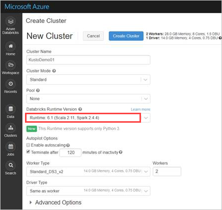
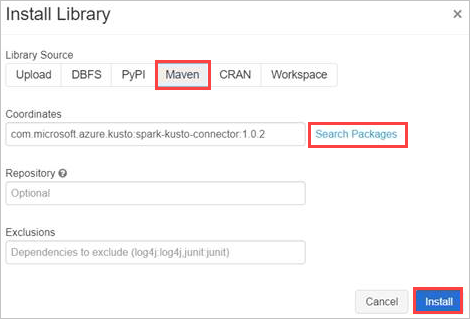
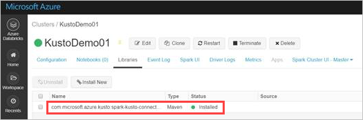

# Azure Data Explorer Connector for Apache Spark (Preview)

[Apache Spark](https://spark.apache.org/) is a unified analytics engine for large-scale data processing. Azure Data Explorer is a fast, fully managed data analytics service for real-time analysis on large volumes of data. 

Azure Data Explorer connector for Spark implements data source and data sink for moving data across Azure Data Explorer and Spark clusters to use both of their capabilities. Using Azure Data Explorer and Apache Spark, you can build fast and scalable applications targeting data driven scenarios, such as machine learning (ML), Extract-Transform-Load (ETL), and Log Analytics. 
Writing to Azure Data Explorer can be done in batch and streaming mode.
Reading from Azure Data Explorer supports column pruning and predicate pushdown, which reduces the volume of transferred data by filtering out data in Azure Data Explorer.

Azure Data Explorer Spark connector is an [open source project](https://github.com/Azure/azure-kusto-spark) that can run on any Spark cluster. The Azure Data Explorer Spark connector makes Azure Data Explorer a valid data store for standard Spark source
and sink operations such as write, read and writeStream. 

> [!NOTE]
> Although some of the examples below refer to an [Azure Databricks](https://docs.azuredatabricks.net/) Spark cluster, Azure Data Explorer Spark connector does not take direct dependencies on Databricks or any other Spark distribution.

## Prerequisites

* [Create an Azure Data Explorer cluster and database](/azure/data-explorer/create-cluster-database-portal) 
* Create a Spark cluster
* Install Azure Data Explorer connector library, and libraries listed in [dependencies](https://github.com/Azure/azure-kusto-spark#dependencies) including the following [Kusto Java SDK](/azure/kusto/api/java/kusto-java-client-library) libraries:
    * [Kusto Data Client](https://mvnrepository.com/artifact/com.microsoft.azure.kusto/kusto-data)
    * [Kusto Ingest Client](https://mvnrepository.com/artifact/com.microsoft.azure.kusto/kusto-ingest)
* Pre-built libraries for [Spark 2.4, Scala 2.11](https://github.com/Azure/azure-kusto-spark/releases) and [Maven repo](https://mvnrepository.com/artifact/com.microsoft.azure.kusto/spark-kusto-connector)

## How to build the Spark connector

Spark Connector can be built from [sources](https://github.com/Azure/azure-kusto-spark) as detailed below.

> [!NOTE]
> This step is optional. If you are using pre-built libraries go to [Spark cluster setup](#spark-cluster-setup).

### Build prerequisites

* Java 1.8 SDK installed
* [Maven 3.x](https://maven.apache.org/download.cgi) installed
* Apache Spark version 2.4.0 or higher

> [!TIP]
> 2.3.x versions are also supported, but may require some changes in pom.xml dependencies.

For Scala/Java applications using Maven project definitions, link your application with the following artifact (latest version may differ):

```Maven
   <dependency>
     <groupId>com.microsoft.azure</groupId>
     <artifactId>spark-kusto-connector</artifactId>
     <version>1.0.0-Beta-02</version>
   </dependency>
```

### Build commands

To build jar and run all tests:

```
mvn clean package
```

To build jar, run all tests, and install jar to your local Maven repository:

```
mvn clean install
```

For more information, see [connector usage](https://github.com/Azure/azure-kusto-spark#usage).

## Spark cluster setup

> [!NOTE]
> It is recommended to use the latest Azure Data Explorer Spark connector release when performing the following steps:

1. Set the following Spark cluster settings, based on Azure Databricks cluster using Spark 2.4.4 and Scala 2.11: 

    
    
1. Install the latest spark-kusto-connector library from Maven:

    

1. Verify that all required libraries are installed:

    

## Authentication

Azure Data Explorer Spark connector allows you to authenticate with Azure Active Directory (Azure AD) using an [Azure AD application](#azure-ad-application-authentication), [Azure AD access token](https://github.com/Azure/azure-kusto-spark/blob/dev/docs/Authentication.md#direct-authentication-with-access-token), [device authentication](https://github.com/Azure/azure-kusto-spark/blob/dev/docs/Authentication.md#device-authentication) (for non-production scenarios), or [Azure Key Vault](https://github.com/Azure/azure-kusto-spark/blob/dev/docs/Authentication.md#key-vault). The user must install azure-keyvault package and provide application credentials to access the Key Vault resource.

### Azure AD application authentication

Most simple and common authentication method. This method is recommended for Azure Data Explorer Spark connector usage.

|Properties  |Description  |
|---------|---------|
|**KUSTO_AAD_CLIENT_ID**     |   Azure AD application (client) identifier.      |
|**KUSTO_AAD_AUTHORITY_ID**     |  Azure AD authentication authority. Azure AD Directory (tenant) ID.        |
|**KUSTO_AAD_CLIENT_PASSWORD**    |    Azure AD application key for the client.     |

### Azure Data Explorer privileges

The following privileges must be granted on an Azure Data Explorer cluster:

* For reading (data source), Azure AD application must have *viewer* privileges on the target database, or *admin* privileges on the target table.
* For writing (data sink), Azure AD application must have *ingestor* privileges on the target database. It must also have *user* privileges on the target database to create new tables. If the target table already exists, *admin* privileges on the target table can be configured.
 
For more information on Azure Data Explorer principal roles, see [role-based authorization](/azure/kusto/management/access-control/role-based-authorization). For managing security roles, see [security roles management](/azure/kusto/management/security-roles).

## Spark sink: writing to Azure Data Explorer

1. Set up sink parameters:

     ```scala
    val KustoSparkTestAppId = dbutils.secrets.get(scope = "KustoDemos", key = "KustoSparkTestAppId")
    val KustoSparkTestAppKey = dbutils.secrets.get(scope = "KustoDemos", key = "KustoSparkTestAppKey")
 
    val appId = KustoSparkTestAppId
    val appKey = KustoSparkTestAppKey
    val authorityId = "72f988bf-86f1-41af-91ab-2d7cd011db47" // Optional - defaults to microsoft.com
    val cluster = "Sparktest.eastus2"
    val database = "TestDb"
    val table = "StringAndIntTable"
    ```

1. Write Spark DataFrame to Azure Data Explorer cluster as batch:

    ```scala
    import com.microsoft.kusto.spark.datasink.KustoSinkOptions
    import org.apache.spark.sql.{SaveMode, SparkSession}

    df.write
      .format("com.microsoft.kusto.spark.datasource")
      .option(KustoSinkOptions.KUSTO_CLUSTER, cluster)
      .option(KustoSinkOptions.KUSTO_DATABASE, database)
      .option(KustoSinkOptions.KUSTO_TABLE, "Demo3_spark")
      .option(KustoSinkOptions.KUSTO_AAD_CLIENT_ID, appId)
      .option(KustoSinkOptions.KUSTO_AAD_CLIENT_PASSWORD, appKey)
      .option(KustoSinkOptions.KUSTO_AAD_AUTHORITY_ID, authorityId)
      .option(KustoSinkOptions.KUSTO_TABLE_CREATE_OPTIONS, "CreateIfNotExist")
      .mode(SaveMode.Append)
      .save()  
    ```
    
   Or use the simplified syntax:
   
    ```scala
         import com.microsoft.kusto.spark.datasink.SparkIngestionProperties
         import com.microsoft.kusto.spark.sql.extension.SparkExtension._
         
         val sparkIngestionProperties = Some(new SparkIngestionProperties()) // Optional, use None if not needed
         df.write.kusto(cluster, database, table, conf, sparkIngestionProperties)
    ```
   
1. Write streaming data:

    ```scala    
    import org.apache.spark.sql.streaming.Trigger
    import java.util.concurrent.TimeUnit
    import java.util.concurrent.TimeUnit
    import org.apache.spark.sql.streaming.Trigger

    // Set up a checkpoint and disable codeGen. Set up a checkpoint and disable codeGen as a workaround for an known issue 
    spark.conf.set("spark.sql.streaming.checkpointLocation", "/FileStore/temp/checkpoint")
    spark.conf.set("spark.sql.codegen.wholeStage","false") // Use in case a NullPointerException is thrown inside codegen iterator
    
    // Write to a Kusto table from a streaming source
    val kustoQ = df
          .writeStream
          .format("com.microsoft.kusto.spark.datasink.KustoSinkProvider")
          .options(conf) 
          .option(KustoSinkOptions.KUSTO_WRITE_ENABLE_ASYNC, "true") // Optional, better for streaming, harder to handle errors
          .trigger(Trigger.ProcessingTime(TimeUnit.SECONDS.toMillis(10))) // Sync this with the ingestionBatching policy of the database
          .start()
    ```

## Spark source: reading from Azure Data Explorer

1. When reading small amounts of data, define the data query:

    ```scala
    import com.microsoft.kusto.spark.datasource.KustoSourceOptions
    import org.apache.spark.SparkConf
    import org.apache.spark.sql._
    import com.microsoft.azure.kusto.data.ClientRequestProperties

    val query = s"$table | where (ColB % 1000 == 0) | distinct ColA"
    val conf: Map[String, String] = Map(
          KustoSourceOptions.KUSTO_AAD_CLIENT_ID -> appId,
          KustoSourceOptions.KUSTO_AAD_CLIENT_PASSWORD -> appKey
        )

    val df = spark.read.format("com.microsoft.kusto.spark.datasource").
      options(conf).
      option(KustoSourceOptions.KUSTO_QUERY, query).
      option(KustoSourceOptions.KUSTO_DATABASE, database).
      option(KustoSourceOptions.KUSTO_CLUSTER, cluster).
      load()

    // Simplified syntax flavor
    import com.microsoft.kusto.spark.sql.extension.SparkExtension._
    
    val cpr: Option[ClientRequestProperties] = None // Optional
    val df2 = spark.read.kusto(cluster, database, query, conf, cpr)
    display(df2)
    ```

1. When reading large amounts of data, transient blob storage must be provided. Provide storage container SAS key, or storage account name, account key, and container name. This step is only required for the current preview release of the Spark connector.

    ```scala
    // Use either container/account-key/account name, or container SaS
    val container = dbutils.secrets.get(scope = "KustoDemos", key = "blobContainer")
    val storageAccountKey = dbutils.secrets.get(scope = "KustoDemos", key = "blobStorageAccountKey")
    val storageAccountName = dbutils.secrets.get(scope = "KustoDemos", key = "blobStorageAccountName")
    // val storageSas = dbutils.secrets.get(scope = "KustoDemos", key = "blobStorageSasUrl")
    ```

    In the example above, we don't access the Key Vault using the connector interface. Alternatively, we use a simpler method of using the Databricks secrets.

1. Read from Azure Data Explorer:

    ```scala
     val conf3 = Map(
          KustoSourceOptions.KUSTO_AAD_CLIENT_ID -> appId,
          KustoSourceOptions.KUSTO_AAD_CLIENT_PASSWORD -> appKey
          KustoSourceOptions.KUSTO_BLOB_STORAGE_SAS_URL -> storageSas)
    val df2 = spark.read.kusto(cluster, database, "ReallyBigTable", conf3)
    
    val dfFiltered = df2
      .where(df2.col("ColA").startsWith("row-2"))
      .filter("ColB > 12")
      .filter("ColB <= 21")
      .select("ColA")
    
    display(dfFiltered)
    ```

## Next steps

* Learn more about the [Azure Data Explorer Spark Connector](https://github.com/Azure/azure-kusto-spark/tree/master/docs)
* [Sample code](https://github.com/Azure/azure-kusto-spark/tree/master/samples/src/main)

