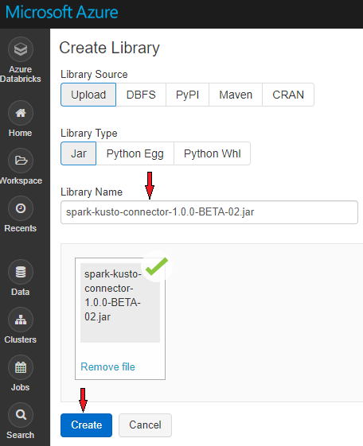
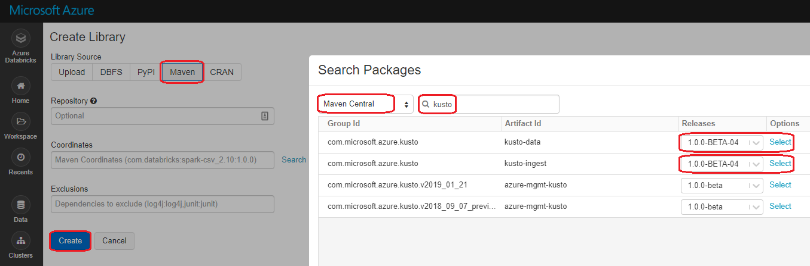
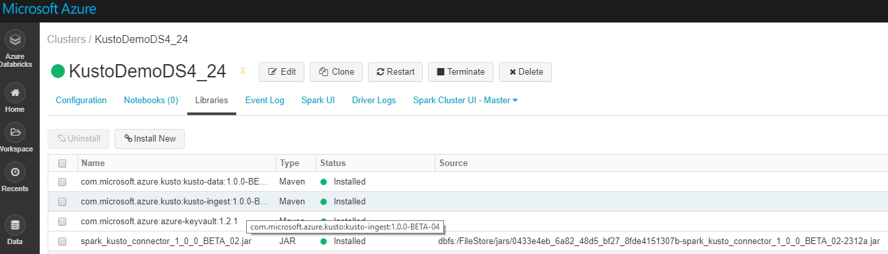
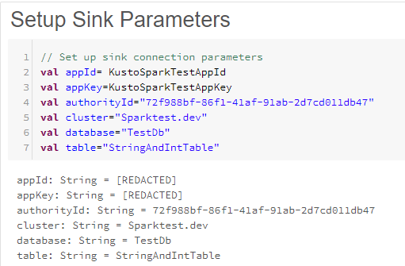
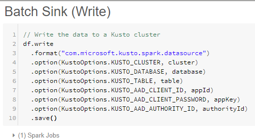
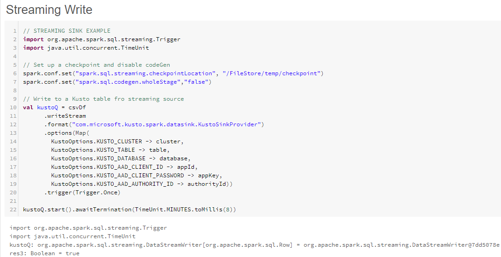
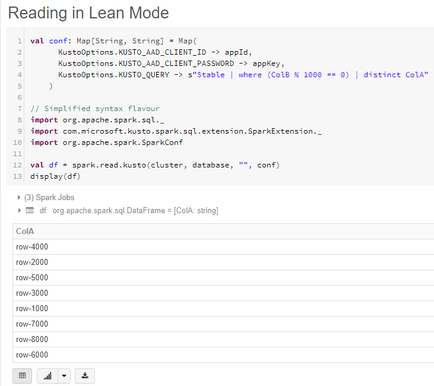
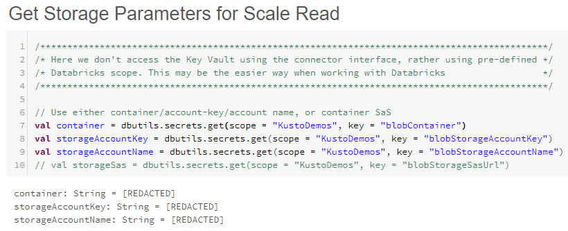
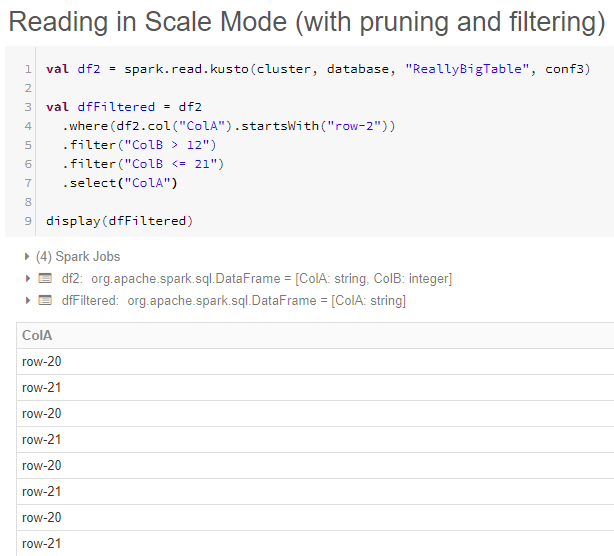

# Azure Data Explorer Connector for Apache Spark

[Apache Spark](https://spark.apache.org/) is a unified analytics engine for large-scale data processing. Azure Data Explorer is a fast, fully managed data analytics service for real-time analysis on large volumes of data. Spark Azure Data Explorer connector implements data source and data sink for moving data across Azure Data Explorer and Spark clusters to utilize both of their capabilities. Using Azure Data Explorer and Apache Spark, you can build fast and scalable applications targeting data driven scenarios, such as machine learning (ML), Extract-Transform-Load (ETL), and Log Analytics. Azure Data Explorer Spark connector is an [open source project](https://github.com/Azure/azure-kusto-spark). Azure Data Explorer Spark connector can run on any Spark cluster.

> [!NOTE]
> some of the examples below relate to an [Azure Databricks](https://docs.azuredatabricks.net/) Spark cluster. This is done for reference purposes only; Azure Data Explorer Spark connector does not take direct dependencies on Databricks or any other Spark distribution. 

## Prerequisites

* [Create an Azure Data Explorer cluster and database](https://docs.microsoft.com/en-us/azure/data-explorer/create-cluster-database-portal) 
* Create a spark cluster
* Install Azure Data Explorer connector library, and libraries listed in the [dependencies](https://github.com/Azure/azure-kusto-spark#dependencies) section. Typically this is limited to [Kusto Java SDK](https://docs.microsoft.com/en-us/azure/kusto/api/java/kusto-java-client-library) libraries:
    * [Kusto Data Client](https://mvnrepository.com/artifact/com.microsoft.azure.kusto/kusto-data)
    * [Kusto Ingest Client](https://mvnrepository.com/artifact/com.microsoft.azure.kusto/kusto-ingest)
* Pre-built libraries for Spark 2.4, Scala 2.11 are available [here](https://github.com/Azure/azure-kusto-spark/releases). Spark Connector can be built from [sources](https://github.com/Azure/azure-kusto-spark) as described in the connector [usage](https://github.com/Azure/azure-kusto-spark#usage) section. 
    
## Spark Cluster Settings -> change heading 

1. Spark cluster settings, based on Azure Databricks cluster using Spark 2.4 and Scala 2.11: 

    

1. Import the Azure Data Explorer connector library:

    

1. Add additional dependencies:

    

1. Verify that all required libraries are installed:

    

## Authentication

Azure Data Explorer Spark connector allows you to authenticate with AAD using an AAD application, [AAD access token](), or device authentication (for non-production scenarios). Authentication parameters can also be stored in Azure Key Vault. The user must provide application credentials to access the Key Vault resource.

### AAD Application Authentication

Most simple and common authentication method. Method recommended for Azure Data Explorer Spark connector usage.

Example?

|Properties  |Description  |
|---------|---------|
|**KUSTO_CLUSTER**     |         |
|**KUSTO_DATABASE**    |         |
|**KUSTO_TABLE**    |         |
|**KUSTO_AAD_CLIENT_ID**     |   AAD application (client) identifier.      |
|**KUSTO_AAD_AUTHORITY_ID**     |  AAD authentication authority. This is the AAD Directory (tenant) ID.        |
|**KUSTO_AAD_CLIENT_PASSWORD**    |    AAD application key for the client.     |

### Azure Key Vault Authentication

Azure Data Explorer Spark connector allows authentication using Azure Key Vault. The Key Vault must contain the mandatory read/write authentication parameters.

> [!NOTE]
>This option requires you to install azure-keyvault package.

### Azure Data Explorer Privileges

The following privileges must be granted on an Azure Data Explorer Cluster:
* For reading (data source), AAD application must have 'viewer' privileges on the target database, or 'admin' privileges on the target table.
* For writing (data sink), AAD application must have 'ingestor' privileges on the target database. It must also have 'user' privileges on the target database to create new tables. If the target table already exists, 'admin' privileges on the target table can be configured. 
 
For more information on Azure Data Explorer principal roles, please refer to [Role-based Authorization](/azure/kusto/management/access-control/role-based-authorization). For managing security roles, please refer to [Security Roles Management](/azure/kusto/management/security-roles).

## Spark Sink: writing to Azure Data Explorer

1. Set up sink parameters:

    

1. Write Spark DataFrame to Azure Data Explorer cluster as batch:

    

1. Write streaming data:
    

## Spark Source: reading from Azure Data Explorer

1. When reading small amounts of data, define the data query:
    

1. When reading substantial amounts of data, transient blob storage must be provided. Provide storage container SAS key, or storage account name, account key and container name:

    

    > [!NOTE]
    > This is a temporary requirement. Future versions of the connector will be able to provision transient storage internally.

1. Read from Azure Data Explorer:

    
