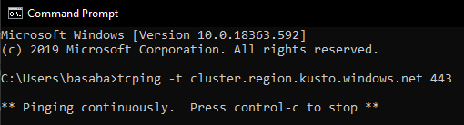

# Troubleshoot Virtual Network Deployment

Learn how to troubleshoot connectivity, operational, cluster creation issues for a cluster that is deployed into your [Virtual Network](/azure/virtual-network/virtual-networks-overview).

## Access issues

If you have an issue while accessing cluster using the public (cluster.region.kusto.windows.net) or private (private-cluster.region.kusto.windows.net) endpoint and you suspect it is related to virtual network setup, follow these steps to troubleshoot the issue.

### Step 1: Check connectivity using tcping

1. Download TCping to the machine that is connecting to the cluster.
2. Open a Command Prompt window.
3. Navigate to the folder in which you downloaded TCping.
4. Ping the destination from the source machine by using the following command:

    

    ```cmd
    tcping64.exe -t <destination cluster URL> 443
    ```

If the test is successful, that means that the issue is due to other issue or operational issue, please go to [operational issues](#operational-issues) section to troubleshoot, otherwise proceed with the following steps.

### Step 2: Check Network Secuirty Group (NSG)

Make sure that [Network Security Group](/azure/virtual-network/security-overview) (NSG) attached to the cluster's subnet has an inbound rule that allows the access from the client machine's IP for the port 443.

### Step 3: Check Route Table

If the cluster's subnet has force-tunneling setup to firewall (subnet with a [route table](/azure/virtual-network/virtual-networks-udr-overview) that contains the default route '0.0.0.0/0') make sure that the machine IP address has route with [next hop type](/azure/virtual-network/virtual-networks-udr-overview) to VirtualNetwork/Internet, this is required to prevent asymmetric route issues.

## Ingestion issues

If you're experiencing ingestion issues and you suspect it is related to virtual network setup, follow these steps to troubleshoot the issue.

### Step 1: Check cluster health

Make sure that the [cluster health metrics](/azure/data-explorer/using-metrics#cluster-health-metrics) indicate healthy state.

### Step 2: Check ingestion health

Make sure that the [cluster ingestion metrics](/azure/data-explorer/using-metrics#ingestion-health-and-performance-metrics) indicate healthy state.

### Step 3: Check security rules on source resources

If you see that metrics indicate that no events were processed from data source (*'Events processed (for Event/IoT Hubs)'* metric) make sure that the data source resources (EventHub/Storage) allow access from cluster's subnet in the firewall rules or service endpoints.
<br>

### Step 4: Check security rules configured on cluster's subnet

Make sure cluster's subnet has NSG, UDR and firewall rules are properly configured.
<br>
To test network connectivty for all dependent endpoints follow the steps [here](#diagnose-virtual-network). 

## Cluster creation issues

If you're experiencing cluster creation issues and you suspect it is related to virtual network setup, follow these steps to troubleshoot the issue.

### Step 1: Diagnose virtual network with the REST API

The ARMclient is used to call the REST API using PowerShell. The ARMClient is found on chocolatey at [ARMClient on Chocolatey](https://chocolatey.org/packages/ARMClient)

### Log in with ARMClient

```powerShell
armclient login
```

### Invoke diagnose operation.

```powershell
$subscriptionId = '<subscription id>'
$clusterName = '<name of cluster>'
$resourceGroupName = '<resource group name>'
$apiversion = "2019-11-09"

armclient post "https://management.azure.com/subscriptions/${subscriptionId}/resourceGroups/${resourceGroupName}/providers/Microsoft.Kusto/cluster/${networkWatcherName}/diagnoseVirtualNetwork?api-version=${api-version}" -verbose
```

<bar>
Check the response

```powershell
HTTP/1.1 202 Accepted
...
Azure-AsyncOperation: https://management.azure.com/subscriptions/{subscription-id}/providers/Microsoft.Kusto/locations/{location}/operationResults/{operation-id}?api-version=2019-11-09
Location: https://management.azure.com/subscriptions/{subscription-id}/providers/Microsoft.Kusto/locations/{location}/operationResults/{operation-id}?api-version=2019-11-09&operationResultResponseType=Location
...
```

### Wait for the operation completion
```powershell
armclient get https://management.azure.com/subscriptions/{subscription-id}/providers/Microsoft.Kusto/locations/{location}/operationResults/{operation-id}?api-version=2019-11-09

{
  "id": "/subscriptions/{subscription-id}/providers/Microsoft.Kusto/locations/{location}/operationresults/{operation-id}",
  "name": "{operation-name}",
  "status": "[Running/Failed/Completed]",
  "startTime": "{start-time}",
  "endTime": "{end-time}",
  "properties": {...}
}
```

Wait until the *status* property shows *Completed*, then the *properties* field should show:
```powershell
{
  "id": "/subscriptions/{subscription-id}/providers/Microsoft.Kusto/locations/{location}/operationresults/{operation-id}",
  "name": "{operation-name}",
  "status": "Completed",
  "startTime": "{start-time}",
  "endTime": "{end-time}",
  "properties": {
    "Findings": [...]
  }
}
```
If *Findings* property shows empty result, it means that all network tests passed and no connections are broken, otherwise it will show an error as follows *"Outbound dependency '{dependencyName}:{port}' might be not satisfied (Outbound)"* it means the cluster cannot reach the dependent service's endpoints, proceed with the following steps to troubleshoot.

### Step 2: Check Network Security Group (NSG)

Make sure that the [Network Security Group](/azure/virtual-network/security-overview) is configured properly per the instuctions in [Dependencies for VNet deployment](/azure/data-explorer/vnet-deployment#dependencies-for-vnet-deployment)

### Step 3: Check Route Table

If the cluster's subnet has force-tunneling setup to firewall (subnet with a [route table](/azure/virtual-network/virtual-networks-udr-overview) that contains the default route '0.0.0.0/0') make sure that the [management IP addresses](/azure/data-explorer/vnet-deployment#azure-data-explorer-management-ip-addresses) and [health monitoring IP addresses](/azure/data-explorer/vnet-deployment#health-monitoring-ip-addresses) has route with [next hop type](/azure/virtual-network/virtual-networks-udr-overview##next-hop-types-across-azure-tools) *Internet*, and [source address prefix](/azure/virtual-network/virtual-networks-udr-overview#how-azure-selects-a-route) to *'management-ip/32'* and *'health-monitoring-ip/32'*, this is required to prevent asymmetric route issues.

### Step 4: Check firewall rules

If you force tunnel subnet outbound traffic to a firewall, make sure all dependencies FQDN are allowed in the firewall configuration as described in [Securing outbound traffic with firewall](/azure/data-explorer/vnet-deployment#securing-outbound-traffic-with-firewall).

## Operational issues

If [cluster health metrics](/azure/data-explorer/using-metrics#cluster-health-metrics) show unhealthy status and you suspect it is related to virtual network setup, follow the instructions above.