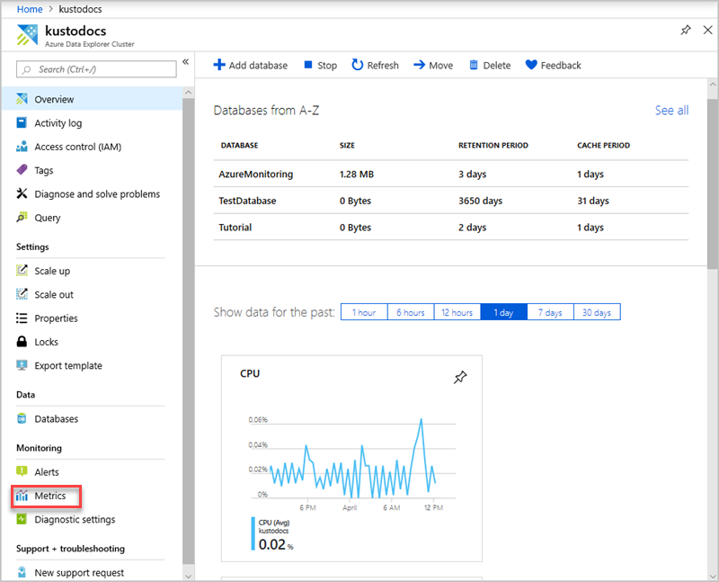
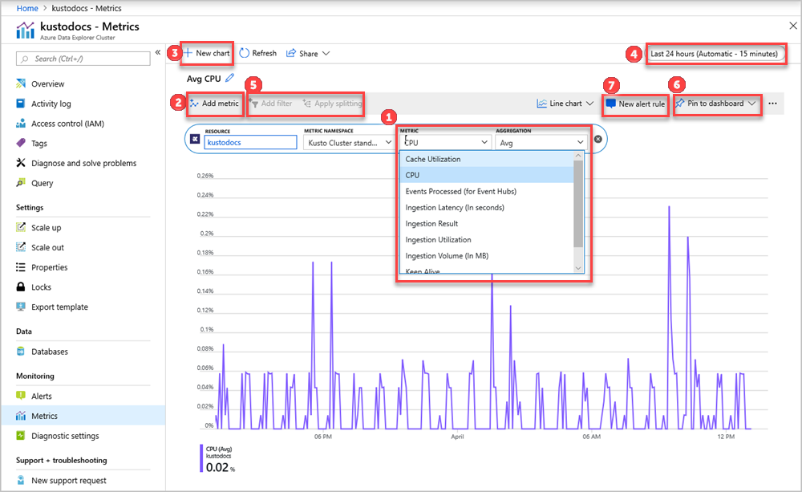

# Monitor Azure Data Explorer performance, health, and usage with metrics

Azure Data Explorer is a fast, fully managed data analytics service for real-time analysis on large volumes of data streaming from applications, websites, IoT devices, and more. To use Azure Data Explorer, you first create a cluster, and create one or more databases in that cluster. Then you ingest (load) data into a database so that you can run queries against it. Azure Data Explorer metrics provide key indicators as to the health and performance of the cluster resources. Use the metrics that are detailed in this article to monitor Azure Data Explorer cluster health and performance in your specific scenario as standalone metrics. You can also use metrics as the basis for operational [Azure Dashboards](/azure/azure-portal/azure-portal-dashboards) and [Azure Alerts](/azure/azure-monitor/platform/alerts-metric-overview).

## Prerequisites

* If you don't have an Azure subscription, create a [free Azure account](https://azure.microsoft.com/free/).

* Create a [cluster and database](create-cluster-database-portal.md).

## Sign in to the Azure portal

Sign in to the [Azure portal](https://portal.azure.com/).

## Using metrics

In your Azure Data Explorer cluster, select **Metrics** to open the metrics pane and begin analysis on your cluster.

In the Metrics pane:

1. To create a metric chart, select **Metric** name and relevant **Aggregation** per metric as detailed below. The **Resource** and **Metric Namespace** pickers are pre-selected to your Azure Data Explorer cluster.

    **Metric** | **Unit** | **Aggregation** | **Metric description**
    |---|---|---|---|
    | Cache utilization | Percent | Avg, Max, Min | Percentage of allocated cache resources currently in use by the cluster. Cache refers to the size of SSD allocated for user activity according to the defined cache policy. An average cache utilization of 80% or less is a sustainable state for a cluster. If the average cache utilization is above 80%, the cluster should be [scaled up](manage-cluster-vertical-scaling.md) to a storage optimized pricing tier or [scaled out](manage-cluster-horizontal-scaling.md) to more instances. Alternatively, adapt the cache policy (fewer days in cache). If cache utilization is over 100%, the size of data to be cached, according to the caching policy, is larger that the total size of cache on the cluster. |
    | CPU | Percent | Avg, Max, Min | Percentage of allocated compute resources currently in use by machines in the cluster. An average CPU of 80% or less is sustainable for a cluster. The maximum value of CPU is 100% which means there are no additional compute resources to process data. When a cluster isn't performing well, check the maximum value of the CPU to determine if there are specific CPUs that are blocked. |
    | Events processed (for Event Hubs) | Count | Max, Min, Sum | Total number of events read from event hubs and processed by the cluster. The events are split into events rejected and events accepted by the cluster engine. |
    | Ingestion latency | Seconds | Avg, Max, Min | Latency of data ingested, from the time the data was received in the cluster until it's ready for query. The ingestion latency period depends on the ingestion scenario. |
    | Ingestion result | Count | Count | Total number of ingestion operations that failed and succeeded. Use **apply splitting** to create buckets of success and fail results and analyze the dimensions (**Value** > **Status**).|
    | Ingestion utilization | Percent | Avg, Max, Min | Percentage of actual resources used to ingest data from the total resources allocated, in the capacity policy, to perform ingestion. The default capacity policy is no more than 512 concurrent ingestion operations or 75% of the cluster resources invested in ingestion. Average ingestion utilization of 80% or less is a sustainable state for a cluster. Maximum value of ingestion utilization is 100%, which means all cluster ingestion ability is used and an ingestion queue may result. |
    | Ingestion volume (in MB) | Count | Max, Min, Sum | The total size of data ingested to the cluster (in MB) before compression. |
    | Keep alive | Count | Avg | Tracks the responsiveness of the cluster. A fully responsive cluster returns value 1 and a blocked or disconnected cluster returns 0. |
    | Query duration | Seconds | Count, Avg, Min, Max, Sum | Total time until query results are received (doesn't include network latency). |
    | | | |

    Additional information regarding [supported Azure Data Explorer cluster metrics](/azure/azure-monitor/platform/metrics-supported#microsoftkustoclusters)

2. Select the **Add metric** button to see multiple metrics plotted in the same chart.
3. Select the **+ New chart** button to see multiple charts in one view.
4. Use the time picker to change the time range (default: past 24 hours).
5. Use [**Add filter** and **Apply splitting**](/azure/azure-monitor/platform/metrics-getting-started#apply-dimension-filters-and-splitting) for metrics that have dimensions.
6. Select **Pin to dashboard** to add your chart configuration to the dashboards so that you can view it again.
7. Set **New alert rule** to visualize your metrics using the set criteria. The new alerting rule will include your target resource, metric, splitting, and filter dimensions from your chart. Modify these settings in the [alert rule creation pane](/azure/azure-monitor/platform/metrics-charts#create-alert-rules).

Additional information on using the [Metrics Explorer](/azure/azure-monitor/platform/metrics-getting-started).

## Next steps

> [!div class="nextstepaction"]
> [Quickstart: Query data in Azure Data Explorer](web-query-data.md)
