# Tutorial: Visualize data from Azure Data Explorer in Power BI

Azure Data Explorer is a fast and highly scalable data exploration service for log and telemetry data. Power BI is a business analytics solution that lets you visualize your data and share the results across your organization. In this tutorial, you first learn how to render visuals in Azure Data Explorer. You then connect to Azure Data Explorer with Power BI, build a report based on sample data, and publish the report to the Power BI service.

If you don't have an Azure subscription, create a [free Azure account](https://azure.microsoft.com/free/) before you begin. If you're not signed up for Power BI Pro, [sign up for a free trial](https://app.powerbi.com/signupredirect?pbi_source=web) before you begin.

In this tutorial, you learn how to:

> [!div class="checklist"]
> * Render visuals in Azure Data Explorer
> * Connect to Azure Data Explorer in Power BI Desktop
> * Work with data in Power BI Desktop
> * Create a report with visuals
> * Publish and share the report

## Prerequisites

In addition to Azure and Power BI subscriptions, you need the following to complete this tutorial:

* [A test cluster and database](create-cluster-database-portal.md)

* [The StormEvents sample data](ingest-sample-data.md)

* [Power BI Desktop](https://powerbi.microsoft.com/get-started/) (click **DOWNLOAD FREE**)

## Render visuals in Azure Data Explorer

Before jumping into Power BI, let's look at how to render visuals in Azure Data Explorer. This is great for some quick analysis.

1. Sign in to [https://dataexplorer.azure.com](https://dataexplorer.azure.com).

1. In the left pane, select the test database that contains the StormEvents sample data.

1. Paste the following query into the right window, and select **Run**.

    ```Kusto
    StormEvents
    | summarize event_count=count() by State
    | where event_count > 1800
    | project State, event_count
    | sort by event_count
    | render columnchart
    ```

    This query counts weather events by state. It then renders a column chart for all states that have more than 1800 weather events.

    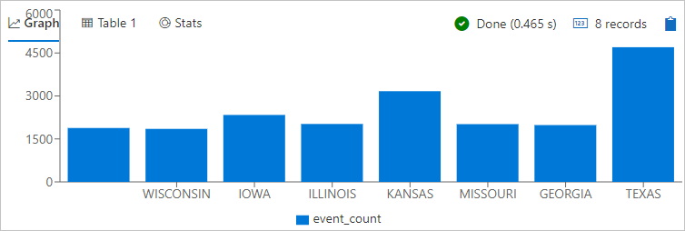

1. Paste the following query into the right window, and select **Run**.

    ```Kusto
    StormEvents
    | where State == "WASHINGTON" and StartTime >= datetime(2007-07-01) and StartTime <= datetime(2007-07-31)
    | summarize StormCount = count() by EventType
    | render piechart
    ```

    This query counts weather events by type for the month of July in the state of Washington. It then renders a pie chart showing the percentage of each event type.

    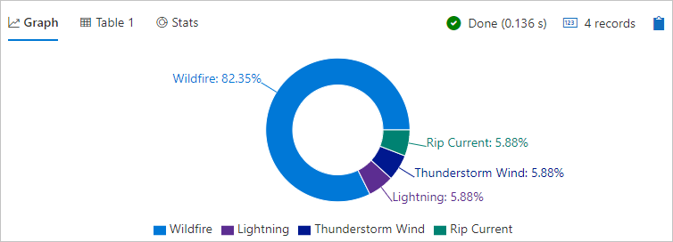

It's now time to look at Power BI, but there's a lot more you can do with visuals in Azure Data Explorer.

## Connect to Azure Data Explorer

Now you connect to Azure Data Explorer in Power BI Desktop.

1. In Power BI Desktop, select **Get Data** then **More**.

    

1. Search for *Kusto*, select **Azure Kusto (Beta)**, then **Connect**.

    

1. On the **Preview connector** screen, select **Continue**.

1. On the **Kusto** screen, enter the name of your test cluster and database. Cluster should be in the form `https://<ClusterName>.<Region>.kusto.windows.net`. Enter *StormEvents* for the name of the table. Leave all other options with default values, and select **OK**.

    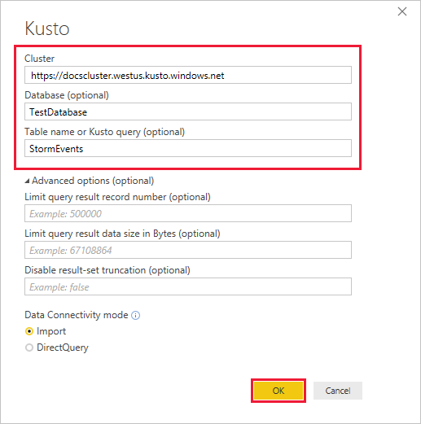

1. On the data preview screen, select **Edit**.

    The table opens in Power Query Editor, where you can edit rows and columns before importing the data.

## Work with data in Power BI Desktop

Now that you have a connection to Azure Data Explorer, you edit the data in Power Query Editor. You drop rows with null values in the **BeginLat** column and drop the **StormSummary** JSON column entirely. These are simple operations, but you can also perform complex transformations when importing data.

1. Select the arrow for the **BeginLat** column, clear the **null** check box, then select **OK**.

    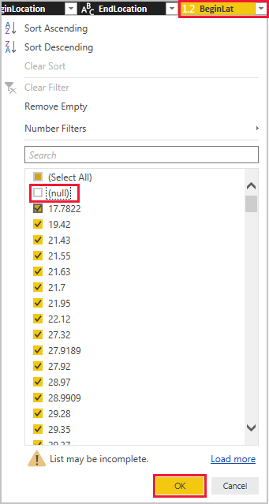

1. Right-click the **StormSummary** column header, then select **Remove**.

    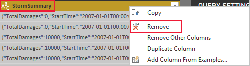

1. In the **QUERY SETTINGS** pane, change the name from *Query1* to *StormEvents*.

    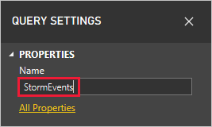

1. On the **Home** tab of the ribbon, select **Close and apply**.

    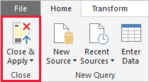

    Power Query applies your changes, then imports the sample data into a *data model*. The next few steps show you how to enrich that model. Again, this is just a simple example to give an idea of what's possible.

1. On the left side of the main window, select the data view.

    

1. On the **Modeling** tab of the ribbon, select **New column**.

    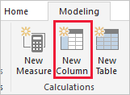

1. Enter the following Data Analysis Expressions (DAX) formula into the formula bar, then press Enter.

    ```DAX
    DurationHours = DATEDIFF(StormEvents[StartTime], StormEvents[EndTime], hour)
    ```

    

    This formula creates the column *DurationHours* that calculates how many hours each weather event lasted. You use this column in a visual in the next section.

1. Scroll to the right side of the table to see the column.

## Create a report with visuals

Now that the data is imported and you've improved the data model, it's time to build a report with visuals. You add a column chart based on event duration and a map that shows crop damage.

1. On the left side of the window, select the report view.

    

1. In the **VISUALIZATIONS** pane, select the clustered column chart.

    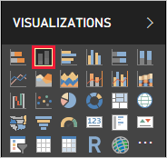

    A blank chart is added to the canvas.

    

1. In the **FIELDS** list, select **DurationHours** and **State**.

    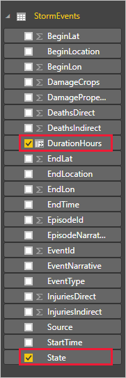

    You now have a chart that shows the total hours of weather events by state over the course of a year.

    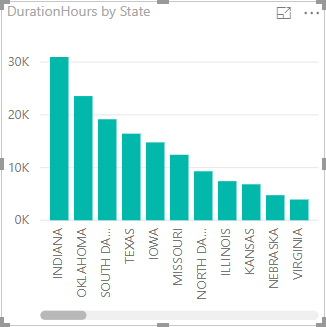

1. Click anywhere on the canvas outside the column chart.

1. In the **VISUALIZATIONS** pane, select the map.

    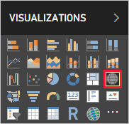

1. In the **FIELDS** list, select **CropDamage** and **State**. Resize the map so you can see the US states clearly.

    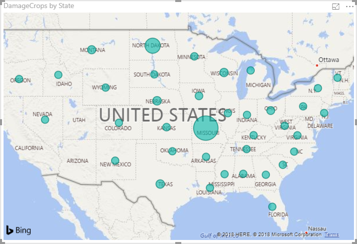

    The size of the bubbles represents the dollar value of crop damage. Mouse over the bubbles to see details.

1. Move and resize the visuals so you have a report that looks like the following image.

    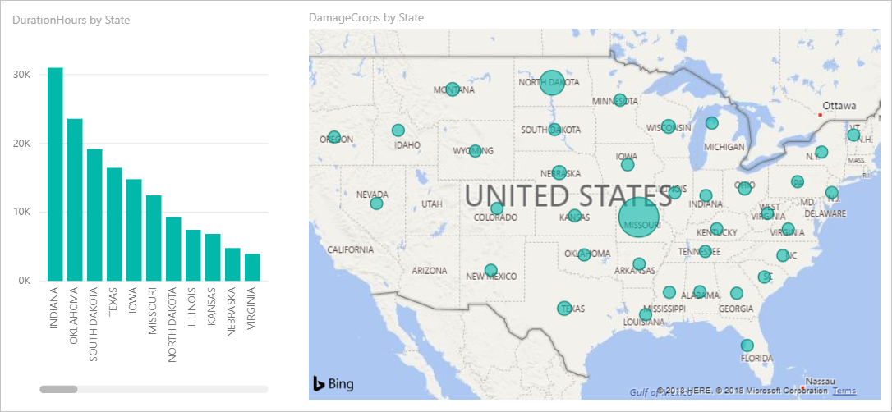

1. Save the report with the name *storm-events.pbix*.

## Publish and share the report

Until this point, the work you've done in Power BI has all been local, using Power BI Desktop. Now you publish the report to the Power BI service where you can share it with others.

1. In Power BI Desktop, on the **Home** tab of the ribbon, select **Publish**.

    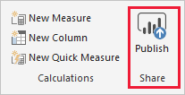

1. If you're not already signed in to Power BI, go through the sign-in process.

1. Select **My workspace**, then **Select**.

    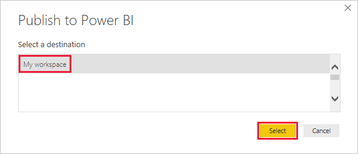

1. When publishing is finished, select **Open storm-events.pbix in Power BI**.

    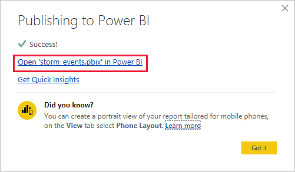

    The report opens in the service, with the same visuals and layout you defined in Power BI Desktop.

1. In the upper-right corner of the report, select **Share**.

    

1. In the **Share report** screen, add a colleague in your organization, add a note, then select **Share**.

    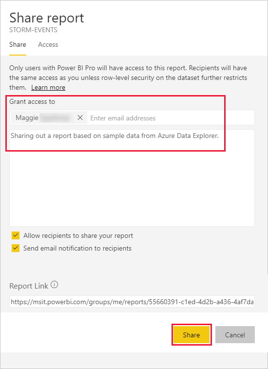

    If your colleague has appropriate permissions, they can access the report that you shared.

## Clean up resources

If you don't want to keep the report you created, simply delete the *storm-events.pbix* file. If you want to remove the report you published, follow these steps.

1. Under **My workspace**, scroll down to **REPORTS** and find **storm-events**.

1. Select the ellipsis (**. . .**) next to **storm-events**, then select **REMOVE**.

    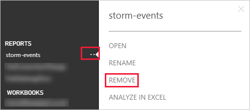

1. Confirm the removal.

## Next steps

> [!div class="nextstepaction"]
> [Write queries](write-queries.md)
