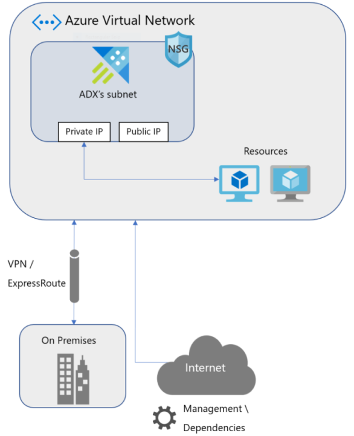

# Deploy Azure Data Explorer cluster into your Virtual Network

This article explains the resources that are present when you deploy an Azure Data Explorer cluster into a custom Azure Virtual Network. This information will help you deploy a cluster into a subnet in your Virtual Network (VNet). For more information on Azure Virtual Networks, see [What is Azure Virtual Network?](/azure/virtual-network/virtual-networks-overview)

   

Azure Data Explorer supports deploying a cluster into a subnet in your Virtual Network (VNet). This capability enables you to:

* Enforce [Network Security Group](/azure/virtual-network/security-overview) (NSG) rules on your Azure Data Explorer cluster traffic.
* Connect your on-premises network to Azure Data Explorer cluster's subnet.
* Secure your data connection sources ([Event Hub](/azure/event-hubs/event-hubs-about) and [Event Grid](/azure/event-grid/overview)) with [service endpoints](/azure/virtual-network/virtual-network-service-endpoints-overview).

## Access your Azure Data Explorer cluster in your VNet

You can access your Azure Data Explorer cluster using the following IP addresses for each service (engine and data management services):

* **Private IP**: Used for accessing the cluster inside the VNet.
* **Public IP**: Used for accessing the cluster from outside the VNet for management and monitoring, and as a source address for outbound connections started from the cluster.

The following DNS records are created to access the service: 

* `[clustername].[geo-region].kusto.windows.net` (engine) `ingest-[clustername].[geo-region].kusto.windows.net` (data management) are mapped to the public IP for each service. 

* `private-[clustername].[geo-region].kusto.windows.net` (engine) `private-ingest-[clustername].[geo-region].kusto.windows.net` (data management) are mapped to the private IP for each service.

## Plan subnet size in your VNet

The size of the subnet used to host an Azure Data Explorer cluster can't be altered after the subnet is deployed. In your VNet, Azure Data Explorer uses one private IP address for each VM and two private IP addresses for the internal load balancers (engine and data management). Azure networking also uses five IP addresses for each subnet. Azure Data Explorer provisions two VMs for the data management service. Engine service VMs are provisioned per user configuration scale capacity.

The total number of IP addresses:

| Use | Number of addresses |
| --- | --- |
| Engine service | 1 per instance |
| Data management service | 2 |
| Internal load balancers | 2 |
| Azure reserved addresses | 5 |
| **Total** | **#engine_instances + 9** |

> [!IMPORTANT]
> Subnet size must be planned in advance since it can't be changed after Azure Data Explorer is deployed. Therefore, reserve needed subnet size accordingly.

## Service endpoints for connecting to Azure Data Explorer

[Azure Service Endpoints](/azure/virtual-network/virtual-network-service-endpoints-overview) enables you to secure your Azure multi-tenant resources to your virtual network.
Deploying Azure Data Explorer cluster into your subnet allows you to setup data connections with [Event Hub](/azure/event-hubs/event-hubs-about) or [Event Grid](/azure/event-grid/overview) while restricting the underlying resources for Azure Data Explorer subnet.

> [!NOTE]
> When using EventGrid setup with [Storage](/azure/storage/common/storage-introduction) and [Event Hub], the storage account used in the subscription can be locked with service endpoints to Azure Data Explorer's subnet while allowing trusted Azure platform services in the [firewall configuration](/azure/storage/common/storage-network-security), but the Event Hub can't enable Service Endpoint since it doesn't support trusted [Azure platform services](/azure/event-hubs/event-hubs-service-endpoints).

## Dependencies for VNet deployment

### Network Security Groups configuration

[Network Security Groups (NSG)](/azure/virtual-network/security-overview) provide the ability to control network access within a VNet. Azure Data Explorer can be accessed using two endpoints: HTTPs (443) and TDS (1433). The following NSG rules must be configured to allow access to these endpoints for management, monitoring, and proper operation of your cluster.

#### Inbound NSG configuration

| **Use**   | **From**   | **To**   | **Protocol**   |
| --- | --- | --- | --- |
| Management  |[ADX management addresses](#azure-data-explorer-management-ip-addresses)/AzureDataExplorerManagement(ServiceTag) | ADX subnet:443  | TCP  |
| Health monitoring  | [ADX health monitoring addresses](#health-monitoring-addresses)  | ADX subnet:443  | TCP  |
| ADX internal communication  | ADX subnet: All ports  | ADX subnet:All ports  | All  |
| Allow Azure load balancer inbound (health probe)  | AzureLoadBalancer  | ADX subnet:80,443  | TCP  |

#### Outbound NSG configuration

| **Use**   | **From**   | **To**   | **Protocol**   |
| --- | --- | --- | --- |
| Dependency on Azure Storage  | ADX subnet  | Storage:443  | TCP  |
| Dependency on Azure Data Lake  | ADX subnet  | AzureDataLake:443  | TCP  |
| EventHub ingestion and service monitoring  | ADX subnet  | EventHub:443,5671  | TCP  |
| Publish Metrics  | ADX subnet  | AzureMonitor:443 | TCP  |
| Azure Monitor configuration download  | ADX subnet  | [Azure Monitor configuration endpoint addresses](#azure-monitor-configuration-endpoint-addresses):443 | TCP  |
| Active Directory (if applicable) | ADX subnet | AzureActiveDirectory:443 | TCP |
| Certificate authority | ADX subnet | Internet:80 | TCP |
| Internal communication  | ADX subnet  | ADX Subnet:All Ports  | All  |
| Ports that are used for `sql\_request` and `http\_request` plugins  | ADX subnet  | Internet:Custom  | TCP  |

### Relevant IP addresses

#### Azure Data Explorer management IP addresses

| Region | Addresses |
| --- | --- |
| Australia Central | 20.37.26.134 |
| Australia Central2 | 20.39.99.177 |
| Australia East | 40.82.217.84 |
| Australia Southeast | 20.40.161.39 |
| BrazilSouth | 191.233.25.183 |
| Canada Central | 40.82.188.208 |
| Canada East | 40.80.255.12 |
| Central India | 40.81.249.251, 104.211.98.159 |
| Central US | 40.67.188.68 |
| Central US EUAP | 40.89.56.69 |
| East Asia | 20.189.74.103 |
| East US | 52.224.146.56 |
| East US2 | 52.232.230.201 |
| East US2 EUAP | 52.253.226.110 |
| France Central | 40.66.57.91 |
| France South | 40.82.236.24 |
| Japan East | 20.43.89.90 |
| Japan West | 40.81.184.86 |
| Korea Central | 40.82.156.149 |
| Korea South | 40.80.234.9 |
| North Central US | 40.81.45.254 |
| North Europe | 52.142.91.221 |
| South Africa North | 102.133.129.138 |
| South Africa West | 102.133.0.97 |
| South Central US | 20.45.3.60 |
| Southeast Asia | 40.119.203.252 |
| South India | 40.81.72.110, 104.211.224.189 |
| UK South | 40.81.154.254 |
| UK West | 40.81.122.39 |
| West Central US | 52.159.55.120 |
| West Europe | 51.145.176.215 |
| West India | 40.81.88.112, 104.211.160.120 |
| West US | 13.64.38.225 |
| West US2 | 40.90.219.23 |

#### Health monitoring addresses

| Region | Addresses |
| --- | --- |
| Australia Central | 191.239.64.128 |
| Australia Central 2 | 191.239.64.128 |
| Australia East | 191.239.64.128 |
| Australia Southeast | 191.239.160.47 |
| Brazil South | 23.98.145.105 |
| Canada Central | 168.61.212.201 |
| Canada East | 168.61.212.201 |
| Central India | 23.99.5.162 |
| Central US | 168.61.212.201 |
| Central US EUAP | 168.61.212.201 |
| East Asia | 168.63.212.33 |
| East US | 137.116.81.189 |
| East US 2 | 137.116.81.189 |
| East US 2 EUAP | 137.116.81.189 |
| France Central | 23.97.212.5 |
| France South | 23.97.212.5 |
| Japan East | 138.91.19.129 |
| Japan West | 138.91.19.129 |
| Korea Central | 138.91.19.129 |
| Korea South | 138.91.19.129 |
| North Central US | 23.96.212.108 |
| North Europe | 191.235.212.69 
| South Africa North | 104.211.224.189 |
| South Africa West | 104.211.224.189 |
| South Central US | 23.98.145.105 |
| South India | 23.99.5.162 |
| Southeast Asia | 168.63.173.234 |
| UK South | 23.97.212.5 |
| UK West | 23.97.212.5 |
| West Central US | 168.61.212.201 |
| West Europe | 23.97.212.5 |
| West India | 23.99.5.162 |
| West US | 23.99.5.162 |
| West US 2 | 23.99.5.162, 104.210.32.14 |    

#### Azure Monitor configuration endpoint addresses

| Region | Addresses |
| --- | --- |
| Australia Central | 52.148.86.165 |
| Australia Central 2 | 52.148.86.165 |
| Australia East | 52.148.86.165 |
| Australia Southeast | 52.148.86.165 |
| Brazil South | 13.68.89.19 |
| Canada Central | 13.90.43.231 |
| Canada East | 13.90.43.231 |
| Central India | 13.71.25.187 |
| Central US | 52.173.95.68 |
| Central US EUAP | 13.90.43.231 |
| East Asia | 13.75.117.221 |
| East US | 13.90.43.231 |
| East US 2 | 13.68.89.19 |    
| East US 2 EUAP | 13.68.89.19 |
| France Central | 52.174.4.112 |
| France South | 52.174.4.112 |
| Japan East | 13.75.117.221 |
| Japan West | 13.75.117.221 |
| Korea Central | 13.75.117.221 |
| Korea South | 13.75.117.221 |
| North Central US | 52.162.240.236 |
| North Europe | 52.169.237.246 |
| South Africa North | 13.71.25.187 |
| South Africa West | 13.71.25.187 |
| South Central US | 13.84.173.99 |
| South India | 13.71.25.187 |
| Southeast Asia | 52.148.86.165 |
| UK South | 52.174.4.112 |
| UK West | 52.169.237.246 |
| West Central US | 52.161.31.69 |
| West Europe | 52.174.4.112 |
| West India | 13.71.25.187 |
| West US | 40.78.70.148 |
| West US 2 | 52.151.20.103 |

## ExpressRoute setup

Use ExpressRoute to connect on premises network to the Azure Virtual Network. A common setup is to advertise the default route (0.0.0.0/0) through the Border Gateway Protocol (BGP) session. This forces traffic coming out of the Virtual Network to be forwarded to the customer's premise network that may drop the traffic, causing outbound flows to break. To overcome this default, [User Defined Route (UDR)](/azure/virtual-network/virtual-networks-udr-overview#user-defined) (0.0.0.0/0) can be configured and next hop will be *Internet*. Since the UDR takes precedence over BGP, the traffic will be destined to the Internet.

## Securing outbound traffic with firewall

If you want to secure outbound traffic using [Azure Firewall](/azure/firewall/overview) or any virtual appliance to limit domain names, the following Fully Qualified Domain Names (FQDN) must be allowed in the firewall.

```
prod.warmpath.msftcloudes.com:443
production.diagnostics.monitoring.core.windows.net:443
graph.windows.net:443
*.update.microsoft.com:443
shavamanifestcdnprod1.azureedge.net:443
login.live.com:443
wdcp.microsoft.com:443
login.microsoftonline.com:443
azureprofilerfrontdoor.cloudapp.net:443
*.core.windows.net:443
*.servicebus.windows.net:443
shoebox2.metrics.nsatc.net:443
prod-dsts.dsts.core.windows.net:443
ocsp.msocsp.com:80
*.windowsupdate.com:80
ocsp.digicert.com:80
go.microsoft.com:80
dmd.metaservices.microsoft.com:80
www.msftconnecttest.com:80
crl.microsoft.com:80
www.microsoft.com:80
adl.windows.com:80
crl3.digicert.com:80
```

You also need to define the [route table](/azure/virtual-network/virtual-networks-udr-overview) on the subnet with the [management addresses](#azure-data-explorer-management-ip-addresses) and [health monitoring addresses](#health-monitoring-addresses) with next hop *Internet* to prevent asymmetric routes issues.

For example, for **West US** region, the following UDRs must be defined:

| Name | Address Prefix | Next Hop |
| --- | --- | --- |
| ADX_Management | 13.64.38.225/32 | Internet |
| ADX_Monitoring | 23.99.5.162/32 | Internet |

## Deploy Azure Data Explorer cluster into your VNet using an Azure Resource Manager template

To deploy Azure Data Explorer cluster into your virtual network, use the [Deploy Azure Data Explorer cluster into your VNet](https://azure.microsoft.com/resources/templates/101-kusto-vnet/) Azure Resource Manager template.

This template creates the cluster, virtual network, subnet, network security group, and public IP addresses.
