# Quickstart: Query data in Azure Data Explorer Web UI

Azure Data Explorer is a fast and highly scalable data exploration service for log and telemetry data. Azure Data explorer provides a web application that enables you to run and share queries. The application is available in the Azure portal and as a stand-alone web application. In this article, you work in the stand-alone version, which enables you to connect to multiple clusters and to share deep links to your queries.

If you don't have an Azure subscription, create a [free Azure account](https://azure.microsoft.com/free/) before you begin.

## Prerequisites

In addition to an Azure subscription, you need [a test cluster and database](create-cluster-database-portal.md) to complete this quickstart.

## Sign in to the application

Sign in to [the application](https://dataexplorer.azure.com/).

## Add clusters

When you first open the application, there are no connections.

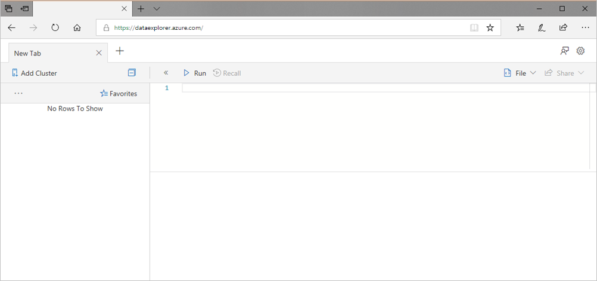

You must add a connection to at least one cluster before you can start running queries. In this section, you add connections to the Azure Data Explorer *help cluster* that we have set up to aid learning, and to the test cluster you created in a previous quickstart.

1. In the upper-left of the application, select **Add cluster**.

1. In the **Add cluster** dialog box, enter the URI, then select **Add**.

   You may use the help cluster URI, `https://help.kusto.windows.net`. If you have your own cluster, provide the URI of your cluster. For example, `https://mydataexplorercluster.westus.kusto.windows.net` as in the following image:

    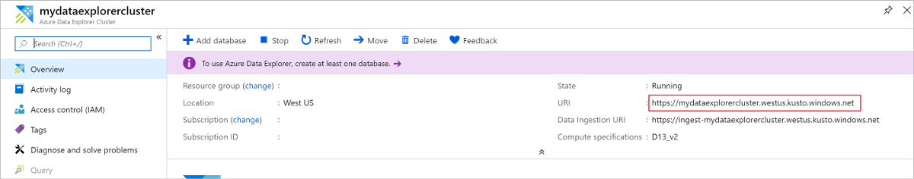

1. In the left pane, you should now see the **help** cluster. Expand the **Samples** database so that you can see the sample tables that you have access to.

    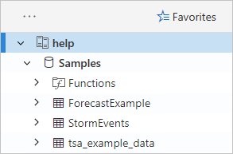

    We use the **StormEvents** table later in this quickstart, and in other Azure Data Explorer articles.

Now add the test cluster you created.

1. Select **Add cluster**.

1. In the **Add cluster** dialog box, enter your test cluster URL in the form `https://<ClusterName>.<Region>.kusto.windows.net/`, then select **Add**.

    In the example below, you see the **help** cluster and a new cluster, **docscluster.westus** (full URL is `https://docscluster.westus.kusto.windows.net/`).

    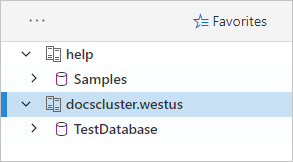

## Run queries

You can now run queries against either cluster that you're connected to (assuming you have data in your test cluster). We'll focus on the **help** cluster.

1. In the left pane, under the **help** cluster, select the **Samples** database.

1. Copy and paste the following query into the query window. At the top of the window, select **Run**.

    ```Kusto
    StormEvents
    | sort by StartTime desc
    | take 10
    ```
    This query returns the ten newest records in the **StormEvents** table. The left side of the result should look like the following table.

    

    The following image shows the state that the application should now be in, with clusters added, and a query with results.

    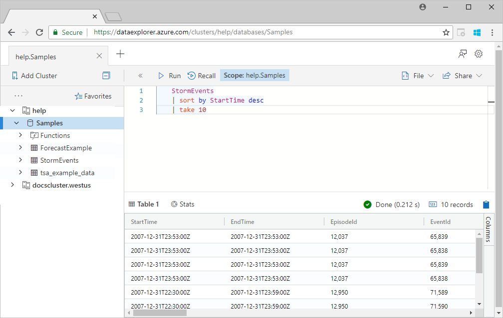

1. Copy and paste the following query into the query window, below the first query. Notice how it's not formatted on separate lines like the first query.

    ```Kusto
    StormEvents | sort by StartTime desc | project StartTime, EndTime, State, EventType, DamageProperty, EpisodeNarrative | take 10
    ```

1. Click the new query in the window, which selects the query. Press Shift+Alt+F to format the query, so it looks like the following.

    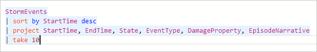

1. Press Shift+Enter, which is a shortcut to run a query.

   This query returns the same records as the first one, but includes only the columns specified in the `project` statement. The result should look like the following table.

    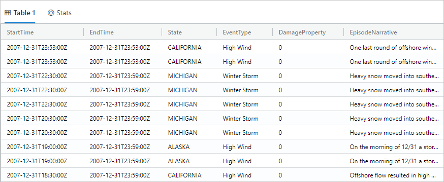

1. At the top of the query window, select **Recall**.

    The query window now shows the result set from the first query without having to rerun the query. Often during analysis, you run multiple queries, and **Recall** enables you to revisit the results of previous queries.

1. Let's run one more query to see a different type of output.

    ```Kusto
    StormEvents
    | summarize event_count=count(), mid = avg(BeginLat) by State
    | sort by mid
    | where event_count > 1800
    | project State, event_count
    | render columnchart
    ```
    The result should look like the following chart.

    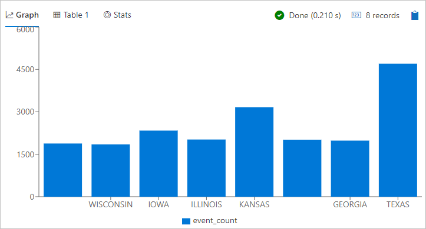

## Work with the table grid

Now you've seen how basic queries work, let's look at how you can use the table grid to customize results and do further analysis.

1. Rerun the first query. Mouse-over the **State** column, select the menu, and select **Group by State**.

    

1. In the grid, expand **California** to see records for that state.

    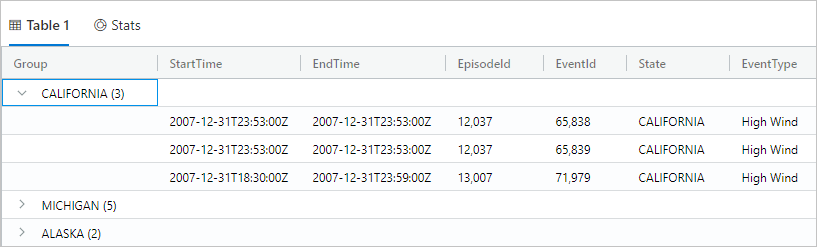

    This type of grouping can be helpful when doing exploratory analysis.

1. Mouse-over the **Group** column, then select **Reset columns**.

    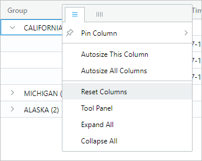

    This returns the grid to its original state.

1. Run the following query.

    ```Kusto
    StormEvents
    | sort by StartTime desc
    | where DamageProperty > 5000
    | project StartTime, State, EventType, DamageProperty, Source
    | take 10
    ```

1. On the right side of the grid, select **Columns** to see the tool panel.

    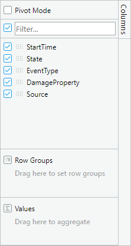

    This panel functions similarly to the pivot table field list in Excel, enabling you to do more analysis in the grid itself.

1. Select **Pivot Mode**, then drag columns as follows: **State** to **Row groups**; **DamageProperty** to **Values**; and **EventType** to **Column labels**.  

    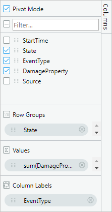

    The result should look like the following pivot table.

    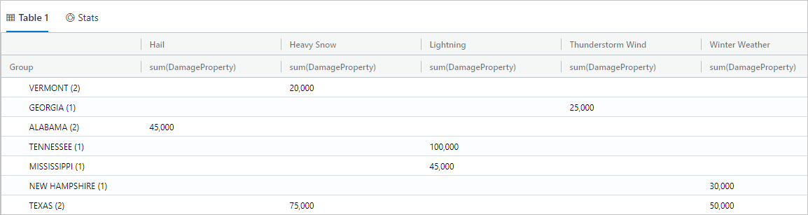

    Notice how Vermont and Alabama each have two events under the same category, while Texas has two events under different categories. Pivot tables enable you to quickly spot things like this; they are a great tool for quick analysis.

## Share queries

Many times, you want to share the queries you create. You can provide a deep link so that other users with access to the cluster can run the queries.

1. In the query window, select the first query you copied in.

1. At the top of the query window, select **Share**.

1. Select **Link, query to clipboard**.

1. Copy the link and query to a text file.

1. Paste the link into a new browser window. The result should look like the following after the query runs.

    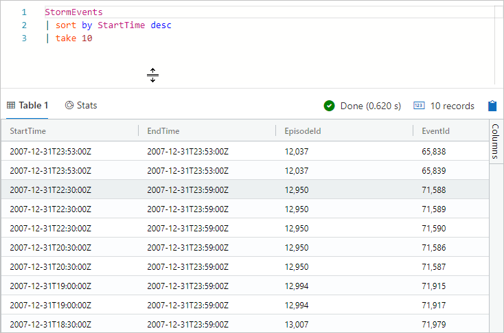

## Provide feedback

Data Explorer is currently in preview, and we welcome feedback on your experience. You can do this now or wait until you've spent more time with it.

1. In the upper-right of the application, select the feedback icon: .

1. Enter your feedback, then select **Submit**.

## Clean up resources

You didn't create any resources in this quickstart, but if you'd like to remove one or both clusters from the application, right-click the cluster and select **Remove connection**.

## Next steps

[Write queries for Azure Data Explorer](write-queries.md)
