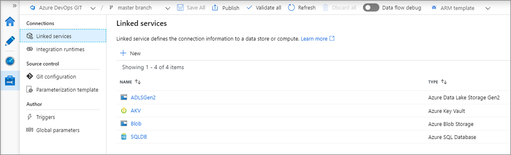
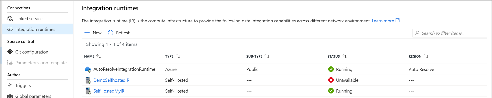
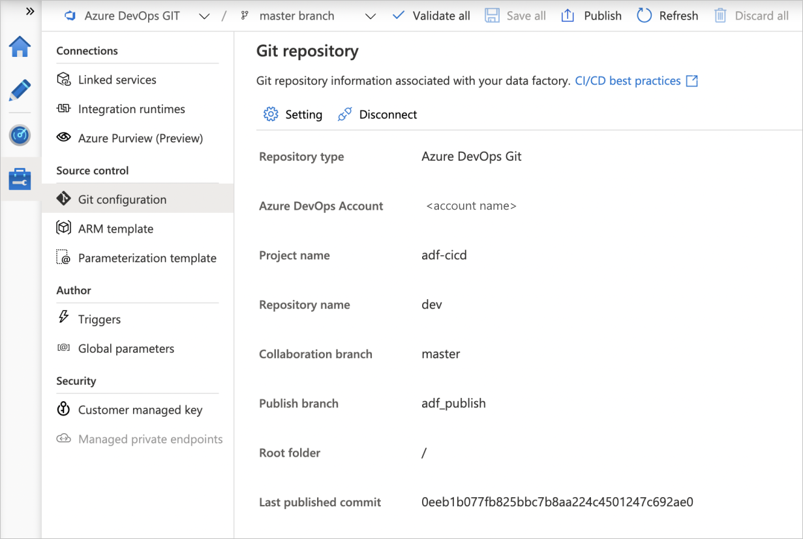
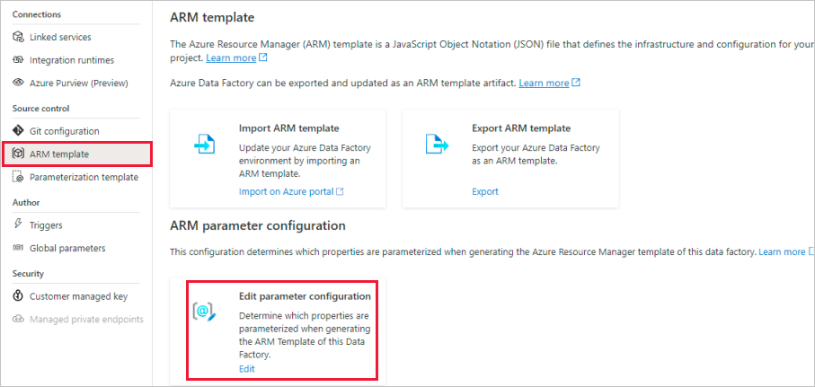
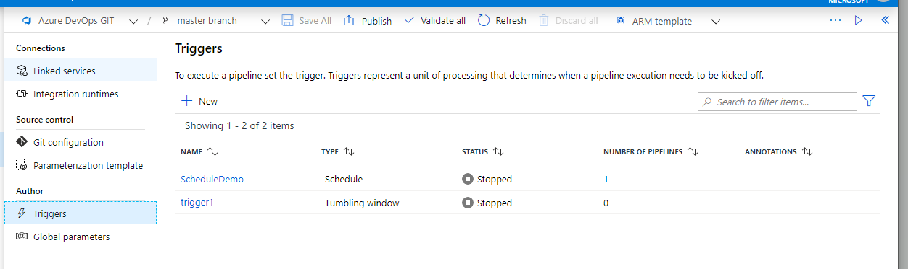

# Management hub in Azure Data Factory

[!INCLUDE[appliesto-adf-xxx-md](includes/appliesto-adf-xxx-md.md)]

The management hub, accessed by the *Manage* tab in the Azure Data Factory UX, is a portal that hosts global management actions for your data factory. Here, you can manage your connections to data stores and external computes, source control configuration, and trigger settings.

## Manage connections

### Linked services

Linked services define the connection information for Azure Data Factory to connect to external data stores and compute environments. For more information, see [linked services concepts](concepts-linked-services.md). Linked service creation, editing, and deletion is done in the management hub.

### Integration runtimes

An integration runtime is a compute infrastructure used by Azure Data Factory to provide data integration capabilities across different network environments. For more information, learn about [integration runtime concepts](concepts-integration-runtime.md). In the management hub, you can create, delete, and monitor your integration runtimes.

## Manage source control

### Git configuration

View and edit your configured git repository settings in the management hub. For more information, learn about [source control in Azure Data Factory](source-control.md).

### Parameterization template

To override the generated Resource Manager template parameters when publishing from the collaboration branch, you can generate or edit a custom parameters file. For more information, learn how to [use custom parameters in the Resource Manager template](continuous-integration-deployment.md#use-custom-parameters-with-the-resource-manager-template). The parameterization template is only available when working in a git repository. If the *arm-template-parameters-definition.json* file doesn't exist in the working branch, editing the default template will generate it.

## Manage authoring

### Triggers

Triggers determine when a pipeline run should be kicked off. Currently triggers can be on a wall clock schedule, operate on a periodic interval, or depend on an event. For more information, learn about [trigger execution](concepts-pipeline-execution-triggers.md#trigger-execution). In the management hub, you can create, edit, delete, or view the current state of a trigger.

## Next steps

Learn how to [configure a git repository](source-control.md) to your ADF

