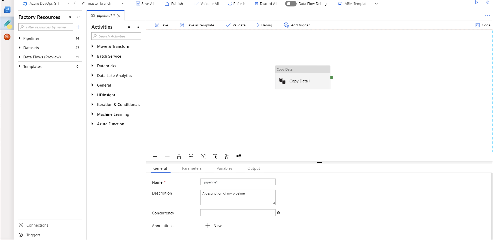
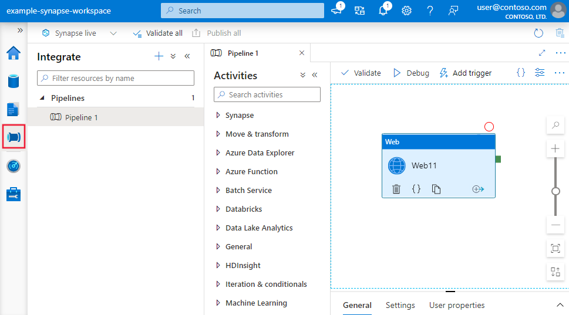
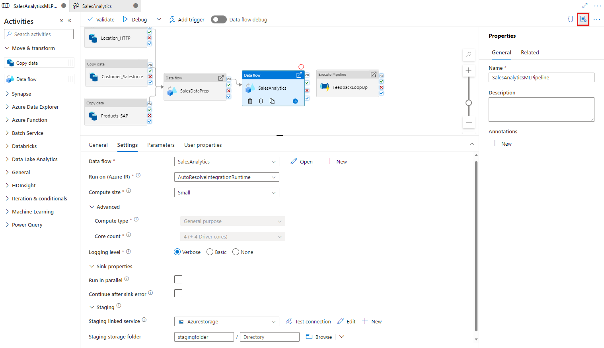
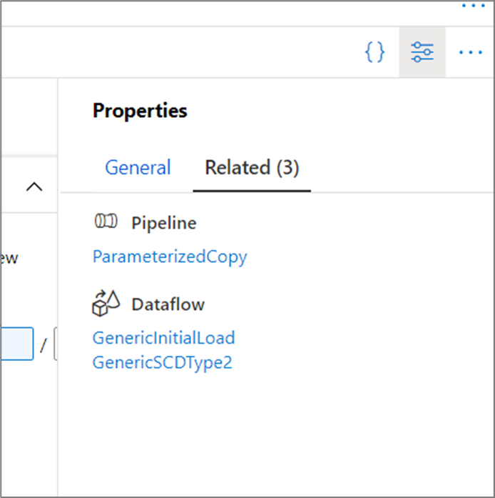

# Visual authoring in Azure Data Factory

[!INCLUDE[appliesto-adf-asa-md](includes/appliesto-adf-asa-md.md)]

The Azure Data Factory and Synapse Analytics user interface (UI) experience lets you visually author and deploy resources for your data factory or Synapse pipelines without having to write any code. You can drag activities to a pipeline canvas, perform test runs, debug iteratively, and deploy and monitor your pipeline runs.

Currently, the UI is only supported in Microsoft Edge and Google Chrome.

## Authoring canvas

# [Azure Data Factory](#tab/data-factory)
To open the **authoring canvas**, click on the pencil icon. 

Here, you author the pipelines, activities, datasets, and data flows that comprise your factory. Similarly, linked services, triggers and integration runtimes can be edited on the [Manage tab](#management-hub). To get started building a pipeline using the authoring canvas, see [Copy data using the copy Activity](tutorial-copy-data-portal.md). 

# [Synapse Analytics](#tab/synapse-analytics)
To open the **authoring canvas**, click on the pipeline/integrate icon. 

Here, you author the pipelines and activities in Synapse. Similarly, data flows used by your pipelines can be edited on the Develop tab, and linked services, triggers and integration runtimes associated with them can be edited on the [Manage tab](#management-hub).  To get started building a pipeline using the authoring canvas, see [Copy data using the copy Activity](tutorial-copy-data-portal.md). 

---

The default visual authoring experience is directly working with the service. Azure Repos Git or GitHub integration is also supported to allow source control and collaboration for work on your pipelines. To learn more about the differences between these authoring experiences, see [Source control](source-control.md).

### Properties pane

For top-level resources such as pipelines, datasets, and data flows, high-level properties are editable in the properties pane on the right-hand side of the canvas. The properties pane contains properties such as name, description, annotations, and other high-level properties. Subresources such as pipeline activities and data flow transformations are edited using the panel at the bottom of the canvas. 

The properties pane only opens by default on resource creation. To edit it, click on the properties pane icon located in the top-right corner of the canvas.

### Related resources

In the properties pane, you can see what resources are dependent on the selected resource by selecting the **Related** tab. Any resource that references the current resource will be listed here.

For example, in the above image, one pipeline and two data flows use the dataset currently selected.

## Management hub

The management hub, accessed by the *Manage* tab in the UI, is a portal that hosts global management actions for the service. Here, you can manage your connections to data stores and external computes, source control configuration, and trigger settings. For more information, learn about the capabilities of the [management hub](author-management-hub.md).

# [Azure Data Factory](#tab/data-factory)

:::image type="content" source="media/author-management-hub/management-hub-linked-services.png" alt-text="Manage linked services":::

# [Synapse Analytics](#tab/synapse-analytics)

:::image type="content" source="media/author-management-hub/management-hub-linked-services.png" alt-text="Manage linked services":::

---

## Expressions and functions

Expressions and functions can be used instead of static values to specify many properties within the service.

To specify an expression for a property value, select **Add Dynamic Content** or click **Alt + P** while focusing on the field.

This opens the **Expression Builder** where you can build expressions from supported system variables, activity output, functions, and user-specified variables or parameters. 

For information about the expression language, see [Expressions and functions](control-flow-expression-language-functions.md).

## Provide feedback

Select **Feedback** to comment about features or to notify Microsoft about issues with the tool:

## Next steps

To learn more about monitoring and managing pipelines, see [Monitor and manage pipelines programmatically](monitor-programmatically.md).
