# Visual authoring in Azure Data Factory
The Azure Data Factory user interface experience (UX) lets you visually author and deploy resources for your data factory without having to write any code. You can drag activities to a pipeline canvas, perform test runs, debug iteratively, and deploy and monitor your pipeline runs. There are two approaches for using the UX to perform visual authoring:

- Author directly with the Data Factory service.
- Author with Azure Repos Git integration for collaboration, source control, and versioning.

## Author directly with the Data Factory service
Visual authoring with the Data Factory service differs from visual authoring with Git integration in two ways:

- The Data Factory service doesn't include a repository for storing the JSON entities for your changes.
- The Data Factory service isn't optimized for collaboration or version control.

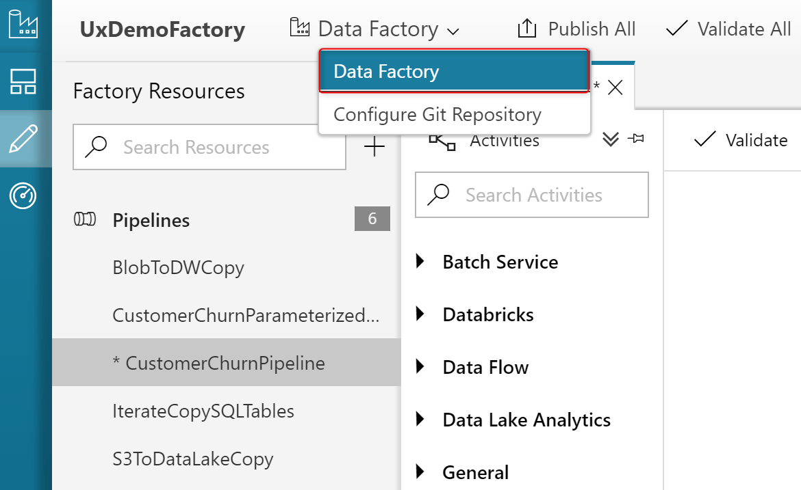

When you use the UX **Authoring canvas** to author directly with the Data Factory service, only the **Publish All** mode is available. Any changes that you make are published directly to the Data Factory service.

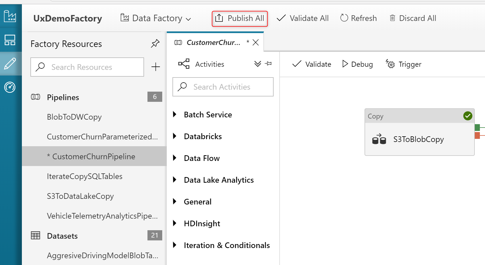

## Author with Azure Repos Git integration
Visual authoring with Azure Repos Git integration supports source control and collaboration for work on your data factory pipelines. You can associate a data factory with an Azure Repos Git organization repository for source control, collaboration, versioning, and so on. A single Azure Repos Git organization can have multiple repositories, but an Azure Repos Git repository can be associated with only one data factory. If you don't have an Azure Repos organization or repository, follow [these instructions](https://docs.microsoft.com/azure/devops/organizations/accounts/create-organization-msa-or-work-student) to create your resources.

> [!NOTE]
> You can store script and data files in an Azure Repos Git repository. However, you have to upload the files manually to Azure Storage. A Data Factory pipeline does not automatically upload script or data files stored in an Azure Repos Git repository to Azure Storage.

### Configure an Azure Repos Git repository with Azure Data Factory
You can configure an Azure Repos Git repository with a data factory through two methods.

#### <a name="method1"></a> Configuration method 1 (Azure Repos Git repo): Let's get started page

In Azure Data Factory, go to the **Let's get started** page. Select **Configure Code Repository**:

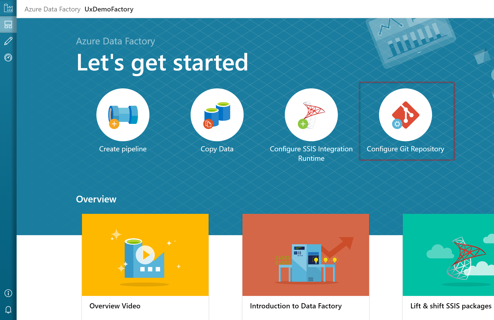

The **Repository Settings** configuration pane appears:

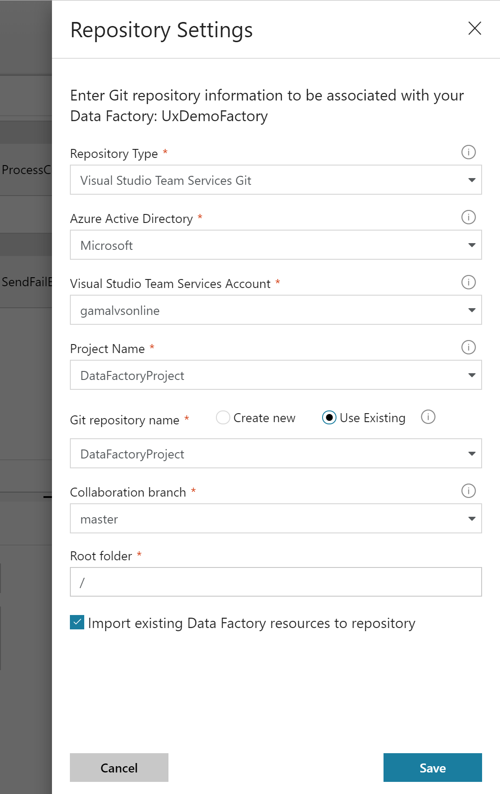

The pane shows the following Azure Repos code repository settings:

| Setting | Description | Value |
|:--- |:--- |:--- |
| **Repository Type** | The type of the Azure Repos code repository.<br/>**Note**: GitHub is not currently supported. | Azure Repos Git |
| **Azure Active Directory** | Your Azure AD tenant name. | <your tenant name> |
| **Azure Repos Organization** | Your Azure Repos organization name. You can locate your Azure Repos organization name at `https://{organization name}.visualstudio.com`. You can [sign in to your Azure Repos organization](https://www.visualstudio.com/team-services/git/) to access your Visual Studio profile and see your repositories and projects. | <your organization name> |
| **ProjectName** | Your Azure Repos project name. You can locate your Azure Repos project name at `https://{organization name}.visualstudio.com/{project name}`. | <your Azure Repos project name> |
| **RepositoryName** | Your Azure Repos code repository name. Azure Repos projects contain Git repositories to manage your source code as your project grows. You can create a new repository or use an existing repository that's already in your project. | <your Azure Repos code repository name> |
| **Collaboration branch** | Your Azure Repos collaboration branch that is used for publishing. By default, it is `master`. Change this setting in case you want to publish resources from another branch. | <your collaboration branch name> |
| **Root folder** | Your root folder in your Azure Repos collaboration branch. | <your root folder name> |
| **Import existing Data Factory resources to repository** | Specifies whether to import existing data factory resources from the UX **Authoring canvas** into an Azure Repos Git repository. Select the box to import your data factory resources into the associated Git repository in JSON format. This action exports each resource individually (that is, the linked services and datasets are exported into separate JSONs). When this box isn't selected, the existing resources aren't imported. | Selected (default) |

#### Configuration method 2 (Azure Repos Git repo): UX authoring canvas
In the Azure Data Factory UX **Authoring canvas**, locate your data factory. Select the **Data Factory** drop-down menu, and then select **Configure Code Repository**.

A configuration pane appears. For details about the configuration settings, see the descriptions in <a href="#method1">Configuration method 1</a>.

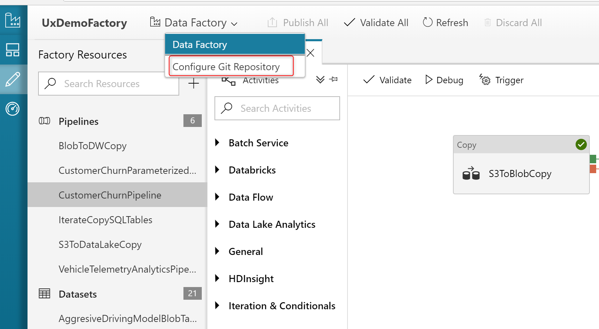

## Use a different Azure Active Directory tenant

You can create an Azure Repos Git repo in a different Azure Active Directory tenant. To specify a different Azure AD tenant, you have to have administrator permissions for the Azure subscription that you're using.

## Switch to a different Git repo

To switch to a different Git repo, locate the icon in the upper right corner of the Data Factory overview page, as shown in the following screenshot. If you can’t see the icon, clear your local browser cache. Select the icon to remove the association with the current repo.

After you remove the association with the current repo, you can configure your Git settings to use a different repo. Then you can import existing Data Factory resources to the new repo.

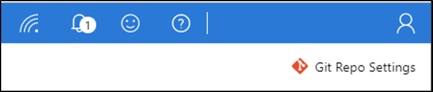

## Use version control
Version control systems (also known as _source control_) let developers collaborate on code and track changes that are made to the code base. Source control is an essential tool for multi-developer projects.

Each Azure Repos Git repository that's associated with a data factory has a collaboration branch. (`master` is the default collaboration branch). Users can also create feature branches by clicking **+ New Branch** and do development in the feature branches.


When you are ready with the feature development in your feature branch, you can click **Create pull request**. This action takes you to Azure Repos Git where you can raise pull requests, do code reviews, and merge changes to your collaboration branch. (`master` is the default). You are only allowed to publish to the Data Factory service from your collaboration branch. 


## Configure publishing settings

To configure the publish branch - that is, the branch where Resource Manager templates are saved - add a `publish_config.json` file to the root folder in the collaboration branch. Data Factory reads this file, looks for the field `publishBranch`, and creates a new branch (if it doesn't already exist) with the value provided. Then it saves all Resource Manager templates to the specified location. For example:

```json
{
    "publishBranch": "factory/adf_publish"
}
```

When you publish from Git mode, you can confirm that Data Factory is using the publish branch that you expect, as shown in the following screenshot:

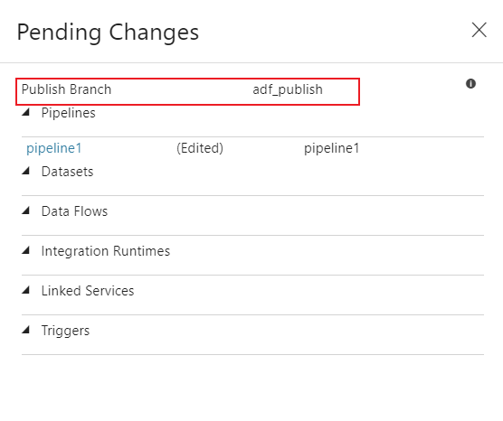

When you specify a new publish branch, Data Factory doesn't delete the previous publish branch. If you want to remote the previous publish branch, delete it manually.

Data Factory only reads the `publish_config.json` file when it loads the factory. If you already have the factory loaded in the portal, refresh the browser to make your changes take effect.

## Publish code changes
After you have merged changes to the collaboration branch (`master` is the default), select **Publish** to manually publish your code changes in the master branch to the Data Factory service.

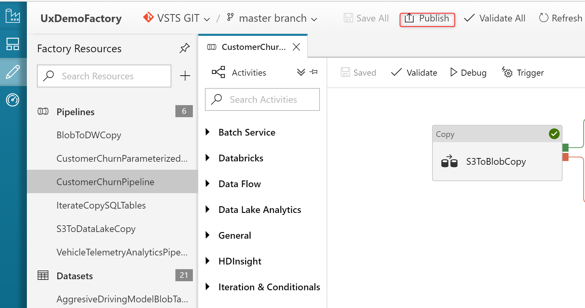

> [!IMPORTANT]
> The master branch is not representative of what's deployed in the Data Factory service. The master branch *must* be published manually to the Data Factory service.

## Author with GitHub integration

Visual authoring with GitHub integration supports source control and collaboration for work on your data factory pipelines. You can associate a data factory with a GitHub account repository for source control, collaboration, versioning. A single GitHub account can have multiple repositories, but a GitHub repository can be associated with only one data factory. If you don't have a GitHub account or repository, follow [these instructions](https://github.com/join) to create your resources. The GitHub integration with Data Factory supports both public GitHub as well as GitHub Enterprise.

To configure a GitHub repo, you have to have administrator permissions for the Azure subscription that you're using.

For a nine-minute introduction and demonstration of this feature, watch the following video:

> [!VIDEO https://channel9.msdn.com/shows/azure-friday/Azure-Data-Factory-visual-tools-now-integrated-with-GitHub/player]

### Limitations

- You can store script and data files in a GitHub repository. However, you have to upload the files manually to Azure Storage. A Data Factory pipeline does not automatically upload script or data files stored in a GitHub repository to Azure Storage.

- GitHub Enterprise with a version older than 2.14.0 doesn't work in the Microsoft Edge browser.

- GitHub integration with the Data Factor visual authoring tools only works in the generally available version of Data Factory.

### Configure a public GitHub repository with Azure Data Factory

You can configure a GitHub repository with a data factory through two methods.

**Configuration method 1 (public repo): Let's get started page**

In Azure Data Factory, go to the **Let's get started** page. Select **Configure Code Repository**:

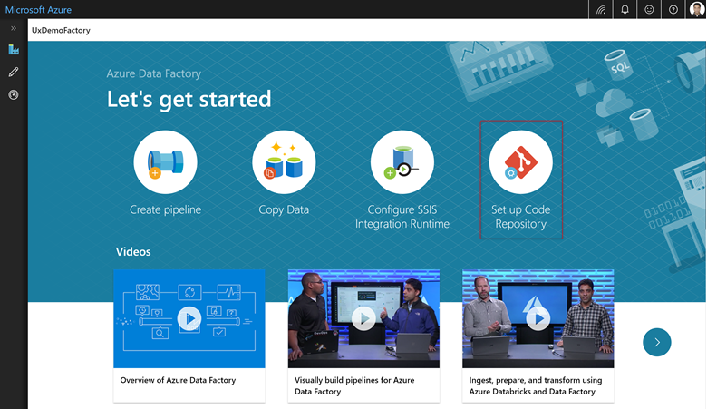

The **Repository Settings** configuration pane appears:

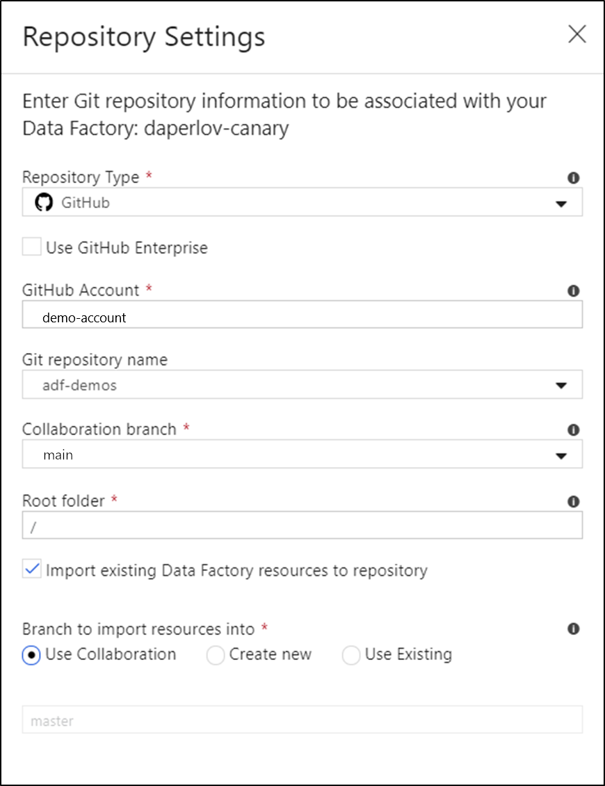

The pane shows the following Azure Repos code repository settings:

| **Setting**                                              | **Description**                                                                                                                                                                                                                                                                                                                                                                                                                   | **Value**          |
|----------------------------------------------------------|-----------------------------------------------------------------------------------------------------------------------------------------------------------------------------------------------------------------------------------------------------------------------------------------------------------------------------------------------------------------------------------------------------------------------------------|--------------------|
| **Repository Type**                                      | The type of the Azure Repos code repository.                                                                                                                                                                                                                                                                                                                                                                                             | GitHub             |
| **GitHub account**                                       | Your GitHub account name. This name can be found from https://github.com/{account name}/{repository name}. Navigating to this page prompts you to enter GitHub OAuth credentials to your GitHub account.                                                                                                                                                                                                                                               |                    |
| **RepositoryName**                                       | Your GitHub code repository name. GitHub accounts contain Git repositories to manage your source code. You can create a new repository or use an existing repository that's already in your account.                                                                                                                                                                                                                              |                    |
| **Collaboration branch**                                 | Your GitHub collaboration branch that is used for publishing. By default, it is master. Change this setting in case you want to publish resources from another branch.                                                                                                                                                                                                                                                               |                    |
| **Root folder**                                          | Your root folder in your GitHub collaboration branch.                                                                                                                                                                                                                                                                                                                                                                             |                    |
| **Import existing Data Factory resources to repository** | Specifies whether to import existing data factory resources from the UX **Authoring canvas** into a GitHub repository. Select the box to import your data factory resources into the associated Git repository in JSON format. This action exports each resource individually (that is, the linked services and datasets are exported into separate JSONs). When this box isn't selected, the existing resources aren't imported. | Selected (default) |
| **Branch to import resource into**                       | Specifies into which branch the data factory resources (pipelines, datasets, linked services etc.) are imported. You can import resources into one of the following branches: a. Collaboration b. Create new c. Use Existing                                                                                                                                                                                                     |                    |

#### Configuration method 2 (public repo): UX authoring canvas

In the Azure Data Factory UX **Authoring canvas**, locate your data factory. Select the **Data Factory** drop-down menu, and then select **Configure Code Repository**.

A configuration pane appears. For details about the configuration settings, see the descriptions in *Configuration method 1* above.

### Configure a GitHub Enterprise Repository with Azure Data Factory

You can configure a GitHub Enterprise repository with a data factory through two methods.

 #### Configuration method 1 (Enterprise repo): Let's get started page

In Azure Data Factory, go to the **Let's get started** page. Select **Configure Code Repository**:


The **Repository Settings** configuration pane appears:

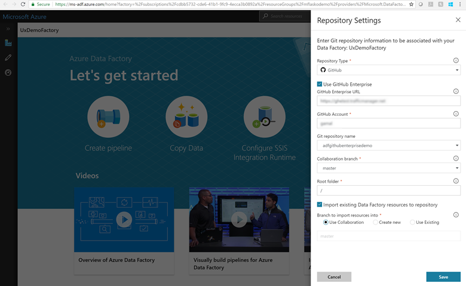

The pane shows the following Azure Repos code repository settings:

| **Setting**                                              | **Description**                                                                                                                                                                                                                                                                                                                                                                                                                   | **Value**          |
|----------------------------------------------------------|-----------------------------------------------------------------------------------------------------------------------------------------------------------------------------------------------------------------------------------------------------------------------------------------------------------------------------------------------------------------------------------------------------------------------------------|--------------------|
| **Repository Type**                                      | The type of the Azure Repos code repository.                                                                                                                                                                                                                                                                                                                                                                                             | GitHub             |
| **Use GitHub Enterprise**                                | Checkbox to select GitHub Enterprise                                                                                                                                                                                                                                                                                                                                                                                              |                    |
| **GitHub Enterprise URL**                                | The GitHub Enterprise root URL. For example: https://github.mydomain.com                                                                                                                                                                                                                                                                                                                                                          |                    |
| **GitHub account**                                       | Your GitHub account name. This name can be found from https://github.com/{account name}/{repository name}. Navigating to this page prompts you to enter GitHub OAuth credentials to your GitHub account.                                                                                                                                                                                                                                               |                    |
| **RepositoryName**                                       | Your GitHub code repository name. GitHub accounts contain Git repositories to manage your source code. You can create a new repository or use an existing repository that's already in your account.                                                                                                                                                                                                                              |                    |
| **Collaboration branch**                                 | Your GitHub collaboration branch that is used for publishing. By default, it is master. Change this setting in case you want to publish resources from another branch.                                                                                                                                                                                                                                                               |                    |
| **Root folder**                                          | Your root folder in your GitHub collaboration branch.                                                                                                                                                                                                                                                                                                                                                                             |                    |
| **Import existing Data Factory resources to repository** | Specifies whether to import existing data factory resources from the UX **Authoring canvas** into a GitHub repository. Select the box to import your data factory resources into the associated Git repository in JSON format. This action exports each resource individually (that is, the linked services and datasets are exported into separate JSONs). When this box isn't selected, the existing resources aren't imported. | Selected (default) |
| **Branch to import resource into**                       | Specifies into which branch the data factory resources (pipelines, datasets, linked services etc.) are imported. You can import resources into one of the following branches: a. Collaboration b. Create new c. Use Existing                                                                                                                                                                                                     |                    |

#### Configuration method 2 (Enterprise repo): UX authoring canvas

In the Azure Data Factory UX **Authoring canvas**, locate your data factory. Select the **Data Factory** drop-down menu, and then select **Configure Code Repository**.

A configuration pane appears. For details about the configuration settings, see the descriptions in *Configuration method 1* above.

## Use the expression language
You can specify expressions for property values by using the expression language that's supported by Azure Data Factory.

Specify expressions for property values by selecting **Add Dynamic Content**:

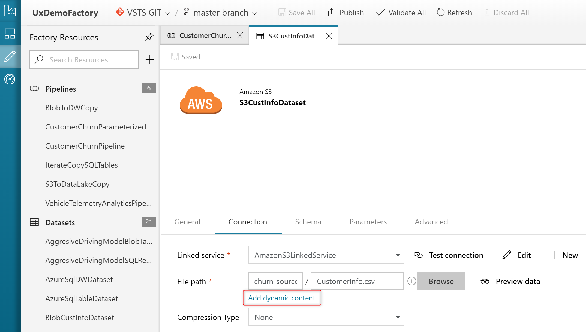

## Use functions and parameters

You can use functions or specify parameters for pipelines and datasets in the Data Factory **expression builder**:

For information about the supported expressions, see [Expressions and functions in Azure Data Factory](control-flow-expression-language-functions.md).

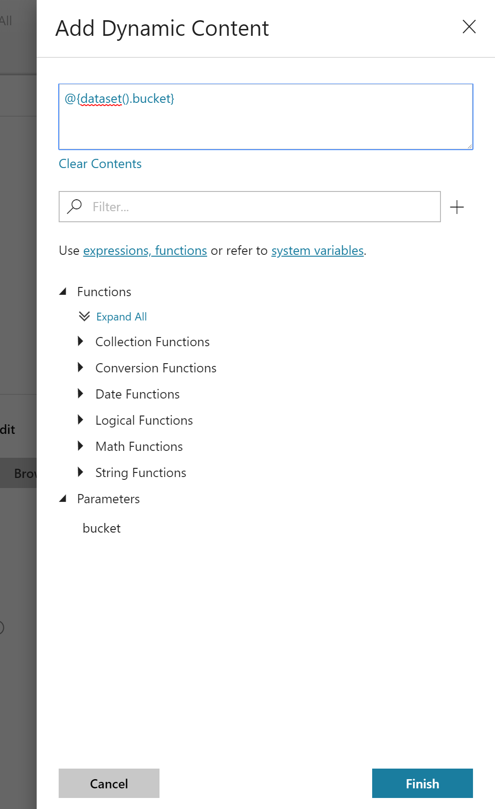

## Provide feedback
Select **Feedback** to comment about features or to notify Microsoft about issues with the tool:

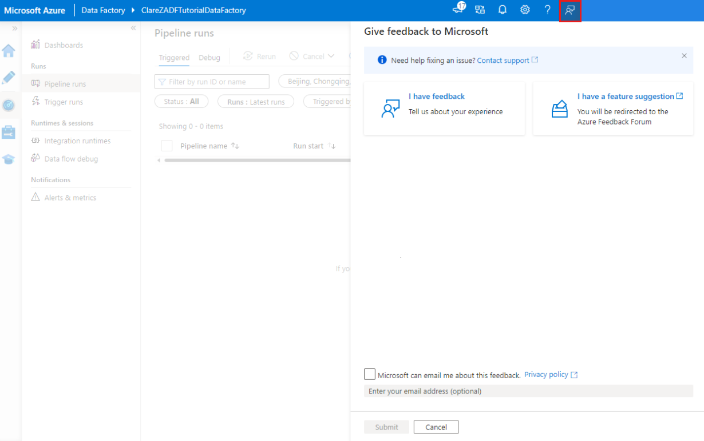

## Next steps
To learn more about monitoring and managing pipelines, see [Monitor and manage pipelines programmatically](monitor-programmatically.md).
