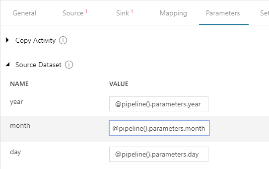
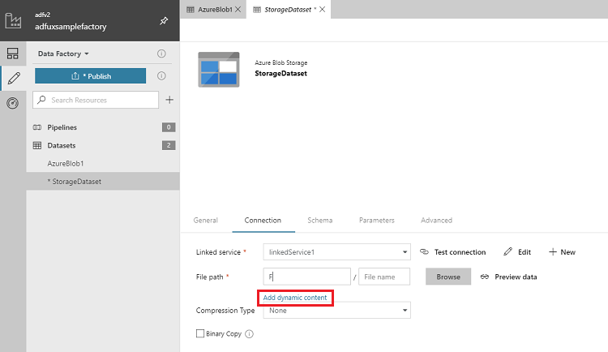

# Visual authoring in Azure Data Factory
The Azure Data Factory user interface experience (UX) lets you visually author and deploy resources for your data factory without having to write any code. You can drag activities to a pipeline canvas, perform test runs, debug iteratively, and deploy and monitor your pipeline runs. There are two approaches for using the UX to perform visual authoring:

- Author directly with the Data Factory service.
- Author with Visual Studio Team Services (VSTS) Git integration for collaboration, source control, or versioning.

## Author directly with the Data Factory service
Visual authoring with the Data Factory service differs from visual authoring with VSTS in two ways:

- The Data Factory service doesn't include a repository for storing the JSON entities for your changes.
- The Data Factory service isn't optimized for collaboration or version control.

When you use the UX **Authoring canvas** to author directly with the Data Factory service, only the **Publish** mode is available. Any changes that you make are published directly to the Data Factory service.

## Author with VSTS Git integration
Visual authoring with VSTS Git integration supports source control and collaboration for work on your data factory pipelines. You can associate a data factory with a VSTS Git account repository for source control, collaboration, versioning, and so on. A single VSTS Git account can have multiple repositories, but a VSTS Git repository can be associated with only one data factory. If you don't have a VSTS account or repository, follow [these instructions](https://docs.microsoft.com/vsts/accounts/create-account-msa-or-work-student) to create your resources.

### Configure a VSTS Git repository with Azure Data Factory
You can configure a VSTS GIT repository with a data factory through two methods.

#### Configuration method 1: Let's get started page
In Azure Data Factory, go to the **Let's get started** page. Select **Configure Code Repository**:

The **Repository Settings** configuration pane appears:

The pane shows the following VSTS code repository settings:

| Setting | Description | Value |
|:--- |:--- |:--- |
| **Repository Type** | The type of the VSTS code repository. **Note**: GitHub is not currently supported. | Visual Studio Team Services Git |
| **Visual Studio Team Services Account** | Your VSTS account name. You can locate your VSTS account name at `https://{account name}.visualstudio.com`. You can [sign in to your VSTS account](https://www.visualstudio.com/team-services/git/) to access your Visual Studio profile and see your repositories and projects. | \<your account name> |
| **ProjectName** | Your VSTS project name. You can locate your VSTS project name at `https://{account name}.visualstudio.com/{project name}`. | \<your VSTS project name> |
| **RepositoryName** | Your VSTS code repository name. VSTS projects contain Git repositories to manage your source code as your project grows. You can create a new repository or use an existing repository that's already in your project. | \<your VSTS code repository name> |
| **Import existing Data Factory resources to repository** | Specifies whether to import existing data factory resources from the UX **Authoring canvas** into a VSTS Git repository. Select the box to import your data factory resources into the associated Git repository in JSON format. This action exports each resource individually (that is, the linked services and datasets are exported into separate JSONs). When this box isn't selected, the existing resources aren't imported. | Selected (default) |

#### Configuration method 2: UX authoring canvas
In the Azure Data Factory UX **Authoring canvas**, locate your data factory. Select the **Data Factory** drop-down menu, and then select **Configure Code Repository**.

A configuration pane appears. For details about the configuration settings, see the descriptions in <a href="#method1">Configuration method 1</a>.

### Use version control
Version control systems (also known as _source control_) let developers collaborate on code and track changes that are made to the code base. Source control is an essential tool for multi-developer projects.

Each VSTS Git repository that's associated with a data factory has a master branch. When you have access to a VSTS Git repository, you can change the code by choosing **Sync** or **Publish**:

#### Sync code changes
After you select **Sync**, you can pull changes from the master branch to your local branch, or push changes from your local branch to the master branch.

#### Publish code changes
Select **Publish** to manually publish your code changes in the master branch to the Data Factory service.

> [!IMPORTANT]
> The master branch is not representative of what's deployed in the Data Factory service. The master branch *must* be published manually to the Data Factory service.

## Use the expression language
You can specify expressions for property values by using the expression language that's supported by Azure Data Factory. For information about the supported expressions, see [Expressions and functions in Azure Data Factory](control-flow-expression-language-functions.md).

Specify expressions for property values by using the UX **Authoring canvas**:

## Specify parameters
You can specify parameters for pipelines and datasets in the Azure Data Factory **Parameters** tab. You can easily use the parameters in properties by selecting **Add Dynamic Content**:

You can use existing parameters or specify new parameters for your property values:

## Provide feedback
Select **Feedback** to comment about features or to notify Microsoft about issues with the tool:

## Next steps
To learn more about monitoring and managing pipelines, see [Monitor and manage pipelines programmatically](monitor-programmatically.md).
