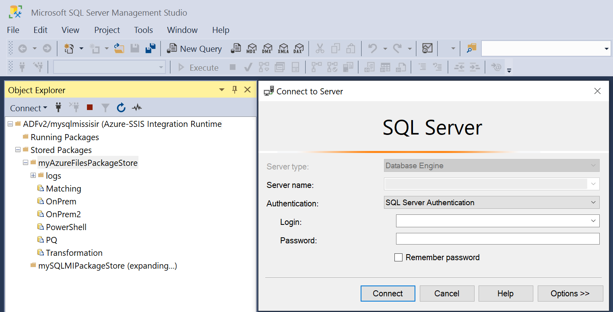

# Manage packages with Azure-SSIS Integration Runtime package store

[!INCLUDE[appliesto-adf-asa-md](includes/appliesto-adf-asa-md.md)]

To lift & shift your on-premises SQL Server Integration Services (SSIS) workloads to the cloud, you can provision Azure-SSIS Integration Runtime (IR) in Azure Data Factory (ADF). For more information, see [Provision an Azure-SSIS IR](https://docs.microsoft.com/azure/data-factory/tutorial-deploy-ssis-packages-azure). An Azure-SSIS IR supports:

- Running packages deployed into SSIS catalog (SSISDB) hosted by Azure SQL Database server/Managed Instance (Project Deployment Model)
- Running packages deployed into file system, Azure Files, or SQL Server database (MSDB) hosted by Azure SQL Managed Instance (Package Deployment Model)

When you use Package Deployment Model, you can choose whether you want to provision your Azure-SSIS IR with package stores that provide a package management layer on top of file system/Azure Files/MSDB hosted by Azure SQL Managed Instance. Azure-SSIS IR package store allows you to import/export/delete/run packages and monitor/stop running packages via SQL Server Management Studio (SSMS) similar to the [legacy SSIS package store](https://docs.microsoft.com/sql/integration-services/service/package-management-ssis-service?view=sql-server-2017). 

## Connect to Azure-SSIS IR

Once your Azure-SSIS IR is provisioned, you can connect to it to browse its package stores on SSMS.

On the **Object Explorer** window of SSMS, select **Azure-SSIS Integration Runtime** in the **Connect** drop-down menu. Next, sign in to Azure and select the relevant subscription, ADF, and Azure-SSIS IR, to which your package stores are attached. Your Azure-SSIS IR will appear with **Running Packages** and **Stored Packages** nodes underneath. Expand the **Stored Packages** node to see your package stores underneath. Expand your package stores to see folders and packages underneath. You may be asked to enter the access credentials for your package stores, if SSMS fails to connect to them automatically. For example, if you expand a package store on top of MSDB, you may be asked to connect to your Azure SQL Managed Instance first.

## Manage folders and packages

When browsing your Azure-SSIS IR on SSMS, you can right-click on any package stores/folders/packages to pop up a menu and select **New Folder**, **Import Package**, **Export Package**, **Delete**, or **Refresh**.

   

   *  Select **New Folder** to create a new folder for imported packages.

   *  Select **Import Package** to import packages from **File System**, **SQL Server** (MSDB), or the legacy **SSIS Package Store** into your package store.

      

      Depending on the **Package location** to import from, select the relevant **Server**/**Authentication type**, enter the access credentials if necessary, select the **Package path**, and enter the new **Package name**. When importing packages, their protection level can't be changed. To change it, use SQL Server Data Tools (SSDT) or `dtutil` command-line utility.

   *  Select **Export Package** to export packages from your package store into **File System**, **SQL Server** (MSDB), or the legacy **SSIS Package Store**.

      

      Depending on the **Package location** to export into, select the relevant **Server**/**Authentication type**, enter the access credentials if necessary, and select the **Package path**. When exporting packages, if they're encrypted, enter the passwords to decrypt them first and then you can change their protection level, for example to not save sensitive data or to encrypt all/sensitive data with user key/password.

   *  Select **Delete** to delete existing folders/packages from your package store.

   *  Select **Refresh** to show newly added folders/packages in your package store.

## Execute packages

When browsing your Azure-SSIS IR on SSMS, you can right-click on any stored packages to pop up a menu and select **Run Package**.  This will open the **Execute Package Utility** dialog, where you can configure your package executions on Azure-SSIS IR as Execute SSIS Package activities in ADF pipelines.

The **General**, **Configurations**, **Execution Options**, and **Logging** pages of **Execute Package Utility** dialog correspond to the  **Settings** tab of Execute SSIS Package activity, where you can enter the encryption password for your package, access information for your package configuration file, package execution credentials/properties, and access information for your log folder.  The **Set Values** page of **Execute Package Utility** dialog corresponds to the **Property Overrides** tab of Execute SSIS Package activity, where you can enter your existing package properties to override. For more information, see [Run SSIS packages as Execute SSIS Package activities in ADF pipelines](https://docs.microsoft.com/azure/data-factory/how-to-invoke-ssis-package-ssis-activity).

When you select the **Execute** button of **Execute Package Utility** dialog, a new ADF pipeline with Execute SSIS Package activity will be automatically generated and triggered. If an ADF pipeline with the same package execution settings already exists, it will be rerun and a new pipeline will not be generated. The ADF pipeline and Execute SSIS Package activity will be named `Pipeline_SSMS_YourPackageName_HashString` and `Activity_SSMS_YourPackageName`, respectively.

## Monitor and stop running packages

When browsing your Azure-SSIS IR on SSMS, you can expand the **Running Packages** node to see your currently running packages underneath.  Right-click on any of them to pop up a menu and select **Stop** or **Refresh**.

   

   *  Select **Stop** to cancel the currently running ADF pipeline that runs the package as Execute SSIS Package activity.

   *  Select **Refresh** to show newly running packages from your package stores.

## Monitor Azure-SSIS IR and edit package stores

When browsing your Azure-SSIS IR on SSMS, you can right-click on it to pop up a menu and select **Go to Azure Data Factory portal** or **Refresh**.

   

   *  Select **Go to Azure Data Factory portal** to open the **Integration runtimes** page of ADF monitoring hub, where you can monitor your Azure-SSIS IR. On the **PACKAGE STORES** tile, you can see the number of package stores that are attached to your Azure-SSIS IR.  Selecting that number will pop up a window where you can edit ADF linked services that store the access information for your package stores.

      

   *  Select **Refresh** to show newly added folders/packages in your package stores and running packages from your package stores.

## Next steps

You can rerun/edit the auto-generated ADF pipelines with Execute SSIS Package activities or create new ones on ADF portal. For more information, see [Run SSIS packages as Execute SSIS Package activities in ADF pipelines](https://docs.microsoft.com/azure/data-factory/how-to-invoke-ssis-package-ssis-activity).