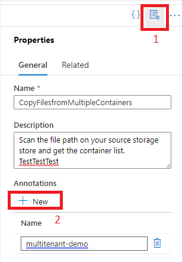
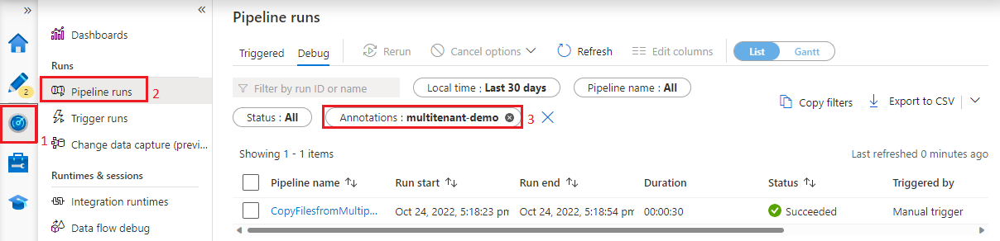
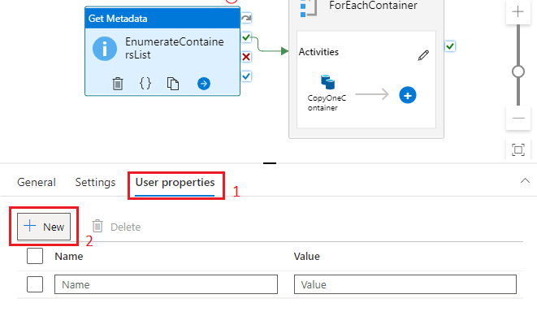
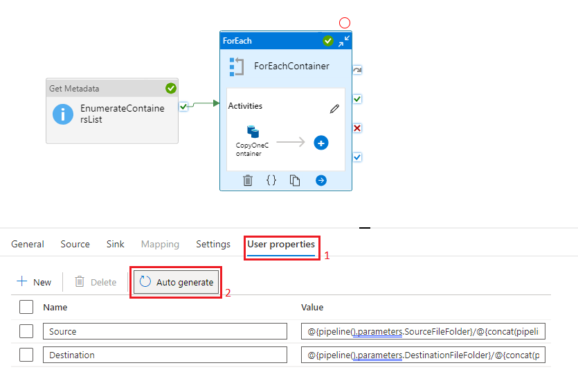
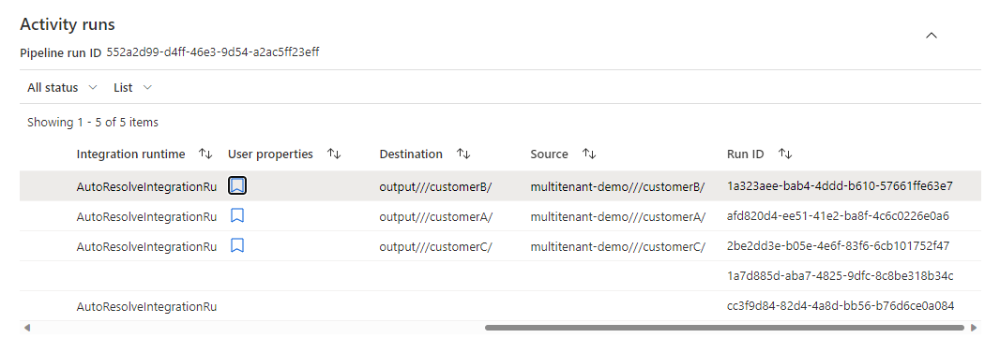
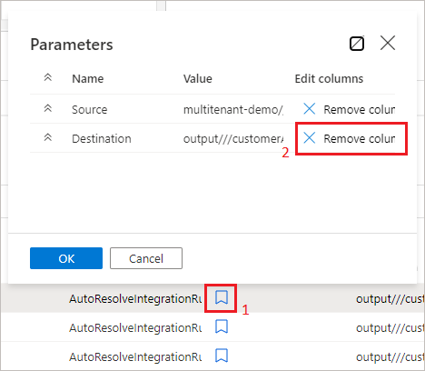

# Monitor Azure Data Factory and Azure Synapse Analytics pipelines with annotations and user properties

[!INCLUDE[appliesto-adf-asa-md](includes/appliesto-adf-asa-md.md)]

When monitoring your data pipelines, you may want to be able to filter and monitor a certain group of activities, such as those of a project or specific department's pipelines. You may also need to further monitor activities based on dynamic properties. You can achieve these things by leveraging annotations and user properties.

## Annotations

Azure Data Factory annotations are tags that you can add to your Azure Data Factory or Azure Synapse Analytics entities to easily identify them. An annotation allows you to classify or group different entities in order to easily monitor or filter them after an execution. Annotations only allow you to define static values and can be added to pipelines, datasets, linked services and triggers.

## User properties

User properties are key-value pairs defined at the activity level. By adding user properties, you can view additional information about activities under activity runs window that may help you to monitor your activity executions.
User properties allow you to define dynamic values and can be added to any activity, up to 5 per activity, under User Properties tab.

## Create and use annotations and user properties

As we discussed, annotations are static values that you can assign to pipelines, datasets, linked services, and triggers. Let's assume you want to filter for pipelines that belong to the same business unit or project name. We will first create the annotation. Click on the Properties icon, + New button and name your annotation appropriately. We advise being consistent with your naming.

When you go to the Monitor tab, you can filter under Pipeline runs for this Annotation:

If you want to monitor for dynamic values at the activity level, you can do so by leveraging the User properties. You can add these under any activity by clicking on the Activity box, User properties tab and the + New button:

For Copy Activity specifically, you can auto-generate these:

To monitor User properties, go to the Activity runs monitoring view. Here you will see all the properties you added.

You can remove some from the view if you click on the Bookmark sign:

## Next steps

To learn more about monitoring see [Visually monitor Azure Data Factory.](./monitor-visually.md)
