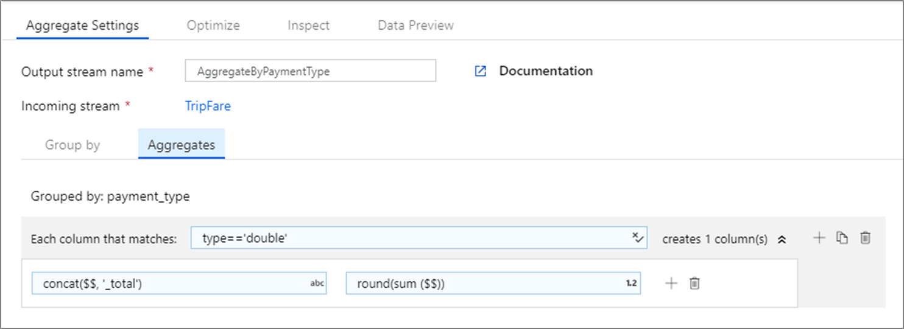

# Azure data factory mapping data flows column patterns

[!INCLUDE [notes](../../includes/data-factory-data-flow-preview.md)]

Several Azure Data Factory Data Flow transformations support the idea of "Columns Patterns" so that you can create template columns based on patterns instead of hard-coded column names. You can use this feature within the Expression Builder to define patterns to match columns for transformation instead of requiring exact, specific field names. Patterns are useful if incoming source fields change often, particularly in the case of changing columns in text files or NoSQL databases. This condition is sometimes referred to as "Schema Drift".

Column patterns are useful for handling both Schema Drift scenarios as well as general scenarios. It is good for conditions where you are not able to fully know each column name. You can pattern match on column name and column data type and build an expression for transformation that will perform that operation against any field in the data stream that matches your `name` & `type` patterns.

When adding an expression to a transform that accepts patterns, choose "Add Column Pattern". Column Patterns allows schema drift column matching patterns.

When building template column patterns, use `$$` in the expression to represent a reference to each matched field from the input data stream.

If you choose to use one of the Expression Builder regex functions, you can then subsequently use $1, $2, $3 ... to reference the sub-patterns matched from your regex expression.

An example of Column Pattern scenario is using SUM with a series of incoming fields. The aggregate SUM calculations are in the Aggregate transformation. You can then use SUM on every match of field types that match "integer" and then use $$ to reference each match in your expression.
