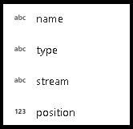
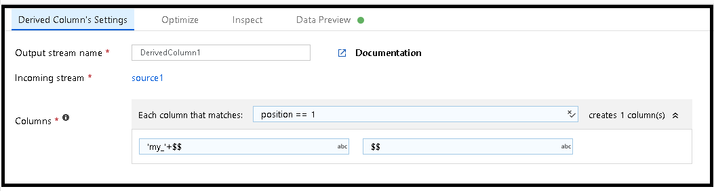

# Mapping data flows column patterns

[!INCLUDE [notes](../../includes/data-factory-data-flow-preview.md)]

Several Azure Data Factory Data Flow transformations support the idea of "Columns Patterns" so that you can create template columns based on patterns instead of hard-coded column names. You can use this feature within the Expression Builder to define patterns to match columns for transformation instead of requiring exact, specific field names. Patterns are useful if incoming source fields change often, particularly in the case of changing columns in text files or NoSQL databases. This condition is sometimes referred to as "Schema Drift".

This "Flexible Schema" handling is currently found in the Derived Column and Aggregate transformations as well as the Select and Sink transformations as "rule-based mapping".

## Column patterns
Column patterns are useful for handling both Schema Drift scenarios as well as general scenarios. It is good for conditions where you are not able to fully know each column name. You can pattern match on column name and column data type and build an expression for transformation that will perform that operation against any field in the data stream that matches your `name` & `type` patterns.

When adding an expression to a transform that accepts patterns, choose "Add Column Pattern". Column Patterns allows schema drift column matching patterns.

When building template column patterns, use `$$` in the expression to represent a reference to each matched field from the input data stream.

If you choose to use one of the Expression Builder regex functions, you can then subsequently use $1, $2, $3 ... to reference the subpatterns matched from your regex expression.

An example of Column Pattern scenario is using SUM with a series of incoming fields. The aggregate SUM calculations are in the Aggregate transformation. You can then use SUM on every match of field types that match "integer" and then use $$ to reference each match in your expression.

## Match columns

To build patterns based on columns, you can match on column name, type, stream, or position and use any combination of those with expression functions and regular expressions.

## Rule-based mapping
When mapping columns in Source and Select transformations, you will have an option to choose "Fixed mapping" or "Rule-based mapping". When you know the schema of your data and expect specific columns from the Source dataset that always match specific static names, you can use fixed mapping. But when you are working with flexible schemas, use rule-based mapping. You will be able to build a pattern match using the rules described above.

Build your rules using the expression builder. Your expressions will return a boolean value to either match columns (true) or exclude columns (false).

## Pattern matching special columns

* `$$` will translate to the name of each match at design time in debug mode and upon execution at run time
* `name` represents the name of each incoming column
* `type` represents the data type of each incoming column
* `stream` represents the name associated with each stream or transformation in your flow
* `position` is the ordinal position of columns in your data flow

## Next steps
* Learn more about the ADF Mapping Data Flow [expression language](http://aka.ms/dataflowexpressions) for data transformations
* Use column patterns in the [Sink transformation](data-flow-sink.md) and [Select transformation](data-flow-select.md) with rule-based mapping
