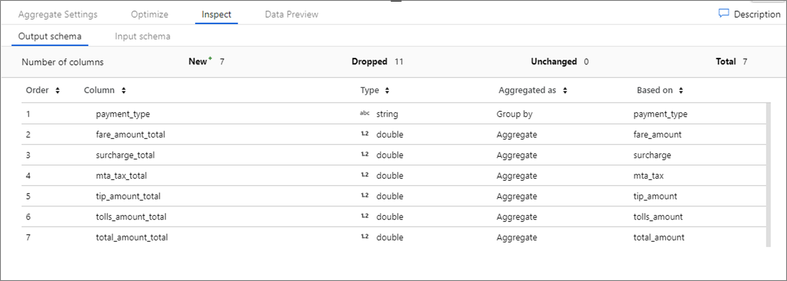
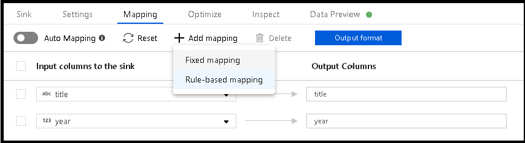
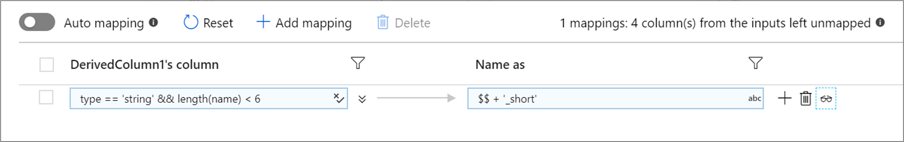
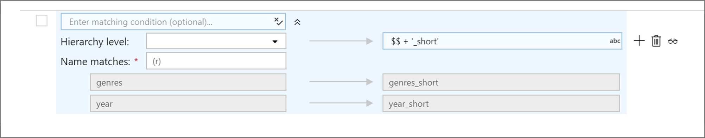
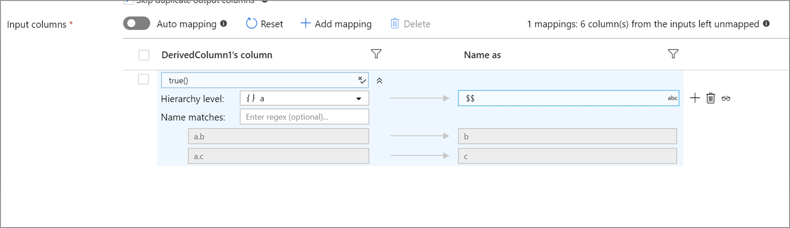

# Using column patterns in mapping data flow

[!INCLUDE[appliesto-adf-asa-md](includes/appliesto-adf-asa-md.md)]

Several mapping data flow transformations allow you to reference template columns based on patterns instead of hard-coded column names. This matching is known as *column patterns*. You can define patterns to match columns based on name, data type, stream, or position instead of requiring exact field names. There are two scenarios where column patterns are useful:

* If incoming source fields change often such as the case of changing columns in text files or NoSQL databases. This scenario is known as [schema drift](concepts-data-flow-schema-drift.md).
* If you wish to do a common operation on a large group of columns. For example, wanting to cast every column that has 'total' in its column name into a double.

Column patterns are currently available in the derived column, aggregate, select, and sink transformations.

## Column patterns in derived column and aggregate

To add a column pattern in a derived column or the Aggregates tab of an aggregate transformation, click the plus icon to the right of an existing column. Select **Add column pattern**. 

Use the [expression builder](concepts-data-flow-expression-builder.md) to enter the match condition. Create a boolean expression that matches columns based on the `name`, `type`, `stream`, and `position` of the column. The pattern will affect any column, drifted or defined, where the condition returns true.

The two expression boxes below the match condition specify the new names and values of the affected columns. Use `$$` to reference the existing value of the matched field. The left expression box defines the name and the right expression box defines the value.

The above column pattern matches every column of type double and creates one aggregate column per match. The name of the new column is the matched column's name concatenated with '_total'. The value of the new column is the rounded, aggregated sum of the existing double value.

To verify your matching condition is correct, you can validate the output schema of defined columns in the **Inspect** tab or get a snapshot of the data in the **Data preview** tab. 

## Rule-based mapping in select and sink

When mapping columns in source and select transformations, you can add either fixed mapping or rule-based mappings. Match based on the `name`, `type`, `stream`, and `position` of columns. You can have any combination of fixed and rule-based mappings. By default, all projections with greater than 50 columns will default to a rule-based mapping that matches on every column and outputs the inputted name. 

To add a rule-based mapping, click **Add mapping** and select **Rule-based mapping**.

Each rule-based mapping requires two inputs: the condition on which to match by and what to name each mapped column. Both values are inputted via the [expression builder](concepts-data-flow-expression-builder.md). In the left expression box, enter your boolean match condition. In the right expression box, specify what the matched column will be mapped to.

Use `$$` syntax to reference the input name of a matched column. Using the above image as an example, say a user wants to match on all string columns whose names are shorter than six characters. If one incoming column was named `test`, the expression `$$ + '_short'` will rename the column `test_short`. If that's the only mapping that exists, all columns that don't meet the condition will be dropped from the outputted data.

Patterns match both drifted and defined columns. To see which defined columns are mapped by a rule, click the eyeglasses icon next to the rule. Verify your output using data preview.

### Regex mapping

If you click the downward chevron icon, you can specify a regex-mapping condition. A regex-mapping condition matches all column names that match the specified regex condition. This can be used in combination with standard rule-based mappings.

The above example matches on regex pattern `(r)` or any column name that contains a lower case r. Similar to standard rule-based mapping, all matched columns are altered by the condition on the right using `$$` syntax.

### Rule-based hierarchies

If your defined projection has a hierarchy, you can use rule-based mapping to map the hierarchies subcolumns. Specify a matching condition and the complex column whose subcolumns you wish to map. Every matched subcolumn will be outputted using the 'Name as' rule specified on the right.

The above example matches on all subcolumns of complex column `a`. `a` contains two subcolumns `b` and `c`. The output schema will include two columns `b` and `c` as the 'Name as' condition is `$$`.

## Pattern matching expression values.

* `$$` translates to the name or value of each match at run time
* `name` represents the name of each incoming column
* `type` represents the data type of each incoming column
* `stream` represents the name associated with each stream, or transformation in your flow
* `position` is the ordinal position of columns in your data flow

## Next steps
* Learn more about the mapping data flow [expression language](data-flow-expression-functions.md) for data transformations
* Use column patterns in the [sink transformation](data-flow-sink.md) and [select transformation](data-flow-select.md) with rule-based mapping
