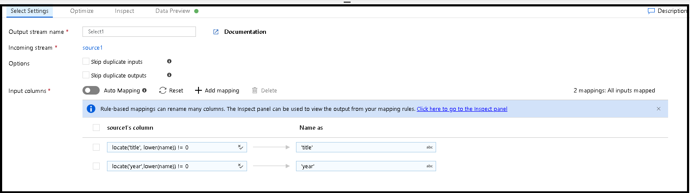

# Using column patterns in mapping data flow

Several mapping data flow transformations allow you to reference template columns based on patterns instead of hard-coded column names. This matching is known as *column patterns*. You can define patterns to match columns based on name, data type, stream, or position instead of requiring exact field names. There are two scenarios where column patterns are useful:

* If incoming source fields change often such as the case of changing columns in text files or NoSQL databases. This scenario is known as [schema drift](concepts-data-flow-schema-drift.md).
* If you wish to do a common operation on a large group of columns. For example, wanting to cast every column that has 'total' in its column name into a double.

Column patterns are currently available in the derived column, aggregate, select, and sink transformations.

## Column patterns in derived column and aggregate

To add a column pattern in a derived column or the Aggregates tab of an aggregate transformation, click the plus icon to the right of an existing column. Select **Add column pattern**. 

Use the [expression builder](concepts-data-flow-expression-builder.md) to enter the match condition. Create a boolean expression that matches columns based on the `name`, `type`, `stream`, and `position` of the column. The pattern will affect any column, drifted or defined, where the condition returns true.

The two expression boxes below the match condition specify the new names and values of the affected columns. Use `$$` to reference the existing value of the matched field. The left expression box defines the name and the right expression box defines the value.

The above column pattern matches every column of type double and creates one aggregate column per match. The name of the new column is the matched column's name concatenated with '_total'. The value of the new column is the rounded, aggregated sum of the existing double value.

To verify your matching condition is correct, you can validate the output schema of defined columns in the **Inspect** tab or get a snapshot of the data in the **Data preview** tab. 

## Rule-based mapping in select and sink

When mapping columns in source and select transformations, you can add either fixed mapping or rule-based mappings. If you know the schema of your data and expect specific columns from the source dataset to always match specific static names, use fixed mapping. If you're working with flexible schemas, use rule-based mapping to build a pattern match based on the `name`, `type`, `stream`, and `position` of columns. You can have any combination of fixed and rule-based mappings. 

To add a rule-based mapping, click **Add mapping** and select **Rule-based mapping**.

In the left expression box, enter your boolean match condition. In the right expression box, specify what the matched column will be mapped to. Use `$$` to reference the existing name of the matched field.

If you click the downward chevron icon, you can specify a regex mapping condition.

Click the eyeglasses icon next to a rule-based mapping to view which defined columns are matched and what they're mapped to.

In the above example, two rule-based mappings are created. The first takes all columns not named 'movie' and maps them to their existing values. The second rule uses regex to match all columns that start with 'movie' and maps them to column 'movieId'.

If your rule results in multiple identical mappings, enable **Skip duplicate inputs** or **Skip duplicate outputs** to prevent duplicates.

## Pattern matching expression values.

* `$$` translates to the name or value of each match at run time
* `name` represents the name of each incoming column
* `type` represents the data type of each incoming column
* `stream` represents the name associated with each stream, or transformation in your flow
* `position` is the ordinal position of columns in your data flow

## Next steps
* Learn more about the mapping data flow [expression language](data-flow-expression-functions.md) for data transformations
* Use column patterns in the [sink transformation](data-flow-sink.md) and [select transformation](data-flow-select.md) with rule-based mapping
