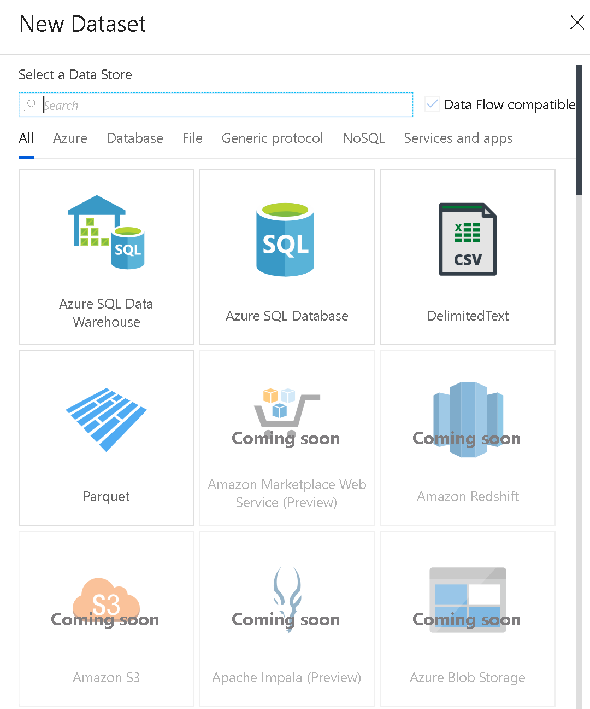
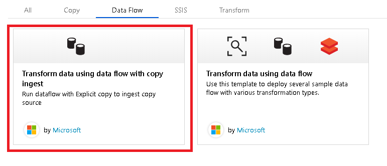

# Mapping Data Flow Datasets

[!INCLUDE [notes](../../includes/data-factory-data-flow-preview.md)]

Datasets are a Data Factory construct that define the shape of the data you are working with in your pipeline. In Data Flow, row & column level data requires a finely-grained dataset definition. Datasets used in control flow pipelines do not require the same depth of data understanding.

Datasets in Data Flow are used in Source and Sink transformations. They are used to define the basic data schemas. If you do not have schema in your data, you can set Schema Drift on for your Source and Sink. With schema defined from the dataset, you will have the related data types, data formats, file location, and connection information from the associated Linked Service. The metadata from the datasets will appear in your Source transform as the source "Projection". The schema in the dataset represents the physical data type and shape while the projection in the Source transformation represents the data flow representation of the data with defined names and types.

## Dataset types

Currently in data flow, you will find four dataset types:

* Azure SQL DB
* Azure SQL DW
* Parquet (from ADLS & Blob)
* Delimited Text (from ADLS & Blob)

Data flow datasets separate the *source type* from the *Linked Service connection type*. Typically in Data Factory, you choose the connection type (Blob, ADLS, etc.) and then define the type of file in the Dataset. Inside Data Flow, you will pick the source types, which can be associated with different Linked Service connection types.

## Data Flow compatible datasets

When creating a new Dataset, there is a checkbox labeled "Data Flow Compatible" on the top right of the panel. Clicking that button will filter only the datasets that can be used with Data Flows. 

## Import schemas

When importing the schema of Data Flow datasets, you will see an Import Schema button. Clicking that button will present you with two options: Import from the source or import from a local file. In most cases, you will import the schema directly from the source. However, if you have an existing schema file (Parquet file or CSV with headers), you can point to that local file and Data Factory will define the schema based upon that schema file.

## Create new table

In Data Flow, you can ask ADF to create a new table definition in your target database by setting a dataset in the Sink transformation that has a new table name. In the SQL dataset, click "Edit" below the table name and enter a new table name. Then, in the Sink Transformation, turn on "Allow Schema Drift". Seth the "Import Schema" setting to None.

## Choose your type of data first

### Delimited text

In the delimited text dataset, you will set the delimiter to handle either single delimiters ('\t' for TSV, ',' for CSV, '|' ...) or use multiple characters for delimiter. Set the header row toggle and then go into the Source transformation to auto-detect data types. If you are using a Delimited Text dataset to land data in a sink, just select a target folder. In the Sink settings, you can define the name of the output files.

### Parquet

Use Parquet as the preferred staging dataset type in ADF data flows. Parquet will store rich metadata schema along with the data.

### Database types

You can select Azure SQL DB or Azure SQL DW.

For the other ADF dataset types, use the Copy Activity to stage your data. There is an ADF template in the template gallery to help you build this pattern.

## Choose your connection type

If you are using Parquet or Delimited Text datasets, you can then select the location for your data: ADLS or Blob.

## Next steps

Start by [creating a new Data Flow](data-flow-create.md) and add a Source Transformation. Then configure the dataset for your Source.

Use the [Copy Activity](copy-activity-overview.md) to bring in data from any ADF data source and stage it in ADLS or Blob for access by Data Flow.

