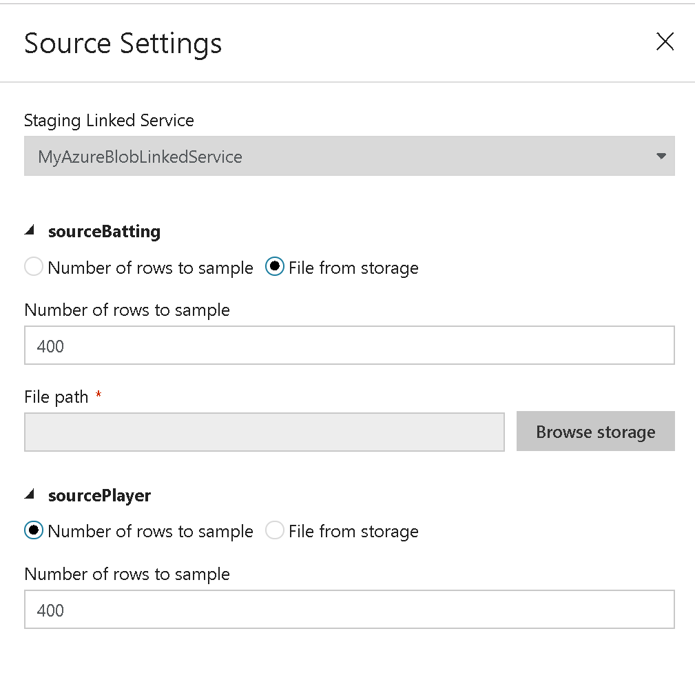

# Mapping Data Flow Debug Mode

[!INCLUDE [notes](../../includes/data-factory-data-flow-preview.md)]

Azure Data Factory Mapping Data Flow has a debug mode, which can be switched on with the Data Flow Debug button at the top of the design surface. When designing data flows, setting debug mode on will allow you to interactively watch the data shape transform while you build and debug your data flows. The Debug session can be used both in Data Flow design sessions as well as during pipeline debug execution of data flows.

## Overview
When Debug mode is on, you will interactively build your data flow with an active Spark cluster. The session will close once you turn debug off in Azure Data Factory. You should be aware of the hourly charges incurred by Azure Databricks during the time that you have the debug session turned on.

In most cases, it is a good practice to build your Data Flows in debug mode so that you can validate your business logic and view your data transformations before publishing your work in Azure Data Factory. You should also use the "Debug" button on the pipeline panel to test your data flow inside of a pipeline.

> [!NOTE]
> While the debug mode light is green on the Data Factory toolbar, you will be charged at the Data Flow debug rate of 8 cores/hr of general compute with a 60 minute time-to-live 

## Debug mode on
When you switch on debug mode, you will be prompted with a side-panel form that will request you to point to your interactive Azure Databricks cluster and select options for the source sampling. You must use an interactive cluster from Azure Databricks and select either a sampling size from each your Source transforms, or pick a text file to use for your test data.

> [!NOTE]
>When running in Debug Mode in Data Flow, your data will not be written to the Sink transform. A Debug session is intended to serve as a test >harness for your transformations. Sinks are not required during debug and are ignored in your data flow. If you wish to test writing the data >in your Sink, execute the Data Flow from an Azure Data Factory Pipeline and use the Debug execution from a pipeline.

## Debug settings
Debug settings can be Each Source from your Data Flow will appear in the side panel and can also be edited by selecting "source settings" on the Data Flow designer toolbar. You can select the limits and/or file source to use for each your Source transformation here. The row limits in this setting are only for the current debug session. You can also use the Sampling setting in the source for limiting rows into the Source transformation.

## Cluster status
There is a cluster status indicator at the top of the design surface that will turn green when the cluster is ready for debug. If your cluster is already warm, then the green indicator will appear almost instantly. If your cluster was not already running when you entered debug mode, then you will have to wait 5-7 minutes for the cluster to spin up. The indicator light will be yellow until it is ready. Once your cluster is ready for Data Flow debug, the indicator light will turn green.

When you are finished with your debugging, turn the Debug switch off so that your Azure Databricks cluster can terminate and you will no longer be billed for debug activity.

## Data preview
With debug on, the Data Preview tab will light-up on the bottom panel. Without debug mode on, Data Flow will show you only the current metadata in and out of each of your transformations in the Inspect tab. The data preview will only query the number of rows that you have set as your limit in your debug settings. You may need to click "Fetch data" to refresh the data preview.

## Data profiles
Selecting individual columns in your data preview tab will pop-up a chart on the far-right of your data grid with detailed statistics about each field. Azure Data Factory will make a determination based upon the data sampling of which type of chart to display. High-cardinality fields will default to NULL / NOT NULL charts while categorical and numeric data that has low cardinality will display bar charts showing data value frequency. You will also see max / len length of string fields, min / max values in numeric fields, standard dev, percentiles, counts and average. 

## Next steps

Once you are finished building and debugging your data flow, [execute it from a pipeline.](control-flow-execute-data-flow-activity.md)

When testing your pipeline with a data flow, use the pipeline [Debug run execution option.](iterative-development-debugging.md)
