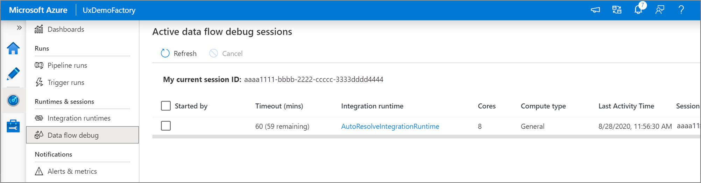

# Mapping data flow Debug Mode

[!INCLUDE[appliesto-adf-asa-md](includes/appliesto-adf-asa-md.md)]

## Overview

Azure Data Factory mapping data flow's debug mode allows you to interactively watch the data shape transform while you build and debug your data flows. The debug session can be used both in Data Flow design sessions as well as during pipeline debug execution of data flows. To turn on debug mode, use the **Data Flow Debug** button in the top bar of data flow canvas or pipeline canvas when you have data flow activities.

Once you turn on the slider, you will be prompted to select which integration runtime configuration you wish to use. If AutoResolveIntegrationRuntime is chosen, a cluster with eight cores of general compute with a default 60-minute time to live will be spun up. If you'd like to allow for more idle team before your session times out, you can choose a higher TTL setting. For more information on data flow integration runtimes, see [Data flow performance](concepts-data-flow-performance.md#ir).

When Debug mode is on, you'll interactively build your data flow with an active Spark cluster. The session will close once you turn debug off in Azure Data Factory. You should be aware of the hourly charges incurred by Azure Databricks during the time that you have the debug session turned on.

In most cases, it's a good practice to build your Data Flows in debug mode so that you can validate your business logic and view your data transformations before publishing your work in Azure Data Factory. Use the "Debug" button on the pipeline panel to test your data flow in a pipeline.

> [!NOTE]
> Every debug session that a user starts from their ADF browser UI is a new session with its own Spark cluster. You can use the monitoring view for debug sessions above to view and manage debug sessions per factory. You are charged for every hour that each debug session is executing including the TTL time.

## Cluster status

The cluster status indicator at the top of the design surface turns green when the cluster is ready for debug. If your cluster is already warm, then the green indicator will appear almost instantly. If your cluster wasn't already running when you entered debug mode, then the Spark cluster will perform a cold boot. The indicator will spin until the environment is ready for interactive debugging.

When you are finished with your debugging, turn the Debug switch off so that your Spark cluster can terminate and you'll no longer be billed for debug activity.

## Debug settings

Once you turn on debug mode, you can edit how a data flow previews data. Debug settings can be edited by clicking "Debug Settings" on the Data Flow canvas toolbar. You can select the row limit or file source to use for each of your Source transformations here. The row limits in this setting are only for the current debug session. You can also select the staging linked service to be used for an Azure Synapse Analytics source. 

If you have parameters in your Data Flow or any of its referenced datasets, you can specify what values to use during debugging by selecting the **Parameters** tab.

Use the sampling settings here to point to sample files or sample tables of data so that you do not have to change your source datasets. By using a sample file or table here, you can maintain the same logic and property settings in your data flow while testing against a subset of data.

The default IR used for debug mode in ADF data flows is a small 4-core single worker node with a 4-core single driver node. This works fine with smaller samples of data when testing your data flow logic. If you expand the row limits in your debug settings during data preview or set a higher number of sampled rows in your source during pipeline debug, then you may wish to consider setting a larger compute environment in a new Azure Integration Runtime. Then you can restart your debug session using the larger compute environment.

## Data preview

With debug on, the Data Preview tab will light-up on the bottom panel. Without debug mode on, Data Flow will show you only the current metadata in and out of each of your transformations in the Inspect tab. The data preview will only query the number of rows that you have set as your limit in your debug settings. Click **Refresh** to fetch the data preview.

> [!NOTE]
> File sources only limit the rows that you see, not the rows being read. For very large datasets, it is recommended that you take a small portion of that file and use it for your testing. You can select a temporary file in Debug Settings for each source that is a file dataset type.

When running in Debug Mode in Data Flow, your data will not be written to the Sink transform. A Debug session is intended to serve as a test harness for your transformations. Sinks are not required during debug and are ignored in your data flow. If you wish to test writing the data in your Sink, execute the Data Flow from an Azure Data Factory Pipeline and use the Debug execution from a pipeline.

Data Preview is a snapshot of your transformed data using row limits and data sampling from data frames in Spark memory. Therefore, the sink drivers are not utilized or tested in this scenario.

### Testing join conditions

When unit testing Joins, Exists, or Lookup transformations, make sure that you use a small set of known data for your test. You can use the Debug Settings option above to set a temporary file to use for your testing. This is needed because when limiting or sampling rows from a large dataset, you cannot predict which rows and which keys will be read into the flow for testing. The result is non-deterministic, meaning that your join conditions may fail.

### Quick actions

Once you see the data preview, you can generate a quick transformation to typecast, remove, or do a modification on a column. Click on the column header and then select one of the options from the data preview toolbar.

Once you select a modification, the data preview will immediately refresh. Click **Confirm** in the top-right corner to generate a new transformation.

**Typecast** and **Modify** will generate a Derived Column transformation and **Remove** will generate a Select transformation.

> [!NOTE]
> If you edit your Data Flow, you need to re-fetch the data preview before adding a quick transformation.

### Data profiling

Selecting a column in your data preview tab and clicking **Statistics** in the data preview toolbar will pop up a chart on the far-right of your data grid with detailed statistics about each field. Azure Data Factory will make a determination based upon the data sampling of which type of chart to display. High-cardinality fields will default to NULL/NOT NULL charts while categorical and numeric data that has low cardinality will display bar charts showing data value frequency. You'll also see max/len length of string fields, min/max values in numeric fields, standard dev, percentiles, counts, and average.

## Next steps

* Once you're finished building and debugging your data flow, [execute it from a pipeline.](control-flow-execute-data-flow-activity.md)
* When testing your pipeline with a data flow, use the pipeline [Debug run execution option.](iterative-development-debugging.md)
