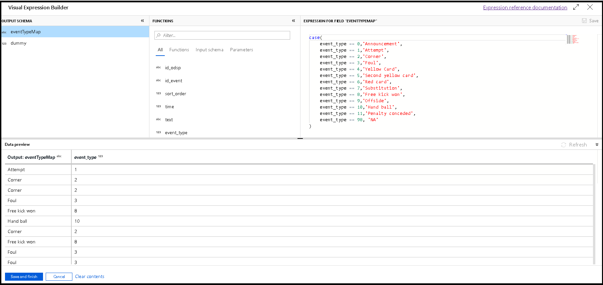
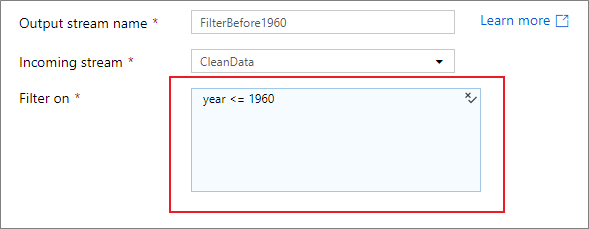
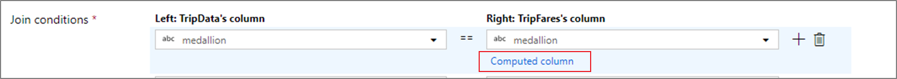
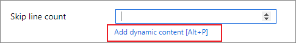
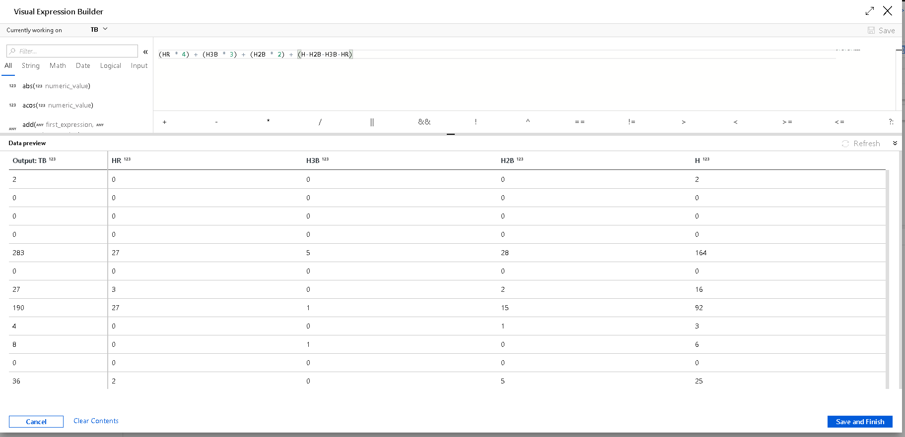
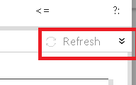
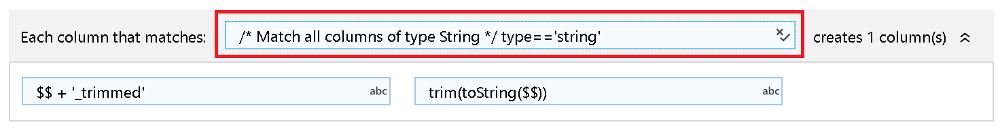
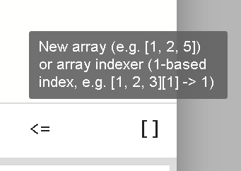

# Build expressions in mapping data flow

[!INCLUDE[appliesto-adf-asa-md](includes/appliesto-adf-asa-md.md)]

In mapping data flow, many transformation properties are entered as expressions. These expressions are composed of column values, parameters, functions, operators, and literals that evaluate to a Spark data type at run time.

> [!VIDEO https://www.microsoft.com/en-us/videoplayer/embed/RE4tkur]

## Open Expression Builder

The expression editing interface in the Azure Data Factory user experience is known as Expression Builder. As you enter your expression logic, Data Factory uses [IntelliSense](https://docs.microsoft.com/visualstudio/ide/using-intellisense?view=vs-2019) code completion for highlighting, syntax checking, and autocompleting.



In transformations such as the derived column and filter, where expressions are mandatory, open Expression Builder by selecting the blue expression box.



When you reference columns in a matching or group-by condition, an expression can extract values from columns. To create an expression, select **Computed column**.



In cases where an expression or a literal value are valid inputs, select **Add dynamic content** to build an expression that evaluates to a literal value.



## Expression language reference

Mapping data flows has built-in functions and operators that can be used in expressions. For a list of available functions, see [Expression functions in the mapping data flow](data-flow-expression-functions.md).

## Column names with special characters

When you have column names that include special characters or spaces, surround the name with curly braces to reference them in an expression.

```{[dbo].this_is my complex name$$$}```

## Preview expression results

If [debug mode](concepts-data-flow-debug-mode.md) is switched on, you can use the live Spark cluster to see an in-progress preview of what your expression evaluates to. As you build your logic, you can debug your expression in real time. 



Select **Refresh** to update the results of your expression against a live sample of your source.



## String interpolation

Use quotation marks to enclose literal string text together with expressions. You can include expression functions, columns, and parameters. String interpolation is useful to avoid extensive use of string concatenation when parameters are included in query strings. To use expression syntax, enclose it in curly braces,

Some examples of string interpolation:

* ```"My favorite movie is {iif(instr(title,', The')>0,"The {split(title,', The')[1]}",title)}"```

* ```"select * from {$tablename} where orderyear > {$year}"```

* ```"Total cost with sales tax is {round(totalcost * 1.08,2)}"```

## Comment expressions

Add comments to your expressions by using single-line and multiline comment syntax.

The following examples are valid comments:

* ```/* This is my comment */```

* ```/* This is a```
*   ```multi-line comment */```

If you put a comment at the top of your expression, it appears in the transformation text box to document your transformation expressions.



## Regular expressions

Many expression language functions use regular expression syntax. When you use regular expression functions, Expression Builder tries to interpret a backslash (\\) as an escape character sequence. When you use backslashes in your regular expression, either enclose the entire regex in backticks (\`) or use a double backslash.

An example that uses backticks:

```
regex_replace('100 and 200', `(\d+)`, 'digits')
```

An example that uses double slashes:

```
regex_replace('100 and 200', '(\\d+)', 'digits')
```

## Address array indexes

With expression functions that return arrays, use brackets ([]) to address specific indexes inside that return array objects. The array is based on ones.



## Keyboard shortcuts

* Ctrl+K Ctrl+C: Comment entire line.
* Ctrl+K Ctrl+U: Uncomment.
* F1: Provide editor help commands.
* Alt+Down arrow key: Move down current line.
* Alt+Up arrow key: Move up current line.
* Ctrl+Spacebar: Show context help.

## Convert to dates or timestamps

To include string literals in your timestamp output, wrap your conversion in ```toString()```.

```toString(toTimestamp('12/31/2016T00:12:00', 'MM/dd/yyyy\'T\'HH:mm:ss'), 'MM/dd /yyyy\'T\'HH:mm:ss')```

To convert milliseconds from epoch to a date or timestamp, use `toTimestamp(<number of milliseconds>)`. If time is coming in seconds, multiply by 1,000.

```toTimestamp(1574127407*1000l)```

The trailing "l" at the end of the previous expression signifies conversion to a long type as inline syntax.

## Next steps

[Begin building data transformation expressions](data-flow-expression-functions.md)
