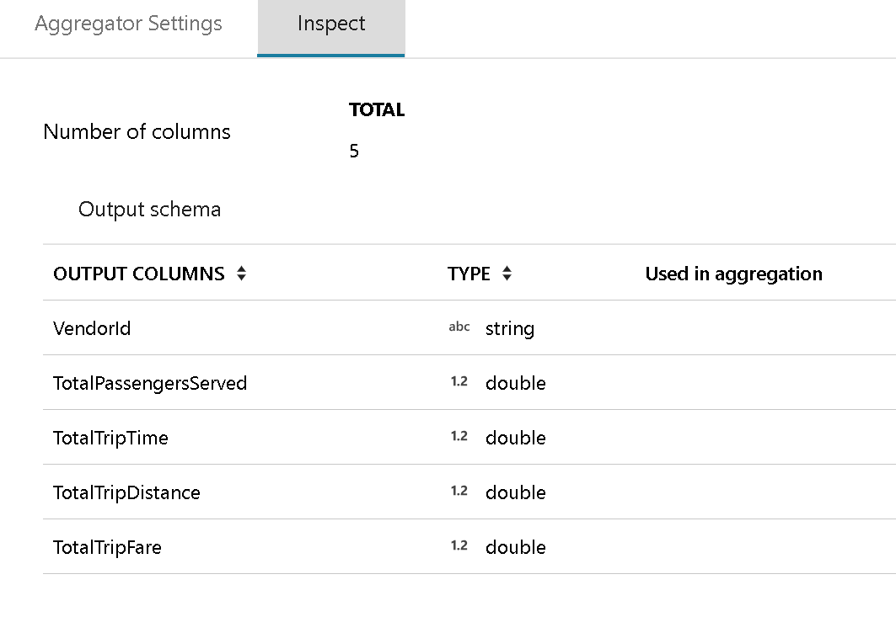
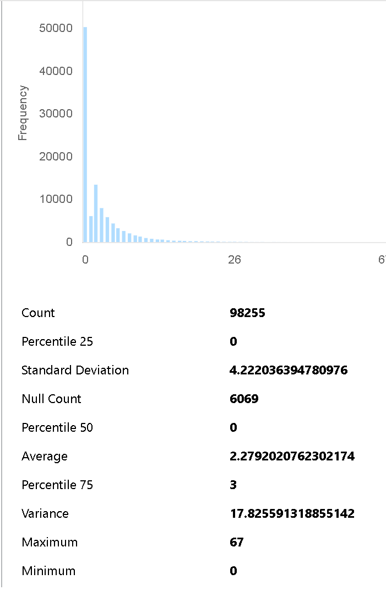

# Azure Data Factory Mapping Data Flow Transformation Inspect Tab

[!INCLUDE [notes](../../includes/data-factory-data-flow-preview.md)]

The Inspect Pane provides a view into the metadata of the data stream that you're transforming. You will be able to see the column counts, columns changed, columns added, data types, column ordering, and column references. "Inspect" is a read-only view of your metadata. You do not need to have Debug mode enabled in order to see metadate in the Inspect Pane.

As you change the shape of your data through transformations, you will see the metadata changes flow through the Inspect Pane. If there is not a defined schema in your Source transformation, then metadata will not be visible in the Inspect Pane. Lack of metadata is common in Schema Drift scenarios.

Data Preview is a pane that provides a read-only view of your data as it is being transformed. You can view the output of your transformation and expressions to validate your data flow. You must have the Debug mode switched-on to see data previews. When you click on columns in the data preview grid, you will see a subsequent panel to the right. The pop-out panel will show the profile statistics about each of the columns that you select.

