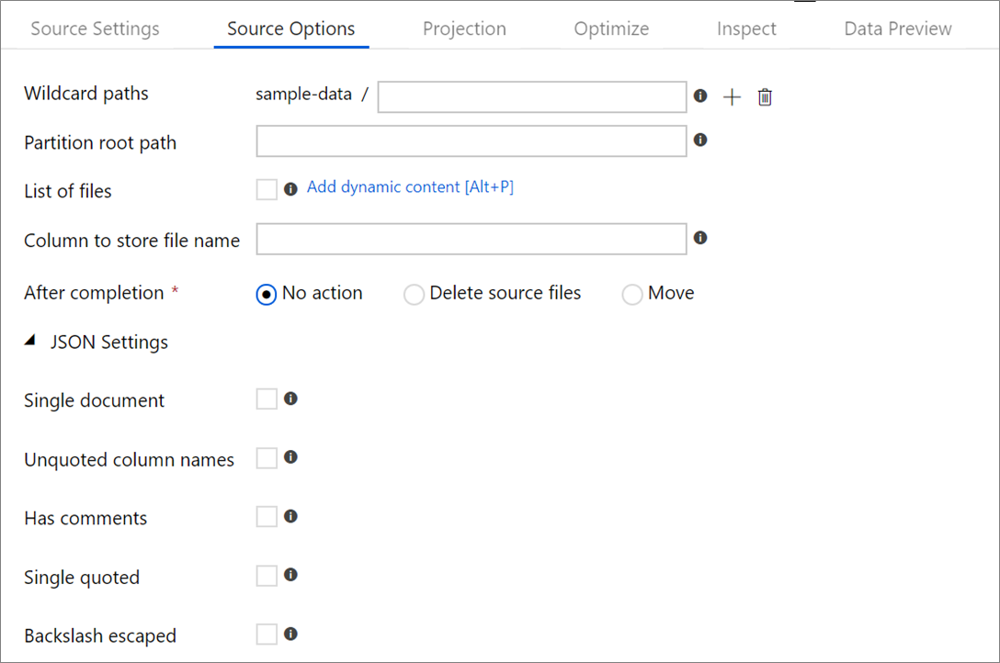

# Mapping data flow JSON handling

## Creating JSON structures in Derived Column

You can add a complex column to your data flow via the derived column expression builder. In the derived column transformation, add a new column and open the expression builder by clicking on the blue box. To make a column complex, you can enter the JSON structure manually or use the UX to add subcolumns interactively.

### Using the expression builder UX

In the output schema side pane, hover over a column and click the plus icon. Select **Add subcolumn** to make the column a complex type.


You can add additional columns and subcolumns in the same way. For each non-complex field, an expression can be added in the expression editor to the right.


### Entering the JSON structure manually

To manually add a JSON structure, add a new column and enter the expression in the editor. The expression follows the following general format:

```
@(
	field1=0,
	field2=@(
		field1=0
	)
)
```

If this expression were entered for a column named "complexColumn", then it would be written to the sink as the following JSON:

```
{
	"complexColumn": {
		"field1": 0,
		"field2": {
			"field1": 0
		}
	}
}
```

#### Sample manual script for complete hierarchical definition
```
@(
	title=Title,
	firstName=FirstName,
	middleName=MiddleName,
	lastName=LastName,
	suffix=Suffix,
	contactDetails=@(
		email=EmailAddress,
		phone=Phone
	),
	address=@(
		line1=AddressLine1,
		line2=AddressLine2,
		city=City,
		state=StateProvince,
		country=CountryRegion,
		postCode=PostalCode
	),
	ids=[
		toString(CustomerID), toString(AddressID), rowguid
	]
)
```

## Source format options

Using a JSON dataset as a source in your data flow allows you to set five additional settings. These settings can be found under the **JSON settings** accordion in the **Source Options** tab.  



### Default

By default, JSON data is read in the following format.

```
{ "json": "record 1" }
{ "json": "record 2" }
{ "json": "record 3" }
```

### Single document

If **Single document** is selected, mapping data flows read one JSON document from each file. 

``` json
File1.json
{
    "json": "record 1"
}
File2.json
{
    "json": "record 2"
}
File3.json
{
    "json": "record 3"
}
```

### Unquoted column names

If **Unquoted column names** is selected, mapping data flows reads JSON columns that aren't surrounded by quotes. 

```
{ json: "record 1" }
{ json: "record 2" }
{ json: "record 3" }
```

### Has comments

Select **Has comments** if the JSON data has C or C++ style commenting.

``` json
{ "json": /** comment **/ "record 1" }
{ "json": "record 2" }
{ /** comment **/ "json": "record 3" }
```

### Single quoted

Select **Single quoted** if the JSON fields and values use single quotes instead of double quotes.

```
{ 'json': 'record 1' }
{ 'json': 'record 2' }
{ 'json': 'record 3' }
```

### Backslash escaped

Select **Single quoted** if backslashes are used to escape characters in the JSON data.

```
{ "json": "record 1" }
{ "json": "\} \" \' \\ \n \\n record 2" }
{ "json": "record 3" }
```

## Higher-order functions

A higher-order function is a function that takes in one or more functions as an argument. Below are a list of higher-order functions supported in mapping data flows that enable array operations.

### filter
Filters elements out of the array that do not meet the provided predicate. Filter expects a reference to one element in the predicate function as #item.

#### Examples
```
filter([1, 2, 3, 4], #item > 2) => [3, 4]
filter(['a', 'b', 'c', 'd'], #item == 'a' || #item == 'b') => ['a', 'b']
```

### map
Maps each element of the array to a new element using the provided expression. Map expects a reference to one element in the expression function as #item.

#### Examples
```
map([1, 2, 3, 4], #item + 2) => [3, 4, 5, 6]
map(['a', 'b', 'c', 'd'], #item + '_processed') => ['a_processed', 'b_processed', 'c_processed', 'd_processed']
```

### reduce
Accumulates elements in an array. Reduce expects a reference to an accumulator and one element in the first expression function as #acc and #item and it expects the resulting value as #result to be used in the second expression function.

#### Examples
```
reduce([1, 2, 3, 4], 0, #acc + #item, #result) => 10
reduce(['1', '2', '3', '4'], '0', #acc + #item, #result) => '01234'
reduce([1, 2, 3, 4], 0, #acc + #item, #result + 15) => 25
```

### sort
Sorts the array using the provided predicate function. Sort expects a reference to two consecutive elements in the expression function as #item1 and #item2.

#### Examples
```
sort([4, 8, 2, 3], compare(#item1, #item2)) => [2, 3, 4, 8]
sort(['a3', 'b2', 'c1'],
        iif(right(#item1, 1) >= right(#item2, 1), 1, -1)) => ['c1', 'b2', 'a3']
sort(['a3', 'b2', 'c1'],
        iif(#item1 >= #item2, 1, -1)) => ['a3', 'b2', 'c1']
```

### contains
Returns true if any element in the provided array evaluates as true in the provided predicate. Contains expects a reference to one element in the predicate function as #item.

#### Examples
```
contains([1, 2, 3, 4], #item == 3) => true
contains([1, 2, 3, 4], #item > 5) => false
```

## Next steps

* [Use the Derived Column transformation to build your hierarchical structures](data-flow-derived-column.md)
