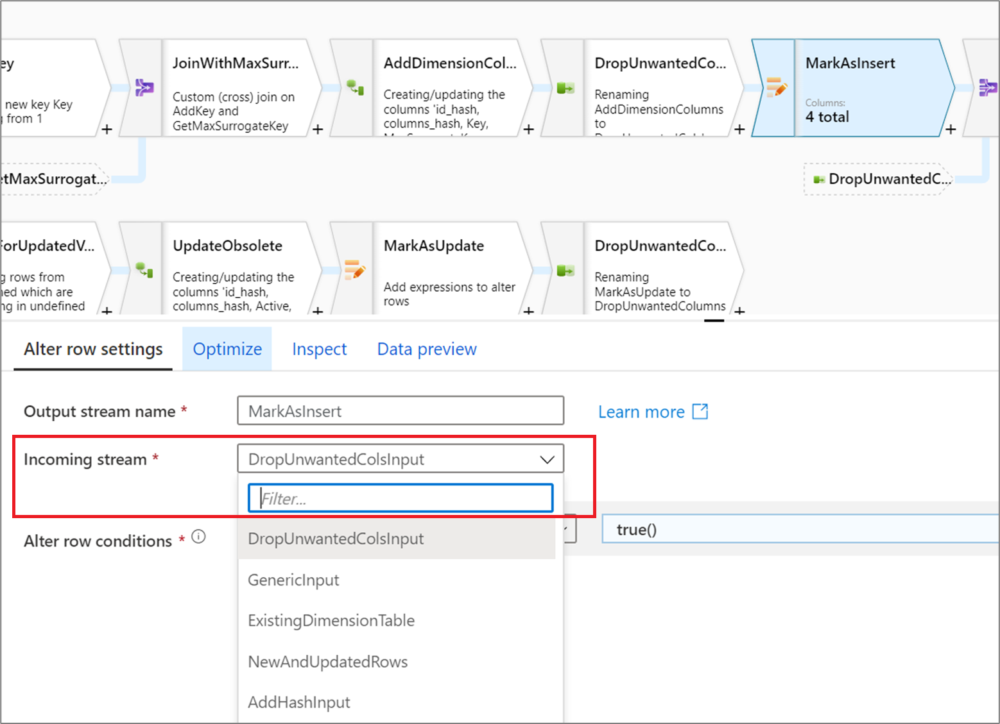
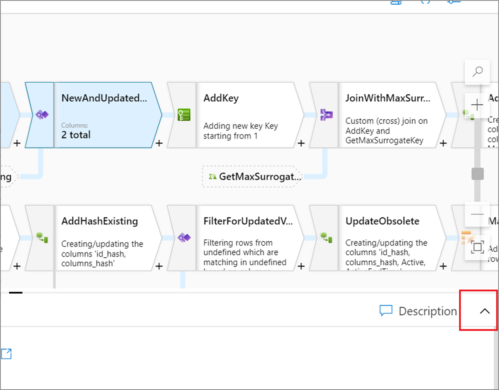
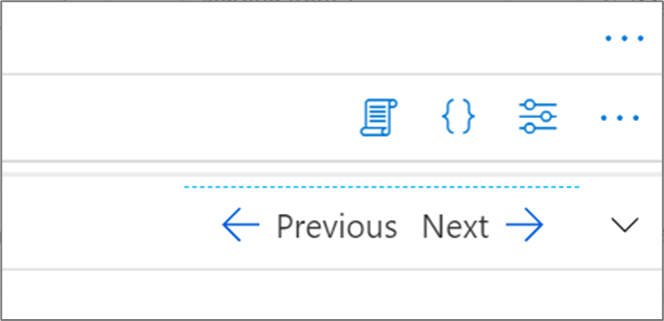
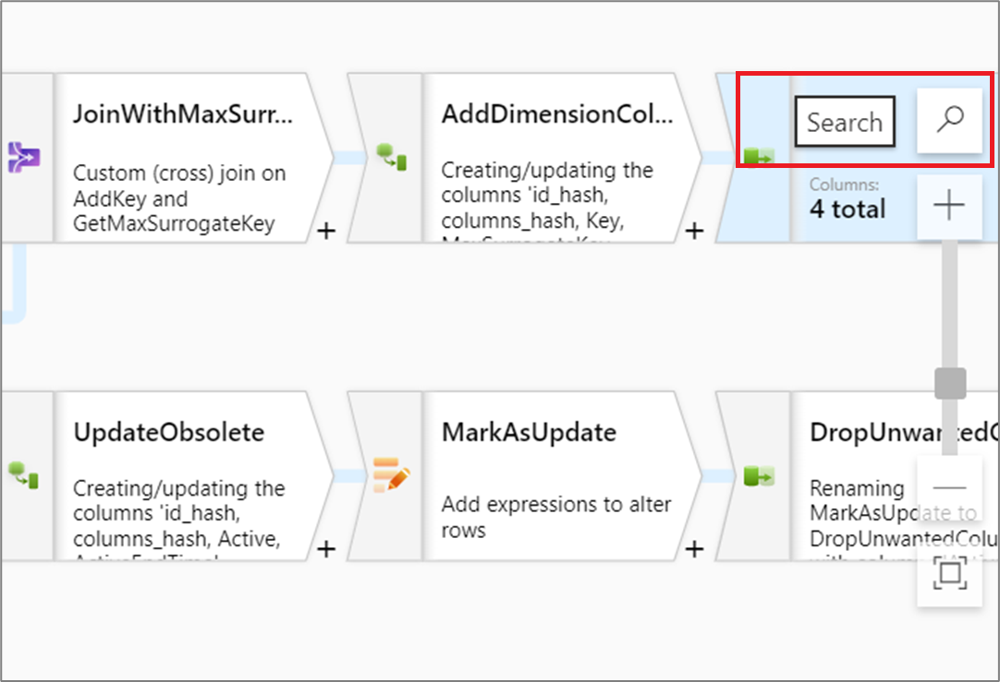
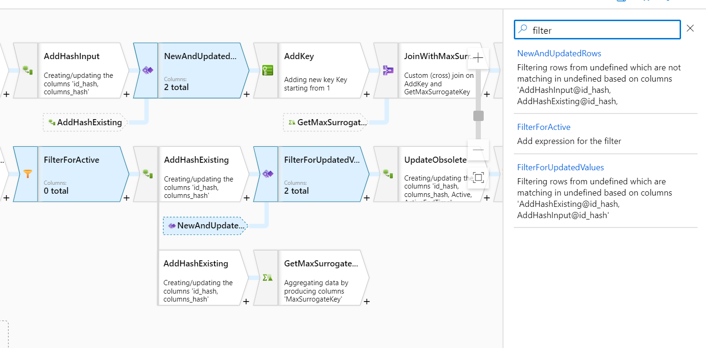
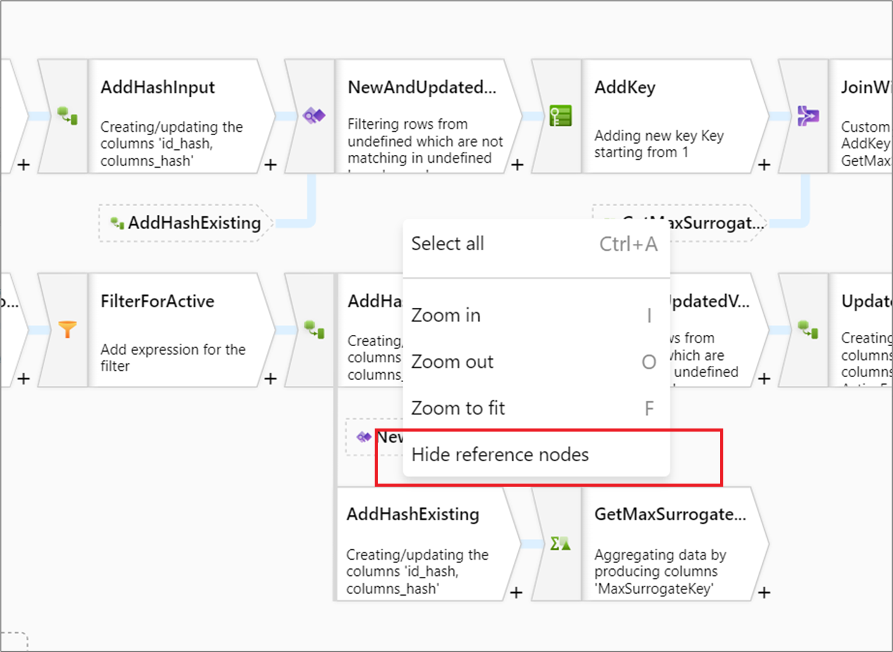

# Managing the mapping data flow graph

[!INCLUDE[appliesto-adf-asa-md](includes/appliesto-adf-asa-md.md)]

Mapping data flows are authored using a design surface know as the data flow graph. In the graph, transformation logic is built left-to-right and additional data streams are added top-down. To add a new transformation, select the plus sign on the lower right of an existing transformation.

As your data flows get more complex, use the following mechanisms to effectively navigate and manage the data flow graph. 

## Moving transformations

In mapping data flows, a set of connected transformation logic is known as a **stream**. The **Incoming stream** field dictates which data stream is feeding the current transformation. Each transformation has one or two incoming streams depending on its function and represents an output stream. The output schema of the incoming streams determines which column metadata can be referenced by the current transformation.

Unlike the pipeline canvas, data flow transformations aren't edited using a drag and drop model. To change the incoming stream of or "move" a transformation, choose a different value from the **Incoming stream** dropdown. When you do this, all downstream transformations will move alongside the edited transformation. The graph will automatically update to show the new logical flow. If you change the incoming stream to a transformation that already has downstream transformation, a new branch or parallel data stream will be created. Learn more about [new branches in mapping data flow](data-flow-new-branch.md).

## Hide graph and show graph

When editing your transformation, you can expand the configuration panel to take up the entire canvas, hiding the graph. Click on the upward-facing chevron located on the right side of the canvas.

When the graph is hidden, you can move between transformations within a stream by clicking **Next** or **Previous**. Click the downward-facing chevron to show the graph.

## Searching for transformations

To quickly find a transformation in your graph, click on the **Search** icon above the zoom setting.

You can search by transformation name or description to locate a transformation.

## Hide reference nodes

If your data flow has any join, lookup, exists, or union transformations, data flow shows reference nodes to all incoming streams. If you wish to minimize the amount of vertical space taken, you can minimize your reference nodes. To do so, right click on the canvas and select **Hide reference nodes**.

## Next steps

After completing your data flow logic, turn on [debug mode](concepts-data-flow-debug-mode.md) and test it out in a data preview.
