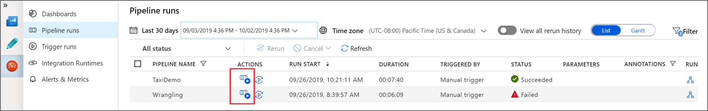
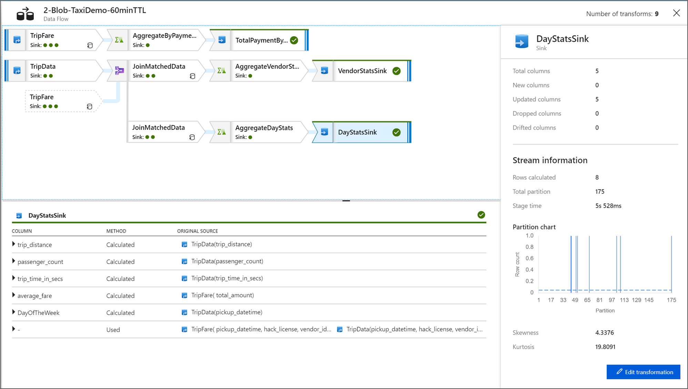
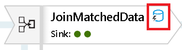

# Monitor Data Flows

[!INCLUDE [notes](../../includes/data-factory-data-flow-preview.md)]

After you have completed building and debugging your data flow, you will want to schedule your data flow to execute on a schedule within the context of a pipeline. You can schedule the pipeline from Azure Data Factory using Triggers. Or you can use the Trigger Now option from the Azure Data Factory Pipeline Builder to execute a single-run execution to test your data flow within the pipeline context.

When you execute your pipeline, you will be able to monitor the pipeline and all of the activities contained in the pipeline including the Data Flow activity. Click on the monitor icon in the left-hand Azure Data Factory UI panel. You will see a screen similar to the one below. The highlighted icons will allow you to drill into the activities in the pipeline, including the Data Flow activity.

You will see stats at this level as well inculding the run times and status. The Run ID at the activity level is different that the Run ID at the pipeline level. The Run ID at the previous level is for the pipeline. Clicking the eyeglasses will give you deep details on your data flow execution.

When you are in the graphical node monitoring view, you will see a simplified view-only version of your data flow graph.

## View Data Flow Execution Plans

When your Data Flow is executed in Databricks, Azure Data Factory determines optimal code paths based on the entirity of your data flow. Additionally, the execution paths may occur on different scale-out nodes and data partitions. Therefore, the monitoring graph represents the design of your flow, taking into account the execution path of your transformations. When you click on individual nodes, you will see "groupings" that represent code that was executed together on the cluster. The timings and counts that you see represent those groups as opposed to the individual steps in your design.

 

* When you click on the open space in the monitoring window, the stats in the bottom pane will display timing and row counts for each Sink and the transformations that led to the sink data for transformation lineage.

* When you select individual transformations, you will receive additional feedback on the right-hand panel that shows partition stats, column counts, skewness (how evenly is the data distributed across partitions), and kurtosis (how spikey is the data).

* When you click on the Sink in the node view, you will see column lineage. There are three different methods that columns are accumulated throughout your data flow to land in the Sink. They are:

  * Computed: You use the column for conditional processing or within an expression in your data flow, but do not land it in the Sink
  * Derived: The column is a new column that you generated in your flow, i.e. it was not present in the Source
  * Mapped: The column originated from the source and your are mapping it to a sink field
  
## Monitor Icons

This icon means that the transformation data was already cached on the cluster, so the timings and execution path have taken that into account:

 

You will also see green circle icons in the transformation. They represent a count of the number of sinks that data is flowing into.
