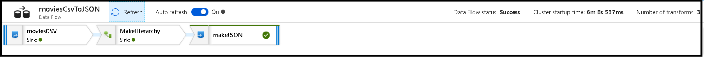

# Monitor Data Flows

[!INCLUDE[appliesto-adf-asa-md](includes/appliesto-adf-asa-md.md)]

After you have completed building and debugging your data flow, you want to schedule your data flow to execute on a schedule within the context of a pipeline. You can schedule the pipeline from Azure Data Factory using Triggers. Or you can use the Trigger Now option from the Azure Data Factory Pipeline Builder to execute a single-run execution to test your data flow within the pipeline context.

When you execute your pipeline, you can monitor the pipeline and all of the activities contained in the pipeline including the Data Flow activity. Click on the monitor icon in the left-hand Azure Data Factory UI panel. You can see a screen similar to the one below. The highlighted icons allow you to drill into the activities in the pipeline, including the Data Flow activity.


You see statistics at this level as well including the run times and status. The Run ID at the activity level is different than the Run ID at the pipeline level. The Run ID at the previous level is for the pipeline. Selecting the eyeglasses gives you deep details on your data flow execution.


When you're in the graphical node monitoring view, you can see a simplified view-only version of your data flow graph.


Here is a video overview of monitoring performance of your data flows from the ADF monitoring screen:

> [!VIDEO https://www.microsoft.com/en-us/videoplayer/embed/RE4u4mH]

## View Data Flow Execution Plans

When your Data Flow is executed in Spark, Azure Data Factory determines optimal code paths based on the entirety of your data flow. Additionally, the execution paths may occur on different scale-out nodes and data partitions. Therefore, the monitoring graph represents the design of your flow, taking into account the execution path of your transformations. When you select individual nodes, you can see "groupings" that represent code that was executed together on the cluster. The timings and counts that you see represent those groups as opposed to the individual steps in your design.


* When you select the open space in the monitoring window, the stats in the bottom pane display timing and row counts for each Sink and the transformations that led to the sink data for transformation lineage.

* When you select individual transformations, you receive additional feedback on the right-hand panel that shows partition stats, column counts, skewness (how evenly is the data distributed across partitions), and kurtosis (how spiky is the data).

* When you select the Sink in the node view, you can see column lineage. There are three different methods that columns are accumulated throughout your data flow to land in the Sink. They are:

  * Computed: You use the column for conditional processing or within an expression in your data flow, but don't land it in the Sink
  * Derived: The column is a new column that you generated in your flow, that is, it was not present in the Source
  * Mapped: The column originated from the source and your are mapping it to a sink field
  * Data flow status: The current status of your execution
  * Cluster startup time: Amount of time to acquire the JIT Spark compute environment for your data flow execution
  * Number of transforms: How many transformation steps are being executed in your flow
  


## Total Sink Processing Time vs. Transformation Processing Time

Each transformation stage includes a total time for that stage to complete with each partition execution time totaled together. When you click on the Sink you will see "Sink Processing Time". This time includes the total of the transformation time *plus* the I/O time it took to write your data to your destination store. The difference between the Sink Processing Time and the total of the transformation is the I/O time to write the data.

You can also see detailed timing for each partition transformation step if you open the JSON output from your data flow activity in the ADF pipeline monitoring view. The JSON contains millisecond timing for each partition, whereas the UX monitoring view is an aggregate timing of partitions added together:

```
 {
     "stage": 4,
     "partitionTimes": [
          14353,
          14914,
          14246,
          14912,
          ...
         ]
}
```

### Post processing time

When you select a sink transformation icon in your map, the slide-in panel on the right will show an additional data point called "post processing time" at the bottom. This is the amount time spent executing your job on the Spark cluster *after* your data has been loaded, transformed, and written. This time can include closing connection pools, driver shutdown, deleting files, coalescing files, etc. When you perform actions in your flow like "move files" and "output to single file", you will likely see an increase in the post processing time value.
  
## Monitor Icons

This icon means that the transformation data was already cached on the cluster, so the timings and execution path have taken that into account:


You also see green circle icons in the transformation. They represent a count of the number of sinks that data is flowing into.
