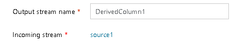

# Mapping Data Flow Move Nodes

[!INCLUDE [notes](../../includes/data-factory-data-flow-preview.md)]

The Azure Data Factory Data Flow design surface is a "construction" surface where you build data flows top-down, left-to-right. There is a toolbox attached to each transform with a plus (+) symbol. Concentrate on your business logic instead of connecting nodes via edges in a free-form DAG environment.

So, without a drag-and-drop paradigm, the way to "move" a transformation node, is to change the incoming stream. Instead, you will move transforms around by changing the "incoming stream".

## Streams of data inside of data flow

In Azure Data Factory Data Flow, streams represent the flow of data. On the transformation settings pane, you will see an "Incoming Steam" field. This tells you which incoming data stream is feeding that transformation. You can change the physical location of your transform node on the graph by clicking the Incoming Stream name and selecting another data stream. The current transformation along with all subsequent transforms on that stream will then move to the new location.

If you are moving a transformation with one or more transformations after it, then the new location in the data flow will be joined via a new branch.

If you have no subsequent transformations after the node you've selected, then only that transform will move to the new location.

## Next steps

After completing your Data Flow design, turn the debug button on and test it out in debug mode either directly in the [data flow designer](concepts-data-flow-debug-mode.md) or [pipeline debug](control-flow-execute-data-flow-activity.md).
