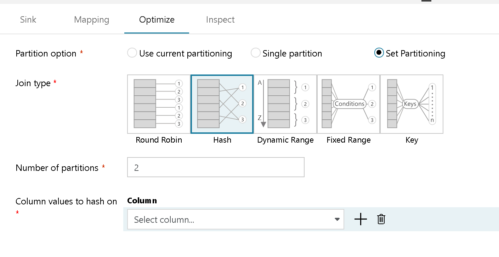

# Mapping data flow transformation optimize tab

[!INCLUDE [notes](../../includes/data-factory-data-flow-preview.md)]

Each Data Flow transformation has an "Optimize" tab. The optimize tab contains optional settings to configure partitioning schemes for data flows.

The default setting is "use current partitioning". Current Partitioning instructs Azure Data Factory to use the partitioning scheme native to Data Flows running on Spark in Azure Databricks. Generally, this is the recommended approach.

However, there are instances where you may wish to adjust the partitioning. For instance, if you want to output your transformations to a single file in the lake, then chose "single partition" on the Optimize tab for partitioning in the Sink Transformation.

Another case where you may wish to exercise control over the partitioning schemes being used for your data transformations is in terms of performance. Adjusting the partitioning of data provides a level of control over the distribution of your data across compute nodes and data locality optimizations that can have both positive as well as negative effects on your overall data flow performance.

If you wish to change partitioning on any transformation, simply click the Optimize tab and select the "Set Partitioning" radio button. You will then be presented with a series of options for partitioning. The best method of partitioning to implement will differ based on your data volumes, candidate keys, null values and cardinality. Best practice is to start with default partitioning and then try the different partitioning options. You can test using the Debug run in Pipeline and then view the time spent in each transformation grouping as well as partition usage from the Monitoring view.

### Round Robin

Round Robin is simple partition that automatically distributes data equally across partitions. Use Round Robin when you do not have good key candidates to implement a solid, smart partitioning strategy. You can set the number of physical partitions.

### Hash

Azure Data Factory will produce a hash of columns to produce uniform partitions such that rows with similar values will fall in the same partition. When using the Hash option, test for possible partition skew. You can set the number of physical partitions.

### Dynamic Range

Dynamic Range will use Spark dynamic ranges based on the columns or expressions that you provide. You can set the number of physical partitions. 

### Fixed Range

You must build an expression that provides a fixed range for values within your partitioned data columns. You should have a good understanding of your data before using this option in order to avoid partition skew. The values you enter for the expression will be used as part of a partition function. You can set the number of physical partitions.

### Key

If you have a good understanding of the cardinality of your data, key partitioning may be a good partition strategy. Key partitioning will create partitions for each unique value in your column. You cannot set the number of partitions because the number will be based on unique values in the data.

## Next steps

[Mapping data flow performance guide](concepts-data-flow-performance.md)
[Data flow monitoring](concepts-data-flow-monitoring.md)
