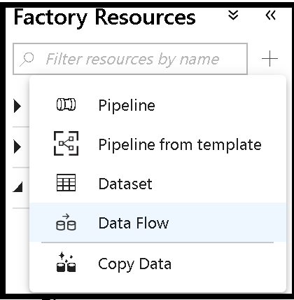
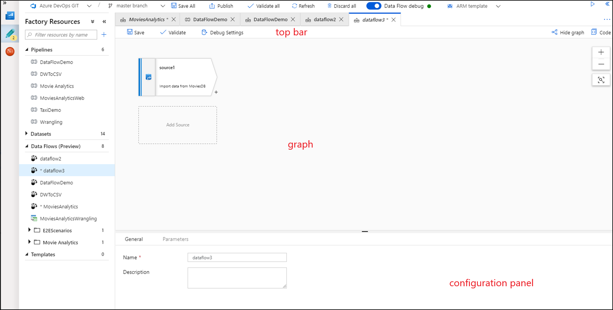
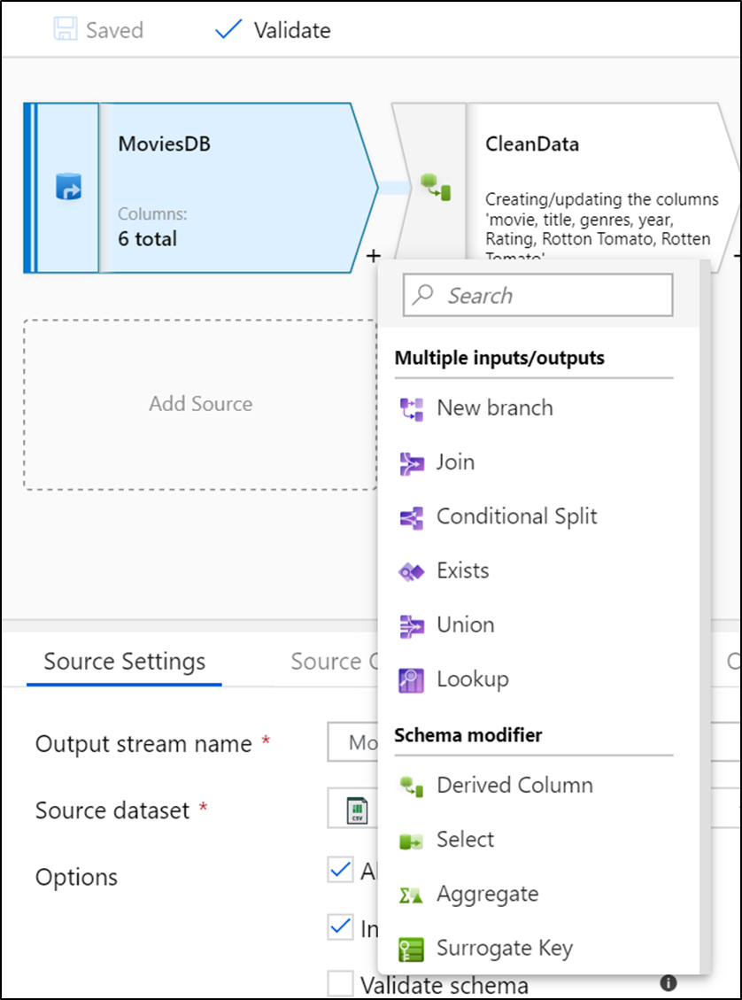
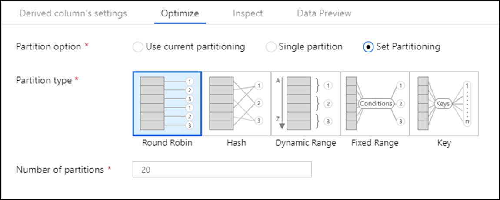
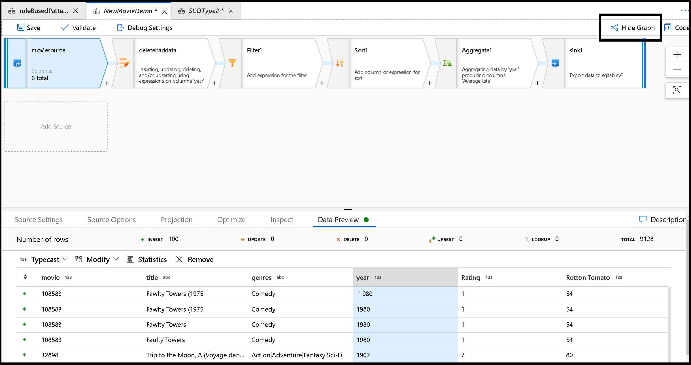
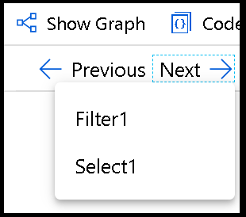

# What are mapping data flows?

[!INCLUDE[appliesto-adf-asa-md](includes/appliesto-adf-asa-md.md)]

Mapping data flows are visually designed data transformations in Azure Data Factory. Data flows allow data engineers to develop graphical data transformation logic without writing code. The resulting data flows are executed as activities within Azure Data Factory pipelines that use scaled-out Apache Spark clusters. Data flow activities can be engaged via existing Data Factory scheduling, control, flow, and monitoring capabilities.

Mapping data flows provide an entirely visual experience with no coding required. Your data flows run on your execution cluster for scaled-out data processing. Azure Data Factory handles all the code translation, path optimization, and execution of your data flow jobs.

## Getting started

To create a data flow, select the plus sign under **Factory Resources**, and then select **Data Flow**. 

This action takes you to the data flow canvas, where you can create your transformation logic. Select **Add source** to start configuring your source transformation. For more information, see [Source transformation](data-flow-source.md).

## Data flow canvas

The data flow canvas is separated into three parts: the top bar, the graph, and the configuration panel. 

### Graph

The graph displays the transformation stream. It shows the lineage of source data as it flows into one or more sinks. To add a new source, select **Add source**. To add a new transformation, select the plus sign on the lower right of an existing transformation.

### Azure integration runtime data flow properties

When you begin working with data flows in ADF, you want to turn on the "Debug" switch for data flows at the top of the browser UI. This spins-up a Spark cluster to use for interactive debugging, data previews, and pipeline debug executions. You can set the size of the cluster being utilized by choosing a custom [Azure Integration Runtime](concepts-integration-runtime.md). The debug session stays alive for up to 60 minutes after your last data preview or last debug pipeline execution.

When you operationalize your pipelines with data flow activities, ADF uses the Azure Integration Runtime associated with the [activity](control-flow-execute-data-flow-activity.md) in the "Run On" property.

The default Azure Integration Runtime is a small 4-core single worker node cluster that allows you to preview data and quickly execute debug pipelines at minimal costs. Set a larger Azure IR configuration if you are performing operations against large datasets.

You can instruct ADF to maintain a pool of cluster resources (VMs) by setting a TTL in the Azure IR data flow properties. This action results in faster job execution on subsequent activities.

#### Azure integration runtime and data flow strategies

##### Execute data flows in parallel

If you execute data flows in a pipeline in parallel, ADF spins up separate Spark clusters for each activity execution based on the settings in your Azure Integration Runtime attached to each activity. To design parallel executions in ADF pipelines, add your data flow activities without precedence constraints in the UI.

Of these three options, this option likely executes in the shortest amount of time. However, each parallel data flow executes at the same time on separate clusters, so the ordering of events is non-deterministic.

If you are executing your data flow activities in parallel inside your pipelines, it is recommended not to use TTL. This action is because parallel executions of your data flow simultaneously using the same Azure Integration Runtime results in multiple warm pool instances for your data factory.

##### Overload single data flow

If you put all of your logic inside a single data flow, ADF executes that same job execution context on a single Spark cluster instance.

This option can be more challenging to follow and troubleshoot because your business rules and business logic can be jumbled together. This option also doesn't provide much reusability.

##### Execute data flows sequentially

If you execute your data flow activities in sequence in the pipeline and you have set a TTL on the Azure IR configuration, then ADF will reuse the compute resources (VMs) resulting in faster subsequent execution times. You will still receive a new Spark context for each execution.

Of these three options, this action likely takes the longest time to execute end-to-end. But it does provide a clean separation of logical operations in each data flow step.

### Configuration panel

The configuration panel shows the settings specific to the currently selected transformation. If no transformation is selected, it shows the data flow. In the overall data flow configuration, you can edit the name and description under the **General** tab or add parameters via the **Parameters** tab. For more information, see [Mapping data flow parameters](parameters-data-flow.md).

Each transformation contains at least four configuration tabs.

#### Transformation settings

The first tab in each transformation's configuration pane contains the settings specific to that transformation. For more information, see that transformation's documentation page.

#### Optimize

The **Optimize** tab contains settings to configure partitioning schemes.

The default setting is **Use current partitioning**, which instructs Azure Data Factory to use the partitioning scheme native to data flows running on Spark. In most scenarios, we recommend this setting.

There are instances where you might want to adjust the partitioning. For instance, if you want to output your transformations to a single file in the lake, select **Single partition** in a sink transformation.

Another case where you might want to control the partitioning schemes is optimizing performance. Adjusting the partitioning provides control over the distribution of your data across compute nodes and data locality optimizations that can have both positive and negative effects on your overall data flow performance. For more information, see the [Data flow performance guide](concepts-data-flow-performance.md).

To change the partitioning on any transformation, select the **Optimize** tab and select the **Set Partitioning** radio button. You are presented with a series of options for partitioning. The best method of partitioning differs based on your data volumes, candidate keys, null values, and cardinality. 

A best practice is to start with default partitioning and then try different partitioning options. You can test by using pipeline debug runs, and view execution time and partition usage in each transformation grouping from the monitoring view. For more information, see [Monitoring data flows](concepts-data-flow-monitoring.md).

The following partitioning options are available.

##### Round robin 

Round robin is a simple partition that automatically distributes data equally across partitions. Use round-robin when you don't have good key candidates to implement a solid, smart partitioning strategy. You can set the number of physical partitions.

##### Hash

Azure Data Factory produces a hash of columns to produce uniform partitions such that rows with similar values fall in the same partition. When you use the Hash option, test for possible partition skew. You can set the number of physical partitions.

##### Dynamic range

The dynamic range uses Spark dynamic ranges based on the columns or expressions that you provide. You can set the number of physical partitions. 

##### Fixed range

Build an expression that provides a fixed range for values within your partitioned data columns. To avoid partition skew, you should have a good understanding of your data before you use this option. The values you enter for the expression are used as part of a partition function. You can set the number of physical partitions.

##### Key

If you have a good understanding of the cardinality of your data, key partitioning might be a good strategy. Key partitioning creates partitions for each unique value in your column. You can't set the number of partitions because the number is based on unique values in the data.

#### Inspect

The **Inspect** tab provides a view into the metadata of the data stream that you're transforming. You can see column counts, the columns changed, the columns added, data types, the column order, and column references. **Inspect** is a read-only view of your metadata. You don't need to have debug mode enabled to see metadata in the **Inspect** pane.

As you change the shape of your data through transformations, you'll see the metadata changes flow in the **Inspect** pane. If there isn't a defined schema in your source transformation, then metadata won't be visible in the **Inspect** pane. Lack of metadata is common in schema drift scenarios.

#### Data preview

If debug mode is on, the **Data Preview** tab gives you an interactive snapshot of the data at each transform. For more information, see [Data preview in debug mode](concepts-data-flow-debug-mode.md#data-preview).

### Top bar

The top bar contains actions that affect the whole data flow, like saving and validation. You can also toggle between graph and configuration modes by using the **Show Graph** and **Hide Graph** buttons.

If you hide your graph, you can browse through your transformation nodes laterally via the **Previous** and **Next** buttons.

## Next steps

* Learn how to create a [source transformation](data-flow-source.md).
* Learn how to build your data flows in [debug mode](concepts-data-flow-debug-mode.md).
