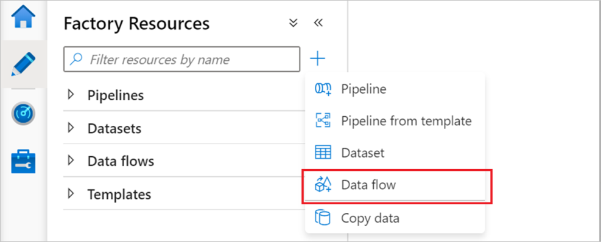
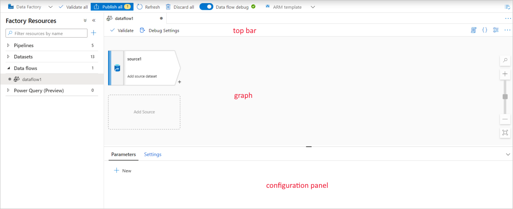
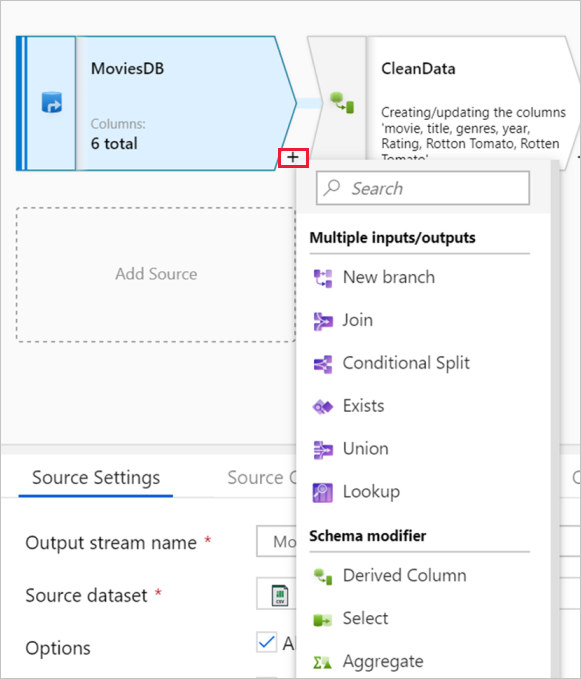
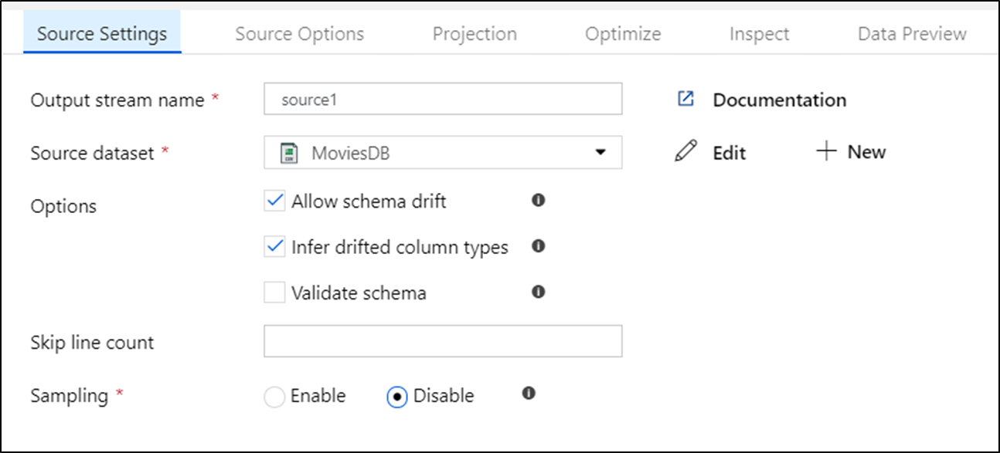
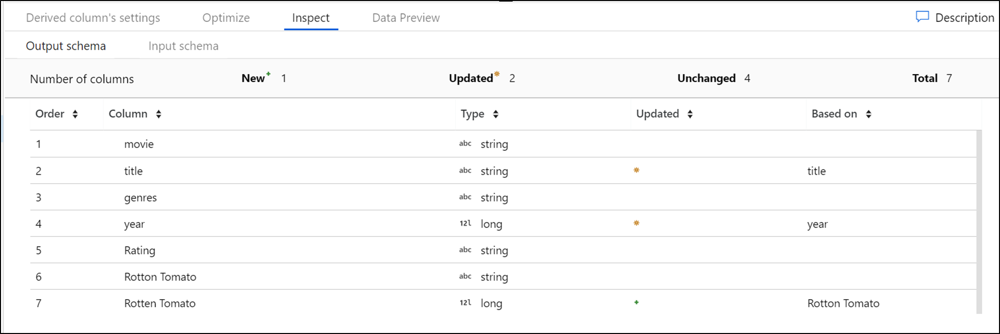

# Mapping data flows in Azure Data Factory

[!INCLUDE[appliesto-adf-asa-md](includes/appliesto-adf-asa-md.md)]

## What are mapping data flows?

Mapping data flows are visually designed data transformations in Azure Data Factory. Data flows allow data engineers to develop data transformation logic without writing code. The resulting data flows are executed as activities within Azure Data Factory pipelines that use scaled-out Apache Spark clusters. Data flow activities can be operationalized using existing Azure Data Factory scheduling, control, flow, and monitoring capabilities.

Mapping data flows provide an entirely visual experience with no coding required. Your data flows run on ADF-managed execution clusters for scaled-out data processing. Azure Data Factory handles all the code translation, path optimization, and execution of your data flow jobs.

## Getting started

Data flows are created from the factory resources pane like pipelines and datasets. To create a data flow, select the plus sign next to **Factory Resources**, and then select **Data Flow**. 

This action takes you to the data flow canvas, where you can create your transformation logic. Select **Add source** to start configuring your source transformation. For more information, see [Source transformation](data-flow-source.md).

## Authoring data flows

Mapping data flow has a unique authoring canvas designed to make building transformation logic easy. The data flow canvas is separated into three parts: the top bar, the graph, and the configuration panel. 

### Graph

The graph displays the transformation stream. It shows the lineage of source data as it flows into one or more sinks. To add a new source, select **Add source**. To add a new transformation, select the plus sign on the lower right of an existing transformation. Learn more on how to [manage the data flow graph](concepts-data-flow-manage-graph.md).

### Configuration panel

The configuration panel shows the settings specific to the currently selected transformation. If no transformation is selected, it shows the data flow. In the overall data flow configuration, you can add parameters via the **Parameters** tab. For more information, see [Mapping data flow parameters](parameters-data-flow.md).

Each transformation contains at least four configuration tabs.

#### Transformation settings

The first tab in each transformation's configuration pane contains the settings specific to that transformation. For more information, see that transformation's documentation page.

#### Optimize

The **Optimize** tab contains settings to configure partitioning schemes. To learn more about how to optimize your data flows, see the [mapping data flow performance guide](concepts-data-flow-performance.md).

#### Inspect

The **Inspect** tab provides a view into the metadata of the data stream that you're transforming. You can see column counts, the columns changed, the columns added, data types, the column order, and column references. **Inspect** is a read-only view of your metadata. You don't need to have debug mode enabled to see metadata in the **Inspect** pane.

As you change the shape of your data through transformations, you'll see the metadata changes flow in the **Inspect** pane. If there isn't a defined schema in your source transformation, then metadata won't be visible in the **Inspect** pane. Lack of metadata is common in schema drift scenarios.

#### Data preview

If debug mode is on, the **Data Preview** tab gives you an interactive snapshot of the data at each transform. For more information, see [Data preview in debug mode](concepts-data-flow-debug-mode.md#data-preview).

### Top bar

The top bar contains actions that affect the whole data flow, like saving and validation. You can view the underlying JSON code and data flow script of your transformation logic as well. For more information, learn about the [data flow script](data-flow-script.md).

## Available transformations

View the [mapping data flow transformation overview](data-flow-transformation-overview.md) to get a list of available transformations.

## Data flow data types

array
binary
boolean
complex
decimal
date
float
integer
long
map
short
string
timestamp

## Data flow activity

Mapping data flows are operationalized within ADF pipelines using the [data flow activity](control-flow-execute-data-flow-activity.md). All a user has to do is specify which integration runtime to use and pass in parameter values. For more information, learn about the [Azure integration runtime](concepts-integration-runtime.md#azure-integration-runtime).

## Debug mode

Debug mode allows you to interactively see the results of each transformation step while you build and debug your data flows. The debug session can be used both in when building your data flow logic and running pipeline debug runs with data flow activities. To learn more, see the [debug mode documentation](concepts-data-flow-debug-mode.md).

## Monitoring data flows

Mapping data flow integrates with existing Azure Data Factory monitoring capabilities. To learn how to understand data flow monitoring output, see [monitoring mapping data flows](concepts-data-flow-monitoring.md).

The Azure Data Factory team has created a [performance tuning guide](concepts-data-flow-performance.md) to help you optimize the execution time of your data flows after building your business logic.

## Available regions

Mapping data flows are available in the following regions in ADF:

| Azure region | Data flows in ADF |
| ------------ | ----------------- |
| Australia Central | |
| Australia Central 2 | |
| Australia East | ✓ |
| Australia Southeast	| ✓ |
| Brazil South	| ✓ |
| Canada Central | ✓ |
| Central India	| ✓ |
| Central US	| ✓ |
| China East |		|
| China East 2	|	|
| China Non-Regional | |
| China North | ✓ |
| China North 2	| ✓ |
| East Asia	| ✓ |
| East US	| ✓ |
| East US 2	| ✓ |
| France Central | ✓ |
| France South	| |
| Germany Central (Sovereign) | |
| Germany Non-Regional (Sovereign) | |
| Germany North (Public) | |
| Germany Northeast (Sovereign) | |
| Germany West Central (Public) |  |
| Japan East | ✓ |
| Japan West |	|
| Korea Central	| ✓ |
| Korea South | |
| North Central US	| ✓ |
| North Europe	| ✓ |
| Norway East | ✓ |
| Norway West | |
| South Africa North	| ✓ |
| South Africa West	|  |
| South Central US	| |
| South India | |
| Southeast Asia	| ✓ |
| Switzerland North	| 	|
| Switzerland West | |
| UAE Central | |
| UAE North	| ✓ |
| UK South	| ✓ |
| UK West |		|
| US DoD Central | |
| US DoD East | |
| US Gov Arizona | ✓ |
| US Gov Non-Regional | |
| US Gov Texas | |
| US Gov Virginia | ✓ |
| West Central US |		|
| West Europe	| ✓ |
| West India | |
| West US	| ✓ |
| West US 2	| ✓ |

## Next steps

* Learn how to create a [source transformation](data-flow-source.md).
* Learn how to build your data flows in [debug mode](concepts-data-flow-debug-mode.md).
