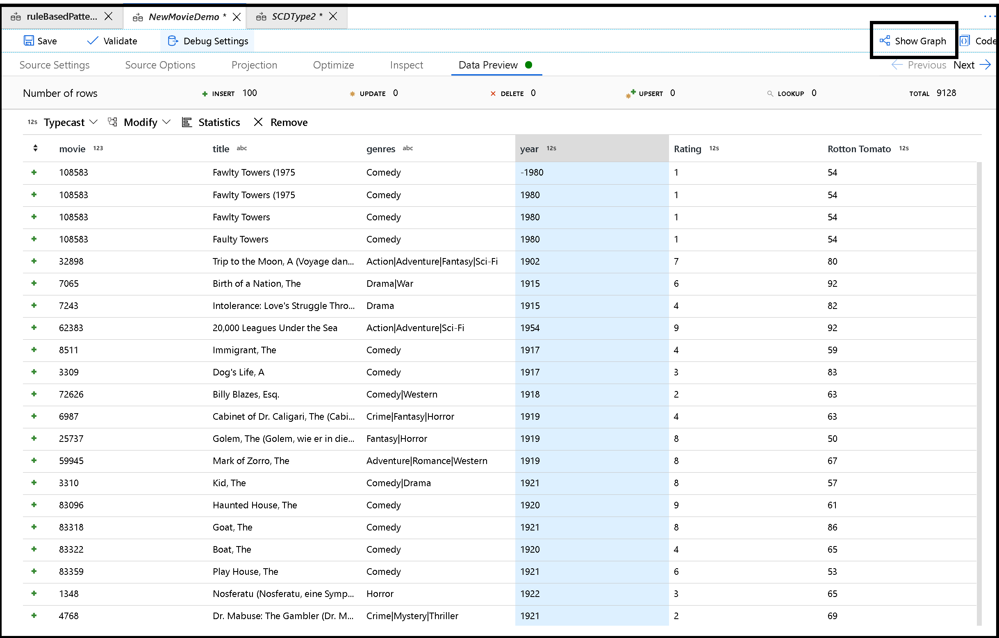

# What are Mapping Data Flows?

Mapping Data Flows are visually-designed data transformation in Azure Data Factory. Data Flows allow data engineers to develop graphical data transformation logic without writing code. The resulting data flows are executed as activities within Azure Data Factory Pipelines using scaled-out Azure Databricks clusters.

The intent of Azure Data Factory Data Flow is to provide a fully visual experience with no coding required. Your Data Flows will execute on your own execution cluster for scaled-out data processing. Azure Data Factory handles all of the code translation, path optimization, and execution of your data flow jobs.

Start by creating data flows in Debug mode so that you can validate your transformation logic interactively. Next, add a Data Flow activity to your pipeline to execute and test your data flow in pipeline debug, or use "Trigger Now" in the pipeline to test your Data Flow from a pipeline Activity.

You will then schedule and monitor your data flow activities by using Azure Data Factory pipelines that execute the Data Flow activity.

The Debug Mode toggle switch on the Data Flow design surface allows interactive building of data transformations. Debug Mode provides a data prep and data preview environment for data flow construction.

## Begin building your data flow logical graph

Start building data flows by using the + sign under Factory Resources to create a new data flow.

Start by configuring your Source Transformation and then add data transformation to each subsequent step using the + sign. As you build out your logical graph, you can switch between graph and configuration modes using the "Show graph" and "Hide graph" button.

## Configure transformation logic

Hiding your graph will let you navigate through your transformation nodes laterally.

## Next steps

* [Begin with a Source Transformation](data-flow-source.md)
