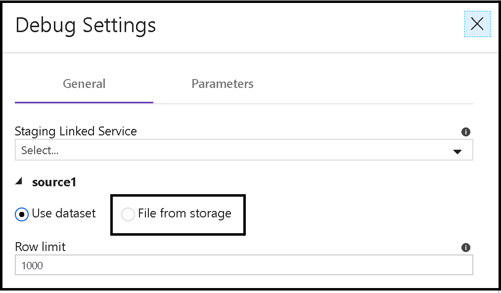
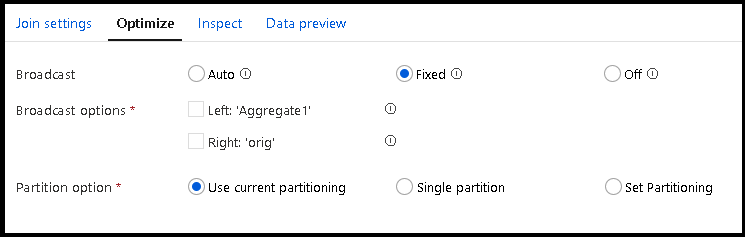

# Mapping data flows performance and tuning guide

[!INCLUDE[appliesto-adf-asa-md](includes/appliesto-adf-asa-md.md)]

Mapping Data Flows in Azure Data Factory provide a code-free interface to design, deploy, and orchestrate data transformations at scale. If you're not familiar with mapping data flows, see the [Mapping Data Flow Overview](concepts-data-flow-overview.md).

When designing and testing Data Flows from the ADF UX, make sure to switch on debug mode to execute your data flows in real time without waiting for a cluster to warm up. For more information, see [Debug Mode](concepts-data-flow-debug-mode.md).

This video shows some sample timings transforming data with data flows:
> [!VIDEO https://www.microsoft.com/en-us/videoplayer/embed/RE4rNxM]

## Monitoring data flow performance

While designing mapping data flows, you can unit test each transformation by clicking on the data preview tab in the configuration panel. Once you verify your logic, test your data flow end-to-end as an activity in a pipeline. Add an Execute Data Flow activity and use the Debug button to test the performance of your data flow. To open the execution plan and performance profile of your data flow, click on the eyeglasses icon under 'actions' in the output tab of your pipeline.


 You can use this information to estimate the performance of your data flow against different-sized data sources. For more information, see [Monitoring mapping data flows](concepts-data-flow-monitoring.md).


 For pipeline debug runs, about one minute of cluster set-up time in your overall performance calculations is required for a warm cluster. If you're initializing the default Azure Integration Runtime, the spin up time may take about 5 minutes.

## Increasing compute size in Azure Integration Runtime

An Integration Runtime with more cores increases the number of nodes in the Spark compute environments and provides more processing power to read, write, and transform your data. ADF Data Flows utilizes Spark for the compute engine. The Spark environment works very well on memory-optimized resources.
* Try a **Compute Optimized** cluster if you want your processing rate to be higher than your input rate.
* Try a **Memory Optimized** cluster if you want to cache more data in memory. Memory optimized has a higher price-point per core than Compute Optimized, but will likely result in faster transformation speeds. If you experience out of memory errors when execution your data flows, switch to a memory optimized Azure IR configuration.


For more information how to create an Integration Runtime, see [Integration Runtime in Azure Data Factory](concepts-integration-runtime.md).

### Increase the size of your debug cluster

By default, turning on debug will use the default Azure Integration runtime that is created automatically for each data factory. This default Azure IR is set for eight cores, four for a driver node and four for a worker node, using General Compute properties. As you test with larger data, you can increase the size of your debug cluster by creating an Azure IR with larger configurations and choose this new Azure IR when you switch on debug. This will instruct ADF to use this Azure IR for data preview and pipeline debug with data flows.

### Decrease cluster compute start-up time with TTL

There is a property in the Azure IR under Data Flow Properties that will allow you to stand-up a pool of cluster compute resources for your factory. With this pool, you can sequentially submit data flow activities for execution. Once the pool is established, each subsequent job will take 1-2 minutes for the on-demand Spark cluster to execute your job. The initial set-up of the resource pool will take around 6 minutes. Specify the amount of time that you wish to maintain the resource pool in the time-to-live (TTL) setting.

## Optimizing for Azure SQL Database and Azure SQL Data Warehouse Synapse

### Partitioning on source

1. Go to the **Optimize** tab and select **Set Partitioning**
1. Select **Source**.
1. Under **Number of partitions**, set the maximum number of connections to your Azure SQL DB. You can try a higher setting to gain parallel connections to your database. However, some cases may result in faster performance with a limited number of connections.
1. Select whether to partition by a specific table column or a query.
1. If you selected **Column**, pick the partition column.
1. If you selected **Query**, enter a query that matches the partitioning scheme of your database table. This query allows the source database engine to leverage partition elimination. Your source database tables don't need to be partitioned. If your source isn't already partitioned, ADF will still use data partitioning in the Spark transformation environment based on the key that you select in the Source transformation.


> [!NOTE]
> A good guide to help you choose number of partitions for your source is based on the number of cores that you have set for your Azure Integration Runtime and multiply that number by five. So, for example, if you are transforming a series of files in your ADLS folders and you are going to utilize a 32-core Azure IR, the number of partitions you would target is 32 x 5 = 160 partitions.

### Source batch size, input, and isolation level

Under **Source Options** in the source transformation, the following settings can affect performance:

* Batch size instructs ADF to store data in sets in Spark memory instead of row-by-row. Batch size is an optional setting and you may run out of resources on the compute nodes if they aren't sized properly. Not setting this property will utilize Spark caching batch defaults.
* Setting a query can allow you to filter rows at the source before they arrive in Data Flow for processing. This can make the initial data acquisition faster. If you use a query, you can add optional query hints for your Azure SQL DB such as READ UNCOMMITTED.
* Read uncommitted will provide faster query results on Source transformation


### Sink batch size

To avoid row-by-row processing of your data flows, set **Batch size** in the Settings tab for Azure SQL DB and Azure SQL DW sinks. If batch size is set, ADF processes database writes in batches based on the size provided. Not setting this property will utilize Spark caching batch defaults.


### Partitioning on sink

Even if you don't have your data partitioned in your destination tables, its recommended to have your data partitioned in the sink transformation. Partitioned data often results in much faster loading over forcing all connections to use a single node/partition. Go to the Optimize tab of your sink and select *Round Robin* partitioning to select the ideal number of partitions to write to your sink.

### Disable indexes on write

In your pipeline, add a [Stored Procedure activity](transform-data-using-stored-procedure.md) before your Data Flow activity that disables indexes on your target tables written from your Sink. After your Data Flow activity, add another Stored Procedure activity that enables those indexes. Or utilize the pre-processing and post-processing scripts in a database sink.

### Increase the size of your Azure SQL DB and DW

Schedule a resizing of your source and sink Azure SQL DB and DW before your pipeline run to increase the throughput and minimize Azure throttling once you reach DTU limits. After your pipeline execution is complete, resize your databases back to their normal run rate.

* SQL DB source table with 887k rows and 74 columns to a SQL DB table with a single derived column transformation takes about 3 mins end-to-end using memory optimized 80-core debug Azure IRs.

### [Azure Synapse SQL DW only] Use staging to load data in bulk via Polybase

To avoid row-by-row inserts into your DW, check **Enable staging** in your Sink settings so that ADF can use [PolyBase](https://docs.microsoft.com/sql/relational-databases/polybase/polybase-guide). PolyBase allows ADF to load the data in bulk.
* When you execute your data flow activity from a pipeline, you'll need to select a Blob or ADLS Gen2 storage location to stage your data during bulk loading.

* File source of 421Mb file with 74 columns to a Synapse table and a single derived column transformation takes about 4 mins end-to-end using memory optimized 80-core debug Azure IRs.

## Optimizing for files

At each transformation, you can set the partitioning scheme you wish data factory to use in the Optimize tab. It is a good practice to first test file-based sinks keeping the default partitioning and optimizations.

* For smaller files, you may find choosing fewer partitions can sometimes work better and faster than asking Spark to partition your small files.
* If you don't have enough information about your source data, choose *Round Robin* partitioning and set the number of partitions.
* If your data has columns that can be good hash keys, choose *Hash partitioning*.

* File source with file sink of a 421Mb file with 74 columns and a single derived column transformation takes about 2 mins end-to-end using memory optimized 80-core debug Azure IRs.

When debugging in data preview and pipeline debug, the limit and sampling sizes for file-based source datasets only apply to the number of rows returned, not the number of rows read. This can affect the performance of your debug executions and possibly cause the flow to fail.
* Debug clusters are small single-node clusters by default and we recommend using sample small files for debugging. Go to Debug Settings and point to a small subset of your data using a temporary file.

    

### File naming options

The most common way to write transformed data in mapping data flows writing Blob or ADLS file store. In your sink, you must select a dataset that points to a container or folder, not a named file. As mapping data flow uses Spark for execution, your output is split over multiple files based on your partitioning scheme.

A common partitioning scheme is to choose _Output to single file_, which merges all output PART files into a single file in your sink. This operation requires the output reduces to a single partition on a single cluster node. You can run out of cluster node resources if you're combining many large source files into a single output file.

To avoid exhausting compute node resources, keep the default, optimized scheme in data flow, and add a Copy Activity in your pipeline that merges all of the PART files from the output folder to a new single file. This technique separates the action of transformation from file merging and achieves the same result as setting _Output to single file_.

### Looping through file lists

A mapping data flow will execute better when the Source transformation iterates over multiple files instead of looping via the For Each activity. We recommend using wildcards or file lists in your source transformation. The Data Flow process will execute faster by allowing the looping to occur inside the Spark cluster. For more information, see [Wildcarding in Source Transformation](connector-azure-data-lake-storage.md#mapping-data-flow-properties).

For example, if you have a list of data files from July 2019 that you wish to process in a folder in Blob Storage, below is a wildcard you can use in your Source transformation.

```DateFiles/*_201907*.txt```

By using wildcarding, your pipeline will only contain one Data Flow activity. This will perform better than a Lookup against the Blob Store that then iterates across all matched files using a ForEach with an Execute Data Flow activity inside.

The pipeline For Each in parallel mode will spawn multiple clusters by spinning-up job clusters for every executed data flow activity. This can cause Azure service throttling with high numbers of concurrent executions. However, use of Execute Data Flow inside of a For Each with Sequential set in the pipeline will avoid throttling and resource exhaustion. This will force Data Factory to execute each of your files against a data flow sequentially.

It is recommended that if you use For Each with a data flow in sequence, that you utilize the TTL setting in the Azure Integration Runtime. This is because each file will incur a full 5 minute cluster startup time inside of your iterator.

### Optimizing for CosmosDB

Setting throughput and batch properties on CosmosDB sinks only take effect during the execution of that data flow from a pipeline data flow activity. The original collection settings will be honored by CosmosDB after your data flow execution.

* Batch size: Calculate the rough row size of your data, and make sure that rowSize * batch size is less than two million. If it is, increase the batch size to get better throughput
* Throughput: Set a higher throughput setting here to allow documents to write faster to CosmosDB. Please keep in mind the higher RU costs based upon a high throughput setting.
*	Write Throughput Budget: Use a value which is smaller than total RUs per minute. If you have a data flow with a high number of Spark partitions, setting a a budget throughput will allow more balance across those partitions.

## Join performance

Managing the performance of joins in your data flow is a very common operation that you will perform throughout the lifecycle of your data transformations. In ADF, data flows do not require data to be sorted prior to joins as these operations are performed as hash joins in Spark. However, you can benefit from improved performance with the "Broadcast" Join optimization that applies to Joins, Exists, and Lookup transformations.

This will avoid on-the-fly shuffles by pushing down the contents of either side of your join relationship into the Spark node. This works well for smaller tables that are used for reference lookups. Larger tables that may not fit into the node's memory are not good candidates for broadcast optimization.

The recommended configuration for data flows with many join operations is to keep the optimization set to "Auto" for "Broadcast" and use a Memory Optimized Azure Integration Runtime configuration. If you are experiencing out of memory errors or broadcast timeouts during data flow executions, you can switch off the broadcast optimization. However, this will result in slower performing data flows. Optionally, you can instruct data flow to pushdown only the left or right side of the join, or both.



Another Join optimization is to build your joins in such a way that it avoids Spark's tendency to implement cross joins. For example, when you include literal values in your join conditions, Spark may see that as a requirement to perform a full cartesian product first, then filter out the joined values. But if you ensure that you have column values on both sides of your join condition, you can avoid this Spark-induced cartesian product and improve the performance of your joins and data flows.

## Next steps

See other Data Flow articles related to performance:

- [Data Flow Optimize Tab](concepts-data-flow-overview.md#optimize)
- [Data Flow activity](control-flow-execute-data-flow-activity.md)
- [Monitor Data Flow performance](concepts-data-flow-monitoring.md)
