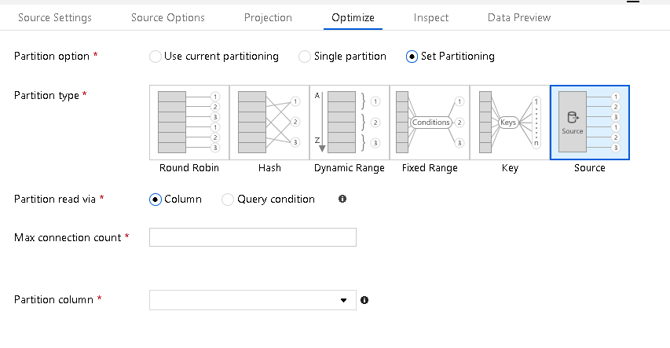

# Mapping data flows performance and tuning guide

[!INCLUDE [notes](../../includes/data-factory-data-flow-preview.md)]

Azure Data Factory Mapping Data Flows provide a code-free browser interface to design, deploy, and orchestrate data transformations at scale.

> [!NOTE]
> If you are not familiar with ADF Mapping Data Flows in general, see [Data Flows Overview](concepts-data-flow-overview.md) before reading this article.
>

> [!NOTE]
> When you are designing and testing Data Flows from the ADF UI, make sure to turn on the Debug switch so that you can execute your data flows in real-time without waiting for a cluster to warm up.
>

## Optimizing for Azure SQL DB

### You can match Spark data partitioning to your source database partitioning based on a database table column key in the Source transformation

* Go to "Optimize" and select "Source". Set either a specific table column or a type in a query.
* If you chose "column", then pick the partition column.
* Also, set the maximum number of connections to your Azure SQL DB. You can try a higher setting to gain parallel connections to your database. However, some cases may result in faster performance with a limited number of connections.

### Set Batch Size and Query on Source

Setting batch size will instruct ADF to store data in sets in memory instead of row-by-row. It is an optional setting and you may run out of resources on the compute nodes if they are not sized properly.
Setting a query can allow you to filter rows right at the source before they even arrive for Data Flow for processing, which can make the initial data acquisition faster.
If you use a query, you can add optional query hints for your Azure SQL DB, i.e. READ UNCOMMITTED
Set Sink Batch Size

 In order to avoid row-by-row processing of your data floes, set the "Batch size" in the sink settings for Azure SQL DB. This will tell ADF to process database writes in batches based on the size provided.
Set Partitioning Options on your Sink

Even if you don't have your data partitioned in your destination Azure SQL DB tables, go to the Optimize tab and set partitioning.
Very often, simply telling ADF to use Round Robin partitioning on the Spark execution clusters results in much faster data loading instead of forcing all connections from a single node/partition.
Increase size of your compute engine in Azure Integration Runtime

Increase the number of cores, which will increase the number of nodes, and provide you with more processing power to query and write to your Azure SQL DB.
Try "Compute Optimized" and "Memory Optimized" options
Disable indexes on write
Use an ADF pipeline stored procedure activity prior to your Data Flow activity that disables indexes on your target tables that are being written to from your Sink.
After your Data Flow activity, add another stored proc activity that enabled those indexes.
Increase the size of your Azure SQL DB
Schedule a resizing of your source and sink Azure SQL DB before your run your pipeline to increase the throughput and minimize Azure throttling once you reach DTU limits.
After your pipeline execution is complete, you can resize your databases back to their normal run rate.

## Next steps
See the other Copy Activity articles:

- [Copy activity overview](copy-activity-overview.md)
- [Copy Activity schema mapping](copy-activity-schema-and-type-mapping.md)
- [Copy activity fault tolerance](copy-activity-fault-tolerance.md)
