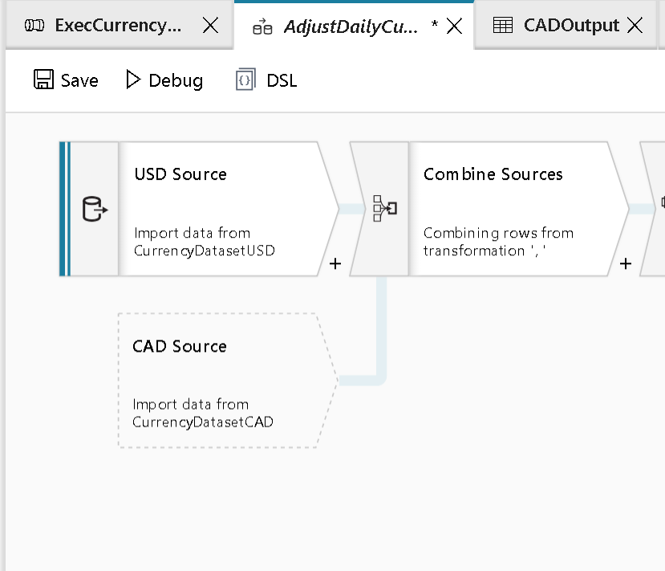

# Mapping Data Flow Reference Node

[!INCLUDE [notes](../../includes/data-factory-data-flow-preview.md)]

A reference node is automatically added to the canvas to signify that the node it is attached to references another existing node on the canvas. Think of a reference node as a pointer or a reference to another data flow transformation.

For example: When you Join or Union more than one stream of data, the Data Flow canvas may add a reference node that reflects the name and settings of the non-primary incoming stream.

The reference node cannot be moved or deleted. However, you can click into the node to modify the originating transformation settings.

The UI rules that govern when Data Flow adds the reference node are based upon available space and vertical spacing between rows.
