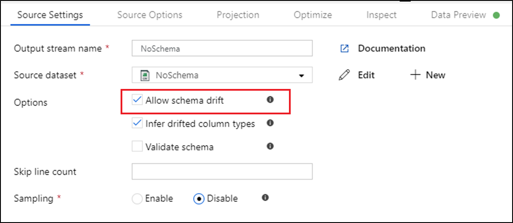
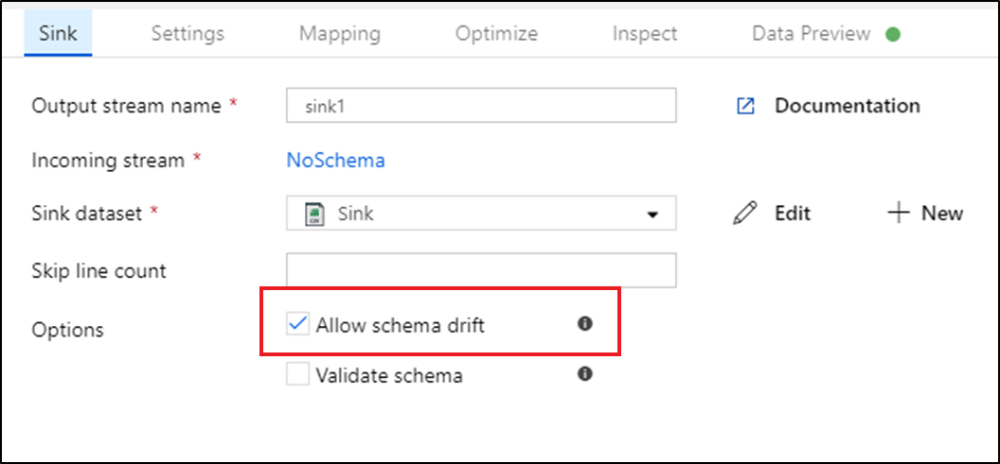
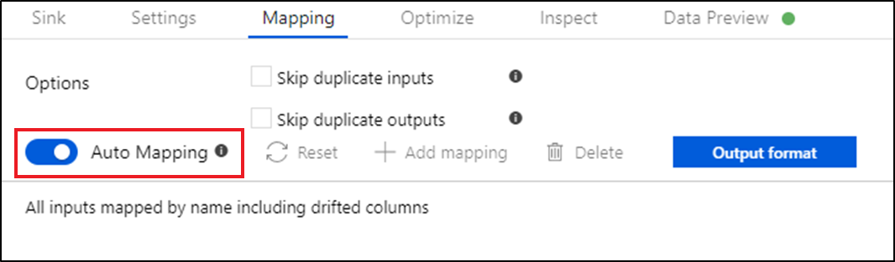
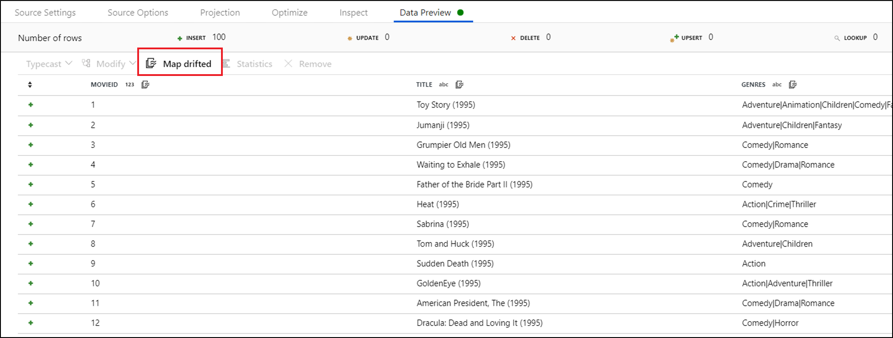
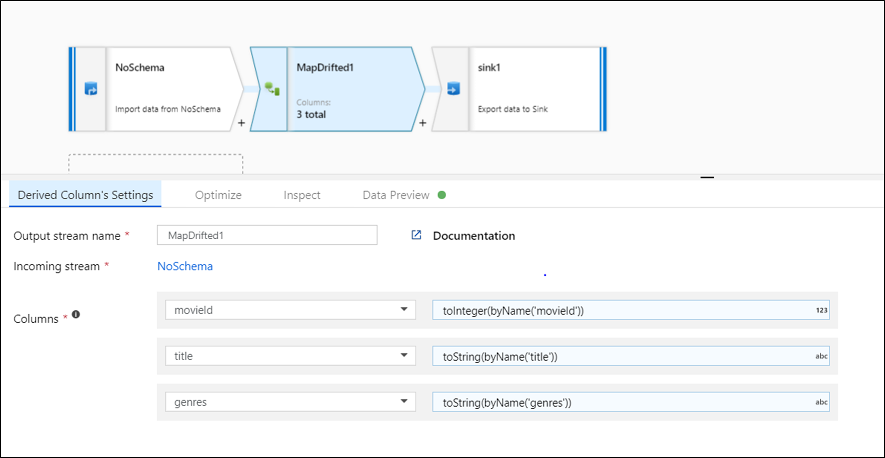

# Schema drift in mapping data flow

[!INCLUDE[appliesto-adf-asa-md](includes/appliesto-adf-asa-md.md)]

Schema drift is the case where your sources often change metadata. Fields, columns, and, types can be added, removed, or changed on the fly. Without handling for schema drift, your data flow becomes vulnerable to upstream data source changes. Typical ETL patterns fail when incoming columns and fields change because they tend to be tied to those source names.

To protect against schema drift, it's important to have the facilities in a data flow tool to allow you, as a Data Engineer, to:

* Define sources that have mutable field names, data types, values, and sizes
* Define transformation parameters that can work with data patterns instead of hard-coded fields and values
* Define expressions that understand patterns to match incoming fields, instead of using named fields

Azure Data Factory natively supports flexible schemas that change from execution to execution so that you can build generic data transformation logic without the need to recompile your data flows.

You need to make an architectural decision in your data flow to accept schema drift throughout your flow. When you do this, you can protect against schema changes from the sources. However, you'll lose early-binding of your columns and types throughout your data flow. Azure Data Factory treats schema drift flows as late-binding flows, so when you build your transformations, the drifted column names won't be available to you in the schema views throughout the flow.

This video provides an introduction to some of the complex solutions that you can build easily in ADF with data flow's schema drift feature. In this example, we build reusable patterns based on flexible database schemas:

> [!VIDEO https://www.microsoft.com/en-us/videoplayer/embed/RE4tyx7]

## Schema drift in source

Columns coming into your data flow from your source definition are defined as "drifted" when they are not present in your source projection. You can view your source projection from the projection tab in the source transformation. When you select a dataset for your source, ADF will automatically take the schema from the dataset and create a project from that dataset schema definition.

In a source transformation, schema drift is defined as reading columns that aren't defined your dataset schema. To enable schema drift, check **Allow schema drift** in your source transformation.

When schema drift is enabled, all incoming fields are read from your source during execution and passed through the entire flow to the Sink. By default, all newly detected columns, known as *drifted columns*, arrive as a string data type. If you wish for your data flow to automatically infer data types of drifted columns, check **Infer drifted column types** in your source settings.

## Schema drift in sink

In a sink transformation, schema drift is when you write additional columns on top of what is defined in the sink data schema. To enable schema drift, check **Allow schema drift** in your sink transformation.

If schema drift is enabled, make sure the **Auto-mapping** slider in the Mapping tab is turned on. With this slider on, all incoming columns are written to your destination. Otherwise you must use rule-based mapping to write drifted columns.

## Transforming drifted columns

When your data flow has drifted columns, you can access them in your transformations with the following methods:

* Use the `byPosition` and `byName` expressions to explicitly reference a column by name or position number.
* Add a column pattern in a Derived Column or Aggregate transformation to match on any combination of name, stream, position, or type
* Add rule-based mapping in a Select or Sink transformation to match drifted columns to columns aliases via a pattern

For more information on how to implement column patterns, see [Column patterns in mapping data flow](concepts-data-flow-column-pattern.md).

### Map drifted columns quick action

To explicitly reference drifted columns, you can quickly generate mappings for these columns via a data preview quick action. Once [debug mode](concepts-data-flow-debug-mode.md) is on, go to the Data Preview tab and click **Refresh** to fetch a data preview. If data factory detects that drifted columns exist, you can click **Map Drifted** and generate a derived column that allows you to reference all drifted columns in schema views downstream.

In the generated Derived Column transformation, each drifted column is mapped to its detected name and data type. In the above data preview, the column 'movieId' is detected as an integer. After **Map Drifted** is clicked, movieId is defined in the Derived Column as `toInteger(byName('movieId'))` and included in schema views in downstream transformations.

## Next steps
In the [Data Flow Expression Language](data-flow-expression-functions.md), you'll find additional facilities for column patterns and schema drift including "byName" and "byPosition".
