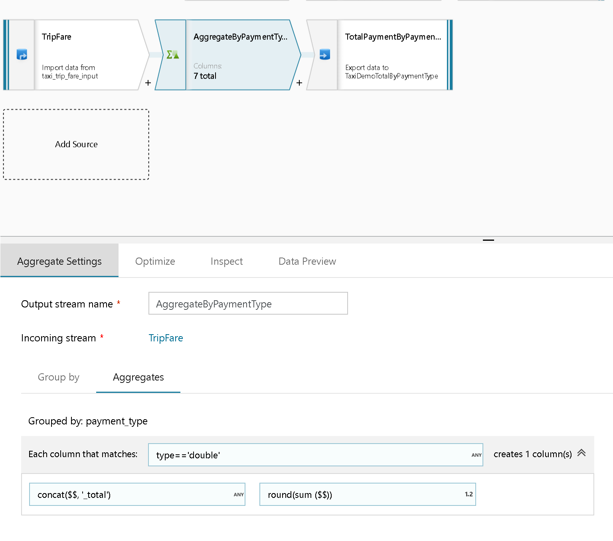
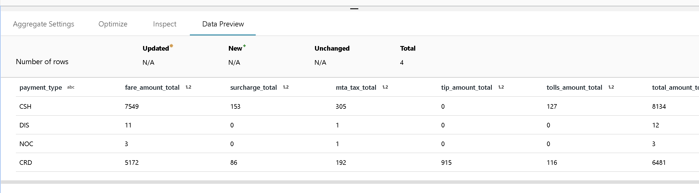

# Mapping Data Flow Schema Drift

[!INCLUDE [notes](../../includes/data-factory-data-flow-preview.md)]

The concept of Schema Drift is the case where your sources often change metadata. Fields, columns, types, etc. can be added, removed or changed on the fly. Without handling for Schema Drift, your Data Flow becomes vulnerable to changes in upstream data source changes. When incoming columns and fields change, typical ETL patterns fail because they tend to be tied to those source names.

In order to protect against Schema Drift, it is important to have the facilities in a Data Flow tool to allow you, as a Data Engineer, to:

* Define sources that have mutable field names, data types, values and sizes
* Define transformation parameters that can work with data patterns instead of hard-coded fields and values
* Define expressions that understand patterns to match incoming fields, instead of using named fields

## How to implement schema drift

* Choose "Allow Schema Drift" in your Source Transformation


* When you've selected this option, all incoming fields will be read from your source on every Data Flow execution and will be passed through the entire flow to the Sink.

* Make sure to use "Auto-Map" to map all new fields in the Sink Transformation so that all new fields get picked-up and landed in your destination.


* Everything will work when new fields are introduced in that scenario with a simple Source -> Sink (aka Copy) mapping.

* To add transformations in that workflow that handles schema drift, you can use pattern matching to match columns by name, type, and value.

* Click on "Add Column Pattern" in the Derived Column or Aggregate transformation if you wish to create a transformation that understands "Schema Drift".


> [!NOTE]
> You need to make an architectural decision in your data flow to accept schema drift throughout your flow. When you do this, you can protect against schema changes from the sources. However, you will lose early-binding of your columns and types throughout your data flow. Azure Data Factory treats schema drift flows as late-binding flows, so when you build your transformations, the column names will not be available to you in the schema views throughout the flow.



In the Taxi Demo sample Data Flow, there is a sample Schema Drift in the bottom data flow with the TripFare source. In the Aggregate transformation, notice that we are using the "column pattern" design for the aggregation fields. Instead of naming specific columns, or looking for columns by position, we assume that the data can change and may not appear in the same order between runs.

In this example of Azure Data Factory Data Flow schema drift handling, we've built and aggregation that scans for columns of type 'double', knowing that the data domain contains prices for each trip. We can then perform an aggregate math calculation across all double fields in the source, regardless of where the column lands and regardless of the column's naming.

The Azure Data Factory Data Flow syntax uses $$ to represent each matched column from your matching pattern. You can also match on column names using complex string search and regular expression functions. In this case, we are going to create a new aggregated field name based on each match of a 'double' type of column and append the text ```_total``` to each of those matched names: 

```concat($$, '_total')```

Then, we will round and sum the values for each of those matched columns:

```round(sum ($$))```

You can test this out with the Azure Data Factory Data Flow sample "Taxi Demo". Switch on the Debug session using the Debug toggle at the top of the Data Flow design surface so that you can see your results interactively:



## Access new columns downstream

When you generate new columns with column patterns, you can access those new columns later in your data flow transformations using the "byName" expression function.

## Next steps

In the [Data Flow Expression Language](data-flow-expression-functions.md) you will find additional facilities for column patterns and schema drift including "byName" and "byPosition".
