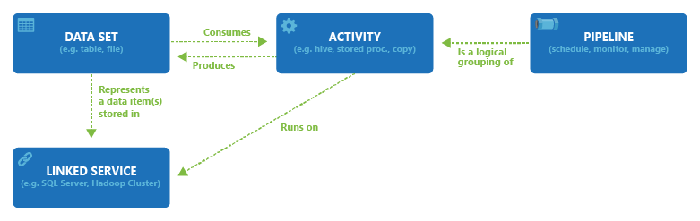

# Datasets in Azure Data Factory
> [!div class="op_single_selector" title1="Select the version of Data Factory service you are using:"]
> * [Version 1](v1/data-factory-create-datasets.md)
> * [Current version](concepts-datasets-linked-services.md)

[!INCLUDE[appliesto-adf-asa-md](includes/appliesto-adf-asa-md.md)]


This article describes what datasets are, how they are defined in JSON format, and how they are used in Azure Data Factory pipelines.

If you are new to Data Factory, see [Introduction to Azure Data Factory](introduction.md) for an overview.

## Overview
A data factory can have one or more pipelines. A **pipeline** is a logical grouping of **activities** that together perform a task. The activities in a pipeline define actions to perform on your data. Now, a **dataset** is a named view of data that simply points or references the data you want to use in your **activities** as inputs and outputs. Datasets identify data within different data stores, such as tables, files, folders, and documents. For example, an Azure Blob dataset specifies the blob container and folder in Blob storage from which the activity should read the data.

Before you create a dataset, you must create a [**linked service**](concepts-linked-services.md) to link your data store to the data factory. Linked services are much like connection strings, which define the connection information needed for Data Factory to connect to external resources. Think of it this way; the dataset represents the structure of the data within the linked data stores, and the linked service defines the connection to the data source. For example, an Azure Storage linked service links a storage account to the data factory. An Azure Blob dataset represents the blob container and the folder within that Azure Storage account that contains the input blobs to be processed.

Here is a sample scenario. To copy data from Blob storage to a SQL Database, you create two linked services: Azure Blob Storage and Azure SQL Database. Then, create two datasets: Delimited Text dataset (which refers to the Azure Blob Storage linked service, assuming you have text files as source) and Azure SQL Table dataset (which refers to the Azure SQL Database linked service). The Azure Blob Storage and Azure SQL Database linked services contain connection strings that Data Factory uses at runtime to connect to your Azure Storage and Azure SQL Database, respectively. The Delimited Text dataset specifies the blob container and blob folder that contains the input blobs in your Blob storage, along with format-related settings. The Azure SQL Table dataset specifies the SQL table in your SQL Database to which the data is to be copied.

The following diagram shows the relationships among pipeline, activity, dataset, and linked service in Data Factory:




## Dataset JSON
A dataset in Data Factory is defined in the following JSON format:

```json
{
    "name": "<name of dataset>",
    "properties": {
        "type": "<type of dataset: DelimitedText, AzureSqlTable etc...>",
        "linkedServiceName": {
                "referenceName": "<name of linked service>",
                "type": "LinkedServiceReference",
        },
        "schema":[

        ],
        "typeProperties": {
            "<type specific property>": "<value>",
            "<type specific property 2>": "<value 2>",
        }
    }
}
```
The following table describes properties in the above JSON:

Property | Description | Required |
-------- | ----------- | -------- |
name | Name of the dataset. See [Azure Data Factory - Naming rules](naming-rules.md). |  Yes |
type | Type of the dataset. Specify one of the types supported by Data Factory (for example: DelimitedText, AzureSqlTable). <br/><br/>For details, see [Dataset types](#dataset-type). | Yes |
schema | Schema of the dataset, represents the physical data type and shape. | No |
typeProperties | The type properties are different for each type. For details on the supported types and their properties, see [Dataset type](#dataset-type). | Yes |

When you import the schema of dataset, select the **Import Schema** button and choose to import from the source or from a local file. In most cases, you'll import the schema directly from the source. But if you already have a local schema file (a Parquet file or CSV with headers), you can direct Data Factory to base the schema on that file.

In copy activity, datasets are used in source and sink. Schema defined in dataset is optional as reference. If you want to apply column/field mapping between source and sink, refer to [Schema and type mapping](copy-activity-schema-and-type-mapping.md).

In Data Flow, datasets are used in source and sink transformations. The datasets define the basic data schemas. If your data has no schema, you can use schema drift for your source and sink. Metadata from the datasets appears in your source transformation as the source projection. The projection in the source transformation represents the Data Flow data with defined names and types.

## Dataset type

Azure Data Factory supports many different types of datasets, depending on the data stores you use. You can find the list of data stores supported by Data Factory from [Connector overview](connector-overview.md) article. Click a data store to learn how to create a linked service and a dataset for it.

For example, for a Delimited Text dataset, the dataset type is set to **DelimitedText** as shown in the following JSON sample:

```json
{
    "name": "DelimitedTextInput",
    "properties": {
        "linkedServiceName": {
            "referenceName": "AzureBlobStorage",
            "type": "LinkedServiceReference"
        },
        "annotations": [],
        "type": "DelimitedText",
        "typeProperties": {
            "location": {
                "type": "AzureBlobStorageLocation",
                "fileName": "input.log",
                "folderPath": "inputdata",
                "container": "adfgetstarted"
            },
            "columnDelimiter": ",",
            "escapeChar": "\\",
            "quoteChar": "\""
        },
        "schema": []
    }
}
```

## Create datasets
You can create datasets by using one of these tools or SDKs: [.NET API](quickstart-create-data-factory-dot-net.md), [PowerShell](quickstart-create-data-factory-powershell.md), [REST API](quickstart-create-data-factory-rest-api.md), Azure Resource Manager Template, and Azure portal

## Current version vs. version 1 datasets

Here are some differences between Data Factory and Data Factory version 1 datasets:

- The external property is not supported in the current version. It's replaced by a [trigger](concepts-pipeline-execution-triggers.md).
- The policy and availability properties are not supported in the current version. The start time for a pipeline depends on [triggers](concepts-pipeline-execution-triggers.md).
- Scoped datasets (datasets defined in a pipeline) are not supported in the current version.

## Next steps
See the following tutorial for step-by-step instructions for creating pipelines and datasets by using one of these tools or SDKs.

- [Quickstart: create a data factory using .NET](quickstart-create-data-factory-dot-net.md)
- [Quickstart: create a data factory using PowerShell](quickstart-create-data-factory-powershell.md)
- [Quickstart: create a data factory using REST API](quickstart-create-data-factory-rest-api.md)
- [Quickstart: create a data factory using Azure portal](quickstart-create-data-factory-portal.md)
