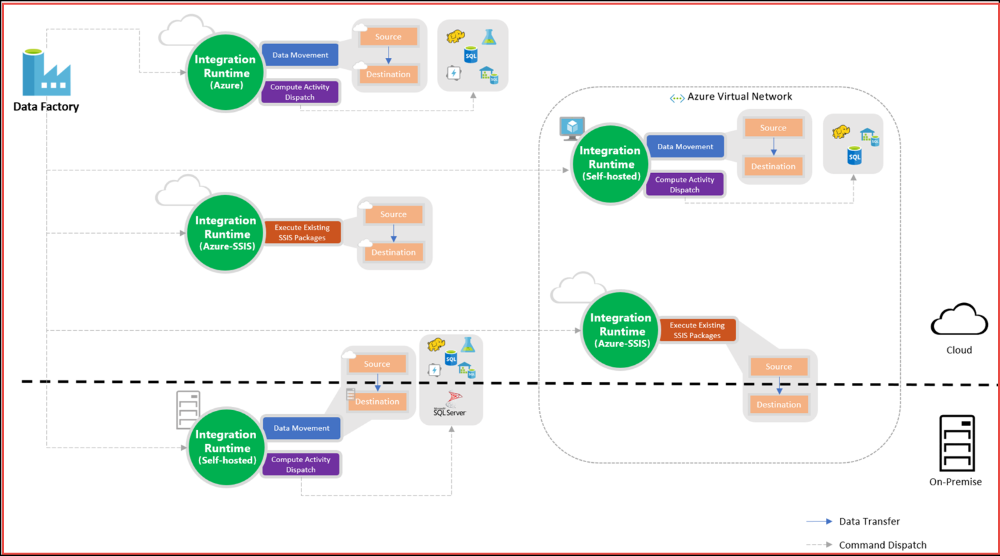
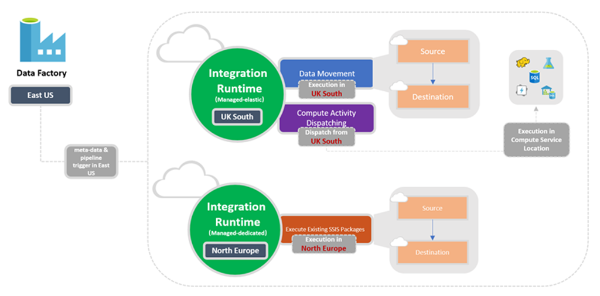

# Integration runtime in Azure Data Factory
The Integration Runtime (IR) is the compute infrastructure used by Azure Data Factory to provide the following data integration capabilities across different network environments:

- **Data Flow**: Execute a [Data Flow](concepts-data-flow-overview.md) in managed Azure compute environment.  
- **Data movement**: Copy data across data stores in public network and data stores in private network (on-premises or virtual private network). It provides support for built-in connectors, format conversion, column mapping, and performant and scalable data transfer.
- **Activity dispatch**:  Dispatch and monitor transformation activities running on a variety of compute services such as Azure Databricks, Azure HDInsight, Azure Machine Learning, Azure SQL Database, SQL Server, and more.
- **SSIS package execution**: Natively execute SQL Server Integration Services (SSIS) packages in a managed Azure compute environment.

In Data Factory, an activity defines the action to be performed. A linked service defines a target data store or a compute service. An integration runtime provides the bridge between the activity and linked Services.  It is referenced by the linked service or activity, and provides the compute environment where the activity either runs on or gets dispatched from. This way, the activity can be performed in the region closest possible to the target data store or compute service in the most performant way while meeting security and compliance needs.

## Integration runtime types
Data Factory offers three types of Integration Runtime, and you should choose the type that best serve the data integration capabilities and network environment needs you are looking for.  These three types are:

- Azure
- Self-hosted
- Azure-SSIS

The following table describes the capabilities and network support for each of the integration runtime types:

IR type | Public network | Private network
------- | -------------- | ---------------
Azure | Data Flow Data movement Activity dispatch | &nbsp;
Self-hosted | Data movement Activity dispatch | Data movement Activity dispatch
Azure-SSIS | SSIS package execution | SSIS package execution

The following diagram shows how the different integration runtimes can be used in combination to offer rich data integration capabilities and network support:

## Azure integration runtime
An Azure integration runtime is capable of:

- Running Data Flows in Azure 
- Running copy activity between cloud data stores
- Dispatching the following transform activities in public network: Databricks Notebook/ Jar/ Python activity, HDInsight Hive activity, HDInsight Pig activity, HDInsight MapReduce activity, HDInsight Spark activity, HDInsight Streaming activity, Machine Learning Batch Execution activity, Machine Learning Update Resource activities, Stored Procedure activity, Data Lake Analytics U-SQL activity, .NET custom activity, Web activity, Lookup activity, and Get Metadata activity.

### Azure IR network environment
Azure Integration Runtime supports connecting to data stores and compute services with public accessible endpoints. Use a self-hosted integration runtime for Azure Virtual Network environment.

### Azure IR compute resource and scaling
Azure integration runtime provides a fully managed, serverless compute in Azure.  You don’t have to worry about infrastructure provision, software installation, patching, or capacity scaling.  In addition, you only pay for the duration of the actual utilization.

Azure integration runtime provides the native compute to move data between cloud data stores in a secure, reliable, and high-performance manner.  You can set how many data integration units to use on the copy activity, and the compute size of the Azure IR is elastically scaled up accordingly without you having to explicitly adjusting size of the Azure Integration Runtime. 

Activity dispatch is a lightweight operation to route the activity to the target compute service, so there isn’t need to scale up the compute size for this scenario.

For information about creating and configuring an Azure IR, see How to create and configure Azure IR under how to guides. 

> [!NOTE] 
> Azure Integration runtime has properties related to Data Flow runtime, which defines the underlying compute infrastructure that would be used to run the data flows on. 

## Self-hosted integration runtime
A self-hosted IR is capable of:

- Running copy activity between a cloud data stores and a data store in private network.
- Dispatching the following transform activities against compute resources in On-Premise or Azure Virtual Network: HDInsight Hive activity (BYOC-Bring Your Own Cluster), HDInsight Pig activity (BYOC), HDInsight MapReduce activity (BYOC), HDInsight Spark activity (BYOC), HDInsight Streaming activity (BYOC), Machine Learning Batch Execution activity, Machine Learning Update Resource activities, Stored Procedure activity, Data Lake Analytics U-SQL activity, Custom activity (runs on Azure Batch), Lookup activity, and Get Metadata activity.

> [!NOTE] 
> Use self-hosted integration runtime to support data stores that requires bring-your-own driver such as SAP Hana, MySQL, etc.  For more information, see [supported data stores](copy-activity-overview.md#supported-data-stores-and-formats).

### Self-hosted IR network environment
If you want to perform data integration securely in a private network environment, which does not have a direct line-of-sight from the public cloud environment, you can install a self-hosted IR on premises environment behind your corporate firewall, or inside a virtual private network.  The self-hosted integration runtime only makes outbound HTTP-based connections to open internet.

### Self-hosted IR compute resource and scaling
Self-hosted IR needs to be installed on an on-premises machine or a virtual machine inside a private network. Currently, we only support running the self-hosted IR on a Windows operating system.  

For high availability and scalability, you can scale out the self-hosted IR by associating the logical instance with multiple on-premises machines in active-active mode.  For more information, see how to [create and configure self-hosted IR](create-self-hosted-integration-runtime.md) article under how to guides for details.

## Azure-SSIS Integration Runtime
To lift and shift existing SSIS workload, you can create an Azure-SSIS IR to natively execute SSIS packages.

### Azure-SSIS IR network environment
Azure-SSIS IR can be provisioned in either public network or private network.  On-premises data access is supported by joining Azure-SSIS IR to a Virtual Network that is connected to your on-premises network.  

### Azure-SSIS IR compute resource and scaling
Azure-SSIS IR is a fully managed cluster of Azure VMs dedicated to run your SSIS packages. You can bring your own Azure SQL Database or Managed Instance server to host the catalog of SSIS projects/packages (SSISDB) that is going to be attached to it. You can scale up the power of the compute by specifying node size and scale it out by specifying the number of nodes in the cluster. You can manage the cost of running your Azure-SSIS Integration Runtime by stopping and starting it as you see fit.

For more information, see how to create and configure Azure-SSIS IR article under how to guides.  Once created, you can deploy and manage your existing SSIS packages with little to no change using familiar tools such as SQL Server Data Tools (SSDT) and SQL Server Management Studio (SSMS), just like using SSIS on premises.

For more information about Azure-SSIS runtime, see the following articles: 

- [Tutorial: deploy SSIS packages to Azure](tutorial-create-azure-ssis-runtime-portal.md). This article provides step-by-step instructions to create an Azure-SSIS IR and uses an Azure SQL database to host the SSIS catalog. 
- [How to: Create an Azure-SSIS integration runtime](create-azure-ssis-integration-runtime.md). This article expands on the tutorial and provides instructions on using Azure SQL Database Managed Instance and joining the IR to a virtual network. 
- [Monitor an Azure-SSIS IR](monitor-integration-runtime.md#azure-ssis-integration-runtime). This article shows you how to retrieve information about an Azure-SSIS IR and descriptions of statuses in the returned information. 
- [Manage an Azure-SSIS IR](manage-azure-ssis-integration-runtime.md). This article shows you how to stop, start, or remove an Azure-SSIS IR. It also shows you how to scale out your Azure-SSIS IR by adding more nodes to the IR. 
- [Join an Azure-SSIS IR to a virtual network](join-azure-ssis-integration-runtime-virtual-network.md). This article provides conceptual information about joining an Azure-SSIS IR to an Azure virtual network. It also provides steps to use Azure portal to configure virtual network so that Azure-SSIS IR can join the virtual network. 

## Integration runtime location
The Data Factory location is where the metadata of the data factory is stored and where the triggering of the pipeline is initiated from. Meanwhile, a data factory can access data stores and compute services in other Azure regions to move data between data stores or process data using compute services. This behavior is realized through the [globally available IR](https://azure.microsoft.com/global-infrastructure/services/) to ensure data compliance, efficiency, and reduced network egress costs.

The IR Location defines the location of its back-end compute, and essentially the location where the data movement, activity dispatching, and SSIS package execution are performed. The IR location can be different from the location of the data factory it belongs to. 

### Azure IR location
You can set a certain location of an Azure IR, in which case the data movement or activity dispatch will happen in that specific region. 

If you choose to use the **auto-resolve Azure IR** which is the default, 

- For copy activity, ADF will make a best effort to automatically detect your sink and source data store to choose the best location either in the same region if available or the closest one in the same geography, or if not detectable to use the data factory region as alternative.

- For Lookup/GetMetadata/Delete activity execution (also known as Pipeline activities), transformation activity dispatching (also known as External activities), and authoring operations (test connection, browse folder list and table list, preview data), ADF will use the IR in the data factory region.

- For Data Flow, ADF will use the IR in the data factory region. 

  > [!TIP] 
  > A good practice would be to ensure Data flow runs in the same region as your corresponding data stores (if possible). You can either achieve this by auto-resolve Azure IR (if data store location is same as Data Factory location), or by creating a new Azure IR instance in the same region as your data stores and then execute the data flow on it. 

You can monitor which IR location takes effect during activity execution in pipeline activity monitoring view on UI or activity monitoring payload.

>[!TIP]
>If you have strict data compliance requirements and need ensure that data do not leave a certain geography, you can explicitly create an Azure IR in a certain region and point the Linked Service to this IR using ConnectVia property. For example, if you want to copy data from Blob in UK South to SQL DW in UK South and want to ensure data do not leave UK, create an Azure IR in UK South and link both Linked Services to this IR.

### Self-hosted IR location
The self-hosted IR is logically registered to the Data Factory and the compute used to support its functionalities is provided by you. Therefore there is no explicit location property for self-hosted IR. 

When used to perform data movement, the self-hosted IR extracts data from the source and writes into the destination.

### Azure-SSIS IR location
Selecting the right location for your Azure-SSIS IR is essential to achieve high performance in your extract-transform-load (ETL) workflows.

- The location of your Azure-SSIS IR does not need be the same as the location of your data factory, but it should be the same as the location of your own Azure SQL Database/Managed Instance server where SSISDB is to be hosted. This way, your Azure-SSIS Integration Runtime can easily access SSISDB without incurring excessive traffics between different locations.
- If you do not have an existing Azure SQL Database/Managed Instance server to host SSISDB, but you have on-premises data sources/destinations, you should create a new Azure SQL Database/Managed Instance server in the same location of a virtual network connected to your on-premises network.  This way, you can create your Azure-SSIS IR using the new Azure SQL Database/Managed Instance server and joining that virtual network, all in the same location, effectively minimizing data movements across different locations.
- If the location of your existing Azure SQL Database/Managed Instance server where SSISDB is hosted is not the same as the location of a virtual network connected to your on-premises network, first create your Azure-SSIS IR using an existing Azure SQL Database/Managed Instance server and joining another virtual network in the same location, and then configure a virtual network to virtual network connection between different locations.

The following diagram shows location settings of Data Factory and its integration run times:

## Determining which IR to use

### Copy activity

For Copy activity, it requires source and sink linked services to define the direction of data flow. The following logic is used to determine which integration runtime instance is used to perform the copy: 

- **Copying between two cloud data sources**: when both source and sink linked services are using Azure IR, ADF will use the regional Azure IR if you specified, or auto determine a location of Azure IR if you choose the auto-resolve IR (default) as described in [Integration runtime location](#integration-runtime-location) section.
- **Copying between a cloud data source and a data source in private network**: if either source or sink linked service points to a self-hosted IR, the copy activity is executed on that self-hosted Integration Runtime.
- **Copying between two data sources in private network**: both the source and sink Linked Service must point to the same instance of integration runtime, and that integration runtime is used to execute the copy Activity.

### Lookup and GetMetadata activity

The Lookup and GetMetadata activity is executed on the integration runtime associated to the data store linked service.

### Transformation activity

Each transformation activity has a target compute Linked Service, which points to an integration runtime. This integration runtime instance is where the transformation activity is dispatched from.

### Data Flow activity

Data Flow activity is executed on the integration runtime associated to it. 

## Next steps
See the following articles:

- [Create Azure integration runtime](create-azure-integration-runtime.md)
- [Create self-hosted integration runtime](create-self-hosted-integration-runtime.md)
- [Create an Azure-SSIS integration runtime](create-azure-ssis-integration-runtime.md). This article expands on the tutorial and provides instructions on using Azure SQL Database Managed Instance and joining the IR to a virtual network. 
