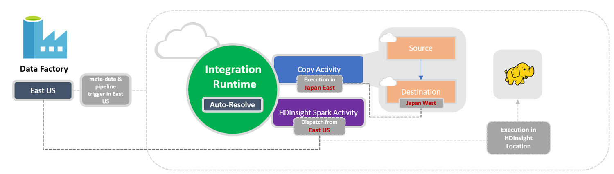

# Integration runtime in Azure Data Factory
The Integration Runtime (IR) is the compute infrastructure used by Azure Data Factory to provide the following data integration capabilities across different network environments:

- **Data movement**: Move data between data stores in public network and data stores in private network (on-premise or virtual private network). It provides support for built-in connectors, format conversion, column mapping, and performant and scalable data transfer.
- **Activity dispatch**:  Dispatch and monitor transformation activities running on a variety of compute services such as Azure HDInsight, Azure Machine Learning, Azure SQL Database, SQL Server, and more.
- **SSIS package execution**: Natively execute SQL Server Integration Services (SSIS) packages in a managed Azure compute environment.

> [!NOTE]
> This article applies to version 2 of Data Factory, which is currently in preview. If you are using version 1 of the Data Factory service, which is generally available (GA), see [Data Factory version 1 documentation](v1/data-factory-introduction.md).

In Data Factory, an activity defines the action to be performed. A linked service defines a target data store or a compute service. An integration runtime provides the bridge between the activity and linked Services.  It is referenced by the linked service, and provides the compute environment where the activity either runs on or gets dispatched from.  This way, the activity can be performed in the region closest possible to the target data store or compute service in the most performant way while meeting security and compliance needs.

## Integration runtime types
Data Factory offers three types of Integration Runtime, and you should choose the type that best serve the data integration capabilities and network environment needs you are looking for.  These three types are:

- Azure
- Self-hosted
- Azure-SSIS

The following table describes the capabilities and network support for each of the integration runtime types:

IR type | Public network | Private network
------- | -------------- | ---------------
Azure | Data movement Activity dispatch | &nbsp;
Self-hosted | Data movement Activity dispatch | Data movement Activity dispatch
Azure-SSIS | SSIS package execution | SSIS package execution

The following diagram shows how the different integration runtimes can be used in combination to offer rich data integration capabilities and network support:

## Azure integration runtime
An Azure integration runtime is capable of:

- Running copy activity between cloud data stores
- Dispatching the following transform activities in public network: HDInsight Hive activity, HDInsight Pig activity, HDInsight MapReduce activity, HDInsight Spark activity, HDInsight Streaming activity, Machine Learning Batch Execution activity, Machine Learning Update Resource activities, Stored Procedure activity, Data Lake Analytics U-SQL activity, .Net custom activity, Web activity, Lookup activity, and Get Metadata activity.

### Network environment
Azure Integration Runtime supports connecting to data stores and compute services in public network with public accessible endpoints. Use a self-hosted integration runtime for Azure Virtual Network environment.

### Compute resource and scaling
Azure integration runtime provides a fully managed, serverless compute in Azure.  You don’t have to worry about infrastructure provision, software installation, patching, or capacity scaling.  In addition, you only pay for the duration of the actual utilization.

Azure integration runtime provides the native compute to move data between cloud data stores in a secure, reliable, and high-performance manner.  You can set how many data movement units to use on the copy activity, and the compute size of the Azure IR is elastically scaled up accordingly without you having to explicitly adjusting size of the Azure Integration Runtime.

Activity dispatch is a lightweight operation to route the activity to the target compute service, so there isn’t need to scale up the compute size for this scenario.

For information about creating and configuring an Azure IR, see [How to create and configure Azure IR](create-azure-integration-runtime.md).

## Self-hosted integration runtime
A self-hosted IR is capable of:

- Running copy activity between a cloud data stores and a data store in private network.
- Dispatching the following transform activities against compute resources in On-Premise or Azure Virtual Network: HDInsight Hive activity (BYOC), HDInsight Pig activity (BYOC), HDInsight MapReduce activity (BYOC), HDInsight Spark activity (BYOC), HDInsight Streaming activity (BYOC), Machine Learning Batch Execution activity, Machine Learning Update Resource activities, Stored Procedure activity, Data Lake Analytics U-SQL activity, .Net custom activity, Lookup activity, and Get Metadata activity.

> [!NOTE] 
> Use self-hosted integration runtime to support data stores that requires bring-your-own driver such as SAP Hana, MySQL, etc.  For more information, see [supported data stores](copy-activity-overview.md#supported-data-stores-and-formats).

### Network environment
If you want to perform data integration securely in a private network environment, which does not have a direct line-of-sight from the public cloud environment, you can install a self-hosted IR on premises environment behind your corporate firewall, or inside a virtual private network.  The self-hosted integration runtime only makes outbound HTTP-based connections to open internet.

### Compute resource and scaling
Self-hosted IR needs to be installed on an on-premises machine or a virtual machine inside a private network. Currently, we only support running the self-hosted IR on a Windows operating system.  

For high availability and scalability, you can scale out the self-hosted IR by associating the logical instance with multiple on-premises machines in active-active mode.  For more information, see [how to create and configure self-hosted IR](create-self-hosted-integration-runtime.md) for details.

## Azure-SSIS Integration Runtime
To lift and shift existing SSIS workload, you can create an Azure-SSIS IR to natively execute SSIS packages.

### Network environment
Azure-SSIS IR can be provisioned in either public network or private network.  On-premises data access is supported by joining Azure-SSIS IR to a Virtual Network (VNet) that is connected to your on-premises network. Currently, only classic VNet is supported. For more information, see [joining Azure-SSIS Integration Runtime to a VNet](create-azure-ssis-integration-runtime.md).

### Compute resource and scaling
Azure-SSIS IR is a fully managed cluster of Azure VMs dedicated to run your SSIS packages. You can bring your own Azure SQL Database or Managed Instance server to host the catalog of SSIS projects/packages (SSISDB) that is going to be attached to it. You can scale up the power of the compute by specifying node size and scale it out by specifying the number of nodes in the cluster.  Do note that while each VM can run multiple packages concurrently (by configuring # of parallel executions per-node), each package cannot be distributed to multiple VMs. You can minimize the cost by starting and stopping the Azure-SSIS Integration Runtime immediately before/after the package execution.

For more information, see [Create and configure Azure-SSIS IR](create-azure-ssis-integration-runtime.md).  Once created, you can deploy and manage your existing SSIS packages with little to no change using familiar tools such as SQL Server Data Tools (SSDT) and SQL Server Management Studio (SSMS), just like using SSIS on premises.

## Determining which IR to use
Each transformation activity has a target compute Linked Service, which points to an integration runtime. This integration runtime instance is where the transformation activity is dispatched from.

For Copy activity, it requires source and sink linked services to define the direction of data flow. The following logic is used to determine which integration runtime instance is used to perform the copy: 

- **Copying between two cloud data sources**: when both source and sink linked services are using Azure IR, the integration runtime used by the sink linked Service is used to execute the Copy activity.
- **Copying between a cloud data source and a data source in private network**: if either source or sink linked service points to a self-hosted IR, the copy activity is executed on that self-hosted Integration Runtime.
- **Copying between two data sources in private network**: Both the source and sink Linked Service must point to the same instance of integration runtime, and that integration runtime is used to execute the copy Activity.

The following diagram shows two copy activity samples:

- For Copy activity 1, its source is a SQL Server Linked Service referencing a self-hosted IR A, and its sink is an Azure Storage Linked Service referencing an Azure IR B. When the copy activity runs, it is executed on the self-hosted IR A.
- For Copy activity 2, its source is an Azure SQL Database Linked Service referencing an Azure IR C, and its sink is an Azure Storage Linked Service referencing Azure IR B. When the copy activity runs, it is executed on the Azure IR B as it’s the integration runtime used by sink Linked Service.

## Integration runtime location
The Data Factory location is where the metadata of the data factory is stored and where the triggering of the pipeline is initiated from. Currently, the supported Data Factory locations are: East US, East US 2. However, a data factory can access data stores and compute services in other Azure regions to move data between data stores or process data using compute services. This behavior is realized through the IR available globally in multiple regions to ensure data compliance, efficiency, and reduced network egress costs.

The IR Location defines the location of its back-end compute, and essentially the location where the data movement,  activity dispatching, and SSIS package execution are performed. The IR location can be different from the location of the data factory it belongs to. The following diagram shows location settings of Data Factory and its integration run times:

### Azure IR
Data Factory uses an Azure IR in the region that is closest to the sink in the same geography to move the data. Refer to the following table for mapping:

Geography of the sink data store | Location of the sink data store | Location used for Azure Integration Runtime
-------------------------------| ----------------| ------------------
United States | East US | East US
&nbsp; | East US 2 | East US 2
&nbsp; | Central US | Central US
&nbsp; | North Central US | North Central US
&nbsp; | South Central US | South Central US
&nbsp; | West Central US | West Central US
&nbsp; | West US | West US
&nbsp; | West US 2 | West US
Canada | Canada East | Canada Central
&nbsp; | Canada Central | Canada Central
Brazil | Brazil South | Brazil South
Europe | North Europe | North Europe
&nbsp; | West Europe | West Europe
United Kingdom | UK West | UK South
&nbsp; | UK South | UK South
Asia Pacific | Southeast Asia | Southeast Asia
&nbsp; | East Asia | Southeast Asia
Australia | Australia East | Australia East
&nbsp; | Australia Southeast | Australia Southeast
Japan | Japan East | Japan East
&nbsp; | Japan West | Japan East
Korea | Korea Central | Korea South
&nbsp; | Korea South | Korea South
India | Central India | Central India
&nbsp; | West India | Central India
&nbsp; | South India | Central India

You can also set the Location of an Azure IR to auto-resolve, which means Data Factory makes a best effort in automatically detecting the best location to use based on the linked service definition.

> [!NOTE] 
> If the region of the destination data store is not in the list or undetectable, the activity fails instead of going through an alternative region for compliance reasons. In this case, indicate explicitly the alternative Location to use to perform the copy.
 
The following picture shows an example of the effective location when the location of Azure IR is set as auto-resolve. When a copy activity is executed, it detects the location of the data destination, in this example it is Japan West.  Based on the table, an Azure IR in Japan East is used to perform the actual data copy. When the same IR is used to connect to HDInsight for a Spark activity, the Spark application submission happens from Data Factory location, in this example it is East US, and the actual execution of the Spark application happens on the HDInsight server location. 

### Self-hosted IR
The self-hosted IR is logically registered to the Data Factory and the compute used to support its functionalities is provided by you. Therefore there is no explicit location property for self-hosted IR. 

When used to perform data movement, the self-hosted IR extracts data from the source and writes into the destination.

### Azure-SSIS IR
Selecting the right location for your Azure-SSIS IR is essential to achieve high performance in your extract-transform-load (ETL) workflows.  Two locations are initially available for preview (East US and North Europe).

- The location of your Azure-SSIS IR does not need be the same as the location of your data factory, but it should be the same as the location of your own Azure SQL Database/Managed Instance server where SSISDB is to be hosted. This way, your Azure-SSIS Integration Runtime can easily access SSISDB without incurring excessive traffics between different locations.
- If you do not have an existing Azure SQL Database/Managed Instance server to host SSISDB, but you have on-premises data sources/destinations, you should create a new Azure SQL Database/Managed Instance server in the same location of a VNet connected to your on-premises network.  This way, you can create your Azure-SSIS IR using the new Azure SQL Database/Managed Instance server and joining that VNet, all in the same location, effectively minimizing data movements across different locations.
- If the location of your existing Azure SQL Database/Managed Instance server where SSISDB is hosted is not the same as the location of a VNet connected to your on-premises network, first create your Azure-SSIS IR using an existing Azure SQL Database/Managed Instance server and joining another VNet in the same location, and then configure a VNet-to-VNet connection between different locations.

## Next steps
See the following articles:

- [Create self-hosted integration runtime](create-self-hosted-integration-runtime.md)
