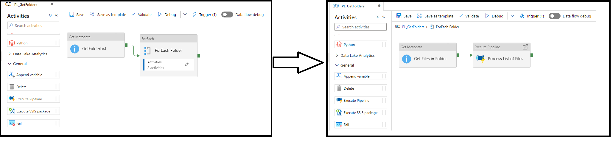

# Nested activities in Azure Data Factory and Azure Synapse Analytics

[!INCLUDE[appliesto-adf-asa-md](includes/appliesto-adf-asa-md.md)]

This article helps you understand nested activities in Azure Data Factory and Azure Synapse Analytics and how to use them, limitations, and best practices.

## Overview
A Data Factory or Synapse Workspace pipeline can contain control flow activities that allow for other activities to be contained inside of them. Think of these nested activities as containers that hold one or more other activities that can execute depending on the top level control flow activity.

See the following example with an If activity that has one activity contained.

:::image type="content" source="media/concepts-pipelines-activities/nested-activity-example.png" alt-text="Screenshot showing an example If Condition activity with a contained activity inside.":::

## Control flow activities
The following control flow activities support nested activities:

Control activity | Description
---------------- | -----------
[For Each](control-flow-for-each-activity.md) | ForEach Activity defines a repeating control flow in your pipeline. This activity is used to iterate over a collection and executes specified activities in a loop. The loop implementation of this activity is similar to the Foreach looping structure in programming languages.
[If Condition Activity](control-flow-if-condition-activity.md) | The If Condition can be used to branch based on condition that evaluates to true or false. The If Condition activity provides the same functionality that an if statement provides in programming languages. It evaluates a set of activities when the condition evaluates to `true` and another set of activities when the condition evaluates to `false.`
[Until Activity](control-flow-until-activity.md) | Implements Do-Until loop that is similar to Do-Until looping structure in programming languages. It executes a set of activities in a loop until the condition associated with the activity evaluates to true. You can specify a timeout value for the until activity.
[Switch Activity](control-flow-switch-activity.md) | The Switch activity provides the same functionality that a switch statement provides in programming languages. It evaluates a set of activities corresponding to a case that matches the condition evaluation.

## Navigating nested activities
There are two primary ways to navigate to the contained activities in a nested activity.

1. Each control flow activity that supports nested activities has an activity tab. Selecting the activity tab will then give you a pencil icon you can select to drill down into the inner activities panel. 
:::image type="content" source="media/concepts-pipelines-activities/nested-activity-navigation.png" alt-text="Screenshot showing an example If Condition activity with a highlight on the pencil icon to navigate.":::

2. From the activity on the pipeline canvas, you can select the pencil icon to drill down into the inner activities panel. Additionally, the ForEach and Until activities support double-clicking on the activity to drill down to the inner activities panel.
:::image type="content" source="media/concepts-pipelines-activities/nested-activity-canvas-navigation.png" alt-text="Screenshot showing an example If Condition activity on the pipeline canvas highlighting the pencil icon.":::

Your pipeline canvas will then switch to the context of the inner activity container that you selected. There will also be a breadcrumb trail at the top you can select to navigate back to the parent pipeline.
:::image type="content" source="media/concepts-pipelines-activities/nested-activity-breadcrumb.png" alt-text="Screenshot showing an example If Condition activity inside the true branch with a highlight on the breadcrumb to navigate back to the parent pipeline.":::

## Nested activity embedding limitations
There are constraints on the activities that support nesting (ForEach, Until, Switch, and If Condition), for nesting another nested activity. Specifically:

- If and Switch can be used inside ForEach or Until activities.
- If and Switch can not used inside If and Switch activities.
- ForEach or Until support only a single level of nesting.

See the best practices section below on how to use other pipeline activities to enable this scenario. In addition, the 
[Validation Activity](control-flow-validation-activity.md) can't be placed inside of a nested activity.

If and Switch can be used inside ForEach or Until activities.
ForEach or Until supports only single level nesting
If and Switch can not used inside If and Switch activities.

## Best practices for multiple levels of nested activities
In order to have logic that supports nesting more than one level deep, you can use the [Execute Pipeline Activity](control-flow-execute-pipeline-activity.md) inside of your nested activity to call another pipeline that then can have another level of nested activities. A common use case for this pattern is with the ForEach loop where you need to additionally loop based off logic in the inner activities. 

An example of this pattern would be if you had a file system that had a list of folders and each folder there are multiple files you want to process. You would accomplish this pattern, generally, by performing the following.
1. Using a [Get Metadata Activity](control-flow-get-metadata-activity.md) first to get a list of just the folders.
2. Pass the result of the Get Metadata activity into the Items list of a ForEach activity. Each iteration then represents a single folder to process.
3. In the inner activities panel of the ForEach activity, use another Get Metadata activity to get a list of files inside of the folder.
4. Call an Execute Pipeline activity that has an array parameter and pass it an array of those filenames.
5. In the child pipeline, you could then use another nested activity (such as ForEach) with the passed in array list to iterate over the files and perform one or more sets of inner activities.
 
The parent pipeline would look similar to the below example.

The child pipeline would look similar to the below example.

 :::image type="content" source="media/concepts-pipelines-activities/nested-activity-execute-child-pipeline.png" alt-text="Screenshot showing an example child pipeline with a ForEach loop.":::

## Next steps

See the following tutorials for step-by-step instructions for creating pipelines and datasets.

- [Tutorial: Copy multiple tables in bulk by using Azure Data Factory in the Azure portal](tutorial-bulk-copy-portal.md)
- [Tutorial: Incrementally load data from a source data store to a destination data store](tutorial-incremental-copy-overview.md)
