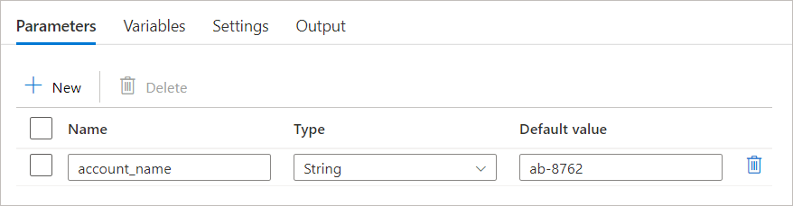
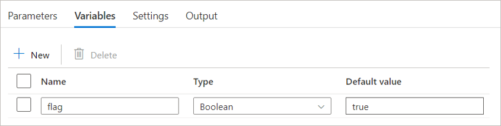

# Pipeline parameters and variables in Azure Data Factory and Azure Synapse Analytics

[!INCLUDE[appliesto-adf-asa-md](includes/appliesto-adf-asa-md.md)]

This article helps you understand the difference between pipeline parameters and variables in Azure Data Factory and Azure Synapse Analytics and how to use them to control your pipeline behavior.

## Pipeline parameters

Parameters are defined at the pipeline level, and cannot be modified during a pipeline run. Pipeline parameters can be used to control the behavior of a pipeline and its activities, such as by passing in the connection details for a dataset or the path of a file to be processed.

### How to define a pipeline parameter

To define a pipeline parameter, follow these steps:

- Click on your pipeline to view its configuration tabs.
- Select the "Parameters" tab, and click on the "+ New" button to define a new parameter.
- Enter a name and description for the parameter, and select its data type from the dropdown menu. Data types can be String, Int, Float, Bool, Array, Object, or SecureString.
- Optionally, you can also assign a default value to the parameter.

After defining a pipeline parameter, you can access its value during a pipeline run by using the ```@pipeline().parameters.<parameter name>``` expression in a pipeline activity. For example, if you defined a parameter called account_name of type String, you can access its value in an activity by using the expression ```@pipeline().parameters.account_name```.



Before each pipeline run, you can assign a new value to your parameter in the right panel, otherwise the pipeline will use the default or the value previously defined.

## Pipeline variables

Pipeline variables are values that can be set and modified during a pipeline run. Unlike pipeline parameters, which are defined at the pipeline level and cannot be changed during a pipeline run, pipeline variables can be set and modified within a pipeline using a [Set Variable](control-flow-set-variable-activity.md) activity.

Pipeline variables can be used to store and manipulate data during a pipeline run, such as by storing the results of a computation or the current state of a process. 

> [!NOTE]
> Variables are currently scoped at the pipeline level. This means that they are not thread safe and can cause unexpected and undesired behavior if they are accessed from within a parallel iteration activity such as a foreach loop, especially when the value is also being modified within that foreach activity.

To define a pipeline variable, follow these steps:

- Click on your pipeline to view its configuration tabs.

- Select the "Variables" tab, and click on the "+ New" button to define a new variable.

- Enter a name and description for the variable, and select its data type from the dropdown menu. Data types can be String, Bool, or Array.

- Optionally, you can also assign a default value to the variable. This value will be used as the initial value of the variable at the start of a pipeline run.

After defining a pipeline variable, you can access its value during a pipeline run by using the ```@variables('<variable name>')``` expression in a pipeline activity. For example, if you defined a variable called flag of type Array, you can access its value in an activity by using the expression ```@variables('flag')```. You can also use a "Set Variable" activity to modify the value of the variable within a pipeline.



## Next steps
See the following tutorials for step-by-step instructions for creating pipelines with activities:

- [Build a pipeline with a copy activity](quickstart-create-data-factory-powershell.md)
- [Build a pipeline with a data transformation activity](tutorial-transform-data-spark-powershell.md)

How to achieve CI/CD (continuous integration and delivery) using Azure Data Factory
- [Continuous integration and delivery in Azure Data Factory](continuous-integration-delivery.md)
