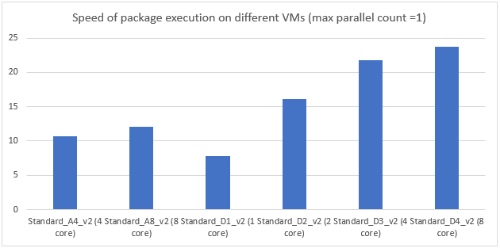
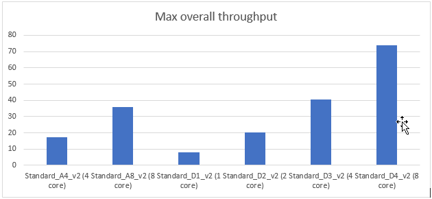

# Configure the Azure-SSIS Integration Runtime for high performance

This article describes how to configure the Azure-SSIS Integration Runtime (IR) for high performance when you deploy and run SSIS packages on Azure.

For more info about deploying and running SSIS packages on Azure, see [Lift and shift SQL Server Integration Services workloads to the cloud](https://docs.microsoft.com/sql/integration-services/lift-shift/ssis-azure-lift-shift-ssis-packages-overview).

> [!IMPORTANT]
> This article contains performance results and observations that are the result of unofficial private testing by members of the SSIS development team. Your results may vary. Do your own testing before you finalize your configuration settings, which affect both cost and performance.

## Properties to configure

The following portion of a configuration script shows the properties that you can configure when you create an Azure-SSIS Integration Runtime. For the complete PowerShell script and description, see [Deploy SQL Server Integration Services packages to Azure](tutorial-deploy-ssis-packages-azure.md).

```
$SubscriptionName = "<Azure subscription name>"
$ResourceGroupName = "<Azure resource group name>"
# Data factory name. Must be globally unique
$DataFactoryName = "<Data factory name>" 
# In public preview, only EastUS amd EastUS2 are supported.
$DataFactoryLocation = "EastUS" 
# Azure-SSIS integration runtime information. This is a Data Factory compute resource for running SSIS packages
$AzureSSISName = "<Specify a name for your Azure-SSIS IR>"
$AzureSSISDescription = "<Specify description for your Azure-SSIS IR"
# In public preview, only EastUS and NorthEurope are supported.
$AzureSSISLocation = "EastUS" 
 # In public preview, only Standard_A4_v2, Standard_A8_v2, Standard_D1_v2, Standard_D2_v2, Standard_D3_v2, Standard_D4_v2 are supported
$AzureSSISNodeSize = "Standard_A4_v2"
# In public preview, only 1-10 nodes are supported.
$AzureSSISNodeNumber = 2 
# In public preview, only 1-8 parallel executions per node are supported.
$AzureSSISMaxParallelExecutionsPerNode = 2 

# SSISDB info
$SSISDBServerEndpoint = "<Azure SQL server name>.database.windows.net"
$SSISDBServerAdminUserName = "<Azure SQL server - user name>"
$SSISDBServerAdminPassword = "<Azure SQL server - user password>"
# Remove the SSISDBPricingTier variable if you are using Azure SQL Managed Instance (private preview)
# This parameter applies only to Azure SQL Database. For the basic pricing tier, specify "Basic", not "B". For standard tiers, specify "S0", "S1", "S2", 'S3", etc.
$SSISDBPricingTier = "<pricing tier of your Azure SQL server. Examples: Basic, S0, S1, S2, S3, etc.>"
```

## AzureSSISLocation

**AzureSSISLocation** is the location for the integration runtime worker. The worker maintains a constant connection with the SSIS Catalog database, SSISDB, on Azure SQL Database. Set the **AzureSSISLocation** to the same location as the SQL Database server which hosts SSISDB to let the integration runtime instance work as efficiently as possible.

## AzureSSISNodeSize

The public preview of Azure Data Factory v2, including the Azure-SSIS IR, supports the following options:
-   Standard\_A4\_v2
-   Standard\_A8\_v2
-   Standard\_D1\_v2
-   Standard\_D2\_v2
-   Standard\_D3\_v2
-   Standard\_D4\_v2.

In unofficial private testing by the SSIS engineering team, the D series appears to be more suitable for SSIS package execution than the A series.

-   The performance/price ratio of the D series is higher than the A series.
-   The throughput for the D series is higher than the A series at the same price point.

### Configure for execution speed

If you don't have many packages to run, and you want packages to run quickly, use the information in the following chart to help you choose a virtual machine type suitable for your scenario.

This data represents a single package execution on a single worker node. The package loads 10M records including first name and last name from Azure Blob Storage, generates a full name column, and writes the records where the full name is longer than 20 characters back to Azure Blob Storage.



### Configure for overall throughput

If you have lots of packages to run, and you care most about the overall throughput, use the information in the following chart to choose a virtual machine type suitable for your scenario.



## AzureSSISNodeNumber

**AzureSSISNodeNumber** adjusts the scalability of the integration runtime. The throughput of the integration runtime is proportional to the **AzureSSISNodeNumber**. Set the **AzureSSISNodeNumber** to a small value at first, monitor the throughput of the integration runtime, then adjust the value for your scenario. To reconfigure the worker node count, see [Manage an Azure-SSIS integration runtime](manage-azure-ssis-integration-runtime.md).

## AzureSSISMaxParallelExecutionsPerNode

When you're already using a powerful worker node to run packages, increasing **AzureSSISMaxParallelExecutionsPerNode** may help to increase the overall throughput of the integration runtime. You can estimate the appropriate value based on the cost of your package and the following configurations for the worker nodes. For more info, see [General purpose virtual machine sizes](https://docs.microsoft.com/azure/virtual-machines/windows/sizes-general).

| Size             | vCPU | Memory: GiB | Temp storage (SSD) GiB | Max temp storage throughput: IOPS / Read MBps / Write MBps | Max data disks / throughput: IOPS | Max NICs / Expected network performance (Mbps) |
|------------------|------|-------------|------------------------|------------------------------------------------------------|-----------------------------------|------------------------------------------------|
| Standard\_D1\_v2 | 1    | 3.5         | 50                     | 3000 / 46 / 23                                             | 2 / 2x500                         | 2 / 750                                        |
| Standard\_D2\_v2 | 2    | 7           | 100                    | 6000 / 93 / 46                                             | 4 / 4x500                         | 2 / 1500                                       |
| Standard\_D3\_v2 | 4    | 14          | 200                    | 12000 / 187 / 93                                           | 8 / 8x500                         | 4 / 3000                                       |
| Standard\_D4\_v2 | 8    | 28          | 400                    | 24000 / 375 / 187                                          | 16 / 16x500                       | 8 / 6000                                       |
| Standard\_A4\_v2 | 4    | 8           | 40                     | 4000 / 80 / 40                                             | 8 / 8x500                         | 4 / 1000                                       |
| Standard\_A8\_v2 | 8    | 16          | 80                     | 8000 / 160 / 80                                            | 16 / 16x500                       | 8 / 2000                                       |

You can also set the **AzureSSISMaxParallelExecutionsPerNode** to a small value at first, increase it by a small amount to check whether the overall throughput is improved, and stop increasing the value when the overall throughput reaches the maximum value.

## SSISDBPricingTier

**SSISDBPricingTier** is the pricing tier for the SSIS Catalog database, SSISDB, on Azure SQL Database. This setting affects the maximum number of workers in the IR instance, the speed to queue a package execution, and the speed to load the execution log.

-   If you don't care about the speed to queue package execution and to load the execution log, you can choose the lowest DB pricing tier. Azure SQL Database with Basic pricing supports 8 workers in an integration runtime instance.

-   Choose a more powerful database than Basic if the worker count is more than 8, or the core count is more than 50. Otherwise the database becomes the bottleneck of the integration runtime instance and the overall performance is negatively impacted.

You can also adjust the DB pricing tier based on DTU usage information available on the Azure portal.

## Design for high performance
Designing an SSIS package to run on Azure is different from SSIS development for on-premises execution. Instead of combining multiple independent tasks in the same package, separate them into several packages for more efficient execution in the Azure-SSIS IR. Create a package execution for each package, so that they don’t have to wait for each other to finish. This approach benefits from the scalability of the Azure-SSIS integration runtime and improves the overall throughput.

## What's next
Learn more about the Azure-SSIS Integration Runtime. See [Azure-SSIS Integration Runtime](concepts-integration-runtime.md#azure-ssis-integration-runtime).