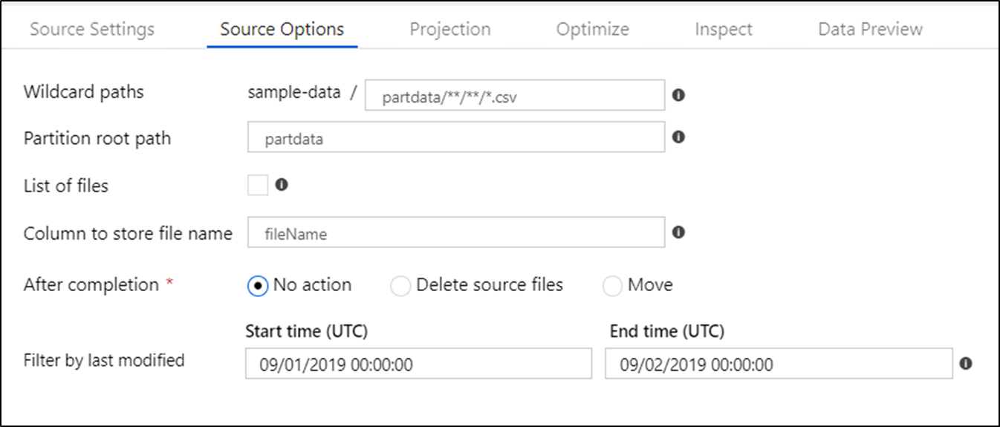
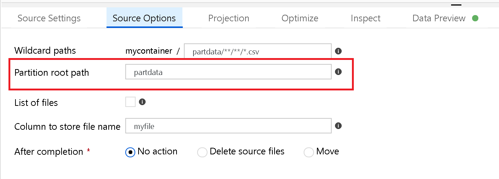
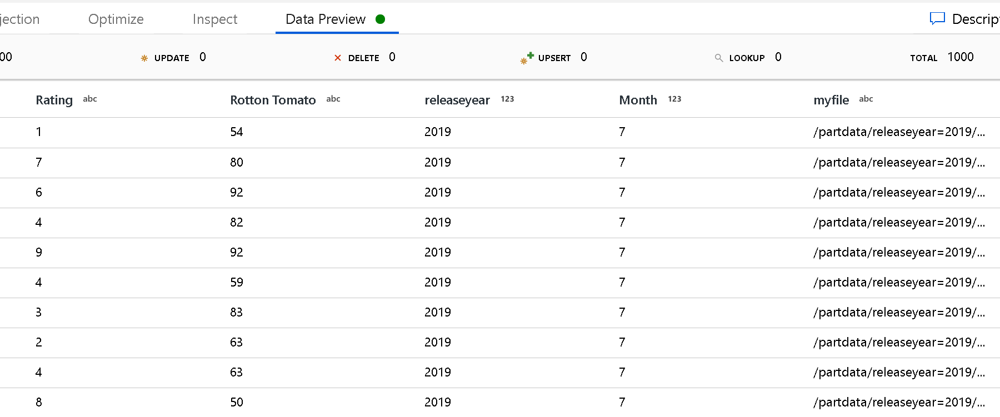
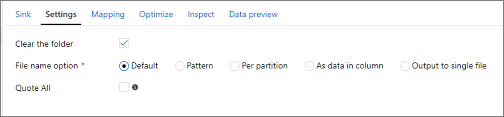

# Copy and transform data in Azure Blob storage by using Azure Data Factory

> [!div class="op_single_selector" title1="Select the version of Data Factory service you are using:"]
> * [Version 1](v1/data-factory-azure-blob-connector.md)
> * [Current version](connector-azure-blob-storage.md)

This article outlines how to use Copy Activity in Azure Data Factory to copy data from and to Azure Blob storage, and use Data Flow to transform data in Azure Blob storage. To learn about Azure Data Factory, read the [introductory article](introduction.md).

[!INCLUDE [updated-for-az](../../includes/updated-for-az.md)]

## Supported capabilities

This Azure Blob connector is supported for the following activities:

- [Copy activity](copy-activity-overview.md) with [supported source/sink matrix](copy-activity-overview.md)
- [Mapping data flow](concepts-data-flow-overview.md)
- [Lookup activity](control-flow-lookup-activity.md)
- [GetMetadata activity](control-flow-get-metadata-activity.md)
- [Delete activity](delete-activity.md)

For Copy activity, this Blob storage connector supports:

- Copying blobs to and from general-purpose Azure storage accounts and hot/cool blob storage. 
- Copying blobs by using account key, service shared access signature, service principal or managed identities for Azure resources authentications.
- Copying blobs from block, append, or page blobs and copying data to only block blobs.
- Copying blobs as is or parsing or generating blobs with [supported file formats and compression codecs](supported-file-formats-and-compression-codecs.md).
- [Preserve file metadata during copy](#preserve-metadata-during-copy).

>[!IMPORTANT]
>If you enable the **Allow trusted Microsoft services to access this storage account** option on Azure Storage firewall settings and want to use Azure integration runtime to connect to your Blob Storage, you must use [managed identity authentication](#managed-identity).

## Get started

[!INCLUDE [data-factory-v2-connector-get-started](../../includes/data-factory-v2-connector-get-started.md)]

The following sections provide details about properties that are used to define Data Factory entities specific to Blob storage.

## Linked service properties

Azure Blob connector support the following authentication types, refer to the corresponding section on details:

- [Account key authentication](#account-key-authentication)
- [Shared access signature authentication](#shared-access-signature-authentication)
- [Service principal authentication](#service-principal-authentication)
- [Managed identities for Azure resources authentication](#managed-identity)

>[!NOTE]
>When using PolyBase to load data into SQL Data Warehouse, if your source or staging Blob storage is configured with Virtual Network endpoint, you must use managed identity authentication as required by PolyBase, and use Self-hosted Integration Runtime with version 3.18 or above. See the [managed identity authentication](#managed-identity) section with more configuration prerequisites.

>[!NOTE]
>HDInsights and Azure Machine Learning activities only support Azure Blob storage account key authentication.

### Account key authentication

To use storage account key authentication, the following properties are supported:

| Property | Description | Required |
|:--- |:--- |:--- |
| type | The type property must be set to **AzureBlobStorage** (suggested) or **AzureStorage** (see notes below). |Yes |
| connectionString | Specify the information needed to connect to Storage for the connectionString property. <br/> You can also put account key in Azure Key Vault and pull the `accountKey` configuration out of the connection string. Refer to the following samples and [Store credentials in Azure Key Vault](store-credentials-in-key-vault.md) article with more details. |Yes |
| connectVia | The [integration runtime](concepts-integration-runtime.md) to be used to connect to the data store. You can use Azure Integration Runtime or Self-hosted Integration Runtime (if your data store is in a private network). If not specified, it uses the default Azure Integration Runtime. |No |

>[!NOTE]
>Secondary Blob Service Endpoint is not supported when using account key authentication. You can use other authentication types.

>[!NOTE]
>If you were using "AzureStorage" type linked service, it is still supported as-is, while you are suggested to use this new "AzureBlobStorage" linked service type going forward.

**Example:**

```json
{
    "name": "AzureBlobStorageLinkedService",
    "properties": {
        "type": "AzureBlobStorage",
        "typeProperties": {
            "connectionString": "DefaultEndpointsProtocol=https;AccountName=<accountname>;AccountKey=<accountkey>"
        },
        "connectVia": {
            "referenceName": "<name of Integration Runtime>",
            "type": "IntegrationRuntimeReference"
        }
    }
}
```

**Example: store account key in Azure Key Vault**

```json
{
    "name": "AzureBlobStorageLinkedService",
    "properties": {
        "type": "AzureBlobStorage",
        "typeProperties": {
            "connectionString": "DefaultEndpointsProtocol=https;AccountName=<accountname>;",
            "accountKey": { 
                "type": "AzureKeyVaultSecret", 
                "store": { 
                    "referenceName": "<Azure Key Vault linked service name>", 
                    "type": "LinkedServiceReference" 
                }, 
                "secretName": "<secretName>" 
            }
        },
        "connectVia": {
            "referenceName": "<name of Integration Runtime>",
            "type": "IntegrationRuntimeReference"
        }            
    }
}
```

### Shared access signature authentication

A shared access signature provides delegated access to resources in your storage account. You can use a shared access signature to grant a client limited permissions to objects in your storage account for a specified time. You don't have to share your account access keys. The shared access signature is a URI that encompasses in its query parameters all the information necessary for authenticated access to a storage resource. To access storage resources with the shared access signature, the client only needs to pass in the shared access signature to the appropriate constructor or method. For more information about shared access signatures, see [Shared access signatures: Understand the shared access signature model](../storage/common/storage-dotnet-shared-access-signature-part-1.md).

> [!NOTE]
>- Data Factory now supports both **service shared access signatures** and **account shared access signatures**. For more information about shared access signatures, see [Grant limited access to Azure Storage resources using shared access signatures (SAS)](../storage/common/storage-sas-overview.md).
>- In later dataset configuration, the folder path is the absolute path starting from container level. You need to configure one aligned with the path in your SAS URI.

> [!TIP]
> To generate a service shared access signature for your storage account, you can execute the following PowerShell commands. Replace the placeholders and grant the needed permission.
> `$context = New-AzStorageContext -StorageAccountName <accountName> -StorageAccountKey <accountKey>`
> `New-AzStorageContainerSASToken -Name <containerName> -Context $context -Permission rwdl -StartTime <startTime> -ExpiryTime <endTime> -FullUri`

To use shared access signature authentication, the following properties are supported:

| Property | Description | Required |
|:--- |:--- |:--- |
| type | The type property must be set to **AzureBlobStorage** (suggested) or **AzureStorage** (see notes below). |Yes |
| sasUri | Specify the shared access signature URI to the Storage resources such as blob/container. <br/>Mark this field as a SecureString to store it securely in Data Factory. You can also put SAS token in Azure Key Vault to leverage auto rotation and remove the token portion. Refer to the following samples and [Store credentials in Azure Key Vault](store-credentials-in-key-vault.md) article with more details. |Yes |
| connectVia | The [integration runtime](concepts-integration-runtime.md) to be used to connect to the data store. You can use the Azure Integration Runtime or the Self-hosted Integration Runtime (if your data store is located in a private network). If not specified, it uses the default Azure Integration Runtime. |No |

>[!NOTE]
>If you were using "AzureStorage" type linked service, it is still supported as-is, while you are suggested to use this new "AzureBlobStorage" linked service type going forward.

**Example:**

```json
{
    "name": "AzureBlobStorageLinkedService",
    "properties": {
        "type": "AzureBlobStorage",
        "typeProperties": {
            "sasUri": {
                "type": "SecureString",
                "value": "<SAS URI of the Azure Storage resource e.g. https://<container>.blob.core.windows.net/?sv=<storage version>&amp;st=<start time>&amp;se=<expire time>&amp;sr=<resource>&amp;sp=<permissions>&amp;sip=<ip range>&amp;spr=<protocol>&amp;sig=<signature>>"
            }
        },
        "connectVia": {
            "referenceName": "<name of Integration Runtime>",
            "type": "IntegrationRuntimeReference"
        }
    }
}
```

**Example: store account key in Azure Key Vault**

```json
{
    "name": "AzureBlobStorageLinkedService",
    "properties": {
        "type": "AzureBlobStorage",
        "typeProperties": {
            "sasUri": {
                "type": "SecureString",
                "value": "<SAS URI of the Azure Storage resource without token e.g. https://<container>.blob.core.windows.net/>"
            },
            "sasToken": { 
                "type": "AzureKeyVaultSecret", 
                "store": { 
                    "referenceName": "<Azure Key Vault linked service name>", 
                    "type": "LinkedServiceReference" 
                }, 
                "secretName": "<secretName>" 
            }
        },
        "connectVia": {
            "referenceName": "<name of Integration Runtime>",
            "type": "IntegrationRuntimeReference"
        }
    }
}
```

When you create a shared access signature URI, consider the following points:

- Set appropriate read/write permissions on objects based on how the linked service (read, write, read/write) is used in your data factory.
- Set **Expiry time** appropriately. Make sure that the access to Storage objects doesn't expire within the active period of the pipeline.
- The URI should be created at the right container/blob based on the need. A shared access signature URI to a blob allows Data Factory to access that particular blob. A shared access signature URI to a Blob storage container allows Data Factory to iterate through blobs in that container. To provide access to more or fewer objects later, or to update the shared access signature URI, remember to update the linked service with the new URI.

### Service principal authentication

For Azure Storage service principal authentication in general, refer to [Authenticate access to Azure Storage using Azure Active Directory](../storage/common/storage-auth-aad.md).

To use service principal authentication, follow these steps:

1. Register an application entity in Azure Active Directory (Azure AD) by following [Register your application with an Azure AD tenant](../storage/common/storage-auth-aad-app.md#register-your-application-with-an-azure-ad-tenant). Make note of the following values, which you use to define the linked service:

    - Application ID
    - Application key
    - Tenant ID

2. Grant the service principal proper permission in Azure Blob storage. Refer to [Manage access rights to Azure Storage data with RBAC](../storage/common/storage-auth-aad-rbac.md) with more details on the roles.

    - **As source**, in Access control (IAM), grant at least **Storage Blob Data Reader** role.
    - **As sink**, in Access control (IAM), grant at least **Storage Blob Data Contributor** role.

These properties are supported for an Azure Blob storage linked service:

| Property | Description | Required |
|:--- |:--- |:--- |
| type | The type property must be set to **AzureBlobStorage**. |Yes |
| serviceEndpoint | Specify the Azure Blob storage service endpoint with the pattern of `https://<accountName>.blob.core.windows.net/`. |Yes |
| servicePrincipalId | Specify the application's client ID. | Yes |
| servicePrincipalKey | Specify the application's key. Mark this field as a **SecureString** to store it securely in Data Factory, or [reference a secret stored in Azure Key Vault](store-credentials-in-key-vault.md). | Yes |
| tenant | Specify the tenant information (domain name or tenant ID) under which your application resides. Retrieve it by hovering the mouse in the top-right corner of the Azure portal. | Yes |
| connectVia | The [integration runtime](concepts-integration-runtime.md) to be used to connect to the data store. You can use Azure Integration Runtime or Self-hosted Integration Runtime (if your data store is in a private network). If not specified, it uses the default Azure Integration Runtime. |No |

>[!NOTE]
>Service principal authentication is only supported by "AzureBlobStorage" type linked service but not previous "AzureStorage" type linked service.

**Example:**

```json
{
    "name": "AzureBlobStorageLinkedService",
    "properties": {
        "type": "AzureBlobStorage",
        "typeProperties": {            
            "serviceEndpoint": "https://<accountName>.blob.core.windows.net/",
            "servicePrincipalId": "<service principal id>",
            "servicePrincipalKey": {
                "type": "SecureString",
                "value": "<service principal key>"
            },
            "tenant": "<tenant info, e.g. microsoft.onmicrosoft.com>" 
        },
        "connectVia": {
            "referenceName": "<name of Integration Runtime>",
            "type": "IntegrationRuntimeReference"
        }
    }
}
```

### <a name="managed-identity"></a> Managed identities for Azure resources authentication

A data factory can be associated with a [managed identity for Azure resources](data-factory-service-identity.md), which represents this specific data factory. You can directly use this managed identity for Blob storage authentication similar to using your own service principal. It allows this designated factory to access and copy data from/to your Blob storage.

Refer to [Authenticate access to Azure Storage using Azure Active Directory](../storage/common/storage-auth-aad.md) for Azure Storage authentication in general. To use managed identities for Azure resources authentication, follow these steps:

1. [Retrieve data factory managed identity information](data-factory-service-identity.md#retrieve-managed-identity) by copying the value of **managed identity object ID** generated along with your factory.

2. Grant the managed identity proper permission in Azure Blob storage. Refer to [Manage access rights to Azure Storage data with RBAC](../storage/common/storage-auth-aad-rbac.md) with more details on the roles.

    - **As source**, in Access control (IAM), grant at least **Storage Blob Data Reader** role.
    - **As sink**, in Access control (IAM), grant at least **Storage Blob Data Contributor** role.

>[!IMPORTANT]
>If you use PolyBase to load data from Blob (as source or as staging) into SQL Data Warehouse, when using managed identity authentication for Blob, make sure you also follow steps 1 and 2 in [this guidance](../sql-database/sql-database-vnet-service-endpoint-rule-overview.md#impact-of-using-vnet-service-endpoints-with-azure-storage) to 1) register your SQL Database server with Azure Active Directory (Azure AD) and 2) assign the Storage Blob Data Contributor role to your SQL Database server; the rest are handled by Data Factory. If your Blob storage is configured with an Azure Virtual Network endpoint, to use PolyBase to load data from it, you must use managed identity authentication as required by PolyBase.

These properties are supported for an Azure Blob storage linked service:

| Property | Description | Required |
|:--- |:--- |:--- |
| type | The type property must be set to **AzureBlobStorage**. |Yes |
| serviceEndpoint | Specify the Azure Blob storage service endpoint with the pattern of `https://<accountName>.blob.core.windows.net/`. |Yes |
| connectVia | The [integration runtime](concepts-integration-runtime.md) to be used to connect to the data store. You can use Azure Integration Runtime or Self-hosted Integration Runtime (if your data store is in a private network). If not specified, it uses the default Azure Integration Runtime. |No |

> [!NOTE]
> Managed identities for Azure resources authentication is only supported by "AzureBlobStorage" type linked service but not previous "AzureStorage" type linked service. 

**Example:**

```json
{
    "name": "AzureBlobStorageLinkedService",
    "properties": {
        "type": "AzureBlobStorage",
        "typeProperties": {            
            "serviceEndpoint": "https://<accountName>.blob.core.windows.net/"
        },
        "connectVia": {
            "referenceName": "<name of Integration Runtime>",
            "type": "IntegrationRuntimeReference"
        }
    }
}
```

## Dataset properties

For a full list of sections and properties available for defining datasets, see the [Datasets](concepts-datasets-linked-services.md) article. 

[!INCLUDE [data-factory-v2-file-formats](../../includes/data-factory-v2-file-formats.md)] 

The following properties are supported for Azure Blob under `location` settings in format-based dataset:

| Property   | Description                                                  | Required |
| ---------- | ------------------------------------------------------------ | -------- |
| type       | The type property of the location in dataset must be set to **AzureBlobStorageLocation**. | Yes      |
| container  | The blob container.                                          | Yes      |
| folderPath | The path to folder under the given container. If you want to use wildcard to filter folder, skip this setting and specify in activity source settings. | No       |
| fileName   | The file name under the given container + folderPath. If you want to use wildcard to filter files, skip this setting and specify in activity source settings. | No       |

**Example:**

```json
{
    "name": "DelimitedTextDataset",
    "properties": {
        "type": "DelimitedText",
        "linkedServiceName": {
            "referenceName": "<Azure Blob Storage linked service name>",
            "type": "LinkedServiceReference"
        },
        "schema": [ < physical schema, optional, auto retrieved during authoring > ],
        "typeProperties": {
            "location": {
                "type": "AzureBlobStorageLocation",
                "container": "containername",
                "folderPath": "folder/subfolder"
            },
            "columnDelimiter": ",",
            "quoteChar": "\"",
            "firstRowAsHeader": true,
            "compressionCodec": "gzip"
        }
    }
}
```

## Copy activity properties

For a full list of sections and properties available for defining activities, see the [Pipelines](concepts-pipelines-activities.md) article. This section provides a list of properties supported by the Blob storage source and sink.

### Blob storage as a source type

[!INCLUDE [data-factory-v2-file-formats](../../includes/data-factory-v2-file-formats.md)] 

The following properties are supported for Azure Blob under `storeSettings` settings in format-based copy source:

| Property                 | Description                                                  | Required                                      |
| ------------------------ | ------------------------------------------------------------ | --------------------------------------------- |
| type                     | The type property under `storeSettings` must be set to **AzureBlobStorageReadSettings**. | Yes                                           |
| recursive                | Indicates whether the data is read recursively from the subfolders or only from the specified folder. Note that when recursive is set to true and the sink is a file-based store, an empty folder or subfolder isn't copied or created at the sink. Allowed values are **true** (default) and **false**. | No                                            |
| wildcardFolderPath       | The folder path with wildcard characters under the given container configured in dataset to filter source folders. <br>Allowed wildcards are: `*` (matches zero or more characters) and `?` (matches zero or single character); use `^` to escape if your actual folder name has wildcard or this escape char inside. <br>See more examples in [Folder and file filter examples](#folder-and-file-filter-examples). | No                                            |
| wildcardFileName         | The file name with wildcard characters under the given container + folderPath/wildcardFolderPath to filter source files. <br>Allowed wildcards are: `*` (matches zero or more characters) and `?` (matches zero or single character); use `^` to escape if your actual folder name has wildcard or this escape char inside.  See more examples in [Folder and file filter examples](#folder-and-file-filter-examples). | Yes if `fileName` is not specified in dataset |
| modifiedDatetimeStart    | Files filter based on the attribute: Last Modified. The files will be selected if their last modified time are within the time range between `modifiedDatetimeStart` and `modifiedDatetimeEnd`. The time is applied to UTC time zone in the format of "2018-12-01T05:00:00Z". <br> The properties can be NULL which mean no file attribute filter will be applied to the dataset.  When `modifiedDatetimeStart` has datetime value but `modifiedDatetimeEnd` is NULL, it means the files whose last modified attribute is greater than or equal with the datetime value will be selected.  When `modifiedDatetimeEnd` has datetime value but `modifiedDatetimeStart` is NULL, it means the files whose last modified attribute is less than the datetime value will be selected. | No                                            |
| modifiedDatetimeEnd      | Same as above.                                               | No                                            |
| maxConcurrentConnections | The number of the connections to connect to storage store concurrently. Specify only when you want to limit the concurrent connection to the data store. | No                                            |

> [!NOTE]
> For Parquet/delimited text format, **BlobSource** type copy activity source mentioned in next section is still supported as-is for backward compatibility. You are suggested to use this new model going forward, and the ADF authoring UI has switched to generating these new types.

**Example:**

```json
"activities":[
    {
        "name": "CopyFromBlob",
        "type": "Copy",
        "inputs": [
            {
                "referenceName": "<Delimited text input dataset name>",
                "type": "DatasetReference"
            }
        ],
        "outputs": [
            {
                "referenceName": "<output dataset name>",
                "type": "DatasetReference"
            }
        ],
        "typeProperties": {
            "source": {
                "type": "DelimitedTextSource",
                "formatSettings":{
                    "type": "DelimitedTextReadSettings",
                    "skipLineCount": 10
                },
                "storeSettings":{
                    "type": "AzureBlobStorageReadSettings",
                    "recursive": true,
                    "wildcardFolderPath": "myfolder*A",
                    "wildcardFileName": "*.csv"
                }
            },
            "sink": {
                "type": "<sink type>"
            }
        }
    }
]
```

### Blob storage as a sink type

[!INCLUDE [data-factory-v2-file-formats](../../includes/data-factory-v2-file-formats.md)] 

The following properties are supported for Azure Blob under `storeSettings` settings in format-based copy sink:

| Property                 | Description                                                  | Required |
| ------------------------ | ------------------------------------------------------------ | -------- |
| type                     | The type property under `storeSettings` must be set to **AzureBlobStorageWriteSettings**. | Yes      |
| copyBehavior             | Defines the copy behavior when the source is files from a file-based data store.<br/><br/>Allowed values are:<br/><b>- PreserveHierarchy (default)</b>: Preserves the file hierarchy in the target folder. The relative path of source file to source folder is identical to the relative path of target file to target folder.<br/><b>- FlattenHierarchy</b>: All files from the source folder are in the first level of the target folder. The target files have autogenerated names. <br/><b>- MergeFiles</b>: Merges all files from the source folder to one file. If the file or blob name is specified, the merged file name is the specified name. Otherwise, it's an autogenerated file name. | No       |
| maxConcurrentConnections | The number of the connections to connect to storage store concurrently. Specify only when you want to limit the concurrent connection to the data store. | No       |

**Example:**

```json
"activities":[
    {
        "name": "CopyFromBlob",
        "type": "Copy",
        "inputs": [
            {
                "referenceName": "<input dataset name>",
                "type": "DatasetReference"
            }
        ],
        "outputs": [
            {
                "referenceName": "<Parquet output dataset name>",
                "type": "DatasetReference"
            }
        ],
        "typeProperties": {
            "source": {
                "type": "<source type>"
            },
            "sink": {
                "type": "ParquetSink",
                "storeSettings":{
                    "type": "AzureBlobStorageWriteSettings",
                    "copyBehavior": "PreserveHierarchy"
                }
            }
        }
    }
]
```

### Folder and file filter examples

This section describes the resulting behavior of the folder path and file name with wildcard filters.

| folderPath | fileName | recursive | Source folder structure and filter result (files in **bold** are retrieved)|
|:--- |:--- |:--- |:--- |
| `container/Folder*` | (empty, use default) | false | container<br/>&nbsp;&nbsp;&nbsp;&nbsp;FolderA<br/>&nbsp;&nbsp;&nbsp;&nbsp;&nbsp;&nbsp;&nbsp;&nbsp;**File1.csv**<br/>&nbsp;&nbsp;&nbsp;&nbsp;&nbsp;&nbsp;&nbsp;&nbsp;**File2.json**<br/>&nbsp;&nbsp;&nbsp;&nbsp;&nbsp;&nbsp;&nbsp;&nbsp;Subfolder1<br/>&nbsp;&nbsp;&nbsp;&nbsp;&nbsp;&nbsp;&nbsp;&nbsp;&nbsp;&nbsp;&nbsp;&nbsp;File3.csv<br/>&nbsp;&nbsp;&nbsp;&nbsp;&nbsp;&nbsp;&nbsp;&nbsp;&nbsp;&nbsp;&nbsp;&nbsp;File4.json<br/>&nbsp;&nbsp;&nbsp;&nbsp;&nbsp;&nbsp;&nbsp;&nbsp;&nbsp;&nbsp;&nbsp;&nbsp;File5.csv<br/>&nbsp;&nbsp;&nbsp;&nbsp;AnotherFolderB<br/>&nbsp;&nbsp;&nbsp;&nbsp;&nbsp;&nbsp;&nbsp;&nbsp;File6.csv |
| `container/Folder*` | (empty, use default) | true | container<br/>&nbsp;&nbsp;&nbsp;&nbsp;FolderA<br/>&nbsp;&nbsp;&nbsp;&nbsp;&nbsp;&nbsp;&nbsp;&nbsp;**File1.csv**<br/>&nbsp;&nbsp;&nbsp;&nbsp;&nbsp;&nbsp;&nbsp;&nbsp;**File2.json**<br/>&nbsp;&nbsp;&nbsp;&nbsp;&nbsp;&nbsp;&nbsp;&nbsp;Subfolder1<br/>&nbsp;&nbsp;&nbsp;&nbsp;&nbsp;&nbsp;&nbsp;&nbsp;&nbsp;&nbsp;&nbsp;&nbsp;**File3.csv**<br/>&nbsp;&nbsp;&nbsp;&nbsp;&nbsp;&nbsp;&nbsp;&nbsp;&nbsp;&nbsp;&nbsp;&nbsp;**File4.json**<br/>&nbsp;&nbsp;&nbsp;&nbsp;&nbsp;&nbsp;&nbsp;&nbsp;&nbsp;&nbsp;&nbsp;&nbsp;**File5.csv**<br/>&nbsp;&nbsp;&nbsp;&nbsp;AnotherFolderB<br/>&nbsp;&nbsp;&nbsp;&nbsp;&nbsp;&nbsp;&nbsp;&nbsp;File6.csv |
| `container/Folder*` | `*.csv` | false | container<br/>&nbsp;&nbsp;&nbsp;&nbsp;FolderA<br/>&nbsp;&nbsp;&nbsp;&nbsp;&nbsp;&nbsp;&nbsp;&nbsp;**File1.csv**<br/>&nbsp;&nbsp;&nbsp;&nbsp;&nbsp;&nbsp;&nbsp;&nbsp;File2.json<br/>&nbsp;&nbsp;&nbsp;&nbsp;&nbsp;&nbsp;&nbsp;&nbsp;Subfolder1<br/>&nbsp;&nbsp;&nbsp;&nbsp;&nbsp;&nbsp;&nbsp;&nbsp;&nbsp;&nbsp;&nbsp;&nbsp;File3.csv<br/>&nbsp;&nbsp;&nbsp;&nbsp;&nbsp;&nbsp;&nbsp;&nbsp;&nbsp;&nbsp;&nbsp;&nbsp;File4.json<br/>&nbsp;&nbsp;&nbsp;&nbsp;&nbsp;&nbsp;&nbsp;&nbsp;&nbsp;&nbsp;&nbsp;&nbsp;File5.csv<br/>&nbsp;&nbsp;&nbsp;&nbsp;AnotherFolderB<br/>&nbsp;&nbsp;&nbsp;&nbsp;&nbsp;&nbsp;&nbsp;&nbsp;File6.csv |
| `container/Folder*` | `*.csv` | true | container<br/>&nbsp;&nbsp;&nbsp;&nbsp;FolderA<br/>&nbsp;&nbsp;&nbsp;&nbsp;&nbsp;&nbsp;&nbsp;&nbsp;**File1.csv**<br/>&nbsp;&nbsp;&nbsp;&nbsp;&nbsp;&nbsp;&nbsp;&nbsp;File2.json<br/>&nbsp;&nbsp;&nbsp;&nbsp;&nbsp;&nbsp;&nbsp;&nbsp;Subfolder1<br/>&nbsp;&nbsp;&nbsp;&nbsp;&nbsp;&nbsp;&nbsp;&nbsp;&nbsp;&nbsp;&nbsp;&nbsp;**File3.csv**<br/>&nbsp;&nbsp;&nbsp;&nbsp;&nbsp;&nbsp;&nbsp;&nbsp;&nbsp;&nbsp;&nbsp;&nbsp;File4.json<br/>&nbsp;&nbsp;&nbsp;&nbsp;&nbsp;&nbsp;&nbsp;&nbsp;&nbsp;&nbsp;&nbsp;&nbsp;**File5.csv**<br/>&nbsp;&nbsp;&nbsp;&nbsp;AnotherFolderB<br/>&nbsp;&nbsp;&nbsp;&nbsp;&nbsp;&nbsp;&nbsp;&nbsp;File6.csv |

### Some recursive and copyBehavior examples

This section describes the resulting behavior of the Copy operation for different combinations of recursive and copyBehavior values.

| recursive | copyBehavior | Source folder structure | Resulting target |
|:--- |:--- |:--- |:--- |
| true |preserveHierarchy | Folder1<br/>&nbsp;&nbsp;&nbsp;&nbsp;File1<br/>&nbsp;&nbsp;&nbsp;&nbsp;File2<br/>&nbsp;&nbsp;&nbsp;&nbsp;Subfolder1<br/>&nbsp;&nbsp;&nbsp;&nbsp;&nbsp;&nbsp;&nbsp;&nbsp;File3<br/>&nbsp;&nbsp;&nbsp;&nbsp;&nbsp;&nbsp;&nbsp;&nbsp;File4<br/>&nbsp;&nbsp;&nbsp;&nbsp;&nbsp;&nbsp;&nbsp;&nbsp;File5 | The target folder Folder1 is created with the same structure as the source:<br/><br/>Folder1<br/>&nbsp;&nbsp;&nbsp;&nbsp;File1<br/>&nbsp;&nbsp;&nbsp;&nbsp;File2<br/>&nbsp;&nbsp;&nbsp;&nbsp;Subfolder1<br/>&nbsp;&nbsp;&nbsp;&nbsp;&nbsp;&nbsp;&nbsp;&nbsp;File3<br/>&nbsp;&nbsp;&nbsp;&nbsp;&nbsp;&nbsp;&nbsp;&nbsp;File4<br/>&nbsp;&nbsp;&nbsp;&nbsp;&nbsp;&nbsp;&nbsp;&nbsp;File5 |
| true |flattenHierarchy | Folder1<br/>&nbsp;&nbsp;&nbsp;&nbsp;File1<br/>&nbsp;&nbsp;&nbsp;&nbsp;File2<br/>&nbsp;&nbsp;&nbsp;&nbsp;Subfolder1<br/>&nbsp;&nbsp;&nbsp;&nbsp;&nbsp;&nbsp;&nbsp;&nbsp;File3<br/>&nbsp;&nbsp;&nbsp;&nbsp;&nbsp;&nbsp;&nbsp;&nbsp;File4<br/>&nbsp;&nbsp;&nbsp;&nbsp;&nbsp;&nbsp;&nbsp;&nbsp;File5 | The target Folder1 is created with the following structure: <br/><br/>Folder1<br/>&nbsp;&nbsp;&nbsp;&nbsp;autogenerated name for File1<br/>&nbsp;&nbsp;&nbsp;&nbsp;autogenerated name for File2<br/>&nbsp;&nbsp;&nbsp;&nbsp;autogenerated name for File3<br/>&nbsp;&nbsp;&nbsp;&nbsp;autogenerated name for File4<br/>&nbsp;&nbsp;&nbsp;&nbsp;autogenerated name for File5 |
| true |mergeFiles | Folder1<br/>&nbsp;&nbsp;&nbsp;&nbsp;File1<br/>&nbsp;&nbsp;&nbsp;&nbsp;File2<br/>&nbsp;&nbsp;&nbsp;&nbsp;Subfolder1<br/>&nbsp;&nbsp;&nbsp;&nbsp;&nbsp;&nbsp;&nbsp;&nbsp;File3<br/>&nbsp;&nbsp;&nbsp;&nbsp;&nbsp;&nbsp;&nbsp;&nbsp;File4<br/>&nbsp;&nbsp;&nbsp;&nbsp;&nbsp;&nbsp;&nbsp;&nbsp;File5 | The target Folder1 is created with the following structure: <br/><br/>Folder1<br/>&nbsp;&nbsp;&nbsp;&nbsp;File1 + File2 + File3 + File4 + File5 contents are merged into one file with an autogenerated file name. |
| false |preserveHierarchy | Folder1<br/>&nbsp;&nbsp;&nbsp;&nbsp;File1<br/>&nbsp;&nbsp;&nbsp;&nbsp;File2<br/>&nbsp;&nbsp;&nbsp;&nbsp;Subfolder1<br/>&nbsp;&nbsp;&nbsp;&nbsp;&nbsp;&nbsp;&nbsp;&nbsp;File3<br/>&nbsp;&nbsp;&nbsp;&nbsp;&nbsp;&nbsp;&nbsp;&nbsp;File4<br/>&nbsp;&nbsp;&nbsp;&nbsp;&nbsp;&nbsp;&nbsp;&nbsp;File5 | The target folder Folder1 is created with the following structure: <br/><br/>Folder1<br/>&nbsp;&nbsp;&nbsp;&nbsp;File1<br/>&nbsp;&nbsp;&nbsp;&nbsp;File2<br/><br/>Subfolder1 with File3, File4, and File5 is not picked up. |
| false |flattenHierarchy | Folder1<br/>&nbsp;&nbsp;&nbsp;&nbsp;File1<br/>&nbsp;&nbsp;&nbsp;&nbsp;File2<br/>&nbsp;&nbsp;&nbsp;&nbsp;Subfolder1<br/>&nbsp;&nbsp;&nbsp;&nbsp;&nbsp;&nbsp;&nbsp;&nbsp;File3<br/>&nbsp;&nbsp;&nbsp;&nbsp;&nbsp;&nbsp;&nbsp;&nbsp;File4<br/>&nbsp;&nbsp;&nbsp;&nbsp;&nbsp;&nbsp;&nbsp;&nbsp;File5 | The target folder Folder1 is created with the following structure: <br/><br/>Folder1<br/>&nbsp;&nbsp;&nbsp;&nbsp;autogenerated name for File1<br/>&nbsp;&nbsp;&nbsp;&nbsp;autogenerated name for File2<br/><br/>Subfolder1 with File3, File4, and File5 is not picked up. |
| false |mergeFiles | Folder1<br/>&nbsp;&nbsp;&nbsp;&nbsp;File1<br/>&nbsp;&nbsp;&nbsp;&nbsp;File2<br/>&nbsp;&nbsp;&nbsp;&nbsp;Subfolder1<br/>&nbsp;&nbsp;&nbsp;&nbsp;&nbsp;&nbsp;&nbsp;&nbsp;File3<br/>&nbsp;&nbsp;&nbsp;&nbsp;&nbsp;&nbsp;&nbsp;&nbsp;File4<br/>&nbsp;&nbsp;&nbsp;&nbsp;&nbsp;&nbsp;&nbsp;&nbsp;File5 | The target folder Folder1 is created with the following structure<br/><br/>Folder1<br/>&nbsp;&nbsp;&nbsp;&nbsp;File1 + File2 contents are merged into one file with an autogenerated file name. autogenerated name for File1<br/><br/>Subfolder1 with File3, File4, and File5 is not picked up. |

## Preserve metadata during copy

When you copy files from Amazon S3/Azure Blob/Azure Data Lake Storage Gen2 to Azure Data Lake Storage Gen2/Azure Blob, you can choose to preserve the file metadata along with data. Learn more from [Preserve metadata](copy-activity-preserve-metadata.md#preserve-metadata).

## Mapping data flow properties

When transforming data in mapping data flow, you can read and write files from Azure Blob Storage in JSON, Avro, Delimited Text, or Parquet format. For more information, see [source transformation](data-flow-source.md) and [sink transformation](data-flow-sink.md) in the mapping data flow feature.

### Source transformation

In the source transformation, you can read from a container, folder or individual file in Azure Blob Storage. The **Source options** tab lets you manage how the files get read. 



**Wildcard path:** Using a wildcard pattern will instruct ADF to loop through each matching folder and file in a single Source transformation. This is an effective way to process multiple files within a single flow. Add multiple wildcard matching patterns with the + sign that appears when hovering over your existing wildcard pattern.

From your source container, choose a series of files that match a pattern. Only container can be specified in the dataset. Your wildcard path must therefore also include your folder path from the root folder.

Wildcard examples:

* ```*``` Represents any set of characters
* ```**``` Represents recursive directory nesting
* ```?``` Replaces one character
* ```[]``` Matches one of more characters in the brackets

* ```/data/sales/**/*.csv``` Gets all csv files under /data/sales
* ```/data/sales/20??/**``` Gets all files in the 20th century
* ```/data/sales/2004/*/12/[XY]1?.csv``` Gets all csv files in 2004 in December starting with X or Y prefixed by a two-digit number

**Partition Root Path:** If you have partitioned folders in your file source with  a ```key=value``` format (for example, year=2019), then you can assign the top level of that partition folder tree to a column name in your data flow data stream.

First, set a wildcard to include all paths that are the partitioned folders plus the leaf files that you wish to read.



Use the Partition Root Path setting to define what the top level of the folder structure is. When you view the contents of your data via a data preview, you'll see that ADF will add the resolved partitions found in each of your folder levels.



**List of files:** This is a file set. Create a text file that includes a list of relative path files to process. Point to this text file.

**Column to store file name:** Store the name of the source file in a column in your data. Enter a new column name here to store the file name string.

**After completion:** Choose to do nothing with the source file after the data flow runs, delete the source file, or move the source file. The paths for the move are relative.

To move source files to another location post-processing, first select "Move" for file operation. Then, set the "from" directory. If you're not using any wildcards for your path, then the "from" setting will be the same folder as your source folder.

If you have a source path with wildcard, your syntax will look like this below:

```/data/sales/20??/**/*.csv```

You can specify "from" as

```/data/sales```

And "to" as

```/backup/priorSales```

In this case, all files that were sourced under /data/sales are moved to /backup/priorSales.

> [!NOTE]
> File operations run only when you start the data flow from a pipeline run (a pipeline debug or execution run) that uses the Execute Data Flow activity in a pipeline. File operations *do not* run in Data Flow debug mode.

**Filter by last modified:** You can filter which files you process by specifying a date range of when they were last modified. All date-times are in UTC. 

### Sink properties

In the sink transformation, you can write to either a container or folder in Azure Blob Storage. the **Settings** tab lets you manage how the files get written.



**Clear the folder:** Determines whether or not the destination folder gets cleared before the data is written.

**File name option:** Determines how the destination files are named in the destination folder. The file name options are:
   * **Default**: Allow Spark to name files based on PART defaults.
   * **Pattern**: Enter a pattern that enumerates your output files per partition. For example, **loans[n].csv** will create loans1.csv, loans2.csv, and so on.
   * **Per partition**: Enter one file name per partition.
   * **As data in column**: Set the output file to the value of a column. The path is relative to the dataset container, not the destination folder.
   * **Output to a single file**: Combine the partitioned output files into a single named file. The path is relative to the dataset folder. Please be aware that te merge operation can possibly fail based upon node size. This option is not recommended for large datasets.

**Quote all:** Determines whether to enclose all values in quotes

## Lookup activity properties

To learn details about the properties, check [Lookup activity](control-flow-lookup-activity.md).

## GetMetadata activity properties

To learn details about the properties, check [GetMetadata activity](control-flow-get-metadata-activity.md) 

## Delete activity properties

To learn details about the properties, check [Delete activity](delete-activity.md)

## Legacy models

>[!NOTE]
>The following models are still supported as-is for backward compatibility. You are suggested to use the new model mentioned in above sections going forward, and the ADF authoring UI has switched to generating the new model.

### Legacy dataset model

| Property | Description | Required |
|:--- |:--- |:--- |
| type | The type property of the dataset must be set to **AzureBlob**. |Yes |
| folderPath | Path to the container and folder in the blob storage. <br/><br/>Wildcard filter is supported for the path excluding container name. Allowed wildcards are: `*` (matches zero or more characters) and `?` (matches zero or single character); use `^` to escape if your actual folder name has wildcard or this escape char inside. <br/><br/>Examples: myblobcontainer/myblobfolder/, see more examples in [Folder and file filter examples](#folder-and-file-filter-examples). |Yes for Copy/Lookup activity, No for GetMetadata activity |
| fileName | **Name or wildcard filter** for the blob(s) under the specified "folderPath". If you don't specify a value for this property, the dataset points to all blobs in the folder. <br/><br/>For filter, allowed wildcards are: `*` (matches zero or more characters) and `?` (matches zero or single character).<br/>- Example 1: `"fileName": "*.csv"`<br/>- Example 2: `"fileName": "???20180427.txt"`<br/>Use `^` to escape if your actual file name has wildcard or this escape char inside.<br/><br/>When fileName isn't specified for an output dataset and **preserveHierarchy** isn't specified in the activity sink, the copy activity automatically generates the blob name with the following pattern: "*Data.[activity run ID GUID].[GUID if FlattenHierarchy].[format if configured].[compression if configured]*", e.g. "Data.0a405f8a-93ff-4c6f-b3be-f69616f1df7a.txt.gz"; if you copy from tabular source using table name instead of query, the name pattern is "*[table name].[format].[compression if configured]*", e.g. "MyTable.csv". |No |
| modifiedDatetimeStart | Files filter based on the attribute: Last Modified. The files will be selected if their last modified time are within the time range between `modifiedDatetimeStart` and `modifiedDatetimeEnd`. The time is applied to UTC time zone in the format of "2018-12-01T05:00:00Z". <br/><br/> Be aware the overall performance of data movement will be impacted by enabling this setting when you want to do file filter from huge amounts of files. <br/><br/> The properties can be NULL that mean no file attribute filter will be applied to the dataset.  When `modifiedDatetimeStart` has datetime value but `modifiedDatetimeEnd` is NULL, it means the files whose last modified attribute is greater than or equal with the datetime value will be selected.  When `modifiedDatetimeEnd` has datetime value but `modifiedDatetimeStart` is NULL, it means the files whose last modified attribute is less than the datetime value will be selected.| No |
| modifiedDatetimeEnd | Files filter based on the attribute: Last Modified. The files will be selected if their last modified time are within the time range between `modifiedDatetimeStart` and `modifiedDatetimeEnd`. The time is applied to UTC time zone in the format of "2018-12-01T05:00:00Z". <br/><br/> Be aware the overall performance of data movement will be impacted by enabling this setting when you want to do file filter from huge amounts of files. <br/><br/> The properties can be NULL that mean no file attribute filter will be applied to the dataset.  When `modifiedDatetimeStart` has datetime value but `modifiedDatetimeEnd` is NULL, it means the files whose last modified attribute is greater than or equal with the datetime value will be selected.  When `modifiedDatetimeEnd` has datetime value but `modifiedDatetimeStart` is NULL, it means the files whose last modified attribute is less than the datetime value will be selected.| No |
| format | If you want to copy files as is between file-based stores (binary copy), skip the format section in both the input and output dataset definitions.<br/><br/>If you want to parse or generate files with a specific format, the following file format types are supported: **TextFormat**, **JsonFormat**, **AvroFormat**, **OrcFormat**, and **ParquetFormat**. Set the **type** property under **format** to one of these values. For more information, see the [Text format](supported-file-formats-and-compression-codecs-legacy.md#text-format), [JSON format](supported-file-formats-and-compression-codecs-legacy.md#json-format), [Avro format](supported-file-formats-and-compression-codecs-legacy.md#avro-format), [Orc format](supported-file-formats-and-compression-codecs-legacy.md#orc-format), and [Parquet format](supported-file-formats-and-compression-codecs-legacy.md#parquet-format) sections. |No (only for binary copy scenario) |
| compression | Specify the type and level of compression for the data. For more information, see [Supported file formats and compression codecs](supported-file-formats-and-compression-codecs-legacy.md#compression-support).<br/>Supported types are **GZip**, **Deflate**, **BZip2**, and **ZipDeflate**.<br/>Supported levels are **Optimal** and **Fastest**. |No |

>[!TIP]
>To copy all blobs under a folder, specify **folderPath** only.<br>To copy a single blob with a given name, specify **folderPath** with folder part and **fileName** with file name.<br>To copy a subset of blobs under a folder, specify **folderPath** with folder part and **fileName** with wildcard filter. 

**Example:**

```json
{
    "name": "AzureBlobDataset",
    "properties": {
        "type": "AzureBlob",
        "linkedServiceName": {
            "referenceName": "<Azure Blob storage linked service name>",
            "type": "LinkedServiceReference"
        },
        "typeProperties": {
            "folderPath": "mycontainer/myfolder",
            "fileName": "*",
            "modifiedDatetimeStart": "2018-12-01T05:00:00Z",
            "modifiedDatetimeEnd": "2018-12-01T06:00:00Z",
            "format": {
                "type": "TextFormat",
                "columnDelimiter": ",",
                "rowDelimiter": "\n"
            },
            "compression": {
                "type": "GZip",
                "level": "Optimal"
            }
        }
    }
}
```

### Legacy copy activity source model

| Property | Description | Required |
|:--- |:--- |:--- |
| type | The type property of the copy activity source must be set to **BlobSource**. |Yes |
| recursive | Indicates whether the data is read recursively from the subfolders or only from the specified folder. Note that when recursive is set to true and the sink is a file-based store, an empty folder or subfolder isn't copied or created at the sink.<br/>Allowed values are **true** (default) and **false**. | No |
| maxConcurrentConnections | The number of the connections to connect to storage store concurrently. Specify only when you want to limit the concurrent connection to the data store. | No |

**Example:**

```json
"activities":[
    {
        "name": "CopyFromBlob",
        "type": "Copy",
        "inputs": [
            {
                "referenceName": "<Azure Blob input dataset name>",
                "type": "DatasetReference"
            }
        ],
        "outputs": [
            {
                "referenceName": "<output dataset name>",
                "type": "DatasetReference"
            }
        ],
        "typeProperties": {
            "source": {
                "type": "BlobSource",
                "recursive": true
            },
            "sink": {
                "type": "<sink type>"
            }
        }
    }
]
```

### Legacy copy activity sink model

| Property | Description | Required |
|:--- |:--- |:--- |
| type | The type property of the copy activity sink must be set to **BlobSink**. |Yes |
| copyBehavior | Defines the copy behavior when the source is files from a file-based data store.<br/><br/>Allowed values are:<br/><b>- PreserveHierarchy (default)</b>: Preserves the file hierarchy in the target folder. The relative path of source file to source folder is identical to the relative path of target file to target folder.<br/><b>- FlattenHierarchy</b>: All files from the source folder are in the first level of the target folder. The target files have autogenerated names. <br/><b>- MergeFiles</b>: Merges all files from the source folder to one file. If the file or blob name is specified, the merged file name is the specified name. Otherwise, it's an autogenerated file name. | No |
| maxConcurrentConnections | The number of the connections to connect to storage store concurrently. Specify only when you want to limit the concurrent connection to the data store. | No |

**Example:**

```json
"activities":[
    {
        "name": "CopyToBlob",
        "type": "Copy",
        "inputs": [
            {
                "referenceName": "<input dataset name>",
                "type": "DatasetReference"
            }
        ],
        "outputs": [
            {
                "referenceName": "<Azure Blob output dataset name>",
                "type": "DatasetReference"
            }
        ],
        "typeProperties": {
            "source": {
                "type": "<source type>"
            },
            "sink": {
                "type": "BlobSink",
                "copyBehavior": "PreserveHierarchy"
            }
        }
    }
]
```

## Next steps

For a list of data stores supported as sources and sinks by the copy activity in Data Factory, see [Supported data stores](copy-activity-overview.md#supported-data-stores-and-formats).
