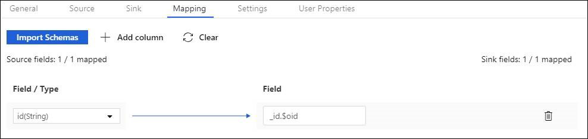

# Copy data to or from Azure Cosmos DB's API for MongoDB by using Azure Data Factory

This article outlines how to use Copy Activity in Azure Data Factory to copy data from and to Azure Cosmos DB's API for MongoDB. The article builds on [Copy Activity in Azure Data Factory](copy-activity-overview.md), which presents a general overview of Copy Activity.

>[!NOTE]
>This connector only support copy data to/from Azure Cosmos DB's API for MongoDB. For SQL API, refer to [Cosmos DB SQL API connector](connector-azure-cosmos-db.md). Other API types are not supported now.

## Supported capabilities

You can copy data from Azure Cosmos DB's API for MongoDB to any supported sink data store, or copy data from any supported source data store to Azure Cosmos DB's API for MongoDB. For a list of data stores that Copy Activity supports as sources and sinks, see [Supported data stores and formats](copy-activity-overview.md#supported-data-stores-and-formats).

You can use the Azure Cosmos DB's API for MongoDB connector to:

- Copy data from and to the [Azure Cosmos DB's API for MongoDB](https://docs.microsoft.com/azure/cosmos-db/mongodb-introduction).
- Write to Azure Cosmos DB as **insert** or **upsert**.
- Import and export JSON documents as-is, or copy data from or to a tabular dataset. Examples include a SQL database and a CSV file. To copy documents as-is to or from JSON files or to or from another Azure Cosmos DB collection, see Import or export JSON documents.

## Get started

[!INCLUDE [data-factory-v2-connector-get-started](../../includes/data-factory-v2-connector-get-started.md)]

The following sections provide details about properties you can use to define Data Factory entities that are specific to Azure Cosmos DB's API for MongoDB.

## Linked service properties

The following properties are supported for the Azure Cosmos DB's API for MongoDB linked service:

| Property | Description | Required |
|:--- |:--- |:--- |
| type | The **type** property must be set to **CosmosDbMongoDbApi**. | Yes |
| connectionString |Specify the connection string for your Azure Cosmos DB's API for MongoDB. You can find it in the Azure portal -> your Cosmos DB blade -> primary or secondary connection string, with the pattern of `mongodb://<cosmosdb-name>:<password>@<cosmosdb-name>.documents.azure.com:10255/?ssl=true&replicaSet=globaldb`. <br/><br />Mark this field as a **SecureString** type to store it securely in Data Factory. You can also [reference a secret stored in Azure Key Vault](store-credentials-in-key-vault.md). |Yes |
| database | Name of the database that you want to access. | Yes |
| connectVia | The [Integration Runtime](concepts-integration-runtime.md) to use to connect to the data store. You can use the Azure Integration Runtime or a self-hosted integration runtime (if your data store is located in a private network). If this property isn't specified, the default Azure Integration Runtime is used. |No |

**Example**

```json
{
    "name": "CosmosDbMongoDBAPILinkedService",
    "properties": {
        "type": "CosmosDbMongoDbApi",
        "typeProperties": {
            "connectionString": {
                "type": "SecureString",
                "value": "mongodb://<cosmosdb-name>:<password>@<cosmosdb-name>.documents.azure.com:10255/?ssl=true&replicaSet=globaldb"
            },
            "database": "myDatabase"
        },
        "connectVia": {
            "referenceName": "<name of Integration Runtime>",
            "type": "IntegrationRuntimeReference"
        }
    }
}
```

## Dataset properties

For a full list of sections and properties that are available for defining datasets, see [Datasets and linked services](concepts-datasets-linked-services.md). The following properties are supported for Azure Cosmos DB's API for MongoDB dataset:

| Property | Description | Required |
|:--- |:--- |:--- |
| type | The **type** property of the dataset must be set to **CosmosDbMongoDbApiCollection**. |Yes |
| collectionName |The name of the Azure Cosmos DB collection. |Yes |

**Example**

```json
{
    "name": "CosmosDbMongoDBAPIDataset",
    "properties": {
        "type": "CosmosDbMongoDbApiCollection",
        "linkedServiceName":{
            "referenceName": "<Azure Cosmos DB's API for MongoDB linked service name>",
            "type": "LinkedServiceReference"
        },
        "typeProperties": {
            "collectionName": "<collection name>"
        }
    }
}
```

## Copy Activity properties

This section provides a list of properties that the Azure Cosmos DB's API for MongoDB source and sink support.

For a full list of sections and properties that are available for defining activities, see [Pipelines](concepts-pipelines-activities.md).

### Azure Cosmos DB's API for MongoDB as source

The following properties are supported in the Copy Activity **source** section:

| Property | Description | Required |
|:--- |:--- |:--- |
| type | The **type** property of the copy activity source must be set to **CosmosDbMongoDbApiSource**. |Yes |
| filter | Specifies selection filter using query operators. To return all documents in a collection, omit this parameter or pass an empty document ({}). | No |
| cursorMethods.project | Specifies the fields to return in the documents for projection. To return all fields in the matching documents, omit this parameter. | No |
| cursorMethods.sort | Specifies the order in which the query returns matching documents. Refer to [cursor.sort()](https://docs.mongodb.com/manual/reference/method/cursor.sort/#cursor.sort). | No |
| cursorMethods.limit |	Specifies the maximum number of documents the server returns. Refer to [cursor.limit()](https://docs.mongodb.com/manual/reference/method/cursor.limit/#cursor.limit).  | No | 
| cursorMethods.skip | Specifies the number of documents to skip and from where MongoDB begins to return results. Refer to [cursor.skip()](https://docs.mongodb.com/manual/reference/method/cursor.skip/#cursor.skip). | No |
| batchSize | Specifies the number of documents to return in each batch of the response from MongoDB instance. In most cases, modifying the batch size will not affect the user or the application. Cosmos DB limits each batch cannot exceed 40MB in size, which is the sum of the batchSize number of documents' size, so decrease this value if your document size being large. | No<br/>(the default is **100**) |

>[!TIP]
>ADF support consuming BSON document in **Strict mode**. Make sure your filter query is in Strict mode instead of Shell mode. More description can be found at [MongoDB manual](https://docs.mongodb.com/manual/reference/mongodb-extended-json/index.html).

**Example**

```json
"activities":[
    {
        "name": "CopyFromCosmosDBMongoDBAPI",
        "type": "Copy",
        "inputs": [
            {
                "referenceName": "<Azure Cosmos DB's API for MongoDB input dataset name>",
                "type": "DatasetReference"
            }
        ],
        "outputs": [
            {
                "referenceName": "<output dataset name>",
                "type": "DatasetReference"
            }
        ],
        "typeProperties": {
            "source": {
                "type": "CosmosDbMongoDbApiSource",
                "filter": "{datetimeData: {$gte: ISODate(\"2018-12-11T00:00:00.000Z\"),$lt: ISODate(\"2018-12-12T00:00:00.000Z\")}, _id: ObjectId(\"5acd7c3d0000000000000000\") }",
                "cursorMethods": {
                    "project": "{ _id : 1, name : 1, age: 1, datetimeData: 1 }",
                    "sort": "{ age : 1 }",
                    "skip": 3,
                    "limit": 3
                }
            },
            "sink": {
                "type": "<sink type>"
            }
        }
    }
]
```

### Azure Cosmos DB's API for MongoDB as sink

The following properties are supported in the Copy Activity **sink** section:

| Property | Description | Required |
|:--- |:--- |:--- |
| type | The **type** property of the Copy Activity sink must be set to **CosmosDbMongoDbApiSink**. |Yes |
| writeBehavior |Describes how to write data to Azure Cosmos DB. Allowed values: **insert** and **upsert**.<br/><br/>The behavior of **upsert** is to replace the document if a document with the same ID already exists; otherwise, insert the document.<br /><br />**Note**: Data Factory automatically generates an ID for a document if an ID isn't specified either in the original document or by column mapping. This means that you must ensure that, for **upsert** to work as expected, your document has an ID. |No<br />(the default is **insert**) |
| writeBatchSize | The **writeBatchSize** property controls the size of documents to write in each batch. You can try increasing the value for **writeBatchSize** to improve performance and decreasing the value if your document size being large. |No<br />(the default is **10,000**) |
| writeBatchTimeout | The wait time for the batch insert operation to finish before it times out. The allowed value is timespan. | No<br/>(the default is **00:30:00** - 30 minutes) |

**Example**

```json
"activities":[
    {
        "name": "CopyToCosmosDBMongoDBAPI",
        "type": "Copy",
        "inputs": [
            {
                "referenceName": "<input dataset name>",
                "type": "DatasetReference"
            }
        ],
        "outputs": [
            {
                "referenceName": "<Document DB output dataset name>",
                "type": "DatasetReference"
            }
        ],
        "typeProperties": {
            "source": {
                "type": "<source type>"
            },
            "sink": {
                "type": "CosmosDbMongoDbApiSink",
                "writeBehavior": "upsert"
            }
        }
    }
]
```

>[!TIP]
>To import JSON documents as-is, refer to [Import or export JSON documents](#import-or-export-json-documents) section; to copy from tabular-shaped data, refer to [Schema mapping](#schema-mapping).

## Import or export JSON documents

You can use this Azure Cosmos DB connector to easily:

* Import JSON documents from various sources to Azure Cosmos DB, including from Azure Blob storage, Azure Data Lake Store, and other file-based stores that Azure Data Factory supports.
* Export JSON documents from an Azure Cosmos DB collection to various file-based stores.
* Copy documents between two Azure Cosmos DB collections as-is.

To achieve such schema-agnostic copy, skip the "structure" (also called *schema*) section in dataset and schema mapping in copy activity.

## Schema mapping

To copy data from Azure Cosmos DB's API for MongoDB to tabular sink or reversed, refer to [schema mapping](copy-activity-schema-and-type-mapping.md#schema-mapping).

Specifically for writing into Cosmos DB, to make sure you populate Cosmos DB with the right object ID from your source data, for example, you have an "id" column in SQL database table and want to use the value of that as the document ID in MongoDB for insert/upsert, you need to set the proper schema mapping according to MongoDB strict mode definition (`_id.$oid`) as the following:



After copy activity execution, below BSON ObjectId is generated in sink:

```json
{
    "_id": ObjectId("592e07800000000000000000")
}
``` 

## Next steps

For a list of data stores that Copy Activity supports as sources and sinks in Azure Data Factory, see [supported data stores](copy-activity-overview.md##supported-data-stores-and-formats).
