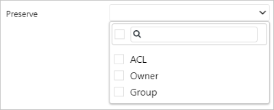

# Copy data to or from Azure Data Lake Storage Gen2 using Azure Data Factory

Azure Data Lake Storage Gen2 is a set of capabilities dedicated to big data analytics built into [Azure Blob storage](../storage/blobs/storage-blobs-introduction.md). You can use it to interface with your data by using both file system and object storage paradigms.

This article outlines how to copy data to and from Azure Data Lake Storage Gen2. To learn about Azure Data Factory, read the [introductory article](introduction.md).

## Supported capabilities

This Azure Data Lake Storage Gen2 connector is supported for the following activities:

- [Copy activity](copy-activity-overview.md) with [supported source or sink matrix](copy-activity-overview.md)
- [Mapping data flow](concepts-data-flow-overview.md)
- [Lookup activity](control-flow-lookup-activity.md)
- [GetMetadata activity](control-flow-get-metadata-activity.md)

Specifically, with this connector you can:

- Copy data by using account key, service principal, or managed identities for Azure resources authentications.
- Copy files as is or parse or generate files with [supported file formats and compression codecs](supported-file-formats-and-compression-codecs.md).

>[!TIP]
>If you enable the hierarchical namespace, currently there's no interoperability of operations between Blob and Data Lake Storage Gen2 APIs. If you hit the error "ErrorCode=FilesystemNotFound" with the message "The specified filesystem does not exist," it's caused by the specified sink file system that was created via the Blob API instead of Data Lake Storage Gen2 API elsewhere. To fix the issue, specify a new file system with a name that doesn't exist as the name of a Blob container. Then Data Factory automatically creates that file system during data copy.

>[!NOTE]
>If you enable the **Allow trusted Microsoft services to access this storage account** option in Azure Storage firewall settings, the Azure integration runtime doesn't connect to Data Lake Storage Gen2 and shows a forbidden error. The error message appears because Data Factory isn't treated as a trusted Microsoft service. Use the self-hosted integration runtime to connect instead.

## Get started

>[!TIP]
>For a walk-through of how to use the Data Lake Storage Gen2 connector, see [Load data into Azure Data Lake Storage Gen2](load-azure-data-lake-storage-gen2.md).

[!INCLUDE [data-factory-v2-connector-get-started](../../includes/data-factory-v2-connector-get-started.md)]

The following sections provide information about properties that are used to define Data Factory entities specific to Data Lake Storage Gen2.

## Linked service properties

The Azure Data Lake Storage Gen2 connector supports the following authentication types. See the corresponding sections for details:

- [Account key authentication](#account-key-authentication)
- [Service principal authentication](#service-principal-authentication)
- [Managed identities for Azure resources authentication](#managed-identity)

>[!NOTE]
>When using PolyBase to load data into SQL Data Warehouse, if your source Data Lake Storage Gen2 is configured with Virtual Network endpoint, you must use managed identity authentication as required by PolyBase. See the [managed identity authentication](#managed-identity) section with more configuration prerequisites.

### Account key authentication

To use storage account key authentication, the following properties are supported:

| Property | Description | Required |
|:--- |:--- |:--- |
| type | The type property must be set to **AzureBlobFS**. |Yes |
| url | Endpoint for Data Lake Storage Gen2 with the pattern of `https://<accountname>.dfs.core.windows.net`. | Yes |
| accountKey | Account key for Data Lake Storage Gen2. Mark this field as a SecureString to store it securely in Data Factory, or [reference a secret stored in Azure Key Vault](store-credentials-in-key-vault.md). |Yes |
| connectVia | The [integration runtime](concepts-integration-runtime.md) to be used to connect to the data store. You can use the Azure integration runtime or a self-hosted integration runtime if your data store is in a private network. If this property isn't specified, the default Azure integration runtime is used. |No |

**Example:**

```json
{
    "name": "AzureDataLakeStorageGen2LinkedService",
    "properties": {
        "type": "AzureBlobFS",
        "typeProperties": {
            "url": "https://<accountname>.dfs.core.windows.net", 
            "accountkey": { 
                "type": "SecureString", 
                "value": "<accountkey>" 
            }
        },
        "connectVia": {
            "referenceName": "<name of Integration Runtime>",
            "type": "IntegrationRuntimeReference"
        }
    }
}
```

### Service principal authentication

To use service principal authentication, follow these steps.

1. Register an application entity in Azure Active Directory (Azure AD) by following the steps in [Register your application with an Azure AD tenant](../storage/common/storage-auth-aad-app.md#register-your-application-with-an-azure-ad-tenant). Make note of the following values, which you use to define the linked service:

    - Application ID
    - Application key
    - Tenant ID

2. Grant the service principal proper permission. Learn more on how permission works in Data Lake Storage Gen2 from [Access control lists on files and directories](../storage/blobs/data-lake-storage-access-control.md#access-control-lists-on-files-and-directories)

    - **As source**: In Storage Explorer, grant at least **Execute** permission starting from the source file system, along with **Read** permission for the files to copy. Alternatively, in Access control (IAM), grant at least the **Storage Blob Data Reader** role.
    - **As sink**: In Storage Explorer, grant at least **Execute** permission starting from the sink file system, along with **Write** permission for the sink folder. Alternatively, in Access control (IAM), grant at least the **Storage Blob Data Contributor** role.

>[!NOTE]
>To list folders starting from the account level or to test connection, you need to set the permission of the service principal being granted to **storage account with "Storage Blob Data Reader" permission in IAM**. This is true when you use the:
>- **Copy data tool** to author copy pipeline.
>- **Data Factory UI** to test connection and navigating folders during authoring. 
>If you have concerns about granting permission at the account level, during authoring, skip testing connection, and input a parent path with permission granted then choose to browse from that specified path. Copy activity works as long as the service principal is granted with proper permission at the files to be copied.

These properties are supported for the linked service:

| Property | Description | Required |
|:--- |:--- |:--- |
| type | The type property must be set to **AzureBlobFS**. |Yes |
| url | Endpoint for Data Lake Storage Gen2 with the pattern of `https://<accountname>.dfs.core.windows.net`. | Yes |
| servicePrincipalId | Specify the application's client ID. | Yes |
| servicePrincipalKey | Specify the application's key. Mark this field as a `SecureString` to store it securely in Data Factory. Or, you can [reference a secret stored in Azure Key Vault](store-credentials-in-key-vault.md). | Yes |
| tenant | Specify the tenant information (domain name or tenant ID) under which your application resides. Retrieve it by hovering the mouse in the upper-right corner of the Azure portal. | Yes |
| connectVia | The [integration runtime](concepts-integration-runtime.md) to be used to connect to the data store. You can use the Azure integration runtime or a self-hosted integration runtime if your data store is in a private network. If not specified, the default Azure integration runtime is used. |No |

**Example:**

```json
{
    "name": "AzureDataLakeStorageGen2LinkedService",
    "properties": {
        "type": "AzureBlobFS",
        "typeProperties": {
            "url": "https://<accountname>.dfs.core.windows.net", 
            "servicePrincipalId": "<service principal id>",
            "servicePrincipalKey": {
                "type": "SecureString",
                "value": "<service principal key>"
            },
            "tenant": "<tenant info, e.g. microsoft.onmicrosoft.com>" 
        },
        "connectVia": {
            "referenceName": "<name of Integration Runtime>",
            "type": "IntegrationRuntimeReference"
        }
    }
}
```

### <a name="managed-identity"></a> Managed identities for Azure resources authentication

A data factory can be associated with a [managed identity for Azure resources](data-factory-service-identity.md), which represents this specific data factory. You can directly use this managed identity for Data Lake Storage Gen2 authentication, similar to using your own service principal. It allows this designated factory to access and copy data to or from your Data Lake Storage Gen2.

To use managed identities for Azure resource authentication, follow these steps.

1. [Retrieve the Data Factory managed identity information](data-factory-service-identity.md#retrieve-managed-identity) by copying the value of the **service identity application ID** generated along with your factory.

2. Grant the managed identity proper permission. Learn more on how permission works in Data Lake Storage Gen2 from [Access control lists on files and directories](../storage/blobs/data-lake-storage-access-control.md#access-control-lists-on-files-and-directories).

    - **As source**: In Storage Explorer, grant at least **Execute** permission starting from the source file system, along with **Read** permission for the files to copy. Alternatively, in Access control (IAM), grant at least the **Storage Blob Data Reader** role.
    - **As sink**: In Storage Explorer, grant at least **Execute** permission starting from the sink file system, along with **Write** permission for the sink folder. Alternatively, in Access control (IAM), grant at least the **Storage Blob Data Contributor** role.

>[!NOTE]
>To list folders starting from the account level or to test connection, you need to set the permission of the managed identity being granted to **storage account with "Storage Blob Data Reader" permission in IAM**. This is true when you use the:
>- **Copy data tool** to author copy pipeline.
>- **Data Factory UI** to test connection and navigating folders during authoring. 
>If you have concerns about granting permission at the account level, during authoring, skip testing connection, and input a parent path with permission granted then choose to browse from that specified path. Copy activity works as long as the service principal is granted with proper permission at the files to be copied.

>[!IMPORTANT]
>If you use PolyBase to load data from Data Lake Storage Gen2 into SQL Data Warehouse, when using  managed identity authentication for Data Lake Storage Gen2, make sure you also follow steps 1 and 2 in [this guidance](../sql-database/sql-database-vnet-service-endpoint-rule-overview.md#impact-of-using-vnet-service-endpoints-with-azure-storage) to 1) register your SQL Database server with Azure Active Directory (Azure AD) and 2) assign the Storage Blob Data Contributor role to your SQL Database server; the rest are handled by Data Factory. If your Data Lake Storage Gen2 is configured with an Azure Virtual Network endpoint, to use PolyBase to load data from it, you must use managed identity authentication as required by PolyBase.

These properties are supported for the linked service:

| Property | Description | Required |
|:--- |:--- |:--- |
| type | The type property must be set to **AzureBlobFS**. |Yes |
| url | Endpoint for Data Lake Storage Gen2 with the pattern of `https://<accountname>.dfs.core.windows.net`. | Yes |
| connectVia | The [integration runtime](concepts-integration-runtime.md) to be used to connect to the data store. You can use the Azure integration runtime or a self-hosted integration runtime if your data store is in a private network. If not specified, the default Azure integration runtime is used. |No |

**Example:**

```json
{
    "name": "AzureDataLakeStorageGen2LinkedService",
    "properties": {
        "type": "AzureBlobFS",
        "typeProperties": {
            "url": "https://<accountname>.dfs.core.windows.net", 
        },
        "connectVia": {
            "referenceName": "<name of Integration Runtime>",
            "type": "IntegrationRuntimeReference"
        }
    }
}
```

## Dataset properties

For a full list of sections and properties available for defining datasets, see [Datasets](concepts-datasets-linked-services.md).

- For the parquet and delimited text format, see the [Parquet and delimited text format dataset](#parquet-and-delimited-text-format-dataset) section.
- For other formats like ORC, Avro, JSON, or binary format, see the [Other format dataset](#other-format-dataset) section.

### Parquet and delimited text format dataset

To copy data to and from Data Lake Storage Gen2 in parquet or delimited text format, see the [Parquet format](format-parquet.md) and [Delimited text format](format-delimited-text.md) articles on format-based dataset and supported settings. The following properties are supported for Data Lake Storage Gen2 under `location` settings in the format-based dataset:

| Property   | Description                                                  | Required |
| ---------- | ------------------------------------------------------------ | -------- |
| type       | The type property under `location` in the dataset must be set to **AzureBlobFSLocation**. | Yes      |
| fileSystem | The Data Lake Storage Gen2 file system name.                              | No       |
| folderPath | The path to a folder under the given file system. If you want to use a wildcard to filter folders, skip this setting and specify it in activity source settings. | No       |
| fileName   | The file name under the given fileSystem + folderPath. If you want to use a wildcard to filter files, skip this setting and specify it in activity source settings. | No       |

> [!NOTE]
> The **AzureBlobFSFile** type dataset with parquet or text format mentioned in the following section is still supported as is for copy, lookup, or GetMetadata activity for backward compatibility. But it doesn't work with the mapping data flow feature. We recommend that you use this new model going forward. The Data Factory authoring UI generates these new types.

**Example:**

```json
{
    "name": "DelimitedTextDataset",
    "properties": {
        "type": "DelimitedText",
        "linkedServiceName": {
            "referenceName": "<Data Lake Storage Gen2 linked service name>",
            "type": "LinkedServiceReference"
        },
        "schema": [ < physical schema, optional, auto retrieved during authoring > ],
        "typeProperties": {
            "location": {
                "type": "AzureBlobFSLocation",
                "fileSystem": "filesystemname",
                "folderPath": "folder/subfolder"
            },
            "columnDelimiter": ",",
            "quoteChar": "\"",
            "firstRowAsHeader": true,
            "compressionCodec": "gzip"
        }
    }
}
```

### Other format dataset

To copy data to and from Data Lake Storage Gen2 in ORC, Avro, JSON, or binary format, the following properties are supported:

| Property | Description | Required |
|:--- |:--- |:--- |
| type | The type property of the dataset must be set to **AzureBlobFSFile**. |Yes |
| folderPath | Path to the folder in Data Lake Storage Gen2. If not specified, it points to the root. <br/><br/>Wildcard filter is supported. Allowed wildcards are `*` (matches zero or more characters) and `?` (matches zero or single character). Use `^` to escape if your actual folder name has a wildcard or this escape char is inside. <br/><br/>Examples: filesystem/folder/. See more examples in [Folder and file filter examples](#folder-and-file-filter-examples). |No |
| fileName | Name or wildcard filter for the files under the specified "folderPath". If you don't specify a value for this property, the dataset points to all files in the folder. <br/><br/>For filter, the wildcards allowed are `*` (matches zero or more characters) and `?` (matches zero or single character).<br/>- Example 1: `"fileName": "*.csv"`<br/>- Example 2: `"fileName": "???20180427.txt"`<br/>Use `^` to escape if your actual file name has a wildcard or this escape char is inside.<br/><br/>When fileName isn't specified for an output dataset and **preserveHierarchy** isn't specified in the activity sink, the copy activity automatically generates the file name with the following pattern: "*Data.[activity run ID GUID].[GUID if FlattenHierarchy].[format if configured].[compression if configured]*", for example, "Data.0a405f8a-93ff-4c6f-b3be-f69616f1df7a.txt.gz". If you copy from a tabular source using a table name instead of a query, the name pattern is "*[table name].[format].[compression if configured]*", for example, "MyTable.csv". |No |
| modifiedDatetimeStart | Files filter based on the attribute Last Modified. The files are selected if their last modified time is within the time range between `modifiedDatetimeStart` and `modifiedDatetimeEnd`. The time is applied to the UTC time zone in the format of "2018-12-01T05:00:00Z". <br/><br/> The overall performance of data movement is affected by enabling this setting when you want to do file filter with huge amounts of files. <br/><br/> The properties can be NULL, which means no file attribute filter is applied to the dataset. When `modifiedDatetimeStart` has a datetime value but `modifiedDatetimeEnd` is NULL, it means the files whose last modified attribute is greater than or equal to the datetime value are selected. When `modifiedDatetimeEnd` has a datetime value but `modifiedDatetimeStart` is NULL, it means the files whose last modified attribute is less than the datetime value are selected.| No |
| modifiedDatetimeEnd | Files filter based on the attribute Last Modified. The files are selected if their last modified time is within the time range between `modifiedDatetimeStart` and `modifiedDatetimeEnd`. The time is applied to the UTC time zone in the format of "2018-12-01T05:00:00Z". <br/><br/> The overall performance of data movement is affected by enabling this setting when you want to do file filter with huge amounts of files. <br/><br/> The properties can be NULL, which means no file attribute filter is applied to the dataset. When `modifiedDatetimeStart` has a datetime value but `modifiedDatetimeEnd` is NULL, it means the files whose last modified attribute is greater than or equal to the datetime value are selected. When `modifiedDatetimeEnd` has a datetime value but `modifiedDatetimeStart` is NULL, it means the files whose last modified attribute is less than the datetime value are selected.| No |
| format | If you want to copy files as is between file-based stores (binary copy), skip the format section in both the input and output dataset definitions.<br/><br/>If you want to parse or generate files with a specific format, the following file format types are supported: **TextFormat**, **JsonFormat**, **AvroFormat**, **OrcFormat**, and **ParquetFormat**. Set the **type** property under **format** to one of these values. For more information, see the [Text format](supported-file-formats-and-compression-codecs.md#text-format), [JSON format](supported-file-formats-and-compression-codecs.md#json-format), [Avro format](supported-file-formats-and-compression-codecs.md#avro-format), [ORC format](supported-file-formats-and-compression-codecs.md#orc-format), and [Parquet format](supported-file-formats-and-compression-codecs.md#parquet-format) sections. |No (only for binary copy scenario) |
| compression | Specify the type and level of compression for the data. For more information, see [Supported file formats and compression codecs](supported-file-formats-and-compression-codecs.md#compression-support).<br/>Supported types are **GZip**, **Deflate**, **BZip2**, and **ZipDeflate**.<br/>Supported levels are **Optimal** and **Fastest**. |No |

>[!TIP]
>To copy all files under a folder, specify **folderPath** only.<br>To copy a single file with a given name, specify **folderPath** with a folder part and **fileName** with a file name.<br>To copy a subset of files under a folder, specify **folderPath** with a folder part and **fileName** with a wildcard filter. 

**Example:**

```json
{
    "name": "ADLSGen2Dataset",
    "properties": {
        "type": "AzureBlobFSFile",
        "linkedServiceName": {
            "referenceName": "<Azure Data Lake Storage Gen2 linked service name>",
            "type": "LinkedServiceReference"
        },
        "typeProperties": {
            "folderPath": "myfilesystem/myfolder",
            "fileName": "*",
            "modifiedDatetimeStart": "2018-12-01T05:00:00Z",
            "modifiedDatetimeEnd": "2018-12-01T06:00:00Z",
            "format": {
                "type": "TextFormat",
                "columnDelimiter": ",",
                "rowDelimiter": "\n"
            },
            "compression": {
                "type": "GZip",
                "level": "Optimal"
            }
        }
    }
}
```

## Copy activity properties

For a full list of sections and properties available for defining activities, see [Copy activity configurations](copy-activity-overview.md#configuration) and [Pipelines and activities](concepts-pipelines-activities.md). This section provides a list of properties supported by the Data Lake Storage Gen2 source and sink.

### Azure Data Lake Storage Gen2 as a source type

- To copy from the parquet or delimited text format, see the [Parquet and delimited text format source](#parquet-and-delimited-text-format-source) section.
- To copy from other formats like ORC, Avro, JSON, or binary format, see the [Other format source](#other-format-source) section.

#### Parquet and delimited text format source

To copy data from Data Lake Storage Gen2 in parquet or delimited text format, see the [Parquet format](format-parquet.md) and [Delimited text format](format-delimited-text.md) article on format-based copy activity source and supported settings. The following properties are supported for Data Lake Storage Gen2 under `storeSettings` settings in format-based copy source:

| Property                 | Description                                                  | Required                                      |
| ------------------------ | ------------------------------------------------------------ | --------------------------------------------- |
| type                     | The type property under `storeSettings` must be set to **AzureBlobFSReadSetting**. | Yes                                           |
| recursive                | Indicates whether the data is read recursively from the subfolders or only from the specified folder. When recursive is set to true and the sink is a file-based store, an empty folder or subfolder isn't copied or created at the sink. Allowed values are **true** (default) and **false**. | No                                            |
| wildcardFolderPath       | The folder path with wildcard characters under the given file system configured in dataset to filter source folders. <br>Allowed wildcards are `*` (matches zero or more characters) and `?` (matches zero or single character). Use `^` to escape if your actual folder name has a wildcard or this escape char inside. <br>See more examples in [Folder and file filter examples](#folder-and-file-filter-examples). | No                                            |
| wildcardFileName         | The file name with wildcard characters under the given file system + folderPath/wildcardFolderPath to filter source files. <br>Allowed wildcards are `*` (matches zero or more characters) and `?` (matches zero or single character). Use `^` to escape if your actual folder name has a wildcard or this escape char inside. See more examples in [Folder and file filter examples](#folder-and-file-filter-examples). | Yes if `fileName` isn't specified in dataset |
| modifiedDatetimeStart    | Files filter based on the attribute Last Modified. The files are selected if their last modified time is within the time range between `modifiedDatetimeStart` and `modifiedDatetimeEnd`. The time is applied to the UTC time zone in the format of "2018-12-01T05:00:00Z". <br> The properties can be NULL, which means that no file attribute filter is applied to the dataset. When `modifiedDatetimeStart` has a datetime value but `modifiedDatetimeEnd` is NULL, it means that the files whose last modified attribute is greater than or equal to the datetime value are selected. When `modifiedDatetimeEnd` has a datetime value but `modifiedDatetimeStart` is NULL, it means that the files whose last modified attribute is less than the datetime value are selected. | No                                            |
| modifiedDatetimeEnd      | Same as above.                                               | No                                            |
| maxConcurrentConnections | The number of connections to connect to storage store concurrently. Specify only when you want to limit the concurrent connection to the data store. | No                                            |

> [!NOTE]
> For the parquet or delimited text format, the **AzureBlobFSSource** type copy activity source mentioned in the following section is still supported as is for backward compatibility. We recommend that you use this new model going forward. The Data Factory authoring UI generates these new types.

**Example:**

```json
"activities":[
    {
        "name": "CopyFromADLSGen2",
        "type": "Copy",
        "inputs": [
            {
                "referenceName": "<Delimited text input dataset name>",
                "type": "DatasetReference"
            }
        ],
        "outputs": [
            {
                "referenceName": "<output dataset name>",
                "type": "DatasetReference"
            }
        ],
        "typeProperties": {
            "source": {
                "type": "DelimitedTextSource",
                "formatSettings":{
                    "type": "DelimitedTextReadSetting",
                    "skipLineCount": 10
                },
                "storeSettings":{
                    "type": "AzureBlobFSReadSetting",
                    "recursive": true,
                    "wildcardFolderPath": "myfolder*A",
                    "wildcardFileName": "*.csv"
                }
            },
            "sink": {
                "type": "<sink type>"
            }
        }
    }
]
```

#### Other format source

To copy data from Data Lake Storage Gen2 in ORC, Avro, JSON, or binary format, the following properties are supported in the copy activity **source** section:

| Property | Description | Required |
|:--- |:--- |:--- |
| type | The type property of the copy activity source must be set to **AzureBlobFSSource**. |Yes |
| recursive | Indicates whether the data is read recursively from the subfolders or only from the specified folder. When recursive is set to true and the sink is a file-based store, an empty folder or subfolder isn't copied or created at the sink.<br/>Allowed values are **true** (default) and **false**. | No |
| maxConcurrentConnections | The number of connections to connect to the data store concurrently. Specify only when you want to limit the concurrent connection to the data store. | No |

**Example:**

```json
"activities":[
    {
        "name": "CopyFromADLSGen2",
        "type": "Copy",
        "inputs": [
            {
                "referenceName": "<ADLS Gen2 input dataset name>",
                "type": "DatasetReference"
            }
        ],
        "outputs": [
            {
                "referenceName": "<output dataset name>",
                "type": "DatasetReference"
            }
        ],
        "typeProperties": {
            "source": {
                "type": "AzureBlobFSSource",
                "recursive": true
            },
            "sink": {
                "type": "<sink type>"
            }
        }
    }
]
```

### Azure Data Lake Storage Gen2 as a sink type

- To copy to the parquet or delimited text format, see the [Parquet and delimited text format sink](#parquet-and-delimited-text-format-sink) section.
- To copy to other formats like ORC, Avro, JSON, or binary format, see the [Other format sink](#other-format-sink) section.

#### Parquet and delimited text format sink

To copy data to Data Lake Storage Gen2 in parquet or delimited text format, see the [Parquet format](format-parquet.md) and [Delimited text format](format-delimited-text.md) articles on format-based copy activity sink and supported settings. The following properties are supported for Data Lake Storage Gen2 under `storeSettings` settings in format-based copy sink:

| Property                 | Description                                                  | Required |
| ------------------------ | ------------------------------------------------------------ | -------- |
| type                     | The type property under `storeSettings` must be set to **AzureBlobFSWriteSetting**. | Yes      |
| copyBehavior             | Defines the copy behavior when the source is files from a file-based data store.<br/><br/>Allowed values are:<br/><b>- PreserveHierarchy (default)</b>: Preserves the file hierarchy in the target folder. The relative path of the source file to the source folder is identical to the relative path of the target file to the target folder.<br/><b>- FlattenHierarchy</b>: All files from the source folder are in the first level of the target folder. The target files have autogenerated names. <br/><b>- MergeFiles</b>: Merges all files from the source folder to one file. If the file name is specified, the merged file name is the specified name. Otherwise, it's an autogenerated file name. | No       |
| maxConcurrentConnections | The number of connections to connect to the data store concurrently. Specify only when you want to limit the concurrent connection to the data store. | No       |

> [!NOTE]
> For the parquet or delimited text format, the **AzureBlobFSSink** type copy activity sink mentioned in the following section is still supported as is for backward compatibility. We recommend that you use this new model going forward. The Data Factory authoring UI generates these new types.

**Example:**

```json
"activities":[
    {
        "name": "CopyToADLSGen2",
        "type": "Copy",
        "inputs": [
            {
                "referenceName": "<input dataset name>",
                "type": "DatasetReference"
            }
        ],
        "outputs": [
            {
                "referenceName": "<Parquet output dataset name>",
                "type": "DatasetReference"
            }
        ],
        "typeProperties": {
            "source": {
                "type": "<source type>"
            },
            "sink": {
                "type": "ParquetSink",
                "storeSettings":{
                    "type": "AzureBlobFSWriteSetting",
                    "copyBehavior": "PreserveHierarchy"
                }
            }
        }
    }
]
```

#### Other format sink

To copy data to Data Lake Storage Gen2 in ORC, Avro, JSON, or binary format, the following properties are supported in the **sink** section:

| Property | Description | Required |
|:--- |:--- |:--- |
| type | The type property of the copy activity sink must be set to **AzureBlobFSSink**. |Yes |
| copyBehavior | Defines the copy behavior when the source is files from a file-based data store.<br/><br/>Allowed values are:<br/><b>- PreserveHierarchy (default)</b>: Preserves the file hierarchy in the target folder. The relative path of the source file to the source folder is identical to the relative path of the target file to the target folder.<br/><b>- FlattenHierarchy</b>: All files from the source folder are in the first level of the target folder. The target files have autogenerated names. <br/><b>- MergeFiles</b>: Merges all files from the source folder to one file. If the file name is specified, the merged file name is the specified name. Otherwise, it's an autogenerated file name. | No |
| maxConcurrentConnections | The number of connections to connect to the data store concurrently. Specify only when you want to limit the concurrent connection to the data store. | No |

**Example:**

```json
"activities":[
    {
        "name": "CopyToADLSGen2",
        "type": "Copy",
        "inputs": [
            {
                "referenceName": "<input dataset name>",
                "type": "DatasetReference"
            }
        ],
        "outputs": [
            {
                "referenceName": "<ADLS Gen2 output dataset name>",
                "type": "DatasetReference"
            }
        ],
        "typeProperties": {
            "source": {
                "type": "<source type>"
            },
            "sink": {
                "type": "AzureBlobFSSink",
                "copyBehavior": "PreserveHierarchy"
            }
        }
    }
]
```

### Folder and file filter examples

This section describes the resulting behavior of the folder path and file name with wildcard filters.

| folderPath | fileName | recursive | Source folder structure and filter result (files in **bold** are retrieved)|
|:--- |:--- |:--- |:--- |
| `Folder*` | (Empty, use default) | false | FolderA<br/>&nbsp;&nbsp;&nbsp;&nbsp;**File1.csv**<br/>&nbsp;&nbsp;&nbsp;&nbsp;**File2.json**<br/>&nbsp;&nbsp;&nbsp;&nbsp;Subfolder1<br/>&nbsp;&nbsp;&nbsp;&nbsp;&nbsp;&nbsp;&nbsp;&nbsp;File3.csv<br/>&nbsp;&nbsp;&nbsp;&nbsp;&nbsp;&nbsp;&nbsp;&nbsp;File4.json<br/>&nbsp;&nbsp;&nbsp;&nbsp;&nbsp;&nbsp;&nbsp;&nbsp;File5.csv<br/>AnotherFolderB<br/>&nbsp;&nbsp;&nbsp;&nbsp;File6.csv |
| `Folder*` | (Empty, use default) | true | FolderA<br/>&nbsp;&nbsp;&nbsp;&nbsp;**File1.csv**<br/>&nbsp;&nbsp;&nbsp;&nbsp;**File2.json**<br/>&nbsp;&nbsp;&nbsp;&nbsp;Subfolder1<br/>&nbsp;&nbsp;&nbsp;&nbsp;&nbsp;&nbsp;&nbsp;&nbsp;**File3.csv**<br/>&nbsp;&nbsp;&nbsp;&nbsp;&nbsp;&nbsp;&nbsp;&nbsp;**File4.json**<br/>&nbsp;&nbsp;&nbsp;&nbsp;&nbsp;&nbsp;&nbsp;&nbsp;**File5.csv**<br/>AnotherFolderB<br/>&nbsp;&nbsp;&nbsp;&nbsp;File6.csv |
| `Folder*` | `*.csv` | false | FolderA<br/>&nbsp;&nbsp;&nbsp;&nbsp;**File1.csv**<br/>&nbsp;&nbsp;&nbsp;&nbsp;File2.json<br/>&nbsp;&nbsp;&nbsp;&nbsp;Subfolder1<br/>&nbsp;&nbsp;&nbsp;&nbsp;&nbsp;&nbsp;&nbsp;&nbsp;File3.csv<br/>&nbsp;&nbsp;&nbsp;&nbsp;&nbsp;&nbsp;&nbsp;&nbsp;File4.json<br/>&nbsp;&nbsp;&nbsp;&nbsp;&nbsp;&nbsp;&nbsp;&nbsp;File5.csv<br/>AnotherFolderB<br/>&nbsp;&nbsp;&nbsp;&nbsp;File6.csv |
| `Folder*` | `*.csv` | true | FolderA<br/>&nbsp;&nbsp;&nbsp;&nbsp;**File1.csv**<br/>&nbsp;&nbsp;&nbsp;&nbsp;File2.json<br/>&nbsp;&nbsp;&nbsp;&nbsp;Subfolder1<br/>&nbsp;&nbsp;&nbsp;&nbsp;&nbsp;&nbsp;&nbsp;&nbsp;**File3.csv**<br/>&nbsp;&nbsp;&nbsp;&nbsp;&nbsp;&nbsp;&nbsp;&nbsp;File4.json<br/>&nbsp;&nbsp;&nbsp;&nbsp;&nbsp;&nbsp;&nbsp;&nbsp;**File5.csv**<br/>AnotherFolderB<br/>&nbsp;&nbsp;&nbsp;&nbsp;File6.csv |

### Some recursive and copyBehavior examples

This section describes the resulting behavior of the copy operation for different combinations of recursive and copyBehavior values.

| recursive | copyBehavior | Source folder structure | Resulting target |
|:--- |:--- |:--- |:--- |
| true |preserveHierarchy | Folder1<br/>&nbsp;&nbsp;&nbsp;&nbsp;File1<br/>&nbsp;&nbsp;&nbsp;&nbsp;File2<br/>&nbsp;&nbsp;&nbsp;&nbsp;Subfolder1<br/>&nbsp;&nbsp;&nbsp;&nbsp;&nbsp;&nbsp;&nbsp;&nbsp;File3<br/>&nbsp;&nbsp;&nbsp;&nbsp;&nbsp;&nbsp;&nbsp;&nbsp;File4<br/>&nbsp;&nbsp;&nbsp;&nbsp;&nbsp;&nbsp;&nbsp;&nbsp;File5 | The target Folder1 is created with the same structure as the source:<br/><br/>Folder1<br/>&nbsp;&nbsp;&nbsp;&nbsp;File1<br/>&nbsp;&nbsp;&nbsp;&nbsp;File2<br/>&nbsp;&nbsp;&nbsp;&nbsp;Subfolder1<br/>&nbsp;&nbsp;&nbsp;&nbsp;&nbsp;&nbsp;&nbsp;&nbsp;File3<br/>&nbsp;&nbsp;&nbsp;&nbsp;&nbsp;&nbsp;&nbsp;&nbsp;File4<br/>&nbsp;&nbsp;&nbsp;&nbsp;&nbsp;&nbsp;&nbsp;&nbsp;File5 |
| true |flattenHierarchy | Folder1<br/>&nbsp;&nbsp;&nbsp;&nbsp;File1<br/>&nbsp;&nbsp;&nbsp;&nbsp;File2<br/>&nbsp;&nbsp;&nbsp;&nbsp;Subfolder1<br/>&nbsp;&nbsp;&nbsp;&nbsp;&nbsp;&nbsp;&nbsp;&nbsp;File3<br/>&nbsp;&nbsp;&nbsp;&nbsp;&nbsp;&nbsp;&nbsp;&nbsp;File4<br/>&nbsp;&nbsp;&nbsp;&nbsp;&nbsp;&nbsp;&nbsp;&nbsp;File5 | The target Folder1 is created with the following structure: <br/><br/>Folder1<br/>&nbsp;&nbsp;&nbsp;&nbsp;autogenerated name for File1<br/>&nbsp;&nbsp;&nbsp;&nbsp;autogenerated name for File2<br/>&nbsp;&nbsp;&nbsp;&nbsp;autogenerated name for File3<br/>&nbsp;&nbsp;&nbsp;&nbsp;autogenerated name for File4<br/>&nbsp;&nbsp;&nbsp;&nbsp;autogenerated name for File5 |
| true |mergeFiles | Folder1<br/>&nbsp;&nbsp;&nbsp;&nbsp;File1<br/>&nbsp;&nbsp;&nbsp;&nbsp;File2<br/>&nbsp;&nbsp;&nbsp;&nbsp;Subfolder1<br/>&nbsp;&nbsp;&nbsp;&nbsp;&nbsp;&nbsp;&nbsp;&nbsp;File3<br/>&nbsp;&nbsp;&nbsp;&nbsp;&nbsp;&nbsp;&nbsp;&nbsp;File4<br/>&nbsp;&nbsp;&nbsp;&nbsp;&nbsp;&nbsp;&nbsp;&nbsp;File5 | The target Folder1 is created with the following structure: <br/><br/>Folder1<br/>&nbsp;&nbsp;&nbsp;&nbsp;File1 + File2 + File3 + File4 + File5 contents are merged into one file with an autogenerated file name. |
| false |preserveHierarchy | Folder1<br/>&nbsp;&nbsp;&nbsp;&nbsp;File1<br/>&nbsp;&nbsp;&nbsp;&nbsp;File2<br/>&nbsp;&nbsp;&nbsp;&nbsp;Subfolder1<br/>&nbsp;&nbsp;&nbsp;&nbsp;&nbsp;&nbsp;&nbsp;&nbsp;File3<br/>&nbsp;&nbsp;&nbsp;&nbsp;&nbsp;&nbsp;&nbsp;&nbsp;File4<br/>&nbsp;&nbsp;&nbsp;&nbsp;&nbsp;&nbsp;&nbsp;&nbsp;File5 | The target Folder1 is created with the following structure: <br/><br/>Folder1<br/>&nbsp;&nbsp;&nbsp;&nbsp;File1<br/>&nbsp;&nbsp;&nbsp;&nbsp;File2<br/><br/>Subfolder1 with File3, File4, and File5 isn't picked up. |
| false |flattenHierarchy | Folder1<br/>&nbsp;&nbsp;&nbsp;&nbsp;File1<br/>&nbsp;&nbsp;&nbsp;&nbsp;File2<br/>&nbsp;&nbsp;&nbsp;&nbsp;Subfolder1<br/>&nbsp;&nbsp;&nbsp;&nbsp;&nbsp;&nbsp;&nbsp;&nbsp;File3<br/>&nbsp;&nbsp;&nbsp;&nbsp;&nbsp;&nbsp;&nbsp;&nbsp;File4<br/>&nbsp;&nbsp;&nbsp;&nbsp;&nbsp;&nbsp;&nbsp;&nbsp;File5 | The target Folder1 is created with the following structure: <br/><br/>Folder1<br/>&nbsp;&nbsp;&nbsp;&nbsp;autogenerated name for File1<br/>&nbsp;&nbsp;&nbsp;&nbsp;autogenerated name for File2<br/><br/>Subfolder1 with File3, File4, and File5 isn't picked up. |
| false |mergeFiles | Folder1<br/>&nbsp;&nbsp;&nbsp;&nbsp;File1<br/>&nbsp;&nbsp;&nbsp;&nbsp;File2<br/>&nbsp;&nbsp;&nbsp;&nbsp;Subfolder1<br/>&nbsp;&nbsp;&nbsp;&nbsp;&nbsp;&nbsp;&nbsp;&nbsp;File3<br/>&nbsp;&nbsp;&nbsp;&nbsp;&nbsp;&nbsp;&nbsp;&nbsp;File4<br/>&nbsp;&nbsp;&nbsp;&nbsp;&nbsp;&nbsp;&nbsp;&nbsp;File5 | The target Folder1 is created with the following structure: <br/><br/>Folder1<br/>&nbsp;&nbsp;&nbsp;&nbsp;File1 + File2 contents are merged into one file with an autogenerated file name. autogenerated name for File1<br/><br/>Subfolder1 with File3, File4, and File5 isn't picked up. |

## Preserve ACLs from Data Lake Storage Gen1

>[!TIP]
>To copy data from Azure Data Lake Storage Gen1 into Gen2 in general, see [Copy data from Azure Data Lake Storage Gen1 to Gen2 with Azure Data Factory](load-azure-data-lake-storage-gen2-from-gen1.md) for a walk-through and best practices.

When you copy files from Azure Data Lake Storage Gen1 to Gen2, you can choose to preserve the POSIX access control lists (ACLs) along with data. For more information on access control, see [Access control in Azure Data Lake Storage Gen1](../data-lake-store/data-lake-store-access-control.md) and [Access control in Azure Data Lake Storage Gen2](../storage/blobs/data-lake-storage-access-control.md).

The following types of ACLs can be preserved by using the Azure Data Factory copy activity. You can select one or more types:

- **ACL**: Copy and preserve POSIX access control lists on files and directories. It copies the full existing ACLs from source to sink. 
- **Owner**: Copy and preserve the owning user of files and directories. Super-user access to sink Data Lake Storage Gen2 is required.
- **Group**: Copy and preserve the owning group of files and directories. Super-user access to sink Data Lake Storage Gen2 or the owning user (if the owning user is also a member of the target group) is required.

If you specify to copy from a folder, Data Factory replicates the ACLs for that given folder and the files and directories under it, if `recursive` is set to true. If you specify to copy from a single file, the ACLs on that file are copied.

>[!IMPORTANT]
>When you choose to preserve ACLs, make sure you grant high enough permissions for Data Factory to operate against your sink Data Lake Storage Gen2 account. For example, use account key authentication or assign the Storage Blob Data Owner role to the service principal or managed identity.

When you configure source as Data Lake Storage Gen1 with the binary copy option or binary format and sink as Data Lake Storage Gen2 with the binary copy option or binary format, you can find the **Preserve** option on the **Copy Data Tool Settings** page or on the **Copy Activity** > **Settings** tab for activity authoring.



Here's an example of JSON configuration (see `preserve`): 

```json
"activities":[
    {
        "name": "CopyFromGen1ToGen2",
        "type": "Copy",
        "typeProperties": {
            "source": {
                "type": "AzureDataLakeStoreSource",
                "recursive": true
            },
            "sink": {
                "type": "AzureBlobFSSink",
                "copyBehavior": "PreserveHierarchy"
            },
            "preserve": [
                "ACL",
                "Owner",
                "Group"
            ]
        },
        "inputs": [
            {
                "referenceName": "<Azure Data Lake Storage Gen1 input dataset name>",
                "type": "DatasetReference"
            }
        ],
        "outputs": [
            {
                "referenceName": "<Azure Data Lake Storage Gen2 output dataset name>",
                "type": "DatasetReference"
            }
        ]
    }
]
```

## Mapping data flow properties

Learn more about [source transformation](data-flow-source.md) and [sink transformation](data-flow-sink.md) in the mapping data flow feature.

## Next steps

For a list of data stores supported as sources and sinks by the copy activity in Data Factory, see [Supported data stores](copy-activity-overview.md##supported-data-stores-and-formats).
