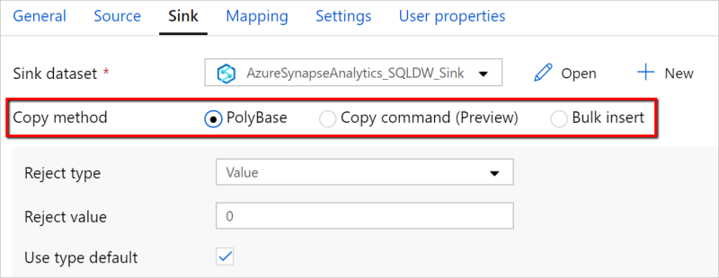

# Copy and transform data in Azure Synapse Analytics (formerly Azure SQL Data Warehouse) by using Azure Data Factory

> [!div class="op_single_selector" title1="Select the version of Data Factory service you're using:"]
>
> - [Version1](v1/data-factory-azure-sql-data-warehouse-connector.md)
> - [Current version](connector-azure-sql-data-warehouse.md)

[!INCLUDE[appliesto-adf-asa-md](includes/appliesto-adf-asa-md.md)]

This article outlines how to use Copy Activity in Azure Data Factory to copy data from and to Azure Synapse Analytics, and use Data Flow to transform data in Azure Data Lake Storage Gen2. To learn about Azure Data Factory, read the [introductory article](introduction.md).

## Supported capabilities

This Azure Synapse Analytics connector is supported for the following activities:

- [Copy activity](copy-activity-overview.md) with [supported source/sink matrix](copy-activity-overview.md) table
- [Mapping data flow](concepts-data-flow-overview.md)
- [Lookup activity](control-flow-lookup-activity.md)
- [GetMetadata activity](control-flow-get-metadata-activity.md)

For Copy activity, this Azure Synapse Analytics connector supports these functions:

- Copy data by using SQL authentication and Azure Active Directory (Azure AD) Application token authentication with a service principal or managed identities for Azure resources.
- As a source, retrieve data by using a SQL query or stored procedure.
- As a sink, load data by using [PolyBase](#use-polybase-to-load-data-into-azure-sql-data-warehouse) or [COPY statement](#use-copy-statement) (preview) or bulk insert. We recommend PolyBase or COPY statement (preview) for better copy performance. The connector also support automatically creating destination table if not exists based on the source schema.

> [!IMPORTANT]
> If you copy data by using Azure Data Factory Integration Runtime, configure a [server-level firewall rule](../azure-sql/database/firewall-configure.md) so that Azure services can access the [logical SQL server](../azure-sql/database/logical-servers.md).
> If you copy data by using a self-hosted integration runtime, configure the firewall to allow the appropriate IP range. This range includes the machine's IP that is used to connect to Azure Synapse Analytics.

## Get started

> [!TIP]
> To achieve best performance, use PolyBase to load data into Azure Synapse Analytics. The [Use PolyBase to load data into Azure Synapse Analytics](#use-polybase-to-load-data-into-azure-sql-data-warehouse) section has details. For a walkthrough with a use case, see [Load 1 TB into Azure Synapse Analytics under 15 minutes with Azure Data Factory](load-azure-sql-data-warehouse.md).

[!INCLUDE [data-factory-v2-connector-get-started](../../includes/data-factory-v2-connector-get-started.md)]

The following sections provide details about properties that define Data Factory entities specific to an Azure Synapse Analytics connector.

## Linked service properties

The following properties are supported for an Azure Synapse Analytics linked service:

| Property            | Description                                                  | Required                                                     |
| :------------------ | :----------------------------------------------------------- | :----------------------------------------------------------- |
| type                | The type property must be set to **AzureSqlDW**.             | Yes                                                          |
| connectionString    | Specify the information needed to connect to the Azure Synapse Analytics instance for the **connectionString** property. <br/>Mark this field as a SecureString to store it securely in Data Factory. You can also put password/service principal key in Azure Key Vault，and if it's SQL authentication pull the `password` configuration out of the connection string. See the JSON example below the table and [Store credentials in Azure Key Vault](store-credentials-in-key-vault.md) article with more details. | Yes                                                          |
| servicePrincipalId  | Specify the application's client ID.                         | Yes, when you use Azure AD authentication with a service principal. |
| servicePrincipalKey | Specify the application's key. Mark this field as a SecureString to store it securely in Data Factory, or [reference a secret stored in Azure Key Vault](store-credentials-in-key-vault.md). | Yes, when you use Azure AD authentication with a service principal. |
| tenant              | Specify the tenant information (domain name or tenant ID) under which your application resides. You can retrieve it by hovering the mouse in the top-right corner of the Azure portal. | Yes, when you use Azure AD authentication with a service principal. |
| connectVia          | The [integration runtime](concepts-integration-runtime.md) to be used to connect to the data store. You can use Azure Integration Runtime or a self-hosted integration runtime (if your data store is located in a private network). If not specified, it uses the default Azure Integration Runtime. | No                                                           |

For different authentication types, refer to the following sections on prerequisites and JSON samples, respectively:

- [SQL authentication](#sql-authentication)
- Azure AD application token authentication: [Service principal](#service-principal-authentication)
- Azure AD application token authentication: [Managed identities for Azure resources](#managed-identity)

>[!TIP]
>If you hit error with error code as "UserErrorFailedToConnectToSqlServer" and message like "The session limit for the database is XXX and has been reached.", add `Pooling=false` to your connection string and try again.

### SQL authentication

#### Linked service example that uses SQL authentication

```json
{
    "name": "AzureSqlDWLinkedService",
    "properties": {
        "type": "AzureSqlDW",
        "typeProperties": {
            "connectionString": "Server=tcp:<servername>.database.windows.net,1433;Database=<databasename>;User ID=<username>@<servername>;Password=<password>;Trusted_Connection=False;Encrypt=True;Connection Timeout=30"
        },
        "connectVia": {
            "referenceName": "<name of Integration Runtime>",
            "type": "IntegrationRuntimeReference"
        }
    }
}
```

**Password in Azure Key Vault:**

```json
{
    "name": "AzureSqlDWLinkedService",
    "properties": {
        "type": "AzureSqlDW",
        "typeProperties": {
            "connectionString": "Server=tcp:<servername>.database.windows.net,1433;Database=<databasename>;User ID=<username>@<servername>;Trusted_Connection=False;Encrypt=True;Connection Timeout=30",
            "password": {
                "type": "AzureKeyVaultSecret",
                "store": {
                    "referenceName": "<Azure Key Vault linked service name>",
                    "type": "LinkedServiceReference"
                },
                "secretName": "<secretName>"
            }
        },
        "connectVia": {
            "referenceName": "<name of Integration Runtime>",
            "type": "IntegrationRuntimeReference"
        }
    }
}
```

### Service principal authentication

To use service principal-based Azure AD application token authentication, follow these steps:

1. **[Create an Azure Active Directory application](../active-directory/develop/howto-create-service-principal-portal.md#create-an-azure-active-directory-application)** from the Azure portal. Make note of the application name and the following values that define the linked service:

   - Application ID
   - Application key
   - Tenant ID

2. **[Provision an Azure Active Directory administrator](../azure-sql/database/authentication-aad-configure.md#provision-azure-ad-admin-sql-database)** for your server in the Azure portal if you haven't already done so. The Azure AD administrator can be an Azure AD user or Azure AD group. If you grant the group with managed identity an admin role, skip steps 3 and 4. The administrator will have full access to the database.

3. **[Create contained database users](../azure-sql/database/authentication-aad-configure.md#create-contained-users-mapped-to-azure-ad-identities)** for the service principal. Connect to the data warehouse from or to which you want to copy data by using tools like SSMS, with an Azure AD identity that has at least ALTER ANY USER permission. Run the following T-SQL:
  
    ```sql
    CREATE USER [your application name] FROM EXTERNAL PROVIDER;
    ```

4. **Grant the service principal needed permissions** as you normally do for SQL users or others. Run the following code, or refer to more options [here](https://docs.microsoft.com/sql/relational-databases/system-stored-procedures/sp-addrolemember-transact-sql?view=sql-server-2017). If you want to use PolyBase to load the data, learn the [required database permission](#required-database-permission).

    ```sql
    EXEC sp_addrolemember db_owner, [your application name];
    ```

5. **Configure an Azure Synapse Analytics linked service** in Azure Data Factory.

#### Linked service example that uses service principal authentication

```json
{
    "name": "AzureSqlDWLinkedService",
    "properties": {
        "type": "AzureSqlDW",
        "typeProperties": {
            "connectionString": "Server=tcp:<servername>.database.windows.net,1433;Database=<databasename>;Connection Timeout=30",
            "servicePrincipalId": "<service principal id>",
            "servicePrincipalKey": {
                "type": "SecureString",
                "value": "<service principal key>"
            },
            "tenant": "<tenant info, e.g. microsoft.onmicrosoft.com>"
        },
        "connectVia": {
            "referenceName": "<name of Integration Runtime>",
            "type": "IntegrationRuntimeReference"
        }
    }
}
```

### <a name="managed-identity"></a> Managed identities for Azure resources authentication

A data factory can be associated with a [managed identity for Azure resources](data-factory-service-identity.md) that represents the specific factory. You can use this managed identity for Azure Synapse Analytics authentication. The designated factory can access and copy data from or to your data warehouse by using this identity.

To use managed identity authentication, follow these steps:

1. **[Provision an Azure Active Directory administrator](../azure-sql/database/authentication-aad-configure.md#provision-azure-ad-admin-sql-database)** for your server on the Azure portal if you haven't already done so. The Azure AD administrator can be an Azure AD user or Azure AD group. If you grant the group with managed identity an admin role, skip steps 3 and 4. The administrator will have full access to the database.

2. **[Create contained database users](../azure-sql/database/authentication-aad-configure.md#create-contained-users-mapped-to-azure-ad-identities)** for the Data Factory Managed Identity. Connect to the data warehouse from or to which you want to copy data by using tools like SSMS, with an Azure AD identity that has at least ALTER ANY USER permission. Run the following T-SQL.
  
    ```sql
    CREATE USER [your Data Factory name] FROM EXTERNAL PROVIDER;
    ```

3. **Grant the Data Factory Managed Identity needed permissions** as you normally do for SQL users and others. Run the following code, or refer to more options [here](https://docs.microsoft.com/sql/relational-databases/system-stored-procedures/sp-addrolemember-transact-sql?view=sql-server-2017). If you want to use PolyBase to load the data, learn the [required database permission](#required-database-permission).

    ```sql
    EXEC sp_addrolemember db_owner, [your Data Factory name];
    ```

4. **Configure an Azure Synapse Analytics linked service** in Azure Data Factory.

**Example:**

```json
{
    "name": "AzureSqlDWLinkedService",
    "properties": {
        "type": "AzureSqlDW",
        "typeProperties": {
            "connectionString": "Server=tcp:<servername>.database.windows.net,1433;Database=<databasename>;Connection Timeout=30"
        },
        "connectVia": {
            "referenceName": "<name of Integration Runtime>",
            "type": "IntegrationRuntimeReference"
        }
    }
}
```

## Dataset properties

For a full list of sections and properties available for defining datasets, see the [Datasets](concepts-datasets-linked-services.md) article.

The following properties are supported for Azure Synapse Analytics dataset:

| Property  | Description                                                  | Required                    |
| :-------- | :----------------------------------------------------------- | :-------------------------- |
| type      | The **type** property of the dataset must be set to **AzureSqlDWTable**. | Yes                         |
| schema | Name of the schema. |No for source, Yes for sink  |
| table | Name of the table/view. |No for source, Yes for sink  |
| tableName | Name of the table/view with schema. This property is supported for backward compatibility. For new workload, use `schema` and `table`. | No for source, Yes for sink |

### Dataset properties example

```json
{
    "name": "AzureSQLDWDataset",
    "properties":
    {
        "type": "AzureSqlDWTable",
        "linkedServiceName": {
            "referenceName": "<Azure Synapse Analytics linked service name>",
            "type": "LinkedServiceReference"
        },
        "schema": [ < physical schema, optional, retrievable during authoring > ],
        "typeProperties": {
            "schema": "<schema_name>",
            "table": "<table_name>"
        }
    }
}
```

## Copy Activity properties

For a full list of sections and properties available for defining activities, see the [Pipelines](concepts-pipelines-activities.md) article. This section provides a list of properties supported by the Azure Synapse Analytics source and sink.

### Azure Synapse Analytics as the source

To copy data from Azure Synapse Analytics, set the **type** property in the Copy Activity source to **SqlDWSource**. The following properties are supported in the Copy Activity **source** section:

| Property                     | Description                                                  | Required |
| :--------------------------- | :----------------------------------------------------------- | :------- |
| type                         | The **type** property of the Copy Activity source must be set to **SqlDWSource**. | Yes      |
| sqlReaderQuery               | Use the custom SQL query to read data. Example: `select * from MyTable`. | No       |
| sqlReaderStoredProcedureName | The name of the stored procedure that reads data from the source table. The last SQL statement must be a SELECT statement in the stored procedure. | No       |
| storedProcedureParameters    | Parameters for the stored procedure.<br/>Allowed values are name or value pairs. Names and casing of parameters must match the names and casing of the stored procedure parameters. | No       |
| isolationLevel | Specifies the transaction locking behavior for the SQL source. The allowed values are: **ReadCommitted** (default), **ReadUncommitted**, **RepeatableRead**, **Serializable**, **Snapshot**. Refer to [this doc](https://docs.microsoft.com/dotnet/api/system.data.isolationlevel) for more details. | No |

**Example: using SQL query**

```json
"activities":[
    {
        "name": "CopyFromAzureSQLDW",
        "type": "Copy",
        "inputs": [
            {
                "referenceName": "<Azure SQL DW input dataset name>",
                "type": "DatasetReference"
            }
        ],
        "outputs": [
            {
                "referenceName": "<output dataset name>",
                "type": "DatasetReference"
            }
        ],
        "typeProperties": {
            "source": {
                "type": "SqlDWSource",
                "sqlReaderQuery": "SELECT * FROM MyTable"
            },
            "sink": {
                "type": "<sink type>"
            }
        }
    }
]
```

**Example: using stored procedure**

```json
"activities":[
    {
        "name": "CopyFromAzureSQLDW",
        "type": "Copy",
        "inputs": [
            {
                "referenceName": "<Azure SQL DW input dataset name>",
                "type": "DatasetReference"
            }
        ],
        "outputs": [
            {
                "referenceName": "<output dataset name>",
                "type": "DatasetReference"
            }
        ],
        "typeProperties": {
            "source": {
                "type": "SqlDWSource",
                "sqlReaderStoredProcedureName": "CopyTestSrcStoredProcedureWithParameters",
                "storedProcedureParameters": {
                    "stringData": { "value": "str3" },
                    "identifier": { "value": "$$Text.Format('{0:yyyy}', <datetime parameter>)", "type": "Int"}
                }
            },
            "sink": {
                "type": "<sink type>"
            }
        }
    }
]
```

**Sample stored procedure:**

```sql
CREATE PROCEDURE CopyTestSrcStoredProcedureWithParameters
(
    @stringData varchar(20),
    @identifier int
)
AS
SET NOCOUNT ON;
BEGIN
    select *
    from dbo.UnitTestSrcTable
    where dbo.UnitTestSrcTable.stringData != stringData
    and dbo.UnitTestSrcTable.identifier != identifier
END
GO
```

### <a name="azure-sql-data-warehouse-as-sink"></a> Azure Synapse Analytics as sink

Azure Data Factory supports three ways to load data into SQL Data Warehouse.



- [Use PolyBase](#use-polybase-to-load-data-into-azure-sql-data-warehouse)
- [Use COPY statement (preview)](#use-copy-statement)
- Use bulk insert

The fastest and most scalable way to load data is through [PolyBase](https://docs.microsoft.com/sql/relational-databases/polybase/polybase-guide) or the [COPY statement](https://docs.microsoft.com/sql/t-sql/statements/copy-into-transact-sql?view=azure-sqldw-latest) (preview).

To copy data to Azure SQL Data Warehouse, set the sink type in Copy Activity to **SqlDWSink**. The following properties are supported in the Copy Activity **sink** section:

| Property          | Description                                                  | Required                                      |
| :---------------- | :----------------------------------------------------------- | :-------------------------------------------- |
| type              | The **type** property of the Copy Activity sink must be set to **SqlDWSink**. | Yes                                           |
| allowPolyBase     | Indicates whether to use PolyBase to load data into SQL Data Warehouse. `allowCopyCommand` and `allowPolyBase` cannot be both true. <br/><br/>See [Use PolyBase to load data into Azure SQL Data Warehouse](#use-polybase-to-load-data-into-azure-sql-data-warehouse) section for constraints and details.<br/><br/>Allowed values are **True** and **False** (default). | No.<br/>Apply when using PolyBase.     |
| polyBaseSettings  | A group of properties that can be specified when the `allowPolybase` property is set to **true**. | No.<br/>Apply  when using PolyBase. |
| allowCopyCommand | Indicates whether to use [COPY statement](https://docs.microsoft.com/sql/t-sql/statements/copy-into-transact-sql?view=azure-sqldw-latest) (preview) to load data into SQL Data Warehouse. `allowCopyCommand` and `allowPolyBase` cannot be both true. <br/><br/>See [Use COPY statement to load data into Azure SQL Data Warehouse](#use-copy-statement) section for constraints and details.<br/><br/>Allowed values are **True** and **False** (default). | No.<br>Apply  when using COPY. |
| copyCommandSettings | A group of properties that can be specified when `allowCopyCommand` property is set to TRUE. | No.<br/>Apply  when using COPY. |
| writeBatchSize    | Number of rows to inserts into the SQL table **per batch**.<br/><br/>The allowed value is **integer** (number of rows). By default, Data Factory dynamically determines the appropriate batch size based on the row size. | No.<br/>Apply  when using bulk insert.     |
| writeBatchTimeout | Wait time for the batch insert operation to finish before it times out.<br/><br/>The allowed value is **timespan**. Example: "00:30:00" (30 minutes). | No.<br/>Apply  when using bulk insert.        |
| preCopyScript     | Specify a SQL query for Copy Activity to run before writing data into Azure SQL Data Warehouse in each run. Use this property to clean up the preloaded data. | No                                            |
| tableOption | Specifies whether to automatically create the sink table if not exists based on the source schema. Auto table creation is not supported when staged copy is configured in copy activity. Allowed values are: `none` (default), `autoCreate`. |No |
| disableMetricsCollection | Data Factory collects metrics such as SQL Data Warehouse DWUs for copy performance optimization and recommendations. If you are concerned with this behavior, specify `true` to turn it off. | No (default is `false`) |

#### SQL Data Warehouse sink example

```json
"sink": {
    "type": "SqlDWSink",
    "allowPolyBase": true,
    "polyBaseSettings":
    {
        "rejectType": "percentage",
        "rejectValue": 10.0,
        "rejectSampleValue": 100,
        "useTypeDefault": true
    }
}
```

## Use PolyBase to load data into Azure SQL Data Warehouse

Using [PolyBase](https://docs.microsoft.com/sql/relational-databases/polybase/polybase-guide) is an efficient way to load a large amount of data into Azure Synapse Analytics with high throughput. You'll see a large gain in the throughput by using PolyBase instead of the default BULKINSERT mechanism. For a walkthrough with a use case, see [Load 1 TB into Azure Synapse Analytics](v1/data-factory-load-sql-data-warehouse.md).

- If your source data is in **Azure Blob, Azure Data Lake Storage Gen1 or Azure Data Lake Storage Gen2**, and the **format is PolyBase compatible**, you can use copy activity to directly invoke PolyBase to let Azure SQL Data Warehouse pull the data from source. For details, see **[Direct copy by using PolyBase](#direct-copy-by-using-polybase)**.
- If your source data store and format isn't originally supported by PolyBase, use the **[Staged copy by using PolyBase](#staged-copy-by-using-polybase)** feature instead. The staged copy feature also provides you better throughput. It automatically converts the data into PolyBase-compatible format, stores the data in Azure Blob storage., then calls PolyBase to load data into SQL Data Warehouse.

> [!TIP]
> Learn more on [Best practices for using PolyBase](#best-practices-for-using-polybase).

The following PolyBase settings are supported under `polyBaseSettings` in copy activity:

| Property          | Description                                                  | Required                                      |
| :---------------- | :----------------------------------------------------------- | :-------------------------------------------- |
| rejectValue       | Specifies the number or percentage of rows that can be rejected before the query fails.<br/><br/>Learn more about PolyBase's reject options in the Arguments section of [CREATE EXTERNAL TABLE (Transact-SQL)](https://msdn.microsoft.com/library/dn935021.aspx). <br/><br/>Allowed values are 0 (default), 1, 2, etc. | No                                            |
| rejectType        | Specifies whether the **rejectValue** option is a literal value or a percentage.<br/><br/>Allowed values are **Value** (default) and **Percentage**. | No                                            |
| rejectSampleValue | Determines the number of rows to retrieve before PolyBase recalculates the percentage of rejected rows.<br/><br/>Allowed values are 1, 2, etc. | Yes, if the **rejectType** is **percentage**. |
| useTypeDefault    | Specifies how to handle missing values in delimited text files when PolyBase retrieves data from the text file.<br/><br/>Learn more about this property from the Arguments section in [CREATE EXTERNAL FILE FORMAT (Transact-SQL)](https://msdn.microsoft.com/library/dn935026.aspx).<br/><br/>Allowed values are **True** and **False** (default).<br><br> | No                                            |

### Direct copy by using PolyBase

SQL Data Warehouse PolyBase directly supports Azure Blob, Azure Data Lake Storage Gen1 and Azure Data Lake Storage Gen2. If your source data meets the criteria described in this section, use PolyBase to copy directly from the source data store to Azure Synapse Analytics. Otherwise, use [Staged copy by using PolyBase](#staged-copy-by-using-polybase).

> [!TIP]
> To copy data efficiently to SQL Data Warehouse, learn more from [Azure Data Factory makes it even easier and convenient to uncover insights from data when using Data Lake Store with SQL Data Warehouse](https://blogs.msdn.microsoft.com/azuredatalake/2017/04/08/azure-data-factory-makes-it-even-easier-and-convenient-to-uncover-insights-from-data-when-using-data-lake-store-with-sql-data-warehouse/).

If the requirements aren't met, Azure Data Factory checks the settings and automatically falls back to the BULKINSERT mechanism for the data movement.

1. The **source linked service** is with the following types and authentication methods:

    | Supported source data store type                             | Supported source authentication type                        |
    | :----------------------------------------------------------- | :---------------------------------------------------------- |
    | [Azure Blob](connector-azure-blob-storage.md)                | Account key authentication, managed identity authentication |
    | [Azure Data Lake Storage Gen1](connector-azure-data-lake-store.md) | Service principal authentication                            |
    | [Azure Data Lake Storage Gen2](connector-azure-data-lake-storage.md) | Account key authentication, managed identity authentication |

    >[!IMPORTANT]
    >If your Azure Storage is configured with VNet service endpoint, you must use managed identity authentication - refer to [Impact of using VNet Service Endpoints with Azure storage](../azure-sql/database/vnet-service-endpoint-rule-overview.md#impact-of-using-vnet-service-endpoints-with-azure-storage). Learn the required configurations in Data Factory from [Azure Blob - managed identity authentication](connector-azure-blob-storage.md#managed-identity) and [Azure Data Lake Storage Gen2 - managed identity authentication](connector-azure-data-lake-storage.md#managed-identity) section respectively.

2. The **source data format** is of **Parquet**, **ORC**, or **Delimited text**, with the following configurations:

   1. Folder path doesn't contain wildcard filter.
   2. File name is empty, or points to a single file. If you specify wildcard file name in copy activity, it can only be `*` or `*.*`.
   3. `rowDelimiter` is **default**, **\n**, **\r\n**, or **\r**.
   4. `nullValue` is left as default or set to **empty string** (""), and `treatEmptyAsNull` is left as default or set to true.
   5. `encodingName` is left as default or set to **utf-8**.
   6. `quoteChar`, `escapeChar`, and `skipLineCount` aren't specified. PolyBase support skip header row, which can be configured as `firstRowAsHeader` in ADF.
   7. `compression` can be **no compression**, **GZip**, or **Deflate**.

3. If your source is a folder, `recursive` in copy activity must be set to true.

4. `wildcardFolderPath` , `wildcardFilename`, `modifiedDateTimeStart`, `modifiedDateTimeEnd` and `additionalColumns` are not specified.

>[!NOTE]
>If your source is a folder, note PolyBase retrieves files from the folder and all of its subfolders, and it doesn't retrieve data from files for which the file name begins with an underline (_) or a period (.), as documented [here - LOCATION argument](https://docs.microsoft.com/sql/t-sql/statements/create-external-table-transact-sql?view=azure-sqldw-latest#arguments-2).

```json
"activities":[
    {
        "name": "CopyFromAzureBlobToSQLDataWarehouseViaPolyBase",
        "type": "Copy",
        "inputs": [
            {
                "referenceName": "ParquetDataset",
                "type": "DatasetReference"
            }
        ],
        "outputs": [
            {
                "referenceName": "AzureSQLDWDataset",
                "type": "DatasetReference"
            }
        ],
        "typeProperties": {
            "source": {
                "type": "ParquetSource",
                "storeSettings":{
                    "type": "AzureBlobStorageReadSettings",
                    "recursive": true
                }
            },
            "sink": {
                "type": "SqlDWSink",
                "allowPolyBase": true
            }
        }
    }
]
```

### Staged copy by using PolyBase

When your source data is not natively compatible with PolyBase, enable data copying via an interim staging Azure Blob storage instance (it can't be Azure Premium Storage). In this case, Azure Data Factory automatically converts the data to meet the data format requirements of PolyBase. Then it invokes PolyBase to load data into SQL Data Warehouse. Finally, it cleans up your temporary data from the blob storage. See [Staged copy](copy-activity-performance-features.md#staged-copy) for details about copying data via a staging Azure Blob storage instance.

To use this feature, create an [Azure Blob Storage linked service](connector-azure-blob-storage.md#linked-service-properties) that refers to the Azure storage account with the interim blob storage. Then specify the `enableStaging` and `stagingSettings` properties for the Copy Activity as shown in the following code.

>[!IMPORTANT]
>If your staging Azure Storage is configured with VNet service endpoint, you must use managed identity authentication - refer to [Impact of using VNet Service Endpoints with Azure storage](../azure-sql/database/vnet-service-endpoint-rule-overview.md#impact-of-using-vnet-service-endpoints-with-azure-storage). Learn the required configurations in Data Factory from [Azure Blob - managed identity authentication](connector-azure-blob-storage.md#managed-identity).

```json
"activities":[
    {
        "name": "CopyFromSQLServerToSQLDataWarehouseViaPolyBase",
        "type": "Copy",
        "inputs": [
            {
                "referenceName": "SQLServerDataset",
                "type": "DatasetReference"
            }
        ],
        "outputs": [
            {
                "referenceName": "AzureSQLDWDataset",
                "type": "DatasetReference"
            }
        ],
        "typeProperties": {
            "source": {
                "type": "SqlSource",
            },
            "sink": {
                "type": "SqlDWSink",
                "allowPolyBase": true
            },
            "enableStaging": true,
            "stagingSettings": {
                "linkedServiceName": {
                    "referenceName": "MyStagingBlob",
                    "type": "LinkedServiceReference"
                }
            }
        }
    }
]
```

### Best practices for using PolyBase

The following sections provide best practices in addition to those mentioned in [Best practices for Azure Synapse Analytics](../synapse-analytics/sql/best-practices-sql-pool.md).

#### Required database permission

To use PolyBase, the user that loads data into SQL Data Warehouse must have ["CONTROL" permission](https://msdn.microsoft.com/library/ms191291.aspx) on the target database. One way to achieve that is to add the user as a member of the **db_owner** role. Learn how to do that in the [SQL Data Warehouse overview](../synapse-analytics/sql-data-warehouse/sql-data-warehouse-overview-manage-security.md#authorization).

#### Row size and data type limits

PolyBase loads are limited to rows smaller than 1 MB. It cannot be used to load to VARCHR(MAX), NVARCHAR(MAX), or VARBINARY(MAX). For more information, see [SQL Data Warehouse service capacity limits](../synapse-analytics/sql-data-warehouse/sql-data-warehouse-service-capacity-limits.md#loads).

When your source data has rows greater than 1 MB, you might want to vertically split the source tables into several small ones. Make sure that the largest size of each row doesn't exceed the limit. The smaller tables can then be loaded by using PolyBase and merged together in Azure Synapse Analytics.

Alternatively, for data with such wide columns, you can use non-PolyBase to load the data using ADF, by turning off "allow PolyBase" setting.

#### SQL Data Warehouse resource class

To achieve the best possible throughput, assign a larger resource class to the user that loads data into SQL Data Warehouse via PolyBase.

#### PolyBase troubleshooting

**Loading to Decimal column**

If your source data is in text format or other non-PolyBase compatible stores (using staged copy and PolyBase), and it contains empty value to be loaded into SQL Data Warehouse Decimal column, you may hit the following error:

```
ErrorCode=FailedDbOperation, ......HadoopSqlException: Error converting data type VARCHAR to DECIMAL.....Detailed Message=Empty string can't be converted to DECIMAL.....
```

The solution is to unselect "**Use type default**" option (as false) in copy activity sink -> PolyBase settings. "[USE_TYPE_DEFAULT](https://docs.microsoft.com/sql/t-sql/statements/create-external-file-format-transact-sql?view=azure-sqldw-latest#arguments
)" is a PolyBase native configuration, which specifies how to handle missing values in delimited text files when PolyBase retrieves data from the text file.

**`tableName` in Azure Synapse Analytics**

The following table gives examples of how to specify the **tableName** property in the JSON dataset. It shows several combinations of schema and table names.

| DB Schema | Table name | **tableName** JSON property               |
| --------- | ---------- | ----------------------------------------- |
| dbo       | MyTable    | MyTable or dbo.MyTable or [dbo].[MyTable] |
| dbo1      | MyTable    | dbo1.MyTable or [dbo1].[MyTable]          |
| dbo       | My.Table   | [My.Table] or [dbo].[My.Table]            |
| dbo1      | My.Table   | [dbo1].[My.Table]                         |

If you see the following error, the problem might be the value you specified for the **tableName** property. See the preceding table for the correct way to specify values for the **tableName** JSON property.

```
Type=System.Data.SqlClient.SqlException,Message=Invalid object name 'stg.Account_test'.,Source=.Net SqlClient Data Provider
```

**Columns with default values**

Currently, the PolyBase feature in Data Factory accepts only the same number of columns as in the target table. An example is a table with four columns where one of them is defined with a default value. The input data still needs to have four columns. A three-column input dataset yields an error similar to the following message:

```
All columns of the table must be specified in the INSERT BULK statement.
```

The NULL value is a special form of the default value. If the column is nullable, the input data in the blob for that column might be empty. But it can't be missing from the input dataset. PolyBase inserts NULL for missing values in Azure Synapse Analytics.

## <a name="use-copy-statement"></a> Use COPY statement to load data into Azure SQL Data Warehouse (preview)

SQL Data Warehouse [COPY statement](https://docs.microsoft.com/sql/t-sql/statements/copy-into-transact-sql?view=azure-sqldw-latest) (preview) directly supports loading data from **Azure Blob and Azure Data Lake Storage Gen2**. If your source data meets the criteria described in this section, you can choose to use COPY statement in ADF to load data into Azure SQL Data Warehouse. Azure Data Factory checks the settings and fails the copy activity run if the criteria is not met.

>[!NOTE]
>Currently Data Factory only support copy from COPY statement compatible sources mentioned below.

Using COPY statement supports the following configuration:

1. The **source linked service and format** are with the following types and authentication methods:

    | Supported source data store type                             | Supported format           | Supported source authentication type                         |
    | :----------------------------------------------------------- | -------------------------- | :----------------------------------------------------------- |
    | [Azure Blob](connector-azure-blob-storage.md)                | [Delimited text](format-delimited-text.md)             | Account key authentication, shared access signature authentication, service principal authentication, managed identity authentication |
    | &nbsp;                                                       | [Parquet](format-parquet.md)                    | Account key authentication, shared access signature authentication |
    | &nbsp;                                                       | [ORC](format-orc.md)                        | Account key authentication, shared access signature authentication |
    | [Azure Data Lake Storage Gen2](connector-azure-data-lake-storage.md) | [Delimited text](format-delimited-text.md)<br/>[Parquet](format-parquet.md)<br/>[ORC](format-orc.md) | Account key authentication, service principal authentication, managed identity authentication |

    >[!IMPORTANT]
    >If your Azure Storage is configured with VNet service endpoint, you must use managed identity authentication - refer to [Impact of using VNet Service Endpoints with Azure storage](../azure-sql/database/vnet-service-endpoint-rule-overview.md#impact-of-using-vnet-service-endpoints-with-azure-storage). Learn the required configurations in Data Factory from [Azure Blob - managed identity authentication](connector-azure-blob-storage.md#managed-identity) and [Azure Data Lake Storage Gen2 - managed identity authentication](connector-azure-data-lake-storage.md#managed-identity) section respectively.

2. Format settings are with the following:

   1. For **Parquet**: `compression` can be **no compression**, **Snappy**, or **GZip**.
   2. For **ORC**: `compression` can be **no compression**, **```zlib```**, or **Snappy**.
   3. For **Delimited text**:
      1. `rowDelimiter` is explicitly set as **single character** or "**\r\n**", the default value is not supported.
      2. `nullValue` is left as default or set to **empty string** ("").
      3. `encodingName` is left as default or set to **utf-8 or utf-16**.
      4. `escapeChar` must be same as `quoteChar`, and is not empty.
      5. `skipLineCount` is left as default or set to 0.
      6. `compression` can be **no compression** or **GZip**.

3. If your source is a folder, `recursive` in copy activity must be set to true, and `wildcardFilename` need to be `*`. 

4. `wildcardFolderPath` , `wildcardFilename` (other than `*`), `modifiedDateTimeStart`, `modifiedDateTimeEnd` and `additionalColumns` are not specified.

The following COPY statement settings are supported under `allowCopyCommand` in copy activity:

| Property          | Description                                                  | Required                                      |
| :---------------- | :----------------------------------------------------------- | :-------------------------------------------- |
| defaultValues | Specifies the default values for each target column in SQL DW.  The default values in the property overwrite the DEFAULT constraint set in the data warehouse, and identity column cannot have a default value. | No |
| additionalOptions | Additional options that will be passed to SQL DW COPY statement directly in "With" clause in [COPY statement](https://docs.microsoft.com/sql/t-sql/statements/copy-into-transact-sql?view=azure-sqldw-latest). Quote the value as needed to align with the COPY statement requirements. | No |

```json
"activities":[
    {
        "name": "CopyFromAzureBlobToSQLDataWarehouseViaCOPY",
        "type": "Copy",
        "inputs": [
            {
                "referenceName": "ParquetDataset",
                "type": "DatasetReference"
            }
        ],
        "outputs": [
            {
                "referenceName": "AzureSQLDWDataset",
                "type": "DatasetReference"
            }
        ],
        "typeProperties": {
            "source": {
                "type": "ParquetSource",
                "storeSettings":{
                    "type": "AzureBlobStorageReadSettings",
                    "recursive": true
                }
            },
            "sink": {
                "type": "SqlDWSink",
                "allowCopyCommand": true,
                "copyCommandSettings": {
                    "defaultValues": [
                        {
                            "columnName": "col_string",
                            "defaultValue": "DefaultStringValue"
                        }
                    ],
                    "additionalOptions": {
                        "MAXERRORS": "10000",
                        "DATEFORMAT": "'ymd'"
                    }
                }
            },
            "enableSkipIncompatibleRow": true
        }
    }
]
```

## Mapping data flow properties

When transforming data in mapping data flow, you can read and write to tables from Azure Synapse Analytics. For more information, see the [source transformation](data-flow-source.md) and [sink transformation](data-flow-sink.md) in mapping data flows.

### Source transformation

Settings specific to Azure Synapse Analytics are available in the **Source Options** tab of the source transformation.

**Input:** Select whether you point your source at a table (equivalent of ```Select * from <table-name>```) or enter a custom SQL query.

**Query**: If you select Query in the input field, enter a SQL query for your source. This setting overrides any table that you've chosen in the dataset. **Order By** clauses aren't supported here, but you can set a full SELECT FROM statement. You can also use user-defined table functions. **select * from udfGetData()** is a UDF in SQL that returns a table. This query will produce a source table that you can use in your data flow. Using queries is also a great way to reduce rows for testing or for lookups.

SQL Example: ```Select * from MyTable where customerId > 1000 and customerId < 2000```

**Batch size**: Enter a batch size to chunk large data into reads. In data flows, ADF will use this setting to set Spark columnar caching. This is an option field which will use Spark defaults if it is left blank.

**Isolation Level**: The default for SQL sources in mapping data flow is read uncommitted. You can change the isolation level here to one of these values:

- Read Committed
- Read Uncommitted
- Repeatable Read
- Serializable
*- None (ignore isolation level)


### Sink transformation

Settings specific to Azure Synapse Analytics are available in the **Settings** tab of the sink transformation.

**Update method:** Determines what operations are allowed on your database destination. The default is to only allow inserts. To update, upsert, or delete rows, an alter-row transformation is required to tag rows for those actions. For updates, upserts and deletes, a key column or columns must be set to determine which row to alter.

**Table action:** Determines whether to recreate or remove all rows from the destination table prior to writing.

- None: No action will be done to the table.
- Recreate: The table will get dropped and recreated. Required if creating a new table dynamically.
- Truncate: All rows from the target table will get removed.

**Enable staging:** Determines whether or not to use [PolyBase](https://docs.microsoft.com/sql/relational-databases/polybase/polybase-guide?view=sql-server-ver15) when writing to Azure Synapse Analytics

**Batch size**: Controls how many rows are being written in each bucket. Larger batch sizes improve compression and memory optimization, but risk out of memory exceptions when caching data.

**Pre and Post SQL scripts**: Enter multi-line SQL scripts that will execute before (pre-processing) and after (post-processing) data is written to your Sink database


## Lookup activity properties

To learn details about the properties, check [Lookup activity](control-flow-lookup-activity.md).

## GetMetadata activity properties

To learn details about the properties, check [GetMetadata activity](control-flow-get-metadata-activity.md)

## Data type mapping for Azure Synapse Analytics

When you copy data from or to Azure Synapse Analytics, the following mappings are used from Azure Synapse Analytics data types to Azure Data Factory interim data types. See [schema and data type mappings](copy-activity-schema-and-type-mapping.md) to learn how Copy Activity maps the source schema and data type to the sink.

>[!TIP]
>Refer to [Table data types in Azure Synapse Analytics](../synapse-analytics/sql/develop-tables-data-types.md) article on SQL DW supported data types and the workarounds for unsupported ones.

| Azure Synapse Analytics data type    | Data Factory interim data type |
| :------------------------------------ | :----------------------------- |
| bigint                                | Int64                          |
| binary                                | Byte[]                         |
| bit                                   | Boolean                        |
| char                                  | String, Char[]                 |
| date                                  | DateTime                       |
| Datetime                              | DateTime                       |
| datetime2                             | DateTime                       |
| Datetimeoffset                        | DateTimeOffset                 |
| Decimal                               | Decimal                        |
| FILESTREAM attribute (varbinary(max)) | Byte[]                         |
| Float                                 | Double                         |
| image                                 | Byte[]                         |
| int                                   | Int32                          |
| money                                 | Decimal                        |
| nchar                                 | String, Char[]                 |
| numeric                               | Decimal                        |
| nvarchar                              | String, Char[]                 |
| real                                  | Single                         |
| rowversion                            | Byte[]                         |
| smalldatetime                         | DateTime                       |
| smallint                              | Int16                          |
| smallmoney                            | Decimal                        |
| time                                  | TimeSpan                       |
| tinyint                               | Byte                           |
| uniqueidentifier                      | Guid                           |
| varbinary                             | Byte[]                         |
| varchar                               | String, Char[]                 |

## Next steps

For a list of data stores supported as sources and sinks by Copy Activity in Azure Data Factory, see [supported data stores and formats](copy-activity-overview.md#supported-data-stores-and-formats).
