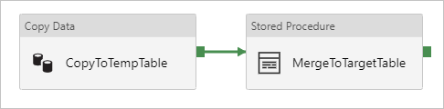

# Copy data to and from Azure SQL Database Managed Instance by using Azure Data Factory

This article outlines how to use the copy activity in Azure Data Factory to copy data to and from Azure SQL Database Managed Instance. It builds on the [Copy activity overview](copy-activity-overview.md) article that presents a general overview of the copy activity.

## Supported capabilities

You can copy data from Azure SQL Database Managed Instance to any supported sink data store. You also can copy data from any supported source data store to the managed instance. For a list of data stores that are supported as sources and sinks by the copy activity, see the [Supported data stores](copy-activity-overview.md#supported-data-stores-and-formats) table.

Specifically, this Azure SQL Database Managed Instance connector supports:

- Copying data by using SQL authentication.
- As a source, retrieving data by using a SQL query or a stored procedure.
- As a sink, appending data to a destination table or invoking a stored procedure with custom logic during copy.

>[!NOTE]
>Azure SQL Database Managed Instance [Always Encrypted](https://docs.microsoft.com/sql/relational-databases/security/encryption/always-encrypted-database-engine?view=azuresqldb-mi-current) isn't supported by this connector now. To work around, you can use a [generic ODBC connector](connector-odbc.md) and a SQL Server ODBC driver via a self-hosted integration runtime. Follow [this guidance](https://docs.microsoft.com/sql/connect/odbc/using-always-encrypted-with-the-odbc-driver?view=azuresqldb-mi-current) with ODBC driver download and connection string configurations.

>[!NOTE]
>Service principal and managed identity authentications currently aren't supported by this connector. To work around, choose an Azure SQL Database connector and manually specify the server of your managed instance.

## Prerequisites

To access the Azure SQL Database Managed Instance [public endpoint](../sql-database/sql-database-managed-instance-public-endpoint-securely.md), you can use an Azure Data Factory managed Azure integration runtime. Make sure that you enable the public endpoint and also allow public endpoint traffic on the network security group so that Azure Data Factory can connect to your database. For more information, see [this guidance](../sql-database/sql-database-managed-instance-public-endpoint-configure.md).

To access the Azure SQL Database Managed Instance private endpoint, set up a [self-hosted integration runtime](create-self-hosted-integration-runtime.md) that can access the database. If you provision the self-hosted integration runtime in the same virtual network as your managed instance, make sure that your integration runtime machine is in a different subnet than your managed instance. If you provision your self-hosted integration runtime in a different virtual network than your managed instance, you can use either a virtual network peering or a virtual network to virtual network connection. For more information, see [Connect your application to Azure SQL Database Managed Instance](../sql-database/sql-database-managed-instance-connect-app.md).

## Get started

[!INCLUDE [data-factory-v2-connector-get-started](../../includes/data-factory-v2-connector-get-started.md)]

The following sections provide details about properties that are used to define Azure Data Factory entities specific to the Azure SQL Database Managed Instance connector.

## Linked service properties

The following properties are supported for the Azure SQL Database Managed Instance linked service:

| Property | Description | Required |
|:--- |:--- |:--- |
| type | The type property must be set to **SqlServer**. | Yes |
| connectionString |This property specifies the **connectionString** information that's needed to connect to the managed instance by using SQL authentication. For more information, see the following examples. <br/>Mark this field as **SecureString** to store it securely in Azure Data Factory. You also can put a password in Azure Key Vault. If it's SQL authentication, pull the `password` configuration out of the connection string. For more information, see the JSON example following the table and [Store credentials in Azure Key Vault](store-credentials-in-key-vault.md). |Yes |
| connectVia | This [integration runtime](concepts-integration-runtime.md) is used to connect to the data store. You can use a self-hosted integration runtime or an Azure integration runtime if your managed instance has a public endpoint and allows Azure Data Factory to access it. If not specified, the default Azure integration runtime is used. |Yes |

**Example 1: Use SQL authentication**

The default port is 1433. If you're using Azure SQL Database Managed Instance with a public endpoint, explicitly specify port 3342.

```json
{
    "name": "AzureSqlMILinkedService",
    "properties": {
        "type": "SqlServer",
        "typeProperties": {
            "connectionString": {
                "type": "SecureString",
                "value": "Data Source=<hostname,port>;Initial Catalog=<databasename>;Integrated Security=False;User ID=<username>;Password=<password>;"
            }
        },
        "connectVia": {
            "referenceName": "<name of Integration Runtime>",
            "type": "IntegrationRuntimeReference"
        }
    }
}
```

**Example 2: Use SQL authentication with a password in Azure Key Vault**

The default port is 1433. If you're using Azure SQL Database Managed Instance with a public endpoint, explicitly specify port 3342.

```json
{
    "name": "AzureSqlMILinkedService",
    "properties": {
        "type": "SqlServer",
        "typeProperties": {
            "connectionString": {
                "type": "SecureString",
                "value": "Data Source=<hostname,port>;Initial Catalog=<databasename>;Integrated Security=False;User ID=<username>;"
            },
            "password": { 
                "type": "AzureKeyVaultSecret", 
                "store": { 
                    "referenceName": "<Azure Key Vault linked service name>", 
                    "type": "LinkedServiceReference" 
                }, 
                "secretName": "<secretName>" 
            }
        },
        "connectVia": {
            "referenceName": "<name of Integration Runtime>",
            "type": "IntegrationRuntimeReference"
        }
    }
}
```

## Dataset properties

For a full list of sections and properties available for use to define datasets, see the datasets article. This section provides a list of properties supported by the Azure SQL Database Managed Instance dataset.

To copy data to and from Azure SQL Database Managed Instance, the following properties are supported:

| Property | Description | Required |
|:--- |:--- |:--- |
| type | The type property of the dataset must be set to **SqlServerTable**. | Yes |
| tableName |This property is the name of the table or view in the database instance that the linked service refers to. | No for source, Yes for sink |

**Example**

```json
{
    "name": "AzureSqlMIDataset",
    "properties":
    {
        "type": "SqlServerTable",
        "linkedServiceName": {
            "referenceName": "<Managed Instance linked service name>",
            "type": "LinkedServiceReference"
        },
        "schema": [ < physical schema, optional, retrievable during authoring > ],
        "typeProperties": {
            "tableName": "MyTable"
        }
    }
}
```

## Copy activity properties

For a full list of sections and properties available for use to define activities, see the [Pipelines](concepts-pipelines-activities.md) article. This section provides a list of properties supported by the Azure SQL Database Managed Instance source and sink.

### Azure SQL Database Managed Instance as a source

To copy data from Azure SQL Database Managed Instance, set the source type in the copy activity to **SqlSource**. The following properties are supported in the copy activity source section:

| Property | Description | Required |
|:--- |:--- |:--- |
| type | The type property of the copy activity source must be set to **SqlSource**. | Yes |
| sqlReaderQuery |This property uses the custom SQL query to read data. An example is `select * from MyTable`. |No |
| sqlReaderStoredProcedureName |This property is the name of the stored procedure that reads data from the source table. The last SQL statement must be a SELECT statement in the stored procedure. |No |
| storedProcedureParameters |These parameters are for the stored procedure.<br/>Allowed values are name or value pairs. The names and casing of the parameters must match the names and casing of the stored procedure parameters. |No |

**Note the following points:**

- If **sqlReaderQuery** is specified for **SqlSource**, the copy activity runs this query against the managed instance source to get the data. You also can specify a stored procedure by specifying **sqlReaderStoredProcedureName** and **storedProcedureParameters** if the stored procedure takes parameters.
- If you don't specify either the **sqlReaderQuery** or **sqlReaderStoredProcedureName** property, the columns defined in the "structure" section of the dataset JSON are used to construct a query. The query `select column1, column2 from mytable` runs against the managed instance. If the dataset definition doesn't have "structure," all columns are selected from the table.

**Example: Use a SQL query**

```json
"activities":[
    {
        "name": "CopyFromAzureSqlMI",
        "type": "Copy",
        "inputs": [
            {
                "referenceName": "<Managed Instance input dataset name>",
                "type": "DatasetReference"
            }
        ],
        "outputs": [
            {
                "referenceName": "<output dataset name>",
                "type": "DatasetReference"
            }
        ],
        "typeProperties": {
            "source": {
                "type": "SqlSource",
                "sqlReaderQuery": "SELECT * FROM MyTable"
            },
            "sink": {
                "type": "<sink type>"
            }
        }
    }
]
```

**Example: Use a stored procedure**

```json
"activities":[
    {
        "name": "CopyFromAzureSqlMI",
        "type": "Copy",
        "inputs": [
            {
                "referenceName": "<Managed Instance input dataset name>",
                "type": "DatasetReference"
            }
        ],
        "outputs": [
            {
                "referenceName": "<output dataset name>",
                "type": "DatasetReference"
            }
        ],
        "typeProperties": {
            "source": {
                "type": "SqlSource",
                "sqlReaderStoredProcedureName": "CopyTestSrcStoredProcedureWithParameters",
                "storedProcedureParameters": {
                    "stringData": { "value": "str3" },
                    "identifier": { "value": "$$Text.Format('{0:yyyy}', <datetime parameter>)", "type": "Int"}
                }
            },
            "sink": {
                "type": "<sink type>"
            }
        }
    }
]
```

**The stored procedure definition**

```sql
CREATE PROCEDURE CopyTestSrcStoredProcedureWithParameters
(
    @stringData varchar(20),
    @identifier int
)
AS
SET NOCOUNT ON;
BEGIN
    select *
    from dbo.UnitTestSrcTable
    where dbo.UnitTestSrcTable.stringData != stringData
    and dbo.UnitTestSrcTable.identifier != identifier
END
GO
```

### Azure SQL Database Managed Instance as a sink

> [!TIP]
> Learn more about the supported write behaviors, configurations, and best practices from [Best practice for loading data into Azure SQL Database Managed Instance](#best-practice-for-loading-data-into-azure-sql-database-managed-instance).

To copy data to Azure SQL Database Managed Instance, set the sink type in the copy activity to **SqlSink**. The following properties are supported in the copy activity sink section:

| Property | Description | Required |
|:--- |:--- |:--- |
| type | The type property of the copy activity sink must be set to **SqlSink**. | Yes |
| writeBatchSize |Number of rows to insert into the SQL table *per batch*.<br/>Allowed values are integers for the number of rows. By default, Azure Data Factory dynamically determines the appropriate batch size based on the row size.  |No |
| writeBatchTimeout |This property specifies the wait time for the batch insert operation to complete before it times out.<br/>Allowed values are for the timespan. An example is “00:30:00,” which is 30 minutes. |No |
| preCopyScript |This property specifies a SQL query for the copy activity to run before writing data into the managed instance. It's invoked only once per copy run. You can use this property to clean up preloaded data. |No |
| sqlWriterStoredProcedureName |This name is for the stored procedure that defines how to apply source data into the target table. <br/>This stored procedure is *invoked per batch*. To do an operation that runs only once and has nothing to do with source data, for example, delete or truncate, use the `preCopyScript` property. |No |
| storedProcedureParameters |These parameters are used for the stored procedure.<br/>Allowed values are name or value pairs. The names and casing of the parameters must match the names and casing of the stored procedure parameters. |No |
| sqlWriterTableType |This property specifies a table type name to be used in the stored procedure. The copy activity makes the data being moved available in a temp table with this table type. Stored procedure code can then merge the data that's being copied with existing data. |No |

**Example 1: Append data**

```json
"activities":[
    {
        "name": "CopyToAzureSqlMI",
        "type": "Copy",
        "inputs": [
            {
                "referenceName": "<input dataset name>",
                "type": "DatasetReference"
            }
        ],
        "outputs": [
            {
                "referenceName": "<Managed Instance output dataset name>",
                "type": "DatasetReference"
            }
        ],
        "typeProperties": {
            "source": {
                "type": "<source type>"
            },
            "sink": {
                "type": "SqlSink",
                "writeBatchSize": 100000
            }
        }
    }
]
```

**Example 2: Invoke a stored procedure during copy**

Learn more details from [Invoke a stored procedure from a SQL sink](#invoke-a-stored-procedure-from-a-sql-sink).

```json
"activities":[
    {
        "name": "CopyToAzureSqlMI",
        "type": "Copy",
        "inputs": [
            {
                "referenceName": "<input dataset name>",
                "type": "DatasetReference"
            }
        ],
        "outputs": [
            {
                "referenceName": "<Managed Instance output dataset name>",
                "type": "DatasetReference"
            }
        ],
        "typeProperties": {
            "source": {
                "type": "<source type>"
            },
            "sink": {
                "type": "SqlSink",
                "sqlWriterStoredProcedureName": "CopyTestStoredProcedureWithParameters",
                "sqlWriterTableType": "CopyTestTableType",
                "storedProcedureParameters": {
                    "identifier": { "value": "1", "type": "Int" },
                    "stringData": { "value": "str1" }
                }
            }
        }
    }
]
```

## Best practice for loading data into Azure SQL Database Managed Instance

When you copy data into Azure SQL Database Managed Instance, you might require different write behavior:

- [Append](#append-data): My source data has only new records.
- [Upsert](#upsert-data): My source data has both inserts and updates.
- [Overwrite](#overwrite-the-entire-table): I want to reload the entire dimension table each time.
- [Write with custom logic](#write-data-with-custom-logic): I need extra processing before the final insertion into the destination table. 

See the respective sections for how to configure in Azure Data Factory and best practices.

### Append data

Appending data is the default behavior of this Azure SQL Database Managed Instance sink connector. Azure Data Factory does a bulk insert to write to your table efficiently. You can configure the source and sink accordingly in the copy activity.

### Upsert data

**Option 1:** When you have a large amount of data to copy, use the following approach to do an upsert: 

- First, use a [temporary table](https://docs.microsoft.com/sql/t-sql/statements/create-table-transact-sql?view=sql-server-2017#temporary-tables) to bulk load all records by using the copy activity. Because operations against temporary tables aren't logged, you can load millions of records in seconds.
- Run a stored procedure activity in Azure Data Factory to apply a [MERGE](https://docs.microsoft.com/sql/t-sql/statements/merge-transact-sql?view=azuresqldb-current) or INSERT/UPDATE statement. Use the temp table as the source to perform all updates or inserts as a single transaction. In this way, the number of round trips and log operations is reduced. At the end of the stored procedure activity, the temp table can be truncated to be ready for the next upsert cycle.

As an example, in Azure Data Factory, you can create a pipeline with a **Copy activity** chained with a **Stored Procedure activity**. The former copies data from your source store into a temporary table, for example, **##UpsertTempTable**, as the table name in the dataset. Then the latter invokes a stored procedure to merge source data from the temp table into the target table and clean up the temp table.



In your database, define a stored procedure with MERGE logic, like the following example, which is pointed to from the previous stored procedure activity. Assume that the target is the **Marketing** table with three columns: **ProfileID**, **State**, and **Category**. Do the upsert based on the **ProfileID** column.

```sql
CREATE PROCEDURE [dbo].[spMergeData]
AS
BEGIN
	MERGE TargetTable AS target
	USING ##UpsertTempTable AS source
	ON (target.[ProfileID] = source.[ProfileID])
	WHEN MATCHED THEN
		UPDATE SET State = source.State
    WHEN NOT matched THEN
    	INSERT ([ProfileID], [State], [Category])
      VALUES (source.ProfileID, source.State, source.Category);
    
    TRUNCATE TABLE ##UpsertTempTable
END
```

**Option 2:** You also can choose to [invoke a stored procedure within a copy activity](#invoke-a-stored-procedure-from-a-sql-sink). This approach runs each row in the source table instead of using bulk insert as the default approach in the copy activity, which isn't appropriate for large-scale upsert.

### Overwrite the entire table

You can configure the **preCopyScript** property in a copy activity sink. In this case, for each copy activity that runs, Azure Data Factory runs the script first. Then it runs the copy to insert the data. For example, to overwrite the entire table with the latest data, specify a script to first delete all the records before you bulk load the new data from the source.

### Write data with custom logic

The steps to write data with custom logic are similar to those described in the [Upsert data](#upsert-data) section. When you need to apply extra processing before the final insertion of source data into the destination table, for large scale, you can do one of two things: 

- Load to a temporary table and then invoke a stored procedure.
- Invoke a stored procedure during copy.

## <a name="invoke-a-stored-procedure-from-a-sql-sink"></a> Invoke a stored procedure from a SQL sink

When you copy data into Azure SQL Database Managed Instance, you also can configure and invoke a user-specified stored procedure with additional parameters.

> [!TIP]
> Invoking a stored procedure processes the data row by row instead of by using a bulk operation, which we don't recommend for large-scale copy. Learn more from [Best practice for loading data into Azure SQL Database Managed Instance](#best-practice-for-loading-data-into-azure-sql-database-managed-instance).

You can use a stored procedure when built-in copy mechanisms don't serve the purpose. An example is when you want to apply extra processing before the final insertion of source data into the destination table. Some extra processing examples are when you want to merge columns, look up additional values, and insert data into more than one table.

The following sample shows how to use a stored procedure to do an upsert into a table in the SQL Server database. Assume that the input data and the sink **Marketing** table each have three columns: **ProfileID**, **State**, and **Category**. Do the upsert based on the **ProfileID** column, and only apply it for a specific category.

**Output dataset:** The "tableName" is the same table type parameter name in your stored procedure, as shown in the following stored procedure script:

```json
{
    "name": "AzureSqlMIDataset",
    "properties":
    {
        "type": "SqlServerTable",
        "linkedServiceName": {
            "referenceName": "<Managed Instance linked service name>",
            "type": "LinkedServiceReference"
        },
        "typeProperties": {
            "tableName": "Marketing"
        }
    }
}
```

Define the **SQL sink** section in the copy activity as follows:

```json
"sink": {
    "type": "SqlSink",
    "SqlWriterTableType": "MarketingType",
    "SqlWriterStoredProcedureName": "spOverwriteMarketing",
    "storedProcedureParameters": {
        "category": {
            "value": "ProductA"
        }
    }
}
```

In your database, define the stored procedure with the same name as **SqlWriterStoredProcedureName**. It handles input data from your specified source and merges into the output table. The parameter name of the table type in the stored procedure is the same as **tableName** defined in the dataset.

```sql
CREATE PROCEDURE spOverwriteMarketing @Marketing [dbo].[MarketingType] READONLY, @category varchar(256)
AS
BEGIN
  MERGE [dbo].[Marketing] AS target
  USING @Marketing AS source
  ON (target.ProfileID = source.ProfileID and target.Category = @category)
  WHEN MATCHED THEN
      UPDATE SET State = source.State
  WHEN NOT MATCHED THEN
      INSERT (ProfileID, State, Category)
      VALUES (source.ProfileID, source.State, source.Category);
END
```

In your database, define the table type with the same name as **sqlWriterTableType**. The schema of the table type is the same as the schema returned by your input data.

```sql
CREATE TYPE [dbo].[MarketingType] AS TABLE(
    [ProfileID] [varchar](256) NOT NULL,
    [State] [varchar](256) NOT NULL，
    [Category] [varchar](256) NOT NULL
)
```

The stored procedure feature takes advantage of [table-valued parameters](https://msdn.microsoft.com/library/bb675163.aspx).

## Data type mapping for Azure SQL Database Managed Instance

When data is copied to and from Azure SQL Database Managed Instance, the following mappings are used from Azure SQL Database Managed Instance data types to Azure Data Factory interim data types. To learn how the copy activity maps from the source schema and data type to the sink, see [Schema and data type mappings](copy-activity-schema-and-type-mapping.md).

| Azure SQL Database Managed Instance data type | Azure Data Factory interim data type |
|:--- |:--- |
| bigint |Int64 |
| binary |Byte[] |
| bit |Boolean |
| char |String, Char[] |
| date |DateTime |
| Datetime |DateTime |
| datetime2 |DateTime |
| Datetimeoffset |DateTimeOffset |
| Decimal |Decimal |
| FILESTREAM attribute (varbinary(max)) |Byte[] |
| Float |Double |
| image |Byte[] |
| int |Int32 |
| money |Decimal |
| nchar |String, Char[] |
| ntext |String, Char[] |
| numeric |Decimal |
| nvarchar |String, Char[] |
| real |Single |
| rowversion |Byte[] |
| smalldatetime |DateTime |
| smallint |Int16 |
| smallmoney |Decimal |
| sql_variant |Object |
| text |String, Char[] |
| time |TimeSpan |
| timestamp |Byte[] |
| tinyint |Int16 |
| uniqueidentifier |Guid |
| varbinary |Byte[] |
| varchar |String, Char[] |
| xml |Xml |

>[!NOTE]
> For data types that map to the Decimal interim type, currently Azure Data Factory supports precision up to 28. If you have data that requires precision larger than 28, consider converting to a string in a SQL query.

## Next steps
For a list of data stores supported as sources and sinks by the copy activity in Azure Data Factory, see [Supported data stores](copy-activity-overview.md##supported-data-stores-and-formats).
