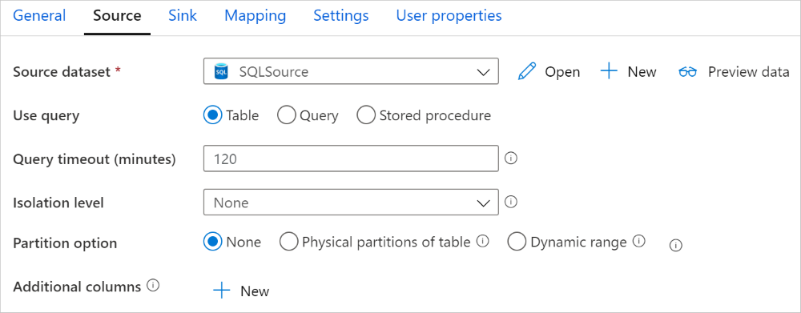
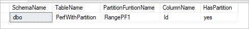
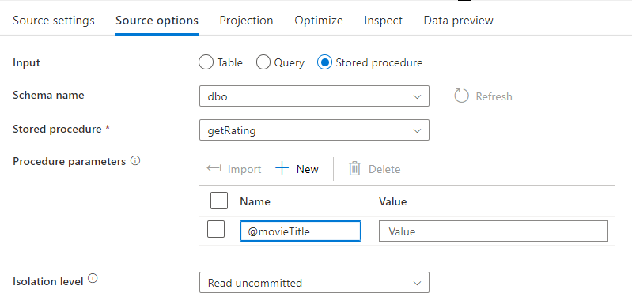
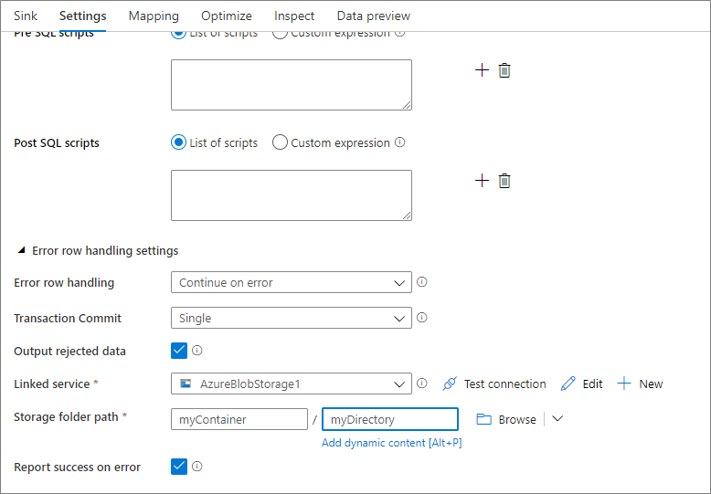

# Copy and transform data in Azure SQL Database by using Azure Data Factory or Azure Synapse Analytics

> [!div class="op_single_selector" title1="Select the version of Azure Data Factory that you're using:"]
>
> - [Version 1](v1/data-factory-azure-sql-connector.md)
> - [Current version](connector-azure-sql-database.md)

[!INCLUDE[appliesto-adf-asa-md](includes/appliesto-adf-asa-md.md)]

This article outlines how to use Copy Activity in Azure Data Factory or Azure Synapse pipelines to copy data from and to Azure SQL Database, and use Data Flow to transform data in Azure SQL Database. To learn more, read the introductory article for [Azure Data Factory](introduction.md) or [Azure Synapse Analytics](../synapse-analytics/overview-what-is.md).

## Supported capabilities

This Azure SQL Database connector is supported for the following activities:

- [Copy activity](copy-activity-overview.md) with [supported source/sink matrix](copy-activity-overview.md) table
- [Mapping data flow](concepts-data-flow-overview.md)
- [Lookup activity](control-flow-lookup-activity.md)
- [GetMetadata activity](control-flow-get-metadata-activity.md)

For Copy activity, this Azure SQL Database connector supports these functions:

- Copying data by using SQL authentication and Azure Active Directory (Azure AD) Application token authentication with a service principal or managed identities for Azure resources.
- As a source, retrieving data by using a SQL query or a stored procedure. You can also choose to parallel copy from an Azure SQL Database source, see the [Parallel copy from SQL database](#parallel-copy-from-sql-database) section for details.
- As a sink, automatically creating destination table if not exists based on the source schema; appending data to a table or invoking a stored procedure with custom logic during the copy.

If you use Azure SQL Database [serverless tier](../azure-sql/database/serverless-tier-overview.md), note when the server is paused, activity run fails instead of waiting for the auto resume to be ready. You can add activity retry or chain additional activities to make sure the server is live upon the actual execution.


> [!IMPORTANT]
> If you copy data by using the Azure integration runtime, configure a [server-level firewall rule](../azure-sql/database/firewall-configure.md) so that Azure services can access the server.
> If you copy data by using a self-hosted integration runtime, configure the firewall to allow the appropriate IP range. This range includes the machine's IP that's used to connect to Azure SQL Database.

## Get started

[!INCLUDE [data-factory-v2-connector-get-started](includes/data-factory-v2-connector-get-started.md)]

## Create an Azure SQL Database linked service using UI

Use the following steps to create an Azure SQL Database linked service in the Data Factory UI.

1. Browse to the Manage tab in your Azure Data Factory or Synapse workspace and select Linked Services, then click New:

    # [Azure Data Factory](#tab/data-factory)

    :::image type="content" source="media/doc-common-process/new-linked-service.png" alt-text="Create a new linked service with Azure Data Factory UI.":::

    # [Synapse Analytics](#tab/synapse-analytics)

    :::image type="content" source="media/doc-common-process/new-linked-service-synapse.png" alt-text="Create a new linked service with Azure Synapse UI.":::

---

2. Search for SQL and select the Azure SQL Database connector.

    :::image type="content" source="media/connector-azure-sql-database/azure-sql-database-connector.png" alt-text="Select Azure SQL Database connector.":::    

1. Configure the service details, test the connection, and create the new linked service.

    :::image type="content" source="media/connector-azure-sql-database/configure-azure-sql-database-linked-service.png" alt-text="Configure Azure SQL Database linked service.":::

## Connector configuration details

The following sections provide details about properties that are used to define Azure Data Factory or Synapse pipeline entities specific to an Azure SQL Database connector.

## Linked service properties

These properties are supported for an Azure SQL Database linked service:

| Property | Description | Required |
|:--- |:--- |:--- |
| type | The **type** property must be set to **AzureSqlDatabase**. | Yes |
| connectionString | Specify information needed to connect to the Azure SQL Database instance for the **connectionString** property. <br/>You also can put a password or service principal key in Azure Key Vault. If it's SQL authentication, pull the `password` configuration out of the connection string. For more information, see the JSON example following the table and [Store credentials in Azure Key Vault](store-credentials-in-key-vault.md). | Yes |
| servicePrincipalId | Specify the application's client ID. | Yes, when you use Azure AD authentication with a service principal |
| servicePrincipalKey | Specify the application's key. Mark this field as **SecureString** to store it securely or [reference a secret stored in Azure Key Vault](store-credentials-in-key-vault.md). | Yes, when you use Azure AD authentication with a service principal |
| tenant | Specify the tenant information, like the domain name or tenant ID, under which your application resides. Retrieve it by hovering the mouse in the upper-right corner of the Azure portal. | Yes, when you use Azure AD authentication with a service principal |
| azureCloudType | For service principal authentication, specify the type of Azure cloud environment to which your Azure AD application is registered. <br/> Allowed values are **AzurePublic**, **AzureChina**, **AzureUsGovernment**, and **AzureGermany**. By default, the data factory or Synapse pipeline's cloud environment is used. | No |
| alwaysEncryptedSettings | Specify **alwaysencryptedsettings** information that's needed to enable Always Encrypted to protect sensitive data stored in SQL server by using either managed identity or service principal. For more information, see the JSON example following the table and [Using Always Encrypted](#using-always-encrypted) section. If not specified, the default always encrypted setting is disabled. |No |
| connectVia | This [integration runtime](concepts-integration-runtime.md) is used to connect to the data store. You can use the Azure integration runtime or a self-hosted integration runtime if your data store is located in a private network. If not specified, the default Azure integration runtime is used. | No |

> [!NOTE]
> Azure SQL Database [**Always Encrypted**](/sql/relational-databases/security/encryption/always-encrypted-database-engine?view=sql-server-ver15&preserve-view=true) is not supported in data flow. 

For different authentication types, refer to the following sections on prerequisites and JSON samples, respectively:

- [SQL authentication](#sql-authentication)
- [Azure AD application token authentication: Service principal](#service-principal-authentication)
- [Azure AD application token authentication: Managed identities for Azure resources](#managed-identity)

>[!TIP]
>If you hit an error with the error code "UserErrorFailedToConnectToSqlServer" and a message like "The session limit for the database is XXX and has been reached," add `Pooling=false` to your connection string and try again. `Pooling=false` is also recommended for **SHIR(Self Hosted Integration Runtime)** type linked service setup. Pooling and other connection parameters can be added as new parameter names and values in **Additional connection properties** section of linked service creation form.

### SQL authentication

**Example: using SQL authentication**

```json
{
    "name": "AzureSqlDbLinkedService",
    "properties": {
        "type": "AzureSqlDatabase",
        "typeProperties": {
            "connectionString": "Data Source=tcp:<servername>.database.windows.net,1433;Initial Catalog=<databasename>;User ID=<username>@<servername>;Password=<password>;Trusted_Connection=False;Encrypt=True;Connection Timeout=30"
        },
        "connectVia": {
            "referenceName": "<name of Integration Runtime>",
            "type": "IntegrationRuntimeReference"
        }
    }
}
```

**Example: password in Azure Key Vault**

```json
{
    "name": "AzureSqlDbLinkedService",
    "properties": {
        "type": "AzureSqlDatabase",
        "typeProperties": {
            "connectionString": "Data Source=tcp:<servername>.database.windows.net,1433;Initial Catalog=<databasename>;User ID=<username>@<servername>;Trusted_Connection=False;Encrypt=True;Connection Timeout=30",
            "password": {
                "type": "AzureKeyVaultSecret",
                "store": {
                    "referenceName": "<Azure Key Vault linked service name>",
                    "type": "LinkedServiceReference"
                },
                "secretName": "<secretName>"
            }
        },
        "connectVia": {
            "referenceName": "<name of Integration Runtime>",
            "type": "IntegrationRuntimeReference"
        }
    }
}
```

**Example: Use Always Encrypted**

```json
{
    "name": "AzureSqlDbLinkedService",
    "properties": {
        "type": "AzureSqlDatabase",
        "typeProperties": {
            "connectionString": "Data Source=tcp:<servername>.database.windows.net,1433;Initial Catalog=<databasename>;User ID=<username>@<servername>;Password=<password>;Trusted_Connection=False;Encrypt=True;Connection Timeout=30"
        },
        "alwaysEncryptedSettings": {
            "alwaysEncryptedAkvAuthType": "ServicePrincipal",
            "servicePrincipalId": "<service principal id>",
            "servicePrincipalKey": {
                "type": "SecureString",
                "value": "<service principal key>"
            }
        },
        "connectVia": {
            "referenceName": "<name of Integration Runtime>",
            "type": "IntegrationRuntimeReference"
        }
    }
}
```

### Service principal authentication

To use a service principal-based Azure AD application token authentication, follow these steps:

1. [Create an Azure Active Directory application](../active-directory/develop/howto-create-service-principal-portal.md#register-an-application-with-azure-ad-and-create-a-service-principal) from the Azure portal. Make note of the application name and the following values that define the linked service:

    - Application ID
    - Application key
    - Tenant ID

2. [Provision an Azure Active Directory administrator](../azure-sql/database/authentication-aad-configure.md#provision-azure-ad-admin-sql-database) for your server on the Azure portal if you haven't already done so. The Azure AD administrator must be an Azure AD user or Azure AD group, but it can't be a service principal. This step is done so that, in the next step, you can use an Azure AD identity to create a contained database user for the service principal.

3. [Create contained database users](../azure-sql/database/authentication-aad-configure.md#create-contained-users-mapped-to-azure-ad-identities) for the service principal. Connect to the database from or to which you want to copy data by using tools like SQL Server Management Studio, with an Azure AD identity that has at least ALTER ANY USER permission. Run the following T-SQL:
  
    ```sql
    CREATE USER [your application name] FROM EXTERNAL PROVIDER;
    ```

4. Grant the service principal needed permissions as you normally do for SQL users or others. Run the following code. For more options, see [this document](/sql/relational-databases/system-stored-procedures/sp-addrolemember-transact-sql).

    ```sql
    ALTER ROLE [role name] ADD MEMBER [your application name];
    ```

5. Configure an Azure SQL Database linked service in an Azure Data Factory or Synapse workspace.

#### Linked service example that uses service principal authentication

```json
{
    "name": "AzureSqlDbLinkedService",
    "properties": {
        "type": "AzureSqlDatabase",
        "typeProperties": {
            "connectionString": "Data Source=tcp:<servername>.database.windows.net,1433;Initial Catalog=<databasename>;Connection Timeout=30",
            "servicePrincipalId": "<service principal id>",
            "servicePrincipalKey": {
                "type": "SecureString",
                "value": "<service principal key>"
            },
            "tenant": "<tenant info, e.g. microsoft.onmicrosoft.com>"
        },
        "connectVia": {
            "referenceName": "<name of Integration Runtime>",
            "type": "IntegrationRuntimeReference"
        }
    }
}
```

### <a name="managed-identity"></a> Managed identities for Azure resources authentication

A data factory or Synapse workspace can be associated with a [managed identity for Azure resources](data-factory-service-identity.md) that represents the service when authenticating to other resources in Azure. You can use this managed identity for Azure SQL Database authentication. The designated factory or Synapse workspace can access and copy data from or to your database by using this identity.

To use managed identity authentication, follow these steps.

1. [Provision an Azure Active Directory administrator](../azure-sql/database/authentication-aad-configure.md#provision-azure-ad-admin-sql-database) for your server on the Azure portal if you haven't already done so. The Azure AD administrator can be an Azure AD user or an Azure AD group. If you grant the group with managed identity an admin role, skip steps 3 and 4. The administrator has full access to the database.

2. [Create contained database users](../azure-sql/database/authentication-aad-configure.md#create-contained-users-mapped-to-azure-ad-identities) for the managed identity. Connect to the database from or to which you want to copy data by using tools like SQL Server Management Studio, with an Azure AD identity that has at least ALTER ANY USER permission. Run the following T-SQL:
  
    ```sql
    CREATE USER [your_resource_name] FROM EXTERNAL PROVIDER;
    ```

3. Grant the managed identity needed permissions as you normally do for SQL users and others. Run the following code. For more options, see [this document](/sql/relational-databases/system-stored-procedures/sp-addrolemember-transact-sql).

    ```sql
    ALTER ROLE [role name] ADD MEMBER [your_resource_name];
    ```

4. Configure an Azure SQL Database linked service.

**Example**

```json
{
    "name": "AzureSqlDbLinkedService",
    "properties": {
        "type": "AzureSqlDatabase",
        "typeProperties": {
            "connectionString": "Data Source=tcp:<servername>.database.windows.net,1433;Initial Catalog=<databasename>;Connection Timeout=30"
        },
        "connectVia": {
            "referenceName": "<name of Integration Runtime>",
            "type": "IntegrationRuntimeReference"
        }
    }
}
```

## Dataset properties

For a full list of sections and properties available to define datasets, see [Datasets](./concepts-datasets-linked-services.md).

The following properties are supported for Azure SQL Database dataset:

| Property | Description | Required |
|:--- |:--- |:--- |
| type | The **type** property of the dataset must be set to **AzureSqlTable**. | Yes |
| schema | Name of the schema. |No for source, Yes for sink  |
| table | Name of the table/view. |No for source, Yes for sink  |
| tableName | Name of the table/view with schema. This property is supported for backward compatibility. For new workload, use `schema` and `table`. | No for source, Yes for sink |

### Dataset properties example

```json
{
    "name": "AzureSQLDbDataset",
    "properties":
    {
        "type": "AzureSqlTable",
        "linkedServiceName": {
            "referenceName": "<Azure SQL Database linked service name>",
            "type": "LinkedServiceReference"
        },
        "schema": [ < physical schema, optional, retrievable during authoring > ],
        "typeProperties": {
            "schema": "<schema_name>",
            "table": "<table_name>"
        }
    }
}
```

## Copy activity properties

For a full list of sections and properties available for defining activities, see [Pipelines](concepts-pipelines-activities.md). This section provides a list of properties supported by the Azure SQL Database source and sink.

### Azure SQL Database as the source

>[!TIP]
>To load data from Azure SQL Database efficiently by using data partitioning, learn more from [Parallel copy from SQL database](#parallel-copy-from-sql-database).

To copy data from Azure SQL Database, the following properties are supported in the copy activity **source** section:

| Property | Description | Required |
|:--- |:--- |:--- |
| type | The **type** property of the copy activity source must be set to **AzureSqlSource**. "SqlSource" type is still supported for backward compatibility. | Yes |
| sqlReaderQuery | This property uses the custom SQL query to read data. An example is `select * from MyTable`. | No |
| sqlReaderStoredProcedureName | The name of the stored procedure that reads data from the source table. The last SQL statement must be a SELECT statement in the stored procedure. | No |
| storedProcedureParameters | Parameters for the stored procedure.<br/>Allowed values are name or value pairs. The names and casing of parameters must match the names and casing of the stored procedure parameters. | No |
| isolationLevel | Specifies the transaction locking behavior for the SQL source. The allowed values are: **ReadCommitted**, **ReadUncommitted**, **RepeatableRead**, **Serializable**, **Snapshot**. If not specified, the database's default isolation level is used. Refer to [this doc](/dotnet/api/system.data.isolationlevel) for more details. | No |
| partitionOptions | Specifies the data partitioning options used to load data from Azure SQL Database. <br>Allowed values are: **None** (default), **PhysicalPartitionsOfTable**, and **DynamicRange**.<br>When a partition option is enabled (that is, not `None`), the degree of parallelism to concurrently load data from an Azure SQL Database is controlled by the [`parallelCopies`](copy-activity-performance-features.md#parallel-copy) setting on the copy activity. | No |
| partitionSettings | Specify the group of the settings for data partitioning. <br>Apply when the partition option isn't `None`. | No |
| ***Under `partitionSettings`:*** | | |
| partitionColumnName | Specify the name of the source column **in integer or  date/datetime type** (`int`, `smallint`, `bigint`, `date`, `smalldatetime`, `datetime`, `datetime2`, or `datetimeoffset`) that will be used by range partitioning for parallel copy. If not specified, the index or the primary key of the table is autodetected and used as the partition column.<br>Apply when the partition option is `DynamicRange`. If you use a query to retrieve the source data, hook  `?AdfDynamicRangePartitionCondition ` in the WHERE clause. For an example, see the [Parallel copy from SQL database](#parallel-copy-from-sql-database) section. | No |
| partitionUpperBound | The maximum value of the partition column for partition range splitting. This value is used to decide the partition stride, not for filtering the rows in table. All rows in the table or query result will be partitioned and copied. If not specified, copy activity auto detect the value.  <br>Apply when the partition option is `DynamicRange`. For an example, see the [Parallel copy from SQL database](#parallel-copy-from-sql-database) section. | No |
| partitionLowerBound | The minimum value of the partition column for partition range splitting. This value is used to decide the partition stride, not for filtering the rows in table. All rows in the table or query result will be partitioned and copied. If not specified, copy activity auto detect the value.<br>Apply when the partition option is `DynamicRange`. For an example, see the [Parallel copy from SQL database](#parallel-copy-from-sql-database) section. | No |

**Note the following points:**

- If **sqlReaderQuery** is specified for **AzureSqlSource**, the copy activity runs this query against the Azure SQL Database source to get the data. You also can specify a stored procedure by specifying **sqlReaderStoredProcedureName** and **storedProcedureParameters** if the stored procedure takes parameters.
- When using stored procedure in source to retrieve data, note if your stored procedure is designed as returning different schema when different parameter value is passed in, you may encounter failure or see unexpected result when importing schema from UI or when copying data to SQL database with auto table creation.

#### SQL query example

```json
"activities":[
    {
        "name": "CopyFromAzureSQLDatabase",
        "type": "Copy",
        "inputs": [
            {
                "referenceName": "<Azure SQL Database input dataset name>",
                "type": "DatasetReference"
            }
        ],
        "outputs": [
            {
                "referenceName": "<output dataset name>",
                "type": "DatasetReference"
            }
        ],
        "typeProperties": {
            "source": {
                "type": "AzureSqlSource",
                "sqlReaderQuery": "SELECT * FROM MyTable"
            },
            "sink": {
                "type": "<sink type>"
            }
        }
    }
]
```

#### Stored procedure example

```json
"activities":[
    {
        "name": "CopyFromAzureSQLDatabase",
        "type": "Copy",
        "inputs": [
            {
                "referenceName": "<Azure SQL Database input dataset name>",
                "type": "DatasetReference"
            }
        ],
        "outputs": [
            {
                "referenceName": "<output dataset name>",
                "type": "DatasetReference"
            }
        ],
        "typeProperties": {
            "source": {
                "type": "AzureSqlSource",
                "sqlReaderStoredProcedureName": "CopyTestSrcStoredProcedureWithParameters",
                "storedProcedureParameters": {
                    "stringData": { "value": "str3" },
                    "identifier": { "value": "$$Text.Format('{0:yyyy}', <datetime parameter>)", "type": "Int"}
                }
            },
            "sink": {
                "type": "<sink type>"
            }
        }
    }
]
```

### Stored procedure definition

```sql
CREATE PROCEDURE CopyTestSrcStoredProcedureWithParameters
(
    @stringData varchar(20),
    @identifier int
)
AS
SET NOCOUNT ON;
BEGIN
     select *
     from dbo.UnitTestSrcTable
     where dbo.UnitTestSrcTable.stringData != stringData
    and dbo.UnitTestSrcTable.identifier != identifier
END
GO
```

### Azure SQL Database as the sink

> [!TIP]
> Learn more about the supported write behaviors, configurations, and best practices from [Best practice for loading data into Azure SQL Database](#best-practice-for-loading-data-into-azure-sql-database).

To copy data to Azure SQL Database, the following properties are supported in the copy activity **sink** section:

| Property | Description | Required |
|:--- |:--- |:--- |
| type | The **type** property of the copy activity sink must be set to **AzureSqlSink**. "SqlSink" type is still supported for backward compatibility. | Yes |
| preCopyScript | Specify a SQL query for the copy activity to run before writing data into Azure SQL Database. It's invoked only once per copy run. Use this property to clean up the preloaded data. | No |
| tableOption | Specifies whether to [automatically create the sink table](copy-activity-overview.md#auto-create-sink-tables) if not exists based on the source schema. <br>Auto table creation is not supported when sink specifies stored procedure. <br>Allowed values are: `none` (default), `autoCreate`. | No |
| sqlWriterStoredProcedureName | The name of the stored procedure that defines how to apply source data into a target table. <br/>This stored procedure is *invoked per batch*. For operations that run only once and have nothing to do with source data, for example, delete or truncate, use the `preCopyScript` property.<br>See example from [Invoke a stored procedure from a SQL sink](#invoke-a-stored-procedure-from-a-sql-sink). | No |
| storedProcedureTableTypeParameterName |The parameter name of the table type specified in the stored procedure.  |No |
| sqlWriterTableType |The table type name to be used in the stored procedure. The copy activity makes the data being moved available in a temp table with this table type. Stored procedure code can then merge the data that's being copied with existing data. |No |
| storedProcedureParameters |Parameters for the stored procedure.<br/>Allowed values are name and value pairs. Names and casing of parameters must match the names and casing of the stored procedure parameters. | No |
| writeBatchSize | Number of rows to insert into the SQL table *per batch*.<br/> The allowed value is **integer** (number of rows). By default, the service dynamically determines the appropriate batch size based on the row size. | No |
| writeBatchTimeout | The wait time for the batch insert operation to finish before it times out.<br/> The allowed value is **timespan**. An example is "00:30:00" (30 minutes). | No |
| disableMetricsCollection | The service collects metrics such as Azure SQL Database DTUs for copy performance optimization and recommendations, which introduces additional master DB access. If you are concerned with this behavior, specify `true` to turn it off. | No (default is `false`) |
| maxConcurrentConnections |The upper limit of concurrent connections established to the data store during the activity run. Specify a value only when you want to limit concurrent connections.| No |

**Example 1: Append data**

```json
"activities":[
    {
        "name": "CopyToAzureSQLDatabase",
        "type": "Copy",
        "inputs": [
            {
                "referenceName": "<input dataset name>",
                "type": "DatasetReference"
            }
        ],
        "outputs": [
            {
                "referenceName": "<Azure SQL Database output dataset name>",
                "type": "DatasetReference"
            }
        ],
        "typeProperties": {
            "source": {
                "type": "<source type>"
            },
            "sink": {
                "type": "AzureSqlSink",
                "tableOption": "autoCreate",
                "writeBatchSize": 100000
            }
        }
    }
]
```

**Example 2: Invoke a stored procedure during copy**

Learn more details from [Invoke a stored procedure from a SQL sink](#invoke-a-stored-procedure-from-a-sql-sink).

```json
"activities":[
    {
        "name": "CopyToAzureSQLDatabase",
        "type": "Copy",
        "inputs": [
            {
                "referenceName": "<input dataset name>",
                "type": "DatasetReference"
            }
        ],
        "outputs": [
            {
                "referenceName": "<Azure SQL Database output dataset name>",
                "type": "DatasetReference"
            }
        ],
        "typeProperties": {
            "source": {
                "type": "<source type>"
            },
            "sink": {
                "type": "AzureSqlSink",
                "sqlWriterStoredProcedureName": "CopyTestStoredProcedureWithParameters",
                "storedProcedureTableTypeParameterName": "MyTable",
                "sqlWriterTableType": "MyTableType",
                "storedProcedureParameters": {
                    "identifier": { "value": "1", "type": "Int" },
                    "stringData": { "value": "str1" }
                }
            }
        }
    }
]
```

## Parallel copy from SQL database

The Azure SQL Database connector in copy activity provides built-in data partitioning to copy data in parallel. You can find data partitioning options on the **Source** tab of the copy activity.



When you enable partitioned copy, copy activity runs parallel queries against your Azure SQL Database source to load data by partitions. The parallel degree is controlled by the [`parallelCopies`](copy-activity-performance-features.md#parallel-copy) setting on the copy activity. For example, if you set `parallelCopies` to four, the service concurrently generates and runs four queries based on your specified partition option and settings, and each query retrieves a portion of data from your Azure SQL Database.

You are suggested to enable parallel copy with data partitioning especially when you load large amount of data from your Azure SQL Database. The following are suggested configurations for different scenarios. When copying data into file-based data store, it's recommended to write to a folder as multiple files (only specify folder name), in which case the performance is better than writing to a single file.

| Scenario                                                     | Suggested settings                                           |
| ------------------------------------------------------------ | ------------------------------------------------------------ |
| Full load from large table, with physical partitions.        | **Partition option**: Physical partitions of table. <br><br/>During execution, the service automatically detects the physical partitions, and copies data by partitions. <br><br/>To check if your table has physical partition or not, you can refer to [this query](#sample-query-to-check-physical-partition). |
| Full load from large table, without physical partitions, while with an integer or datetime column for data partitioning. | **Partition options**: Dynamic range partition.<br>**Partition column** (optional): Specify the column used to partition data. If not specified, the index or primary key column is used.<br/>**Partition upper bound** and **partition lower bound** (optional): Specify if you want to determine the partition stride. This is not for filtering the rows in table, all rows in the table will be partitioned and copied. If not specified, copy activity auto detect the values.<br><br>For example, if your partition column "ID" has values range from 1 to 100, and you set the lower bound as 20 and the upper bound as 80, with parallel copy as 4, the service retrieves data by 4 partitions - IDs in range <=20, [21, 50], [51, 80], and >=81, respectively. |
| Load a large amount of data by using a custom query, without physical partitions, while with an integer or date/datetime column for data partitioning. | **Partition options**: Dynamic range partition.<br>**Query**: `SELECT * FROM <TableName> WHERE ?AdfDynamicRangePartitionCondition AND <your_additional_where_clause>`.<br>**Partition column**: Specify the column used to partition data.<br>**Partition upper bound** and **partition lower bound** (optional): Specify if you want to determine the partition stride. This is not for filtering the rows in table, all rows in the query result will be partitioned and copied. If not specified, copy activity auto detect the value.<br><br>During execution, the service replaces `?AdfRangePartitionColumnName` with the actual column name and value ranges for each partition, and sends to Azure SQL Database. <br>For example, if your partition column "ID" has values range from 1 to 100, and you set the lower bound as 20 and the upper bound as 80, with parallel copy as 4, the service retrieves data by 4 partitions- IDs in range <=20, [21, 50], [51, 80], and >=81, respectively. <br><br>Here are more sample queries for different scenarios:<br> 1. Query the whole table: <br>`SELECT * FROM <TableName> WHERE ?AdfDynamicRangePartitionCondition`<br> 2. Query from a table with column selection and additional where-clause filters: <br>`SELECT <column_list> FROM <TableName> WHERE ?AdfDynamicRangePartitionCondition AND <your_additional_where_clause>`<br> 3. Query with subqueries: <br>`SELECT <column_list> FROM (<your_sub_query>) AS T WHERE ?AdfDynamicRangePartitionCondition AND <your_additional_where_clause>`<br> 4. Query with partition in subquery: <br>`SELECT <column_list> FROM (SELECT <your_sub_query_column_list> FROM <TableName> WHERE ?AdfDynamicRangePartitionCondition) AS T`
|

Best practices to load data with partition option:

1. Choose distinctive column as partition column (like primary key or unique key) to avoid data skew. 
2. If the table has built-in partition, use partition option "Physical partitions of table" to get better performance.    
3. If you use Azure Integration Runtime to copy data, you can set larger "[Data Integration Units (DIU)](copy-activity-performance-features.md#data-integration-units)" (>4) to utilize more computing resource. Check the applicable scenarios there.
4. "[Degree of copy parallelism](copy-activity-performance-features.md#parallel-copy)" control the partition numbers, setting this number too large sometime hurts the performance, recommend setting this number as (DIU or number of Self-hosted IR nodes) * (2 to 4).

**Example: full load from large table with physical partitions**

```json
"source": {
    "type": "AzureSqlSource",
    "partitionOption": "PhysicalPartitionsOfTable"
}
```

**Example: query with dynamic range partition**

```json
"source": {
    "type": "AzureSqlSource",
    "query": "SELECT * FROM <TableName> WHERE ?AdfDynamicRangePartitionCondition AND <your_additional_where_clause>",
    "partitionOption": "DynamicRange",
    "partitionSettings": {
        "partitionColumnName": "<partition_column_name>",
        "partitionUpperBound": "<upper_value_of_partition_column (optional) to decide the partition stride, not as data filter>",
        "partitionLowerBound": "<lower_value_of_partition_column (optional) to decide the partition stride, not as data filter>"
    }
}
```

### Sample query to check physical partition

```sql
SELECT DISTINCT s.name AS SchemaName, t.name AS TableName, pf.name AS PartitionFunctionName, c.name AS ColumnName, iif(pf.name is null, 'no', 'yes') AS HasPartition
FROM sys.tables AS t
LEFT JOIN sys.objects AS o ON t.object_id = o.object_id
LEFT JOIN sys.schemas AS s ON o.schema_id = s.schema_id
LEFT JOIN sys.indexes AS i ON t.object_id = i.object_id 
LEFT JOIN sys.index_columns AS ic ON ic.partition_ordinal > 0 AND ic.index_id = i.index_id AND ic.object_id = t.object_id 
LEFT JOIN sys.columns AS c ON c.object_id = ic.object_id AND c.column_id = ic.column_id 
LEFT JOIN sys.partition_schemes ps ON i.data_space_id = ps.data_space_id 
LEFT JOIN sys.partition_functions pf ON pf.function_id = ps.function_id 
WHERE s.name='[your schema]' AND t.name = '[your table name]'
```

If the table has physical partition, you would see "HasPartition" as "yes" like the following.



## Best practice for loading data into Azure SQL Database

When you copy data into Azure SQL Database, you might require different write behavior:

- [Append](#append-data): My source data has only new records.
- [Upsert](#upsert-data): My source data has both inserts and updates.
- [Overwrite](#overwrite-the-entire-table): I want to reload an entire dimension table each time.
- [Write with custom logic](#write-data-with-custom-logic): I need extra processing before the final insertion into the destination table.

Refer to the respective sections about how to configure in the service and best practices.

### Append data

Appending data is the default behavior of this Azure SQL Database sink connector. the service does a bulk insert to write to your table efficiently. You can configure the source and sink accordingly in the copy activity.

### Upsert data

**Option 1:** When you have a large amount of data to copy, you can bulk load all records into a staging table by using the copy activity, then run a stored procedure activity to apply a [MERGE](/sql/t-sql/statements/merge-transact-sql) or INSERT/UPDATE statement in one shot. 

Copy activity currently doesn't natively support loading data into a database temporary table. There is an advanced way to set it up with a combination of multiple activities, refer to [Optimize Azure SQL Database Bulk Upsert scenarios](https://github.com/scoriani/azuresqlbulkupsert). Below shows a sample of using a permanent table as staging.

As an example, you can create a pipeline with a **Copy activity** chained with a **Stored Procedure activity**. The former copies data from your source store into an Azure SQL Database staging table, for example, **UpsertStagingTable**, as the table name in the dataset. Then the latter invokes a stored procedure to merge source data from the staging table into the target table and clean up the staging table.


In your database, define a stored procedure with MERGE logic, like the following example, which is pointed to from the previous stored procedure activity. Assume that the target is the **Marketing** table with three columns: **ProfileID**, **State**, and **Category**. Do the upsert based on the **ProfileID** column.

```sql
CREATE PROCEDURE [dbo].[spMergeData]
AS
BEGIN
   MERGE TargetTable AS target
   USING UpsertStagingTable AS source
   ON (target.[ProfileID] = source.[ProfileID])
   WHEN MATCHED THEN
      UPDATE SET State = source.State
    WHEN NOT matched THEN
       INSERT ([ProfileID], [State], [Category])
      VALUES (source.ProfileID, source.State, source.Category);
    TRUNCATE TABLE UpsertStagingTable
END
```

**Option 2:** You can choose to [invoke a stored procedure within the copy activity](#invoke-a-stored-procedure-from-a-sql-sink). This approach runs each batch (as governed by the `writeBatchSize` property) in the source table instead of using bulk insert as the default approach in the copy activity.

**Option 3:** You can use [Mapping Data Flow](#sink-transformation) which offers built-in insert/upsert/update methods.

### Overwrite the entire table

You can configure the **preCopyScript** property in the copy activity sink. In this case, for each copy activity that runs, the service runs the script first. Then it runs the copy to insert the data. For example, to overwrite the entire table with the latest data, specify a script to first delete all the records before you bulk load the new data from the source.

### Write data with custom logic

The steps to write data with custom logic are similar to those described in the [Upsert data](#upsert-data) section. When you need to apply extra processing before the final insertion of source data into the destination table, you can load to a staging table then invoke stored procedure activity, or invoke a stored procedure in copy activity sink to apply data, or use Mapping Data Flow.

## <a name="invoke-a-stored-procedure-from-a-sql-sink"></a> Invoke a stored procedure from a SQL sink

When you copy data into Azure SQL Database, you also can configure and invoke a user-specified stored procedure with additional parameters on each batch of the source table. The stored procedure feature takes advantage of [table-valued parameters](/dotnet/framework/data/adonet/sql/table-valued-parameters).

You can use a stored procedure when built-in copy mechanisms don't serve the purpose. An example is when you want to apply extra processing before the final insertion of source data into the destination table. Some extra processing examples are when you want to merge columns, look up additional values, and insert into more than one table.

The following sample shows how to use a stored procedure to do an upsert into a table in Azure SQL Database. Assume that the input data and the sink **Marketing** table each have three columns: **ProfileID**, **State**, and **Category**. Do the upsert based on the **ProfileID** column, and only apply it for a specific category called "ProductA".

1. In your database, define the table type with the same name as **sqlWriterTableType**. The schema of the table type is the same as the schema returned by your input data.

    ```sql
    CREATE TYPE [dbo].[MarketingType] AS TABLE(
        [ProfileID] [varchar](256) NOT NULL,
        [State] [varchar](256) NOT NULL,
        [Category] [varchar](256) NOT NULL
    )
    ```

2. In your database, define the stored procedure with the same name as **sqlWriterStoredProcedureName**. It handles input data from your specified source and merges into the output table. The parameter name of the table type in the stored procedure is the same as **tableName** defined in the dataset.

    ```sql
    CREATE PROCEDURE spOverwriteMarketing @Marketing [dbo].[MarketingType] READONLY, @category varchar(256)
    AS
    BEGIN
    MERGE [dbo].[Marketing] AS target
    USING @Marketing AS source
    ON (target.ProfileID = source.ProfileID and target.Category = @category)
    WHEN MATCHED THEN
        UPDATE SET State = source.State
    WHEN NOT MATCHED THEN
        INSERT (ProfileID, State, Category)
        VALUES (source.ProfileID, source.State, source.Category);
    END
    ```

3. In your Azure Data Factory or Synapse pipeline, define the **SQL sink** section in the copy activity as follows:

    ```json
    "sink": {
        "type": "AzureSqlSink",
        "sqlWriterStoredProcedureName": "spOverwriteMarketing",
        "storedProcedureTableTypeParameterName": "Marketing",
        "sqlWriterTableType": "MarketingType",
        "storedProcedureParameters": {
            "category": {
                "value": "ProductA"
            }
        }
    }
    ```

## Mapping data flow properties

When transforming data in mapping data flow, you can read and write to tables from Azure SQL Database. For more information, see the [source transformation](data-flow-source.md) and [sink transformation](data-flow-sink.md) in mapping data flows.

### Source transformation

Settings specific to Azure SQL Database are available in the **Source Options** tab of the source transformation.

**Input:** Select whether you point your source at a table (equivalent of ```Select * from <table-name>```) or enter a custom SQL query.

**Query**: If you select Query in the input field, enter a SQL query for your source. This setting overrides any table that you've chosen in the dataset. **Order By** clauses aren't supported here, but you can set a full SELECT FROM statement. You can also use user-defined table functions. **select * from udfGetData()** is a UDF in SQL that returns a table. This query will produce a source table that you can use in your data flow. Using queries is also a great way to reduce rows for testing or for lookups.

**Stored procedure**: Choose this option if you wish to generate a projection and source data from a stored procedure that is executed from your source database. You can type in the schema, procedure name, and parameters, or click on Refresh to ask the service to discover the schemas and procedure names. Then you can click on Import to import all procedure parameters using the form ``@paraName``.



- SQL Example: ```Select * from MyTable where customerId > 1000 and customerId < 2000```
- Parameterized SQL Example: ``"select * from {$tablename} where orderyear > {$year}"``

**Batch size**: Enter a batch size to chunk large data into reads.

**Isolation Level**: The default for SQL sources in mapping data flow is read uncommitted. You can change the isolation level here to one of these values:

- Read Committed
- Read Uncommitted
- Repeatable Read
- Serializable
- None (ignore isolation level)


### Sink transformation

Settings specific to Azure SQL Database are available in the **Settings** tab of the sink transformation.

**Update method:** Determines what operations are allowed on your database destination. The default is to only allow inserts. To update, upsert, or delete rows, an alter-row transformation is required to tag rows for those actions. For updates, upserts and deletes, a key column or columns must be set to determine which row to alter.


The column name that you pick as the key here will be used by the service as part of the subsequent update, upsert, delete. Therefore, you must pick a column that exists in the Sink mapping. If you wish to not write the value to this key column, then click "Skip writing key columns".

You can parameterize the key column used here for updating your target Azure SQL Database table. If you have multiple columns for a composite key, the click on "Custom Expression" and you will be able to add dynamic content using the data flow [expression language](control-flow-expression-language-functions.md), which can include an array of strings with column names for a composite key.

**Table action:** Determines whether to recreate or remove all rows from the destination table prior to writing.

- None: No action will be done to the table.
- Recreate: The table will get dropped and recreated. Required if creating a new table dynamically.
- Truncate: All rows from the target table will get removed.

**Batch size**: Controls how many rows are being written in each bucket. Larger batch sizes improve compression and memory optimization, but risk out of memory exceptions when caching data.

**Use TempDB:** By default, the service will use a global temporary table to store data as part of the loading process. You can alternatively uncheck the "Use TempDB" option and instead, ask the service to store the temporary holding table in a user database that is located in the database that is being used for this Sink.


**Pre and Post SQL scripts**: Enter multi-line SQL scripts that will execute before (pre-processing) and after (post-processing) data is written to your Sink database


### Error row handling

When writing to Azure SQL DB, certain rows of data may fail due to constraints set by the destination. Some common errors include:

*    String or binary data would be truncated in table
*    Cannot insert the value NULL into column
*    The INSERT statement conflicted with the CHECK constraint

By default, a data flow run will fail on the first error it gets. You can choose to **Continue on error** that allows your data flow to complete even if individual rows have errors. The service provides different options for you to handle these error rows.

**Transaction Commit:** Choose whether your data gets written in a single transaction or in batches. Single transaction will provide worse performance but no data written will be visible to others until the transaction completes.  

**Output rejected data:** If enabled, you can output the error rows into a csv file in Azure Blob Storage or an Azure Data Lake Storage Gen2 account of your choosing. This will write the error rows with three additional columns: the SQL operation like INSERT or UPDATE, the data flow error code, and the error message on the row.

**Report success on error:** If enabled, the data flow will be marked as a success even if error rows are found. 




## Data type mapping for Azure SQL Database

When data is copied from or to Azure SQL Database, the following mappings are used from Azure SQL Database data types to Azure Data Factory interim data types. The same mappings are used by the Synapse pipeline feature, which implements Azure Data Factory directly.  To learn how the copy activity maps the source schema and data type to the sink, see [Schema and data type mappings](copy-activity-schema-and-type-mapping.md).

| Azure SQL Database data type | Data Factory interim data type |
|:--- |:--- |
| bigint |Int64 |
| binary |Byte[] |
| bit |Boolean |
| char |String, Char[] |
| date |DateTime |
| Datetime |DateTime |
| datetime2 |DateTime |
| Datetimeoffset |DateTimeOffset |
| Decimal |Decimal |
| FILESTREAM attribute (varbinary(max)) |Byte[] |
| Float |Double |
| image |Byte[] |
| int |Int32 |
| money |Decimal |
| nchar |String, Char[] |
| ntext |String, Char[] |
| numeric |Decimal |
| nvarchar |String, Char[] |
| real |Single |
| rowversion |Byte[] |
| smalldatetime |DateTime |
| smallint |Int16 |
| smallmoney |Decimal |
| sql_variant |Object |
| text |String, Char[] |
| time |TimeSpan |
| timestamp |Byte[] |
| tinyint |Byte |
| uniqueidentifier |Guid |
| varbinary |Byte[] |
| varchar |String, Char[] |
| xml |String |

>[!NOTE]
> For data types that map to the Decimal interim type, currently Copy activity supports precision up to 28. If you have data with precision larger than 28, consider converting to a string in SQL query.

## Lookup activity properties

To learn details about the properties, check [Lookup activity](control-flow-lookup-activity.md).

## GetMetadata activity properties

To learn details about the properties, check [GetMetadata activity](control-flow-get-metadata-activity.md)

## Using Always Encrypted

When you copy data from/to SQL Server with [Always Encrypted](/sql/relational-databases/security/encryption/always-encrypted-database-engine), follow below steps: 

1. Store the [Column Master Key (CMK)](/sql/relational-databases/security/encryption/create-and-store-column-master-keys-always-encrypted?view=sql-server-ver15&preserve-view=true) in an [Azure Key Vault](../key-vault/general/overview.md). Learn more on [how to configure Always Encrypted by using Azure Key Vault](../azure-sql/database/always-encrypted-azure-key-vault-configure.md?tabs=azure-powershell)

2. Make sure to great access to the key vault where the [Column Master Key (CMK)](/sql/relational-databases/security/encryption/create-and-store-column-master-keys-always-encrypted?view=sql-server-ver15&preserve-view=true) is stored. Refer to this [article](/sql/relational-databases/security/encryption/create-and-store-column-master-keys-always-encrypted?view=sql-server-ver15&preserve-view=true#key-vaults) for required permissions.

3. Create linked service to connect to your SQL database and enable 'Always Encrypted' function by using either managed identity or service principal. 

>[!NOTE]
>SQL Server [Always Encrypted](/sql/relational-databases/security/encryption/always-encrypted-database-engine) supports below scenarios: 
>1. Either source or sink data stores is using managed identity or service principal as key provider authentication type.
>2. Both source and sink data stores are using managed identity as key provider authentication type.
>3. Both source and sink data stores are using the same service principal as key provider authentication type.

## Next steps

For a list of data stores supported as sources and sinks by the copy activity, see [Supported data stores and formats](copy-activity-overview.md#supported-data-stores-and-formats).
