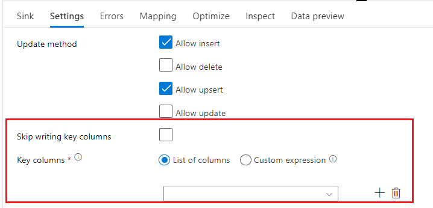
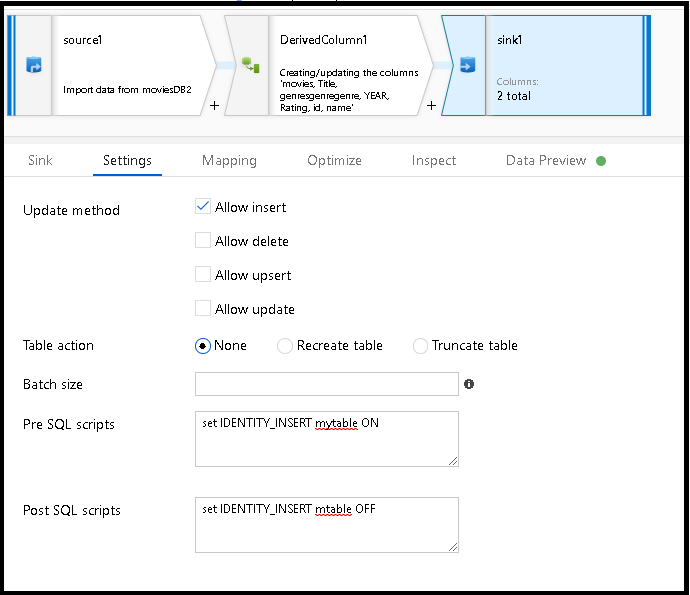

# Copy and transform data in Azure SQL Database by using Azure Data Factory

> [!div class="op_single_selector" title1="Select the version of Azure Data Factory that you're using:"]
>
> - [Version 1](v1/data-factory-azure-sql-connector.md)
> - [Current version](connector-azure-sql-database.md)

[!INCLUDE[appliesto-adf-asa-md](includes/appliesto-adf-asa-md.md)]

This article outlines how to use Copy Activity in Azure Data Factory to copy data from and to Azure SQL Database, and use Data Flow to transform data in Azure SQL Database. To learn about Azure Data Factory, read the [introductory article](introduction.md).

## Supported capabilities

This Azure SQL Database connector is supported for the following activities:

- [Copy activity](copy-activity-overview.md) with [supported source/sink matrix](copy-activity-overview.md) table
- [Mapping data flow](concepts-data-flow-overview.md)
- [Lookup activity](control-flow-lookup-activity.md)
- [GetMetadata activity](control-flow-get-metadata-activity.md)

For Copy activity, this Azure SQL Database connector supports these functions:

- Copying data by using SQL authentication and Azure Active Directory (Azure AD) Application token authentication with a service principal or managed identities for Azure resources.
- As a source, retrieving data by using a SQL query or a stored procedure.
- As a sink, automatically creating destination table if not exists based on the source schema; appending data to a table or invoking a stored procedure with custom logic during the copy.

>[!NOTE]
> Azure SQL Database [Always Encrypted](https://docs.microsoft.com/sql/relational-databases/security/encryption/always-encrypted-database-engine?view=azuresqldb-current) isn't supported by this connector now. To work around, you can use a [generic ODBC connector](connector-odbc.md) and a SQL Server ODBC driver via a self-hosted integration runtime. Learn more from [Using Always Encrypted](#using-always-encrypted) section. 

> [!IMPORTANT]
> If you copy data by using the Azure integration runtime, configure a [server-level firewall rule](https://docs.microsoft.com/azure/sql-database/sql-database-firewall-configure) so that Azure services can access the server.
> If you copy data by using a self-hosted integration runtime, configure the firewall to allow the appropriate IP range. This range includes the machine's IP that's used to connect to Azure SQL Database.

## Get started

[!INCLUDE [data-factory-v2-connector-get-started](../../includes/data-factory-v2-connector-get-started.md)]

The following sections provide details about properties that are used to define Azure Data Factory entities specific to an Azure SQL Database connector.

## Linked service properties

These properties are supported for an Azure SQL Database linked service:

| Property | Description | Required |
|:--- |:--- |:--- |
| type | The **type** property must be set to **AzureSqlDatabase**. | Yes |
| connectionString | Specify information needed to connect to the Azure SQL Database instance for the **connectionString** property. <br/>You also can put a password or service principal key in Azure Key Vault. If it's SQL authentication, pull the `password` configuration out of the connection string. For more information, see the JSON example following the table and [Store credentials in Azure Key Vault](store-credentials-in-key-vault.md). | Yes |
| servicePrincipalId | Specify the application's client ID. | Yes, when you use Azure AD authentication with a service principal |
| servicePrincipalKey | Specify the application's key. Mark this field as **SecureString** to store it securely in Azure Data Factory or [reference a secret stored in Azure Key Vault](store-credentials-in-key-vault.md). | Yes, when you use Azure AD authentication with a service principal |
| tenant | Specify the tenant information, like the domain name or tenant ID, under which your application resides. Retrieve it by hovering the mouse in the upper-right corner of the Azure portal. | Yes, when you use Azure AD authentication with a service principal |
| connectVia | This [integration runtime](concepts-integration-runtime.md) is used to connect to the data store. You can use the Azure integration runtime or a self-hosted integration runtime if your data store is located in a private network. If not specified, the default Azure integration runtime is used. | No |

For different authentication types, refer to the following sections on prerequisites and JSON samples, respectively:

- [SQL authentication](#sql-authentication)
- [Azure AD application token authentication: Service principal](#service-principal-authentication)
- [Azure AD application token authentication: Managed identities for Azure resources](#managed-identity)

>[!TIP]
>If you hit an error with the error code "UserErrorFailedToConnectToSqlServer" and a message like "The session limit for the database is XXX and has been reached," add `Pooling=false` to your connection string and try again.

### SQL authentication

#### Linked service example that uses SQL authentication

```json
{
    "name": "AzureSqlDbLinkedService",
    "properties": {
        "type": "AzureSqlDatabase",
        "typeProperties": {
            "connectionString": "Server=tcp:<servername>.database.windows.net,1433;Database=<databasename>;User ID=<username>@<servername>;Password=<password>;Trusted_Connection=False;Encrypt=True;Connection Timeout=30"
        },
        "connectVia": {
            "referenceName": "<name of Integration Runtime>",
            "type": "IntegrationRuntimeReference"
        }
    }
}
```

**Password in Azure Key Vault**

```json
{
    "name": "AzureSqlDbLinkedService",
    "properties": {
        "type": "AzureSqlDatabase",
        "typeProperties": {
            "connectionString": "Server=tcp:<servername>.database.windows.net,1433;Database=<databasename>;User ID=<username>@<servername>;Trusted_Connection=False;Encrypt=True;Connection Timeout=30",
            "password": {
                "type": "AzureKeyVaultSecret",
                "store": {
                    "referenceName": "<Azure Key Vault linked service name>",
                    "type": "LinkedServiceReference"
                },
                "secretName": "<secretName>"
            }
        },
        "connectVia": {
            "referenceName": "<name of Integration Runtime>",
            "type": "IntegrationRuntimeReference"
        }
    }
}
```

### Service principal authentication

To use a service principal-based Azure AD application token authentication, follow these steps:

1. [Create an Azure Active Directory application](../active-directory/develop/howto-create-service-principal-portal.md#register-an-application-with-azure-ad-and-create-a-service-principal) from the Azure portal. Make note of the application name and the following values that define the linked service:

    - Application ID
    - Application key
    - Tenant ID

2. [Provision an Azure Active Directory administrator](../azure-sql/database/authentication-aad-configure.md#provision-azure-ad-admin-sql-database) for your server on the Azure portal if you haven't already done so. The Azure AD administrator must be an Azure AD user or Azure AD group, but it can't be a service principal. This step is done so that, in the next step, you can use an Azure AD identity to create a contained database user for the service principal.

3. [Create contained database users](../azure-sql/database/authentication-aad-configure.md#create-contained-users-mapped-to-azure-ad-identities) for the service principal. Connect to the database from or to which you want to copy data by using tools like SQL Server Management Studio, with an Azure AD identity that has at least ALTER ANY USER permission. Run the following T-SQL:
  
    ```sql
    CREATE USER [your application name] FROM EXTERNAL PROVIDER;
    ```

4. Grant the service principal needed permissions as you normally do for SQL users or others. Run the following code. For more options, see [this document](https://docs.microsoft.com/sql/relational-databases/system-stored-procedures/sp-addrolemember-transact-sql?view=sql-server-2017).

    ```sql
    ALTER ROLE [role name] ADD MEMBER [your application name];
    ```

5. Configure an Azure SQL Database linked service in Azure Data Factory.

#### Linked service example that uses service principal authentication

```json
{
    "name": "AzureSqlDbLinkedService",
    "properties": {
        "type": "AzureSqlDatabase",
        "typeProperties": {
            "connectionString": "Server=tcp:<servername>.database.windows.net,1433;Database=<databasename>;Connection Timeout=30",
            "servicePrincipalId": "<service principal id>",
            "servicePrincipalKey": {
                "type": "SecureString",
                "value": "<service principal key>"
            },
            "tenant": "<tenant info, e.g. microsoft.onmicrosoft.com>"
        },
        "connectVia": {
            "referenceName": "<name of Integration Runtime>",
            "type": "IntegrationRuntimeReference"
        }
    }
}
```

### <a name="managed-identity"></a> Managed identities for Azure resources authentication

A data factory can be associated with a [managed identity for Azure resources](data-factory-service-identity.md) that represents the specific data factory. You can use this managed identity for Azure SQL Database authentication. The designated factory can access and copy data from or to your database by using this identity.

To use managed identity authentication, follow these steps.

1. [Provision an Azure Active Directory administrator](../azure-sql/database/authentication-aad-configure.md#provision-azure-ad-admin-sql-database) for your server on the Azure portal if you haven't already done so. The Azure AD administrator can be an Azure AD user or an Azure AD group. If you grant the group with managed identity an admin role, skip steps 3 and 4. The administrator has full access to the database.

2. [Create contained database users](../azure-sql/database/authentication-aad-configure.md#create-contained-users-mapped-to-azure-ad-identities) for the Azure Data Factory managed identity. Connect to the database from or to which you want to copy data by using tools like SQL Server Management Studio, with an Azure AD identity that has at least ALTER ANY USER permission. Run the following T-SQL:
  
    ```sql
    CREATE USER [your Data Factory name] FROM EXTERNAL PROVIDER;
    ```

3. Grant the Data Factory managed identity needed permissions as you normally do for SQL users and others. Run the following code. For more options, see [this document](https://docs.microsoft.com/sql/relational-databases/system-stored-procedures/sp-addrolemember-transact-sql?view=sql-server-2017).

    ```sql
    ALTER ROLE [role name] ADD MEMBER [your Data Factory name];
    ```

4. Configure an Azure SQL Database linked service in Azure Data Factory.

**Example**

```json
{
    "name": "AzureSqlDbLinkedService",
    "properties": {
        "type": "AzureSqlDatabase",
        "typeProperties": {
            "connectionString": "Server=tcp:<servername>.database.windows.net,1433;Database=<databasename>;Connection Timeout=30"
        },
        "connectVia": {
            "referenceName": "<name of Integration Runtime>",
            "type": "IntegrationRuntimeReference"
        }
    }
}
```

## Dataset properties

For a full list of sections and properties available to define datasets, see [Datasets](https://docs.microsoft.com/azure/data-factory/concepts-datasets-linked-services).

The following properties are supported for Azure SQL Database dataset:

| Property | Description | Required |
|:--- |:--- |:--- |
| type | The **type** property of the dataset must be set to **AzureSqlTable**. | Yes |
| schema | Name of the schema. |No for source, Yes for sink  |
| table | Name of the table/view. |No for source, Yes for sink  |
| tableName | Name of the table/view with schema. This property is supported for backward compatibility. For new workload, use `schema` and `table`. | No for source, Yes for sink |

### Dataset properties example

```json
{
    "name": "AzureSQLDbDataset",
    "properties":
    {
        "type": "AzureSqlTable",
        "linkedServiceName": {
            "referenceName": "<Azure SQL Database linked service name>",
            "type": "LinkedServiceReference"
        },
        "schema": [ < physical schema, optional, retrievable during authoring > ],
        "typeProperties": {
            "schema": "<schema_name>",
            "table": "<table_name>"
        }
    }
}
```

## Copy activity properties

For a full list of sections and properties available for defining activities, see [Pipelines](concepts-pipelines-activities.md). This section provides a list of properties supported by the Azure SQL Database source and sink.

### Azure SQL Database as the source

To copy data from Azure SQL Database, the following properties are supported in the copy activity **source** section:

| Property | Description | Required |
|:--- |:--- |:--- |
| type | The **type** property of the copy activity source must be set to **AzureSqlSource**. "SqlSource" type is still supported for backward compatibility. | Yes |
| sqlReaderQuery | This property uses the custom SQL query to read data. An example is `select * from MyTable`. | No |
| sqlReaderStoredProcedureName | The name of the stored procedure that reads data from the source table. The last SQL statement must be a SELECT statement in the stored procedure. | No |
| storedProcedureParameters | Parameters for the stored procedure.<br/>Allowed values are name or value pairs. The names and casing of parameters must match the names and casing of the stored procedure parameters. | No |
| isolationLevel | Specifies the transaction locking behavior for the SQL source. The allowed values are: **ReadCommitted** (default), **ReadUncommitted**, **RepeatableRead**, **Serializable**, **Snapshot**. Refer to [this doc](https://docs.microsoft.com/dotnet/api/system.data.isolationlevel) for more details. | No |

**Points to note:**

- If **sqlReaderQuery** is specified for **AzureSqlSource**, the copy activity runs this query against the Azure SQL Database source to get the data. You also can specify a stored procedure by specifying **sqlReaderStoredProcedureName** and **storedProcedureParameters** if the stored procedure takes parameters.
- If you don't specify either **sqlReaderQuery** or **sqlReaderStoredProcedureName**, the columns defined in the "structure" section of the dataset JSON are used to construct a query. The query `select column1, column2 from mytable` runs against Azure SQL Database. If the dataset definition doesn't have "structure," all columns are selected from the table.

#### SQL query example

```json
"activities":[
    {
        "name": "CopyFromAzureSQLDatabase",
        "type": "Copy",
        "inputs": [
            {
                "referenceName": "<Azure SQL Database input dataset name>",
                "type": "DatasetReference"
            }
        ],
        "outputs": [
            {
                "referenceName": "<output dataset name>",
                "type": "DatasetReference"
            }
        ],
        "typeProperties": {
            "source": {
                "type": "AzureSqlSource",
                "sqlReaderQuery": "SELECT * FROM MyTable"
            },
            "sink": {
                "type": "<sink type>"
            }
        }
    }
]
```

#### Stored procedure example

```json
"activities":[
    {
        "name": "CopyFromAzureSQLDatabase",
        "type": "Copy",
        "inputs": [
            {
                "referenceName": "<Azure SQL Database input dataset name>",
                "type": "DatasetReference"
            }
        ],
        "outputs": [
            {
                "referenceName": "<output dataset name>",
                "type": "DatasetReference"
            }
        ],
        "typeProperties": {
            "source": {
                "type": "AzureSqlSource",
                "sqlReaderStoredProcedureName": "CopyTestSrcStoredProcedureWithParameters",
                "storedProcedureParameters": {
                    "stringData": { "value": "str3" },
                    "identifier": { "value": "$$Text.Format('{0:yyyy}', <datetime parameter>)", "type": "Int"}
                }
            },
            "sink": {
                "type": "<sink type>"
            }
        }
    }
]
```

### Stored procedure definition

```sql
CREATE PROCEDURE CopyTestSrcStoredProcedureWithParameters
(
    @stringData varchar(20),
    @identifier int
)
AS
SET NOCOUNT ON;
BEGIN
     select *
     from dbo.UnitTestSrcTable
     where dbo.UnitTestSrcTable.stringData != stringData
    and dbo.UnitTestSrcTable.identifier != identifier
END
GO
```

### Azure SQL Database as the sink

> [!TIP]
> Learn more about the supported write behaviors, configurations, and best practices from [Best practice for loading data into Azure SQL Database](#best-practice-for-loading-data-into-azure-sql-database).

To copy data to Azure SQL Database, the following properties are supported in the copy activity **sink** section:

| Property | Description | Required |
|:--- |:--- |:--- |
| type | The **type** property of the copy activity sink must be set to **AzureSqlSink**. "SqlSink" type is still supported for backward compatibility. | Yes |
| preCopyScript | Specify a SQL query for the copy activity to run before writing data into Azure SQL Database. It's invoked only once per copy run. Use this property to clean up the preloaded data. | No |
| tableOption | Specifies whether to automatically create the sink table if not exists based on the source schema. <br>Auto table creation is not supported when sink specifies stored procedure or staged copy is configured in copy activity. <br>Allowed values are: `none` (default), `autoCreate`. | No |
| sqlWriterStoredProcedureName | The name of the stored procedure that defines how to apply source data into a target table. <br/>This stored procedure is *invoked per batch*. For operations that run only once and have nothing to do with source data, for example, delete or truncate, use the `preCopyScript` property.<br>See example from [Invoke a stored procedure from a SQL sink](#invoke-a-stored-procedure-from-a-sql-sink). | No |
| storedProcedureTableTypeParameterName |The parameter name of the table type specified in the stored procedure.  |No |
| sqlWriterTableType |The table type name to be used in the stored procedure. The copy activity makes the data being moved available in a temp table with this table type. Stored procedure code can then merge the data that's being copied with existing data. |No |
| storedProcedureParameters |Parameters for the stored procedure.<br/>Allowed values are name and value pairs. Names and casing of parameters must match the names and casing of the stored procedure parameters. | No |
| writeBatchSize | Number of rows to insert into the SQL table *per batch*.<br/> The allowed value is **integer** (number of rows). By default, Azure Data Factory dynamically determines the appropriate batch size based on the row size. | No |
| writeBatchTimeout | The wait time for the batch insert operation to finish before it times out.<br/> The allowed value is **timespan**. An example is “00:30:00” (30 minutes). | No |
| disableMetricsCollection | Data Factory collects metrics such as Azure SQL Database DTUs for copy performance optimization and recommendations. If you are concerned with this behavior, specify `true` to turn it off. | No (default is `false`) |

**Example 1: Append data**

```json
"activities":[
    {
        "name": "CopyToAzureSQLDatabase",
        "type": "Copy",
        "inputs": [
            {
                "referenceName": "<input dataset name>",
                "type": "DatasetReference"
            }
        ],
        "outputs": [
            {
                "referenceName": "<Azure SQL Database output dataset name>",
                "type": "DatasetReference"
            }
        ],
        "typeProperties": {
            "source": {
                "type": "<source type>"
            },
            "sink": {
                "type": "AzureSqlSink",
                "tableOption": "autoCreate",
                "writeBatchSize": 100000
            }
        }
    }
]
```

**Example 2: Invoke a stored procedure during copy**

Learn more details from [Invoke a stored procedure from a SQL sink](#invoke-a-stored-procedure-from-a-sql-sink).

```json
"activities":[
    {
        "name": "CopyToAzureSQLDatabase",
        "type": "Copy",
        "inputs": [
            {
                "referenceName": "<input dataset name>",
                "type": "DatasetReference"
            }
        ],
        "outputs": [
            {
                "referenceName": "<Azure SQL Database output dataset name>",
                "type": "DatasetReference"
            }
        ],
        "typeProperties": {
            "source": {
                "type": "<source type>"
            },
            "sink": {
                "type": "AzureSqlSink",
                "sqlWriterStoredProcedureName": "CopyTestStoredProcedureWithParameters",
                "storedProcedureTableTypeParameterName": "MyTable",
                "sqlWriterTableType": "MyTableType",
                "storedProcedureParameters": {
                    "identifier": { "value": "1", "type": "Int" },
                    "stringData": { "value": "str1" }
                }
            }
        }
    }
]
```

## Best practice for loading data into Azure SQL Database

When you copy data into Azure SQL Database, you might require different write behavior:

- [Append](#append-data): My source data has only new records.
- [Upsert](#upsert-data): My source data has both inserts and updates.
- [Overwrite](#overwrite-the-entire-table): I want to reload an entire dimension table each time.
- [Write with custom logic](#write-data-with-custom-logic): I need extra processing before the final insertion into the destination table.

Refer to the respective sections about how to configure in Azure Data Factory and best practices.

### Append data

Appending data is the default behavior of this Azure SQL Database sink connector. Azure Data Factory does a bulk insert to write to your table efficiently. You can configure the source and sink accordingly in the copy activity.

### Upsert data

**Option 1:** When you have a large amount of data to copy, you can bulk load all records into a staging table by using the copy activity, then run a stored procedure activity to apply a [MERGE](https://docs.microsoft.com/sql/t-sql/statements/merge-transact-sql?view=azuresqldb-current) or INSERT/UPDATE statement in one shot. 

Copy activity currently doesn't natively support loading data into a database temporary table. There is an advanced way to set it up with a combination of multiple activities, refer to [Optimize Azure SQL Database Bulk Upsert scenarios](https://github.com/scoriani/azuresqlbulkupsert). Below shows a sample of using a permanent table as staging.

As an example, in Azure Data Factory, you can create a pipeline with a **Copy activity** chained with a **Stored Procedure activity**. The former copies data from your source store into an Azure SQL Database staging table, for example, **UpsertStagingTable**, as the table name in the dataset. Then the latter invokes a stored procedure to merge source data from the staging table into the target table and clean up the staging table.


In your database, define a stored procedure with MERGE logic, like the following example, which is pointed to from the previous stored procedure activity. Assume that the target is the **Marketing** table with three columns: **ProfileID**, **State**, and **Category**. Do the upsert based on the **ProfileID** column.

```sql
CREATE PROCEDURE [dbo].[spMergeData]
AS
BEGIN
   MERGE TargetTable AS target
   USING UpsertStagingTable AS source
   ON (target.[ProfileID] = source.[ProfileID])
   WHEN MATCHED THEN
      UPDATE SET State = source.State
    WHEN NOT matched THEN
       INSERT ([ProfileID], [State], [Category])
      VALUES (source.ProfileID, source.State, source.Category);
    TRUNCATE TABLE UpsertStagingTable
END
```

**Option 2:** You can choose to [invoke a stored procedure within the copy activity](#invoke-a-stored-procedure-from-a-sql-sink). This approach runs each batch (as governed by the `writeBatchSize` property) in the source table instead of using bulk insert as the default approach in the copy activity.

**Option 3:** You can use [Mapping Data Flow](#sink-transformation) which offers built-in insert/upsert/update methods.

### Overwrite the entire table

You can configure the **preCopyScript** property in the copy activity sink. In this case, for each copy activity that runs, Azure Data Factory runs the script first. Then it runs the copy to insert the data. For example, to overwrite the entire table with the latest data, specify a script to first delete all the records before you bulk load the new data from the source.

### Write data with custom logic

The steps to write data with custom logic are similar to those described in the [Upsert data](#upsert-data) section. When you need to apply extra processing before the final insertion of source data into the destination table, you can load to a staging table then invoke stored procedure activity, or invoke a stored procedure in copy activity sink to apply data, or use Mapping Data Flow.

## <a name="invoke-a-stored-procedure-from-a-sql-sink"></a> Invoke a stored procedure from a SQL sink

When you copy data into Azure SQL Database, you also can configure and invoke a user-specified stored procedure with additional parameters on each batch of the source table. The stored procedure feature takes advantage of [table-valued parameters](https://msdn.microsoft.com/library/bb675163.aspx).

You can use a stored procedure when built-in copy mechanisms don't serve the purpose. An example is when you want to apply extra processing before the final insertion of source data into the destination table. Some extra processing examples are when you want to merge columns, look up additional values, and insert into more than one table.

The following sample shows how to use a stored procedure to do an upsert into a table in Azure SQL Database. Assume that the input data and the sink **Marketing** table each have three columns: **ProfileID**, **State**, and **Category**. Do the upsert based on the **ProfileID** column, and only apply it for a specific category called "ProductA".

1. In your database, define the table type with the same name as **sqlWriterTableType**. The schema of the table type is the same as the schema returned by your input data.

    ```sql
    CREATE TYPE [dbo].[MarketingType] AS TABLE(
        [ProfileID] [varchar](256) NOT NULL,
        [State] [varchar](256) NOT NULL,
        [Category] [varchar](256) NOT NULL
    )
    ```

2. In your database, define the stored procedure with the same name as **sqlWriterStoredProcedureName**. It handles input data from your specified source and merges into the output table. The parameter name of the table type in the stored procedure is the same as **tableName** defined in the dataset.

    ```sql
    CREATE PROCEDURE spOverwriteMarketing @Marketing [dbo].[MarketingType] READONLY, @category varchar(256)
    AS
    BEGIN
    MERGE [dbo].[Marketing] AS target
    USING @Marketing AS source
    ON (target.ProfileID = source.ProfileID and target.Category = @category)
    WHEN MATCHED THEN
        UPDATE SET State = source.State
    WHEN NOT MATCHED THEN
        INSERT (ProfileID, State, Category)
        VALUES (source.ProfileID, source.State, source.Category);
    END
    ```

3. In Azure Data Factory, define the **SQL sink** section in the copy activity as follows:

    ```json
    "sink": {
        "type": "AzureSqlSink",
        "sqlWriterStoredProcedureName": "spOverwriteMarketing",
        "storedProcedureTableTypeParameterName": "Marketing",
        "sqlWriterTableType": "MarketingType",
        "storedProcedureParameters": {
            "category": {
                "value": "ProductA"
            }
        }
    }
    ```

## Mapping data flow properties

When transforming data in mapping data flow, you can read and write to tables from Azure SQL Database. For more information, see the [source transformation](data-flow-source.md) and [sink transformation](data-flow-sink.md) in mapping data flows.

### Source transformation

Settings specific to Azure SQL Database are available in the **Source Options** tab of the source transformation.

**Input:** Select whether you point your source at a table (equivalent of ```Select * from <table-name>```) or enter a custom SQL query.

**Query**: If you select Query in the input field, enter a SQL query for your source. This setting overrides any table that you've chosen in the dataset. **Order By** clauses aren't supported here, but you can set a full SELECT FROM statement. You can also use user-defined table functions. **select * from udfGetData()** is a UDF in SQL that returns a table. This query will produce a source table that you can use in your data flow. Using queries is also a great way to reduce rows for testing or for lookups.

- SQL Example: ```Select * from MyTable where customerId > 1000 and customerId < 2000```

**Batch size**: Enter a batch size to chunk large data into reads.

**Isolation Level**: The default for SQL sources in mapping data flow is read uncommitted. You can change the isolation level here to one of these values:

- Read Committed
- Read Uncommitted
- Repeatable Read
- Serializable
- None (ignore isolation level)


### Sink transformation

Settings specific to Azure SQL Database are available in the **Settings** tab of the sink transformation.

**Update method:** Determines what operations are allowed on your database destination. The default is to only allow inserts. To update, upsert, or delete rows, an alter-row transformation is required to tag rows for those actions. For updates, upserts and deletes, a key column or columns must be set to determine which row to alter.



The column name that you pick as the key here will be used by ADF as part of the subsequent update, upsert, delete. Therefore, you must pick a column that exists in the Sink mapping. If you wish to not write the value to this key column, then click "Skip writing key columns".

**Table action:** Determines whether to recreate or remove all rows from the destination table prior to writing.

- None: No action will be done to the table.
- Recreate: The table will get dropped and recreated. Required if creating a new table dynamically.
- Truncate: All rows from the target table will get removed.

**Batch size**: Controls how many rows are being written in each bucket. Larger batch sizes improve compression and memory optimization, but risk out of memory exceptions when caching data.

**Pre and Post SQL scripts**: Enter multi-line SQL scripts that will execute before (pre-processing) and after (post-processing) data is written to your Sink database



## Data type mapping for Azure SQL Database

When data is copied from or to Azure SQL Database, the following mappings are used from Azure SQL Database data types to Azure Data Factory interim data types. To learn how the copy activity maps the source schema and data type to the sink, see [Schema and data type mappings](copy-activity-schema-and-type-mapping.md).

| Azure SQL Database data type | Azure Data Factory interim data type |
|:--- |:--- |
| bigint |Int64 |
| binary |Byte[] |
| bit |Boolean |
| char |String, Char[] |
| date |DateTime |
| Datetime |DateTime |
| datetime2 |DateTime |
| Datetimeoffset |DateTimeOffset |
| Decimal |Decimal |
| FILESTREAM attribute (varbinary(max)) |Byte[] |
| Float |Double |
| image |Byte[] |
| int |Int32 |
| money |Decimal |
| nchar |String, Char[] |
| ntext |String, Char[] |
| numeric |Decimal |
| nvarchar |String, Char[] |
| real |Single |
| rowversion |Byte[] |
| smalldatetime |DateTime |
| smallint |Int16 |
| smallmoney |Decimal |
| sql_variant |Object |
| text |String, Char[] |
| time |TimeSpan |
| timestamp |Byte[] |
| tinyint |Byte |
| uniqueidentifier |Guid |
| varbinary |Byte[] |
| varchar |String, Char[] |
| xml |Xml |

>[!NOTE]
> For data types that map to the Decimal interim type, currently Copy activity supports precision up to 28. If you have data with precision larger than 28, consider converting to a string in SQL query.

## Lookup activity properties

To learn details about the properties, check [Lookup activity](control-flow-lookup-activity.md).

## GetMetadata activity properties

To learn details about the properties, check [GetMetadata activity](control-flow-get-metadata-activity.md)

## Using Always Encrypted

When you copy data from/to Azure SQL Database with [Always Encrypted](https://docs.microsoft.com/sql/relational-databases/security/encryption/always-encrypted-database-engine?view=azuresqldb-current), use [generic ODBC connector](connector-odbc.md) and SQL Server ODBC driver via Self-hosted Integration Runtime. This Azure SQL Database connector does not support Always Encrypted now. 

More specifically:

1. Set up a Self-hosted Integration Runtime if you don't have one. See [Self-hosted Integration Runtime](create-self-hosted-integration-runtime.md) article for details.

2. Download the 64-bit ODBC driver for SQL Server from [here](https://docs.microsoft.com/sql/connect/odbc/download-odbc-driver-for-sql-server?view=azuresqldb-current), and install on the Integration Runtime machine. Learn more about how this driver works from [Using Always Encrypted with the ODBC Driver for SQL Server](https://docs.microsoft.com/sql/connect/odbc/using-always-encrypted-with-the-odbc-driver?view=azuresqldb-current#using-the-azure-key-vault-provider).

3. Create linked service with ODBC type to connect to your SQL database, refer to the following samples:

    - To use **SQL authentication**: Specify the ODBC connection string as below, and select **Basic** authentication to set the user name and password.

        ```
        Driver={ODBC Driver 17 for SQL Server};Server=<serverName>;Database=<databaseName>;ColumnEncryption=Enabled;KeyStoreAuthentication=KeyVaultClientSecret;KeyStorePrincipalId=<servicePrincipalKey>;KeyStoreSecret=<servicePrincipalKey>
        ```

    - To use **Data Factory Managed Identity authentication**: 

        1. Follow the same [prerequisites](#managed-identity) to create database user for the managed identity and grant the proper role in your database.
        2. In linked service, specify the ODBC connection string as below, and select **Anonymous** authentication as the connection string itself indicates`Authentication=ActiveDirectoryMsi`.

        ```
        Driver={ODBC Driver 17 for SQL Server};Server=<serverName>;Database=<databaseName>;ColumnEncryption=Enabled;KeyStoreAuthentication=KeyVaultClientSecret;KeyStorePrincipalId=<servicePrincipalKey>;KeyStoreSecret=<servicePrincipalKey>; Authentication=ActiveDirectoryMsi;
        ```

4. Create dataset and copy activity with ODBC type accordingly. Learn more from [ODBC connector](connector-odbc.md) article.

## Next steps

For a list of data stores supported as sources and sinks by the copy activity in Azure Data Factory, see [Supported data stores and formats](copy-activity-overview.md#supported-data-stores-and-formats).
