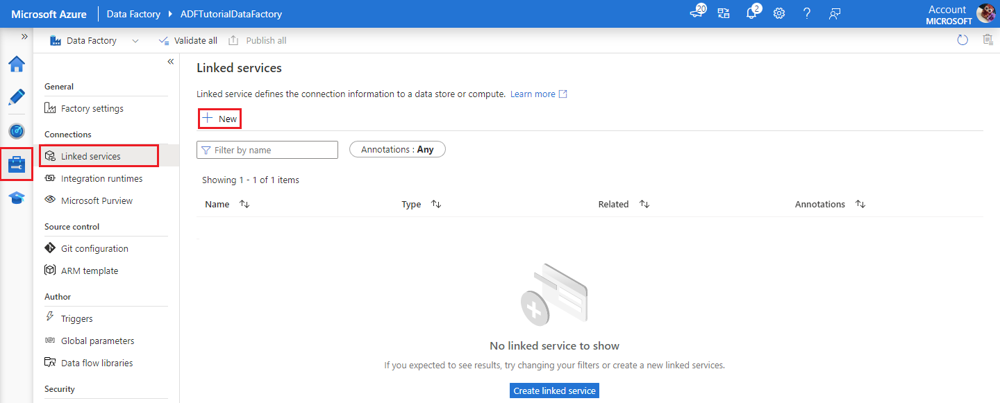
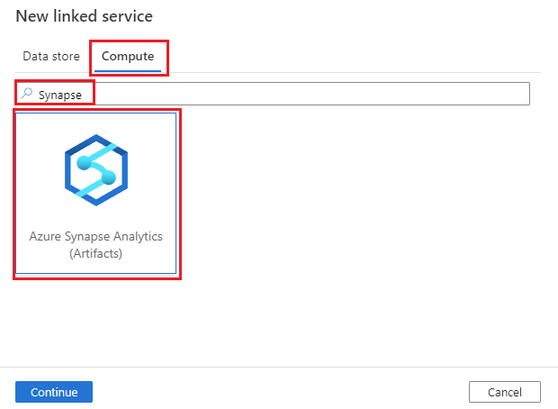
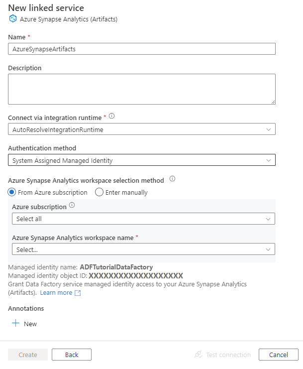

# Copy and transform data in Azure Synapse Analytics (Artifacts) by using Azure Data Factory

This article outlines how to use Copy Activity in Azure Data Factory pipelines to copy data to and from Azure Synapse Analytics (Artifacts). 

## Supported capabilities

This Azure Synapse Analytics (Artifacts) connector is supported for the following capabilities:

| Supported capabilities|IR | Managed private endpoint|
|---------| --------| --------|
|[Copy activity](copy-activity-overview.md) (source/sink)|&#9312; &#9313;|✓ |
|[Mapping data flow](concepts-data-flow-overview.md) (source/sink)|&#9312; |✓ |
|[Lookup activity](control-flow-lookup-activity.md)|&#9312; &#9313;|✓ |
|[GetMetadata activity](control-flow-get-metadata-activity.md)|&#9312; &#9313;|✓ |
|[Script activity](transform-data-using-script.md)|&#9312; &#9313;|✓ |
|[Stored procedure activity](transform-data-using-stored-procedure.md)|&#9312; &#9313;|✓ |

<small>*&#9312; Azure integration runtime &#9313; Self-hosted integration runtime*</small>

## Create an Azure Synapse Analytics (Artifacts) linked service using UI

Use the following steps to create an Azure Synapse Analytics (Artifacts) linked service in the Azure Data Factory portal UI.

1. Browse to the **Manage** tab in your Azure Data Factory and select **Linked Services**, then click **New**:

    > [!div class="mx-imgBorder"]
    > 

2. Search for *Synapse* under the Compute tab, and select the **Azure Synapse Analytics (Artifacts)** connector.

    > [!div class="mx-imgBorder"]
    > 

3. Configure the service details, test the connection, and create the new linked service. 

    > [!div class="mx-imgBorder"]
    > 

## Connector configuration details

The following sections provide details about properties that define Azure Data Factory entities specific to an Azure Synapse Analytics (Artifacts) connector.

## Linked service properties

These generic properties are supported for an Azure Synapse Analytics (Artifacts) linked service:

| Property | Description | Required |
| :------ | :---------- | :-------- |
| Name | Pick a valid name | Yes |
| Description | Give some description of this linked service | No |
| type    | The type property must be set to **AzureSynapseArtifacts**.  | Yes |
| Connect via integration runtime| The [integration runtime](concepts-integration-runtime.md) to be used to connect to the data store. You can use Azure Integration Runtime or a self-hosted integration runtime (if your data store is located in a private network). If not specified, it uses the default Azure Integration Runtime. | Yes |


## Linked service example that uses SQL authentication

```json
{
    "name": "AzureSynapseArtifacts",
    "properties": {
        "annotations": [],
        "type": "AzureSynapseArtifacts",
        "typeProperties": {
            "endpoint": "https://accessibilityverify.dev.azuresynapse.net",
            "authentication": "MSI"
        }
    }
}
```

## Next steps

For a list of data stores supported as sources and sinks by Copy Activity, see [supported data stores and formats](copy-activity-overview.md#supported-data-stores-and-formats).